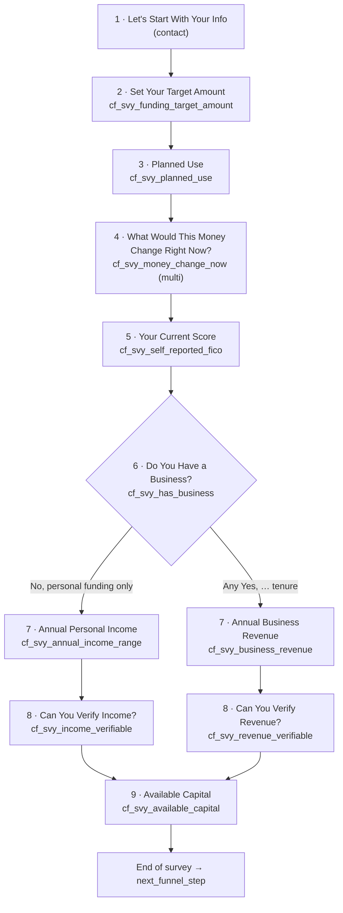

# Apply survey extract — builder spec (2026-09-30)

Extraction only for `https://apply.fundhub.ai/apply`. No new survey UI in this doc.

**Sources:** live HTML + `/apply/cf_survey` JSON (2026-09-30), ClickFunnels MCP (funnel structure, webhooks), owner flow-builder screenshots, `docs/clickfunnels/cf-survey-ground-truth.md`, `src/survey/cf-question-map.mjs`, fragments, webhook adapter, funnel manifest.

**Owner evidence (flow builder, 2026-09-30):** `Screenshot_2026-09-30_at_9.36.44_PM-3fab5741-8118-45fb-9bf5-268021865ce4.png`, `Screenshot_2026-09-30_at_9.36.44_PM-db4938d7-d5f2-4165-9e71-af350b9b79dc.png` (Cursor assets from chat paste).

---

## 1. Live page identity

| Field | Value |
|--------|--------|
| Live URL | https://apply.fundhub.ai/apply |
| CF path slug | `/apply-page` (manifest) |
| Manifest key | `apply-survey` |
| ClickFunnels page id | **25068989** (public `bLryZn`) |
| Funnel | **Fundhub Funnel** id `968281` / `JopwAe` |
| Funnel show-page step | **Apply** — customer path **`/apply`** (step id `KmKBGB`) |
| Push strategy | `head_footer_append_only` — custom HTML **sandwiches** native widget; does **not** replace survey |
| Top fragment | `clickfunnels-fragments/02a-apply-top.html` (hero + grid + `fh-attribution.js`) |
| Bottom fragment | `clickfunnels-fragments/02b-apply-bottom.html` (marquee + footer + `fh-attribution.js`) |
| Native widget | `[data-page-element="Survey/V1"]` (ClickFunnels survey, classic design) |
| Funnel position | After **VSL** (`/watch`), before **Funding Book Call** (`/funding-book-call`) |
| Local harness | `clickfunnels-fragments/harness/apply.html` (mock `Survey/V1` + same shell CSS) |

**Live-only survey params (view-source / Playwright 2026-09-30):**

| Param | Value |
|--------|--------|
| `data-param-workflow_id` | **`1924936`** (numeric; editor public id **`vklXEJ`** — different id space) |
| Survey API | `GET/POST` `https://apply.fundhub.ai/apply/cf_survey?workflow_id=1924936` (session cookie required after step 1) |
| `data-param-survey_progress_enabled` | `true` |
| `data-param-survey_end_text` | `You're qualified. Pick a time below.` |
| `data-param-survey_end_href` (attribute) | `?next_funnel_step=true` |
| Resolved `survey_end_href` (SSR / client JSON) | `?next_funnel_step=<64-char hex token>` — **rotates** (examples seen 2026-09-30: `80990c5d…`, `015772be…`, `6042b234…`); **do not hard-code** |
| `survey_questions` in SSR JSON | `null` (steps load via `/cf_survey`) |
| CF progress counter (live) | **`total_steps`: 9** on contact step (contact + 8 question screens on a completed path; branch hides one pair) |

**Repo vs live copy drift:** committed `02a-apply-top.html` eyebrow is `Application` only. **Live** eyebrow is `Application · Step 1 of 2` (matches harness `apply.html`).

---

## 2. Survey flow (branching)

Owner **ClickFunnels survey flow builder** (screenshots above) matches repo ground truth: one linear trunk, **one branch** after “Do You Have a Business?”, then **merge** at Available Capital.

### 2a. Which steps are conditional

| Step | Conditional? | Rule |
|------|:------------:|------|
| Let's Start With Your Info | No | Always first |
| Set Your Target Amount | No | Always |
| Planned Use | No | Always |
| What Would This Money Change … Right Now? | No | Always (multi-select) |
| Your Current Score | No | Always |
| **Do You Have a Business?** | No (always asked) | **Branch trigger** — answer picks path |
| Annual **Personal** Income | **Yes** | Only if answer = **`No, personal funding only`** |
| Can You Verify **Income**? | **Yes** | Personal path only |
| Annual **Business** Revenue | **Yes** | Only if answer is any **`Yes, …`** tenure option |
| Can You Verify **Revenue**? | **Yes** | Business path only |
| Available Capital | No | Always after branch (rejoin) |

**Skip rule (repo mirror):** `src/survey/cf-question-map.mjs` — `visibleQuestions()` + `PERSONAL_FUNDING_OPTION`. Business path **never** collects `cf_svy_annual_income_range` / `cf_svy_income_verifiable`. Personal path **never** collects `cf_svy_business_revenue` / `cf_svy_revenue_verifiable`.

**Builder layout vs logic:** In the screenshot, **personal** income steps are on the **left (solid connector)** and **business** revenue steps on the **right (dashed connector)**. Triggers are answer-based, not left/right position.

### 2b. Experienced order (happy paths)

**Shared trunk (screens 1–6):**

1. Let's Start With Your Info (contact)
2. Set Your Target Amount → `cf_svy_funding_target_amount`
3. Planned Use → `cf_svy_planned_use`
4. What Would This Money Change For You Right Now? → `cf_svy_money_change_now` *(builder title; live API uses “What Would This Money Change Right Now?” — same step)*
5. Your Current Score → `cf_svy_self_reported_fico`
6. Do You Have a Business? → `cf_svy_has_business`

**Path A — personal (left branch in builder):** answer **`No, personal funding only`**

7. Annual Personal Income → `cf_svy_annual_income_range`
8. Can You Verify Income? → `cf_svy_income_verifiable`
9. Available Capital → `cf_svy_available_capital` → end / redirect

**Path B — business (right branch, dashed in builder):** any **`Yes, …`** tenure on step 6

7. Annual Business Revenue → `cf_svy_business_revenue`
8. Can You Verify Revenue? → `cf_svy_revenue_verifiable`
9. Available Capital → `cf_svy_available_capital` → end / redirect

**Counts:** **11** question definitions in repo (1 contact + 10 `cf_svy_*`). Each completion shows **9** CF progress steps (contact + **8** answered questions — one branch pair skipped). **10** screens if you count contact + 8 + contact is already included in the 9 — treat **9 total CF steps** as the live counter.

---

## 3. Every survey question (definitions + labels)

Ground truth for **verbatim option labels**: `docs/clickfunnels/cf-survey-ground-truth.md` and `src/survey/cf-question-map.mjs`.

Contact is **first** on CF (`apply.fundhub.ai/apply`); homepage widget runs contact **last**.

### Step 1 — Contact (required)

| Order | Title (verbatim) | Field type | Required | Storage |
|------:|------------------|------------|:--------:|---------|
| 1 | Let's Start With Your Info | Contact (CF native) | Yes | Built-in contact fields (§4b). Not a `cf_svy_*` key. |

**UI labels (`surveyTexts` / live `/cf_survey`):** First Name, Last Name, Email, Phone Number.

**Contact field `name=` (live 2026-09-30):** HTML `name` attributes are **ephemeral field ids** from `/cf_survey` (example: `Xmepao`, `dARDpR`, `qOvVpw`, `LKRzGl`) — **not stable** across sessions. Semantic keys on each field in API JSON:

| `attribute` (stable) | Label | Input type |
|----------------------|-------|------------|
| `first_name` | First Name | text |
| `last_name` | Last Name | text |
| `email` | Email | text |
| `phone_number` | Phone Number | text (intl-tel in UI) |

Survey JS also maps logical keys `name`, `first_name`, `last_name`, `email`, `phone_number` in `contactInputNames` (`survey-v1-*.js` bundle).

**Step subhead (contact):** `Required to continue.` (`description` on `/cf_survey` contact step).

### Steps 2–11 — Mapped questions

| Order | Title (verbatim) | Type | Required | `cf_svy_*` key | Options (verbatim labels) |
|------:|------------------|------|:--------:|----------------|----------------------------|
| 2 | Set Your Target Amount | Single select | Yes | `cf_svy_funding_target_amount` | Less than $50k · $50k - $100k · $100k - $200k · $200k - $400k · $400k+ |
| 3 | Planned Use | Single + **Other** | Yes | `cf_svy_planned_use` | Growth (marketing, inventory, hiring) · Equipment or buildout · Debt consolidation · Payroll or rent · Covering a shortfall right now · Not sure yet · *(Other → free text)* |
| 4 | What Would This Money Change Right Now? | **Multi-select** | Yes | `cf_svy_money_change_now` | Peace of mind … · Grow faster … · Pay off pressure … · Stability … · Fresh start … |
| 5 | Your Current Score | Single select | Yes | `cf_svy_self_reported_fico` | 500-579 · 580-649 · 650-699 · 700-749 · 750+ · Not sure |
| 6 | Do You Have a Business? | Single (**branch**) | Yes | `cf_svy_has_business` | Yes, less than 6 months old · Yes, 6-12 months · Yes, 1-2 years · Yes, 2-5 years · Yes, 5+ years · **No, personal funding only** |
| 7a | Annual Business Revenue | Single | Yes (business path) | `cf_svy_business_revenue` | Under $100k · $100k - $249k · $250k - $499k · $500k - $999k · $1M+ |
| 8a | Can You Verify Revenue? | Single | Yes (business path) | `cf_svy_revenue_verifiable` | Yes, bank statements · Yes, tax returns · Yes, both · Not right now |
| 7b | Annual Personal Income | Single | Yes (personal path) | `cf_svy_annual_income_range` | Less than $50k · $50k-$99k · $100k-$199k · $200k-$499k · $500k+ |
| 8b | Can You Verify Income? | Single | Yes (personal path) | `cf_svy_income_verifiable` | Yes, pay stubs · Yes, W-2 or tax returns · Yes, both · Not right now |
| 9 | Available Capital | Single | Yes | `cf_svy_available_capital` | Less than $1k · $1k - $5k · $5k - $25k · $25k - $100k · $100k+ |

**Not on this CF survey:** `cf_svy_has_negatives` — homepage only (ground truth 2026-08-25).

### Builder “N options” vs repo label counts

Flow-builder cards show option **counts** that do not always match counting verbatim labels in `cf-survey-ground-truth.md`. Use **ground truth + cf-question-map** for webhook/CRM label strings.

| Step | Builder screenshot(s) | Verbatim preset labels (repo) | Notes |
|------|-------------------------|-------------------------------|--------|
| Set Your Target Amount | 5 options | **5** | Match |
| Planned Use | **5** (one shot) / **9** (other shot) | **6** presets + **Other** | Builder likely counts Other / internal rows; live `/cf_survey` lists **5** radio labels + separate Other handling |
| Money change | 5 options | **5** | Match |
| Your Current Score | **5** (paste) / **8** (screenshot) | **6** bands | Treat **6** as authoritative label set |
| Do You Have a Business? | **4** options | **6** choices | Builder under-count vs live copy; all six strings above are live |
| Income / revenue / verify steps | 5 / 4 / 5 / 4 | Match respective lists | Match |

**Per-question subheads (descriptions):** Loaded from `/cf_survey` field `description` / `field_description`. **Proved live:** contact → `Required to continue.`; step 2 → `Enter the capital you want to access.` Harness sample uses `Required to continue.` on a mock radio step. **Full table for steps 3–9:** not captured in one uninterrupted walk (Playwright flaky); pull from CF editor or repeat `/cf_survey` capture — do not invent.

---

## 4. Custom / hidden fields, attribution, CRM mapping

### 4a. Survey answer keys (`cf_svy_*`)

| Key | CRM / DB | Notes |
|-----|----------|--------|
| `cf_svy_funding_target_amount` | `clients.custom_fields` + typed `client_custom_fields` | Webhook may send numeric **option row id** on key; words on `_label` |
| `cf_svy_planned_use` | same | Other text when chosen |
| `cf_svy_money_change_now` | same; typed `text[]` | Multi; `_labels` sibling |
| `cf_svy_self_reported_fico` | same | `_label` sibling |
| `cf_svy_has_business` | same | `_label` / `_labels` |
| `cf_svy_business_revenue` | same | Business branch only |
| `cf_svy_revenue_verifiable` | same | Business branch only |
| `cf_svy_annual_income_range` | same | Personal branch only |
| `cf_svy_income_verifiable` | same | Personal branch only |
| `cf_svy_available_capital` | same | **Completion sentinel** → `survey_complete` (`src/handlers/client-lifecycle.mjs`) |

**Live `/cf_survey` mapping (2026-09-30):** step 2 field `attribute` = `cf_svy_funding_target_amount` (Contact Attribute wired for at least that question). Editor checklist “None” is **stale** — owner **2026-08-12** “all mapped” (`docs/workflows/archive/cf-funnel-seam.md`); **2026-09-04** measured **`cf_svy_revenue_verifiable`** sometimes null while verify answer overwrote revenue (`docs/workflows/fix-batch-2026-09-03-remaining.md` §9.2) — treat verify mapping as **historically broken**, fix status **UNKNOWN** without fresh sim webhook.

**Adapter:** `src/adapters/clickfunnels.mjs` `pickSurveyAnswers()` resolves `_label` / `_labels` when values look like CF numeric ids (≥5 digits).

**Option id layers (do not conflate):**

| Layer | Example | Stable? |
|-------|---------|:-------:|
| UI `/cf_survey` option `id` | `JobnqM`, `YgKLyG` | No — session/step scoped |
| HTML radio `name` / `value` | `DzKkGV` / `JobnqM` | No |
| Webhook `custom_attributes` numeric row id | `207883`, `207888`, … | **Per submission** (same label → different id across clients per fix-batch 2026-09-04) |

**Partial webhook id → label map (production sims / tests only — not exhaustive):**

| Numeric id (example) | Label | Question key |
|----------------------|-------|----------------|
| 207883 | $200k - $400k | `cf_svy_funding_target_amount` |
| 207888 | Growth (marketing, inventory, hiring) | `cf_svy_planned_use` |
| 207897 | Grow faster (more customers / more reach) | `cf_svy_money_change_now` |
| 207899 | Stability (cover bills / buffer slow weeks) | `cf_svy_money_change_now` |
| 207909 | 750+ | `cf_svy_self_reported_fico` |
| 207918 | Yes, 5+ years | `cf_svy_has_business` |
| 208124 | $1M+ *(annual revenue label; sim also showed mapping bug)* | `cf_svy_business_revenue` |
| 207975 | $100k+ | `cf_svy_available_capital` |

Full matrix for every option on every question: **UNKNOWN** — needs `CF_CAPTURE_MODE=1` capture or CF export. Looked: repo tests, manual walkthrough F11 table, pipeline-drawer fixtures; no admin export in repo.

### 4b. Standard contact fields (webhook / CRM)

| Field | CF 2.0 / webhook paths |
|-------|------------------------|
| Email | `email_address`, `contact.email` |
| First / last name | `first_name`, `last_name` |
| Phone | `phone_number`, `phone` |

Built-in contact columns — **do not rename** (`OWNER-CF-SETUP-CHECKLIST.md`).

### 4c. Attribution & affiliate hidden fields

`https://fundhub.ai/funnel/fh-attribution.js` stamps on **every** form:

`utm_source`, `utm_medium`, `utm_campaign`, `utm_content`, `utm_term`, `landing_path`, `referrer_domain`, `a1`, `a2` — see prior manifest; no `#fhw` on `/apply`.

### 4d. Consent / TCPA on apply

No consent checkbox in `02a`/`02b` or live survey contact step. Homepage widget has SMS consent; **apply CF path does not** (by design in fragments).

### 4e. Legacy `cf_svy_*` columns

Not on apply survey: `cf_svy_has_negatives`, `cf_svy_your_why`, etc. (`src/handlers/client-custom-fields.mjs` allowlist).

### 4f. Webhook ingress

| Item | Value |
|------|--------|
| URL | `https://fundhub.ai/api/webhooks/clickfunnels` |
| Method | POST |
| Secret | Netlify `CLICKFUNNELS_WEBHOOK_SECRET` |
| **Fundhub endpoint subscribes (CF MCP 2026-09-30)** | `contact.created`, `contact.updated`, `contact.identified`, `form_submission.created`, `appointments/scheduled_event.created\|canceled\|rescheduled` |
| Fundhub canonical events | `entry.captured`; + `survey.submitted` when `cf_svy_*` present; appointments → `booking.*` |
| **Granularity** | **Per screen / contact update — not final-only.** Adapter comment: CF posts **one webhook per survey screen** (`src/adapters/clickfunnels.mjs`). Measured 2026-08-23: ~**20** `entry.captured` and ~**15–17** `survey.submitted` per one apply fill (`docs/workflows/archive/comms-logic-2026-08-23-slice-capture.md`). Repeat Inngest runs suppressed within 6h window (`FUNNEL_REPEAT_WINDOW_MINUTES`). |

---

## 5. Post-submit behavior

| Behavior | Detail |
|----------|--------|
| In-funnel redirect | `survey_end_href` → `?next_funnel_step=<token>` |
| **Next funnel step (proved MCP 2026-09-30)** | **Funding Book Call** — show-page path **`/funding-book-call`**, page id **25062844** / `xgAbbN`, funnel sort **2** after Apply |
| Customer URL | https://apply.fundhub.ai/funding-book-call |
| End copy | `You're qualified. Pick a time below.` |
| Webhooks | See §4f — fires throughout survey, not only at end |
| Workflows | `s-nobook-chase` on `survey.submitted`; `s-02-incomplete-survey-nudge` after `entry.captured` if no survey within 20m |

---

## 6. Layout as of now (shell + widget chrome)

(Unchanged from prior extract — `02a`/`02b` grid, hero **Application · Step 1 of 2**, card 900px / 24px gutter, marquee, footer. V2 polish optional in `fundhub-funnel-dropins-v2/`.)

---

## 7. Remaining UNKNOWNs

| Gap | Looked | Still missing |
|-----|--------|----------------|
| Full numeric **webhook** option id → label for all ~50+ choices | Tests, F11 table, fix-batch sim notes | Complete matrix |
| **`cf_svy_revenue_verifiable`** mapping fixed in CF editor since 2026-09-04 | fix-batch §9.2, sim nulls | Live webhook proof |
| **Subhead `description` for steps 3–9** | `/cf_survey` partial capture (steps 1–2 only); survey JS shape | One full branch walk export |
| **Exact branch predicates in CF builder** (which answer id opens dashed path) | Repo string match on option label; screenshots show topology only | CF internal rule ids |

---

## 8. Rebuild constraints

| Rule | Why |
|------|-----|
| **Keep native CF `Survey/V1` on `/apply` until cutover** | `docs/workflows/funnel-cutover-2026-09-21.md` |
| **Preserve branch rule** | Personal vs business pair — §2 |
| **Preserve `cf_svy_*` keys and verbatim option labels** | Webhook adapter, CRM, deck, pipeline |
| **Preserve multi-select** for `cf_svy_money_change_now` | Typed `text[]` |
| **Preserve attribution hidden names** | `utm_*`, `landing_path`, `referrer_domain`, `a1`, `a2` |
| **Post-submit → `/funding-book-call`** | Funnel structure + journey docs |
| **Do not add `cf_svy_has_negatives` to CF** without owner decision | Ground truth |
| **Label/id duality on webhooks** | Send labels or ids + `_label`/`_labels` like CF |

---

## Quick reference counts

| Metric | Count |
|--------|------:|
| Question definitions (incl. contact) | **11** |
| Active `cf_svy_*` keys on apply | **10** |
| Hidden attribution + affiliate names | **7** |
| CF `progress.total_steps` (live) | **9** |
| Screens per completion (typical) | **9** (contact + 8 questions; one branch pair skipped) |

**One-line summary:** Flow builder + `/cf_survey` confirm **one branch** after business question; **9** live steps; webhooks fire **per screen**; next step **`/funding-book-call`**; four narrow UNKNOWNs remain (full id map, verify mapping proof, subheads 3–9, CF internal branch ids).
