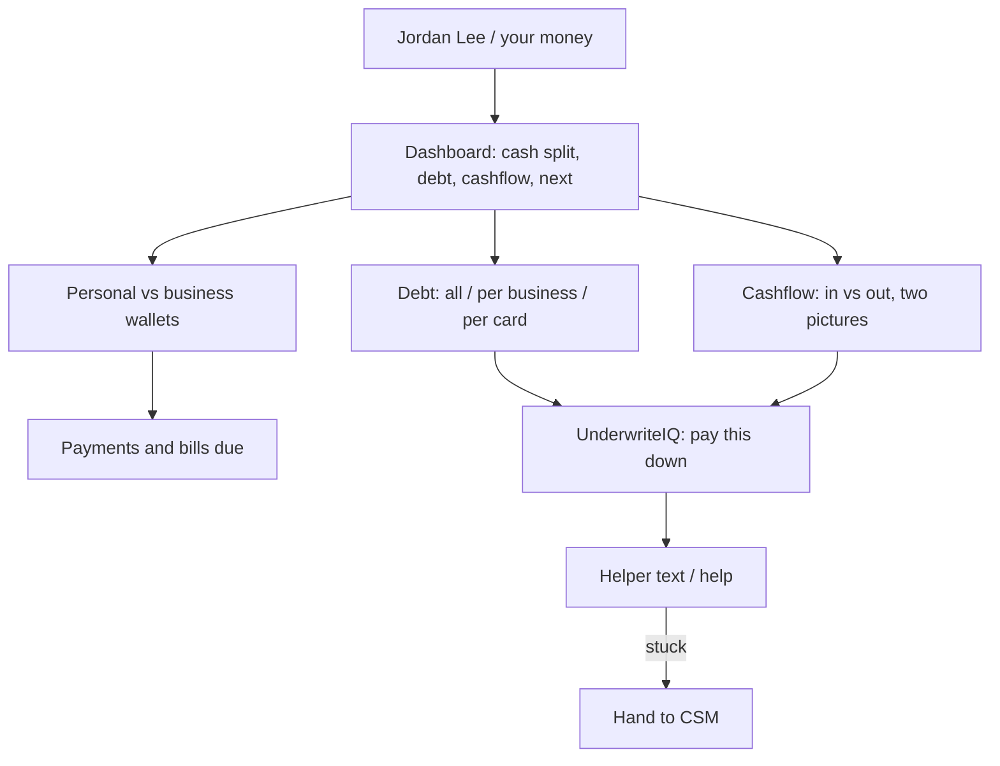

# Client Finance OS — simple wireframe

**Date:** 2026-09-19
**What this is:** a box drawing of the **client** money home. For spec review with Chris.
**What this is not:** a screen. Not HTML. Not the staff desk at `/app/finance-os.html`. Do not build from this file.

**Spec it follows:** `docs/finance/client-finance-os-build-spec-2026-09-19.md`

**COMPLIANCE REVIEW REQUIRED** — money advice and bank login stay marked. This drawing does not turn them on.

**Words used here**

- **Wallet** — a bank or a card we have on file for this person.
- **Dashboard** — the overview at the top: cash, debt, cashflow, next step. Simple boxes. Charts later on the real page.
- **Cashflow** — money in vs money out over time. Personal and business stay two pictures.
- **Debt** — what they owe: all of it, per business, per card.
- **UnderwriteIQ** — FundHub’s existing suggestion engine. We print its stored sentences. We do not write new “you will get approved” lines.
- **CSM** — client success manager. A human on staff. The helper texts them a task when the client is stuck.
- **Typed in** — the client (or staff) typed the numbers. Not a live bank login.
- **Plaid** — live bank login. **Later. Not tonight. Not on this drawing.**

---

## Who this page is for

One signed-in **client**. Their name is already on the page. No “pick a client.” No staff side menu.

Open review choice from the spec (Chris picks later):

- Money **inside** the client portal (default), or
- Money on its **own** client URL

This drawing is the same either way. Only the tab around it changes.

---

## Phone (what they see first)

```
+--------------------------------------+
|  Jordan Lee                          |
|  your money                          |
+--------------------------------------+
|  What you have. What you owe.        |
|  What to do next.                    |
+--------------------------------------+
|  DASHBOARD                           |
|                                      |
|  +-------------------------------+   |
|  | CASH  (two piles, never one)  |   |
|  | personal   $1,240             |   |
|  | business   $4,800             |   |
|  | not sure   $——                |   |
|  +-------------------------------+   |
|                                      |
|  +-------------------------------+   |
|  | DEBT                          |   |
|  | all debt      $3,200  (floor  |   |
|  |                if a card is   |   |
|  |                missing)       |   |
|  | personal      $3,200          |   |
|  | business      $——             |   |
|  +-------------------------------+   |
|                                      |
|  +-------------------------------+   |
|  | CASHFLOW this month           |   |
|  |                               |   |
|  | PERSONAL                      |   |
|  | in   $——  (no paycheck on     |   |
|  |            file = a dash,     |   |
|  |            never $0)          |   |
|  | out  $1,945  (bills we are    |   |
|  |               sure about)     |   |
|  | [ in ####    ]                |   |
|  | [ out ########]               |   |
|  |                               |   |
|  | BUSINESS                      |   |
|  | in   $——                      |   |
|  | out  $——                      |   |
|  | (never add personal+business  |   |
|  |  into one cashflow bar)       |   |
|  +-------------------------------+   |
|                                      |
|  +-------------------------------+   |
|  | NEXT                          |   |
|  | Visa due Oct 3 · min $95      |   |
|  +-------------------------------+   |
+--------------------------------------+
|                                      |
|  YOUR CASH                           |
|  (personal and business stay apart.  |
|   we never add them into one pile.)  |
|                                      |
|  +-------------------------------+   |
|  | PERSONAL                      |   |
|  |                               |   |
|  |  Checking  ....  $1,240       |   |
|  |    First Bank  *12            |   |
|  |    typed in                   |   |
|  |                               |   |
|  |  Savings   ....  $——          |   |
|  |    (no number yet = a dash,   |   |
|  |     never $0.00)              |   |
|  +-------------------------------+   |
|                                      |
|  +-------------------------------+   |
|  | BUSINESS                      |   |
|  |                               |   |
|  |  Checking  ....  $4,800       |   |
|  |    Work Bank  *44             |   |
|  |    typed in                   |   |
|  +-------------------------------+   |
|                                      |
|  +-------------------------------+   |
|  | NOT SURE YET                  |   |
|  |  (we have not labeled this    |   |
|  |   personal or business)       |   |
|  |                               |   |
|  |  Other account  ....  $——     |   |
|  +-------------------------------+   |
|                                      |
+--------------------------------------+
|  YOUR DEBT                           |
|  (all / per business / per card)     |
|                                      |
|  +-------------------------------+   |
|  | ALL DEBT                      |   |
|  | $3,200  (floor if holes)      |   |
|  +-------------------------------+   |
|                                      |
|  +-------------------------------+   |
|  | PER BUSINESS                  |   |
|  |                               |   |
|  |  personal pile    $3,200      |   |
|  |  Work Co          $——         |   |
|  |  not sure yet     $——         |   |
|  |  (two companies = two piles.  |   |
|  |   do not mash companies.)     |   |
|  +-------------------------------+   |
|                                      |
|  +-------------------------------+   |
|  | PER CARD                      |   |
|  |                               |   |
|  |  Visa *1234   personal        |   |
|  |  owe $3,200  limit $5,000     |   |
|  |  room $1,800                  |   |
|  |                               |   |
|  |  Amex *88     business        |   |
|  |  owe $——     limit $——        |   |
|  |  (no “pay this to $0” if the  |   |
|  |   limit is missing or $0)     |   |
|  +-------------------------------+   |
+--------------------------------------+
|  PAYMENTS / BILLS DUE                |
|                                      |
|  +-------------------------------+   |
|  | Visa  due Oct 3               |   |
|  | minimum  $95                  |   |
|  +-------------------------------+   |
|  | Rent  due Oct 1               |   |
|  | $1,850  (we are sure this is  |   |
|  | a repeating bill)             |   |
|  +-------------------------------+   |
|  | Visa  due date passed         |   |
|  | we do NOT say “paid” unless   |   |
|  | you told us you paid          |   |
|  +-------------------------------+   |
|                                      |
|  Weak guesses stay off this list.    |
+--------------------------------------+
|  WHAT TO DO NEXT                     |
|  (UnderwriteIQ suggestion)           |
|                                      |
|  +-------------------------------+   |
|  | Pay down Visa *1234           |   |
|  |                               |   |
|  | engine sentence, word for     |   |
|  | word. no extra promise.       |   |
|  |                               |   |
|  | why: owe $3,200 of $5,000     |   |
|  |      (that is a high share    |   |
|  |       of the card limit)      |   |
|  |                               |   |
|  | or: “not enough on file yet”  |   |
|  +-------------------------------+   |
+--------------------------------------+
|  HELP                                |
|                                      |
|  +-------------------------------+   |
|  | text the money helper         |   |
|  |                               |   |
|  | it can: remind you, point at  |   |
|  | the next bill, help you label |   |
|  | personal vs business          |   |
|  |                               |   |
|  | it cannot: log into a bank,   |   |
|  | move money, or invent a       |   |
|  | balance                       |   |
|  |                               |   |
|  | stuck?  ask for a person  →   |   |
|  | a CSM (human) gets a task.    |   |
|  | helper stops looping.         |   |
|  +-------------------------------+   |
+--------------------------------------+
|  [ add a wallet ]                    |
|  (typed in. never a fake             |
|   “connect Chase” button.)           |
|                                      |
|  live bank login (Plaid) = later.    |
|  not tonight. not on this drawing.   |
+--------------------------------------+
```

---

## Desktop (same page, wider)

Left = the money picture. Right = next step + helper. Still one client. Still no staff picker.

```
+----------------------------------------------------------------------------------+
|  Jordan Lee                                                 your money           |
+----------------------------------------------------------------------------------+
|  What you have. What you owe. What to do next.                                   |
+----------------------------------------------------------------------------------+
|  DASHBOARD                                                                       |
|  +------------------+  +------------------+  +------------------+  +-----------+ |
|  | CASH             |  | DEBT             |  | CASHFLOW (month) |  | NEXT      | |
|  | personal $1,240  |  | all     $3,200   |  | PERSONAL         |  | Visa      | |
|  | business $4,800  |  |  (floor if hole) |  | in $——  out $1,945| | due Oct 3 | |
|  | not sure $——     |  | personal $3,200  |  | BUSINESS         |  | min $95   | |
|  | never one pile   |  | business $——     |  | in $——  out $——  |  |           | |
|  +------------------+  +------------------+  | never one bar    |  +-----------+ |
|                                              +------------------+                |
+---------------------------------------------+------------------------------------+
|                                             |                                    |
|  PERSONAL WALLET                            |  WHAT TO DO NEXT                   |
|  +---------------------------------------+  |  +------------------------------+  |
|  | Checking   First Bank *12    $1,240   |  |  | Pay down Visa *1234          |  |
|  |            typed in                   |  |  |                              |  |
|  | Savings                      $——      |  |  | UnderwriteIQ sentence        |  |
|  +---------------------------------------+  |  | (word for word)              |  |
|                                             |  |                              |  |
|  BUSINESS WALLET                            |  | numbers behind it:           |  |
|  +---------------------------------------+  |  | owe / limit / room left      |  |
|  | Checking   Work Bank *44     $4,800   |  |  +------------------------------+  |
|  |            typed in                   |  |                                    |
|  +---------------------------------------+  |  HELP                              |
|                                             |  +------------------------------+  |
|  NOT SURE YET                               |  | text the money helper        |  |
|  +---------------------------------------+  |  |                              |  |
|  | Other account                $——      |  |  | stuck → CSM (human) task     |  |
|  +---------------------------------------+  |  | no fifth nag text            |  |
|                                             |  +------------------------------+  |
|  DEBT  (all / per business / per card)      |                                    |
|  +---------------------------------------+  |  [ add a wallet ]                  |
|  | ALL  $3,200  (floor if a hole)        |  |  typed in only in v1               |
|  | personal pile $3,200                  |  |                                    |
|  | Work Co       $——                     |  |  live bank login (Plaid)           |
|  | not sure      $——                     |  |  = later. not tonight.             |
|  |                                       |  |  no fake Connect Chase.            |
|  | Visa *1234   personal                 |  |                                    |
|  | owe $3,200   limit $5,000   room $1,800| |                                    |
|  | Amex *88     business                 |  |                                    |
|  | owe $——      limit $——                |  |                                    |
|  +---------------------------------------+  |                                    |
|                                             |                                    |
|  CASHFLOW  (in vs out over time)            |                                    |
|  +---------------------------------------+  |                                    |
|  | PERSONAL   in $——    out $1,945       |  |                                    |
|  | BUSINESS   in $——    out $——          |  |                                    |
|  | (two pictures. never one cash number.)|  |                                    |
|  +---------------------------------------+  |                                    |
|                                             |                                    |
|  PAYMENTS / BILLS DUE                       |                                    |
|  +---------------------------------------+  |                                    |
|  | Visa min $95     due Oct 3            |  |                                    |
|  | Rent $1,850      due Oct 1            |  |                                    |
|  | (past due date ≠ we stored a payment) |  |                                    |
|  +---------------------------------------+  |                                    |
|                                             |                                    |
+---------------------------------------------+------------------------------------+
```

---

## Empty (honest, not fake rows)

If we have no wallets yet:

```
+--------------------------------------+
|  Jordan Lee                          |
|  your money                          |
+--------------------------------------+
|  No wallets on file yet.             |
|                                      |
|  [ add a wallet ]                    |
|                                      |
|  (no fake banks. no fake cards.)     |
+--------------------------------------+
```

If we have a credit file but no banks: show the cards we know, and an empty personal / business cash box. Say the cash boxes are empty. Cashflow in-bar stays a dash if we have no money in.

If a row is a stand-in / mock: label it **not real**.

---

## What this drawing refuses to show

From the spec. Left off on purpose.

- Staff “find a client” picker
- FundHub’s own plans, invoices, or pay links
- One combined “total cash” or net-worth number (all-debt is allowed; mashed cash is not)
- A “Connect Chase” (or any bank) button. Plaid is later, not on this drawing.
- $0.00 standing in for a missing number (including missing money-in)
- “Paid” just because a due date passed
- “Pay this card to $0” when the limit is $0 or unknown
- The helper logging into a bank or moving money

---

## Four later screen states (labels only)

When we build, the page has four honest states. Drawing them now so the spec stays true:

1. **Loading** — “getting your money picture”
2. **Empty** — no wallets; one action: add a wallet
3. **Error** — “could not load. try again”
4. **Full** — the boxes above

---

## Tiny flow (how the pieces sit)



---

## Left undone

- No product code
- No `public/app` edits
- No Plaid implementation (drawing says later, not tonight)
- Open spec choice still: Money inside the portal, or its own client URL

**Next:** Chris says the spec + this drawing are right, or names edits. Then backend. Screen last.
