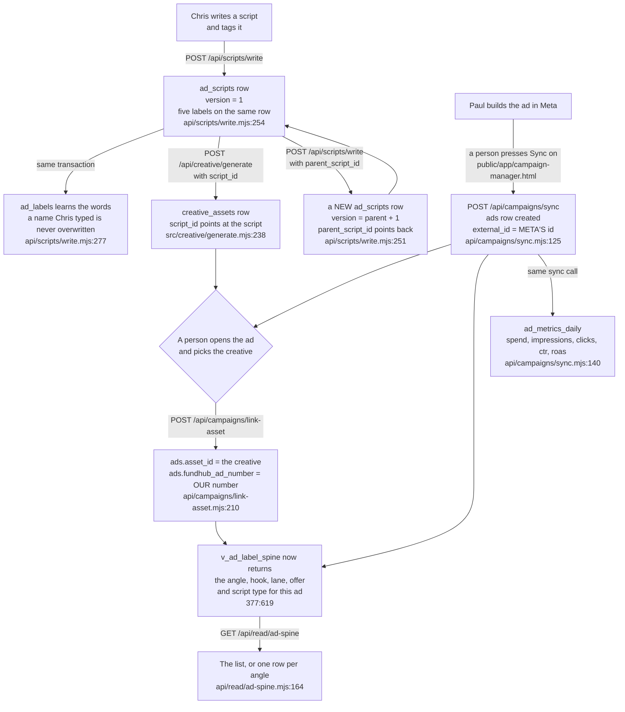

# Ad label spine flow — how a script's labels reach an ad

Required by `CLAUDE.md` §3a step 4 and §4. Written 2026-09-08, traced from the code, not
from the plan.

This page is the back end for `db/migrations/377_marketing_label_spine.sql`. It answers one
question: **when Chris writes a script and tags it with an angle and a hook, what has to
happen before those tags show up next to that ad's spend?**

---

## The short version

A script carries five labels. The labels never get copied onto anything. They are read back
through one view, `v_ad_label_spine`, which walks **ad → creative → script** and picks the
labels up off the script at the far end.

So the whole thing is a chain of three links. **All three can be made today** — the
middle one only since 2026-09-08. None of it has been run against a database yet.

| # | The link | Can it be made today? |
|---|---|---|
| 1 | script → its labels | **Yes.** `POST /api/scripts/write` |
| 2 | script → creative | **Yes.** `POST /api/creative/generate` with `script_id` |
| 3 | creative → ad, and our ad number | **Yes.** `POST /api/campaigns/link-asset` |

**Link 2 was the break, and it is closed.** `creative_assets.script_id` was added by 377
(`db/migrations/377_marketing_label_spine.sql:395-396`) and for a few hours nothing wrote
it — the only writers were three test files, so the chain reached the creative and
stopped.

It now has a real writer. `api/creative/generate.mjs` accepts a `script_id` and folds it
into the job's spec, and `src/creative/generate.mjs:238` writes it onto every asset that
job produces. No new column was needed: `generation_jobs` already carries a jsonb `spec`
(`db/migrations/045_creative_factory.sql:295`) and this code already tucks `assetKind`
into it the same way.

**It is optional and stays NULL when nobody names a script.** An asset with no script is
a real thing, not a zero. The trigger from 377 refuses a creative and a script owned by
different partners, so a wrong id fails loudly at the moment of writing rather than
quietly mislabelling an ad weeks later.

**UNPROVEN.** This has never run against a database — there is no Postgres on the machine
it was written on. See the note at the foot of this page.

---

## The flow

Every solid line is a step something in the code really performs. None of it has
been run against a database — see the note at the foot of this page.

---

## Every move, and what fires it

| From | To | What fires it | Where it happens | Works today? |
|---|---|---|---|---|
| nothing | an `ad_scripts` row, `version = 1`, labels on it | somebody posts the words and the tags | `api/scripts/write.mjs:254` | **yes** |
| a script | a creative carrying that script id | generating with `script_id` | `src/creative/generate.mjs:238` | **yes** |
| a label key | a row in `ad_labels` | the same write, in the same transaction | `api/scripts/write.mjs:277` | **yes** |
| an ad in Meta | an `ads` row with Meta's id | a person presses Sync on the Campaign Manager screen | `api/campaigns/sync.mjs:125` | **yes** |
| an `ads` row | `asset_id` set, `fundhub_ad_number` set | a person picks the creative and types our number | `api/campaigns/link-asset.mjs:210` | **yes** |
| an `ads` row | a day of spend and clicks | the same Sync press | `api/campaigns/sync.mjs:140` | **yes** |
| all of the above | labels readable next to the ad | the view joins them; nothing is copied | `377:619-652` | **yes, once the row above is set** |
| a script | a rewrite of it | posting again with `parent_script_id` | `api/scripts/write.mjs:251` | **yes** |

---

## Five things that are easy to get wrong

**1. The ad exists before the creative is attached, not after.**
The only `INSERT INTO ads` in the whole tree outside tests is the Meta pull
(`api/campaigns/sync.mjs:125`). So an ad row always starts life with no creative and no
number on it, and a person fills both in afterwards. Anything drawn the other way round —
"our creative becomes an ad" — is not what the code does.

**2. Linking the creative to the ad is a person, on purpose.**
`api/campaigns/link-asset.mjs:11-32` sets out why: the Meta pull never even asks for a
creative (`api/campaigns/sync.mjs:228` requests `id,name,status,adset_id`), our
`creative_assets.provider_asset_id` is the generation vendor's id and Meta has never seen
one, and nothing has ever pushed one of our creatives to Meta. The two sides share no
identifier at all. A guess here makes every label answer silently wrong.

**3. Our ad number is typed by a human and nothing can check it.**
`ads.fundhub_ad_number` is ours; `ads.external_id` is Meta's. They are separate columns
(377:557, 046:293). Nothing computes ours — Meta does not know it. The database stops two
ads claiming the **same** number; nothing stops one ad claiming the **wrong** one.

**4. Leaving a field out and sending it blank are different instructions.**
On `link-asset`, an absent key means "leave it alone" and a present key that is blank or
null means "clear it" (`api/campaigns/link-asset.mjs:36-55`). Clearing `asset_id` turns that
ad's labels back off with no error anywhere. A screen with an empty box must send nothing,
not `""`.

**5. Labels are never copied down. They are looked up.**
Nothing writes `angle_key` onto a creative or onto an ad. The view is the only place the
inheritance happens (377:603-606). Correct a script's angle and every ad made from it reads
the corrected one immediately.

---

## What works today, plainly

**Works:**

- Writing a script with its five labels, and the dictionary learning the new words.
- Writing a rewrite that points back at what it replaced, without touching the original.
- Pulling ads and daily spend in from Meta.
- Saying which creative runs on an ad, and what our number for it is.
- Reading the whole chain back, either as a list or grouped by angle, hook, lane, offer or
  script type.

**Closed on 2026-09-08, and worth recording because the page said otherwise for a few
hours:** a script can now become a creative. `api/creative/generate.mjs` takes a
`script_id` and `src/creative/generate.mjs:238` writes it onto every asset the job makes.

It stays NULL when nobody names a script, which is right — an asset with no script is a
real thing, not a zero. What follows from that: an ad whose creative carries no script
still reads with blank labels, and blank looks exactly like "no data yet" rather than
like a fault. That is the failure worth watching for on any screen built on this.

**Does not exist yet:**
- **No screen calls any of the three endpoints.** Searched `public/` on 2026-09-08: no page
  mentions `read/ad-spine`, `scripts/write` or `campaigns/link-asset`. They answer, but only
  to something posting to them directly.
- **Hook rate and hold rate are not stored.** `storeInsights` writes spend, impressions,
  clicks, ctr and roas only (`api/campaigns/sync.mjs:140-149`). The video drop-off fields
  Meta hands out for free — 3-second, p25, p50, p75, p95, p100 — are never requested and
  have no column. So "where do people fall off inside the ad" cannot be answered from this
  database yet, even though Meta would give it away.
- **Spend and booked calls are not joined to the labels.** `/api/read/ad-spine` returns
  labels and counts of ads, nothing more, and says so at
  `api/read/ad-spine.mjs:32-41`. The two joins that would attach money are named in 377's
  own header and neither is written.
- **The Meta pull is not on a clock.** Nothing in `src/workflows/index.mjs` registers it. It
  runs when a person presses Sync on `public/app/campaign-manager.html`.

**UNVERIFIED — never executed:** every `.pg.test.mjs` covering this chain skips with no
`DATABASE_URL`, and there is no Postgres on the machine this was traced on. The paths above
are read from the code, not observed running.
