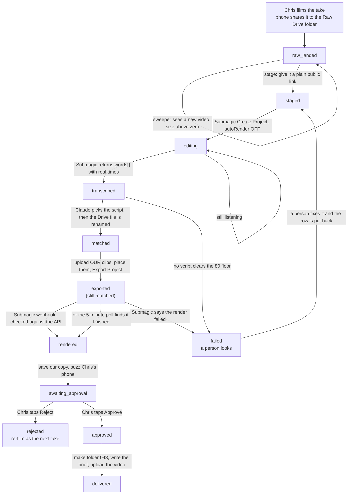

# Ad video — from a filmed take to Paul's folder

Generated from the code on 2026-09-22. Written against `src/ad-videos/pipeline.mjs`,
`src/workflows/ad-video-sweeper.mjs`, `src/messaging/providers/submagic.mjs`,
`src/messaging/providers/google-drive-write.mjs`, `src/messaging/providers/ntfy.mjs`
and the `submagic` branch in `src/http/router.mjs`.

The plan is `docs/video-pipeline-plan.md`. The vendor facts are
`docs/specs/video-pipeline-api-verification-2026-09-22.md`. The 4K rule is
`.claude/rules/video-4k-unless-ad.md`.

**Chris films, and Chris approves. That is the whole job.**

---

## The picture

---

## Who does each move

| From | What runs | To | Where it lives |
|---|---|---|---|
| — | Drive `files.list` on the Raw folder every 5 minutes | `raw_landed` | `ad-video-sweeper.mjs` `detect()` |
| `raw_landed` | make a public link for the take | `staged` | `pipeline.mjs` `stage()` — **not built, see below** |
| `staged` | Submagic Create Project, `autoRender:false` | `editing` | `pipeline.mjs` `submagicCreate()` |
| `editing` | Submagic Get Project → `words[]` | `transcribed` | `pipeline.mjs` `readTranscript()` |
| `transcribed` | Claude matches the words to a script, then Drive rename | `matched` | `pipeline.mjs` `matchAndRename()` |
| `matched` | upload our clips, place them, Export Project | stays `matched`, `exported_at` set | `pipeline.mjs` `placeBrollAndExport()` |
| `matched` + exported | Submagic webhook **or** the 5-minute poll | `rendered` | `router.mjs` / `pipeline.mjs` `pollFinished()` |
| `rendered` | save our copy, buzz the phone | `awaiting_approval` | `pipeline.mjs` `saveFinishedAndNotify()` |
| `awaiting_approval` | **Chris taps Approve or Reject** | `approved` / `rejected` | a person. Nothing else moves it. |
| `approved` | folder `043`, the brief, the video | `delivered` | `pipeline.mjs` `deliverToPaul()` |

---

## Two places the code does not match the plan

Both are recorded rather than reconciled (CLAUDE.md §4).

**1. Two states swapped places.** The plan puts `transcribed` before Submagic,
because it was written against Deepgram. The owner's decision of 2026-09-22
replaced Deepgram with Submagic's own word-level transcript, and that transcript
does not exist until the project has been created. So:

* plan: `staged → transcribed → matched → editing`
* code: `staged → editing → transcribed → matched`

No state is added, removed or renamed. The database's status list is untouched.

**2. The brief is plain text, not a PDF.** The plan names `043_brief.pdf`.
`uploadTextFile()` writes text, and making a PDF would need a new dependency.
The brief holds the same five things either way: ad number, hook, headline,
primary text and the landing link.

---

## Three things that are NOT built, named out loud

**Staging the take — the one that blocks everything.** Submagic cannot be given
a Google Drive link: Drive puts a virus-scan page in front of anything over
25 MB and Submagic rejects share links outright. So the take needs a plain
public link first, and this repo has no proven place to put a
several-hundred-megabyte file. The one public-URL trick already here is a
Netlify **draft** deploy
(`clickfunnels-fragments/slo/client-wins/upload-deck-images.mjs`), which shells
out to the `netlify` command line — so it can only run on a laptop, never inside
a worker — and was built for small images. With no staging port the row simply
waits and says so. Nothing is lost: the take is still in Drive.

**Moving the video bytes.** `src/lib/outbound-fetch.mjs` — the one door
everything outbound goes through — reads every response as text. That is right
for JSON and wrong for a 4K MP4. So downloading the finished file from Submagic
and uploading it into Paul's folder cannot happen through the fence.
`uploadVideo()` refuses and says why. The folder and the brief are real and do
land; the video is the gap. Moving it is a laptop script's job, the same way
`scripts/slo-broll-upload.mjs` already moves b-roll.

**Writing to Drive at all may be refused.** `src/company-brain/config.mjs` asks
Google for `drive.readonly`. A read-only token cannot make a folder or upload a
file. The provider checks the granted scope and reports "the stored Google token
is read-only" instead of a mystery 403. Granting the write scope is a change on
the Google side. Owner law: the stored key is never removed.

---

## What has to be true before a single byte leaves

Three separate switches, and all three default to off:

| | |
|---|---|
| `ADAPTERS_DRY_RUN` | must be `0`/`false`/`no`/`off`, or Submagic and Drive are both held |
| `MESSAGING_DRY_RUN` | must be the same, or the phone stays quiet |
| `SUBMAGIC_API_KEY`, the Google credentials, `DRIVE_RAW_FOLDER_ID` | must be set, or every step reports "not configured" |

With none of those set the sweeper walks an empty folder and does nothing.

---

## Env names this flow reads

Read by NAME only; no value is ever printed or logged.

`SUBMAGIC_API_KEY`, `SUBMAGIC_API_BASE`, `SUBMAGIC_API_AUTH_HEADER`,
`SUBMAGIC_EXPORT_PATH`, `SUBMAGIC_WEBHOOK_URL`, `ANTHROPIC_API_KEY`,
`GOOGLE_DRIVE_SERVICE_ACCOUNT_JSON`, `GOOGLE_DRIVE_DELEGATE_EMAIL`,
`GOOGLE_DRIVE_OAUTH_TOKEN_JSON`, `DRIVE_RAW_FOLDER_ID`, `DRIVE_PAUL_FOLDER_ID`,
`NTFY_TOPIC`, `NTFY_SERVER`, `NTFY_TOKEN`, `PUBLIC_SITE_URL`,
`ADAPTERS_DRY_RUN`, `MESSAGING_DRY_RUN`.

`NTFY_TOPIC`, `DRIVE_RAW_FOLDER_ID` and `DRIVE_PAUL_FOLDER_ID` are new and are
**not set**. A topic name is the whole address of a notification — set it long
and random, like a password.

---

## The money guard

Export is capped at 50 an hour and every update costs another export. So:

* a pass moves at most 10 rows and picks up at most 20 new files
* `exported_at` on the row stops a second export of the same take
* `submagic_project_id` stops a second project, which is a second paid minute
* AI B-roll is never asked for — 3 credits a clip against 15 credits a month is
  five clips for a hundred ads. `buildItems()` refuses the type outright.

---

## The 4K law

`.claude/rules/video-4k-unless-ad.md`: everything that is not a paid ad must be
4K. The real width and height are read off the Drive file
(`videoMediaMetadata`), never off a form. A take that is not an ad and came back
under 2160 lines tall is flagged on the row and in the notification. It is never
upscaled and never quietly shipped.

---

## What the merge review changed (2026-09-22)

Three agents built this in three worktrees at the same time. All three finished
green. The pipeline still could not have moved a single video, because every
defect lived in the gap **between** two files that were never loaded into the
same process — so no test in any of the three could see it.

**The workers wrote fourteen columns the table did not have.** The pipeline was
written to the plan's §2 step 4 (what has already happened to a take) and the
table to the plan's §3 (what we know about a take). Those are different lists.
`exported_at` was one of the missing ones — the mark that stops a take being
re-exported on every five-minute pass, at Submagic's per-minute rate. The guard
was written and had nothing to stand on. `db/migrations/390_ad_video_worker_marks.sql`
adds them. Three more were named differently on each side and now use the
table's name: `raw_public_url` → `source_url`, `submagic_download_url` →
`finished_url`, `drive_final_folder_id` → `paul_folder_id`.

**The table could not hold a take that had just landed.** 389 made `ad_id` and
`take_no` NOT NULL, but a take does not know its ad number when it lands —
Chris's phone calls the file IMG_4471.mov and the transcript match is what gives
it a number (plan §1 step 8). A worker had to refuse the row or invent a number,
and an invented number is worse: it is indistinguishable from a real one to
everybody downstream, including Paul. 390 makes both columns nullable and adds
`ad_videos_identified_ck`, which is stricter where it counts — a take cannot
reach `matched` or anything after it without both numbers.

**The sweeper and the store spoke different languages.** The sweeper probed for
`lastRawSeenAt`, `recordRawTake`, `listPending`, `patch` and `candidateScripts`;
the store offered none of them. It did not crash — it reported "the store does
not offer listPending/patch" and returned, on every pass, silently. Those five
are now built, plus `mintApprovalLink`, and each opens its own staff transaction
because `ad_videos` carries FORCEd row-level security and an unscoped connection
matches zero rows without erroring.

**The Submagic webhook dropped every render.** It called
`findBySubmagicProjectId(db, projectId)` — a pool where a staff transaction
belongs and a bare string where an options object belongs. Between the two, it
always found nothing and answered "no take is waiting on this project".
`findByProject(db, projectId)` is the correctly-shaped twin.

**Chris's notification had no buttons in it.** `approveUrl` and `rejectUrl` were
both `null`, because the worker half had no token minter. `approvalLinks()` in
the sweeper now mints one per row, a moment before that row's buzz goes out, and
only while the row is still `rendered` — so a second mint cannot kill the link
in the notification he is looking at right now.

**Three approval doors became one.** Two of the three builders each built a way
to approve a take. Both were sound; two doors for one decision is not. The door
is `api/public/ad-video-approve.mjs`, whose token lives on the `ad_videos` row
and whose row-level security policies are written on that token. The screen from
the door that was dropped was kept — `src/ad-videos/decision-page.mjs` — because
a phone notification is opened by a **browser**, and the surviving door answered
a tap with raw JSON that has no Approve button in it. A GET that asks for a page
now gets the page; only a POST decides, so a link preview or a URL scanner
following the link out of a notification still cannot approve anything.

`src/ad-videos/seam.test.mjs` is what stops all of this coming back. It reads
the migrations as text and the modules as modules, so it needs no database —
which is the only kind of proof available on a machine with no Postgres.

**Still not proved:** every `.pg.test.mjs` in this feature is unrun. There is no
local Postgres on this Mac. Nothing about migration 389, migration 390, the
constraints, the row-level security policies, or any SQL statement in
`store.mjs` or `token.mjs` has been executed even once.
