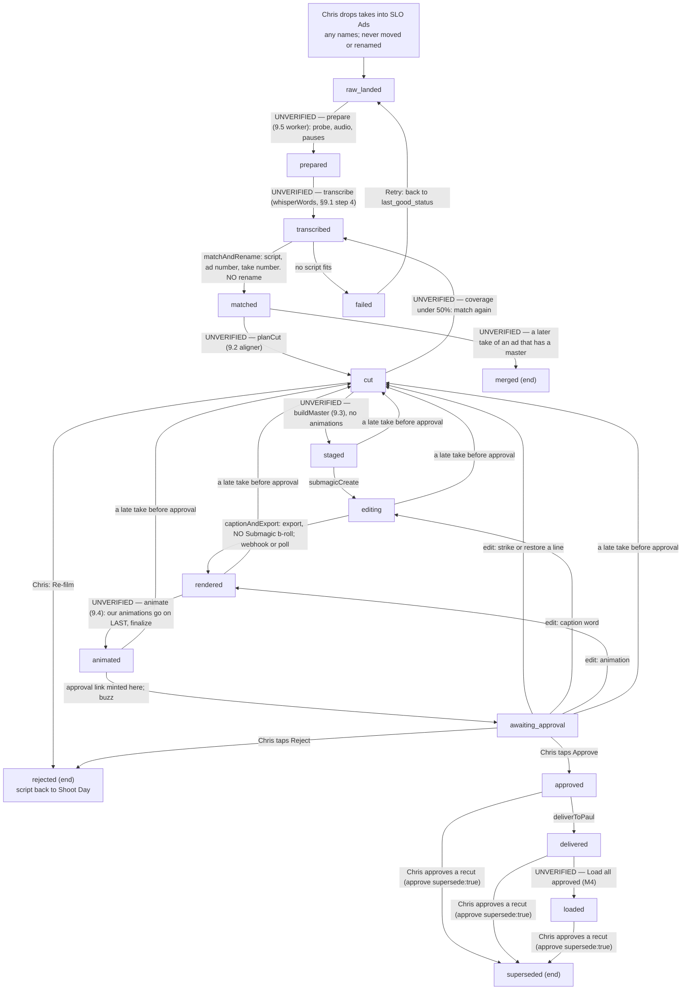

# Ad video — from a filmed take to Paul's folder

**Rebuilt from the code on 2026-10-05 for the marketing machine (spec §9.1, step
9.1: the state machine).** Written against `src/ad-videos/states.mjs`,
`src/ad-videos/pipeline.mjs` (`NEXT_STEP`), `src/ad-videos/store.mjs`,
`src/workflows/ad-video-sweeper.mjs` and `db/migrations/416_ad_video_states_v2.sql`.
The intended journey is `docs/journeys/marketing-machine-intended.md`; the spec is
`docs/specs/marketing-machine-2026-10-04.md` §9.

**The order never changes: cut → Submagic captions → our animations → finalize.**

Five steps in this picture are built by later steps of the spec. Until each one
lands, a take that reaches it **waits there** and its row says so in
`last_step_note` ("prepare is not built yet — …"). They are marked UNVERIFIED
below: the state machine allows the move, and no code makes it yet.

---

## The picture

`failed` can be reached from every state a worker acts on, plus `scripted`,
`filming` and `awaiting_approval`. Retry puts the take back at the state it
failed from (`last_good_status`), not at the start. The picture draws only one
retry arrow to keep it readable.

---

## Who does each move

| From | What runs | To | Where it lives |
|---|---|---|---|
| — | Drive `files.list` on SLO Ads every 5 minutes | `raw_landed` | `ad-video-sweeper.mjs` `detect()` |
| `raw_landed` | `prepare` — **not built (9.5)**, waits | `prepared` | `pipeline.mjs` `NOT_BUILT_YET` |
| `prepared` | `transcribe` — **not built (§9.1 step 4)**, waits | `transcribed` | `pipeline.mjs` `NOT_BUILT_YET` |
| `transcribed` | match the words to a script; take number from "Take N" in the name, else the next free number (`store.nextFreeTakeNo`). The raw file is **not** renamed | `matched` | `pipeline.mjs` `matchAndRename()` |
| `matched` | `planCut` — **not built (9.2)**, waits | `cut` or `merged` | `pipeline.mjs` `NOT_BUILT_YET` |
| `cut` | `buildMaster` — **not built (9.3)**, waits | `staged` (or back to `transcribed`) | `pipeline.mjs` `NOT_BUILT_YET` |
| `staged` | Submagic create, `autoRender:false` | `editing` | `pipeline.mjs` `submagicCreate()` |
| `editing` | claimed export with **no** Submagic b-roll, then webhook or poll. A row with no `cut_at` and no export (old order) waits and is never exported | `rendered` | `pipeline.mjs` `captionAndExport()` |
| `rendered` | `animate` — **not built (9.4)**, waits | `animated` | `pipeline.mjs` `NOT_BUILT_YET` |
| `animated` | mint the approval link, save, buzz | `awaiting_approval` | `ad-video-sweeper.mjs` `approvalLinks()` + `pipeline.mjs` `saveFinishedAndNotify()` |
| `awaiting_approval` | **Chris taps Approve, Reject or an edit** | `approved` / `rejected` / `cut` / `editing` / `rendered` | a person. No worker step. |
| `approved` | the finished-ads folder | `delivered` | `pipeline.mjs` `deliverToPaul()` |
| `delivered` | Load all approved — **not built (M4)** | `loaded` | — |
| `failed` | **Retry** (a person) | `last_good_status` | `store.mjs` `retryFailed()` |

**The locks in the database (416):** `ad_videos_one_finished_uq` — one of
approved, delivered or loaded per ad. `ad_videos_one_master_uq` — one of cut,
staged, editing, rendered, animated or awaiting_approval per ad.
`ad_videos_identified_ck` — only scripted, filming, raw_landed, prepared,
transcribed and failed may be missing an ad number.

**The pace.** A pass moves up to 40 rows (`DEFAULT_BATCH`, `TAKES_PER_PASS`) and
stops starting new ones at 12 minutes (`PASS_BUDGET_MS`).

**Rows caught mid-pipeline by the change** are moved once by
`scripts/ad-videos-move-in-flight-9-1.mjs` (dry run first): editing,
transcribed, and staged or matched with no export go back to `raw_landed`, with
the old Submagic project id kept in `last_step_note`; matched with an export
goes to `editing` so the paid export is polled. It builds
`ad_videos_one_master_uq` and validates `ad_videos_identified_ck` if 416 could
not, and it never picks between two takes of one ad.

---

## Gaps between intended and actual (CLAUDE.md §4)

* **Five steps are not built yet** (prepare, transcribe, planCut, buildMaster,
  animate). A take stops at `raw_landed` today and says why. Steps 9.2–9.5 of
  the spec build them.
* **Delivery, loading, the edit and recut routes, one buzz per shoot and the
  signed final link** are later steps (9.6, 9.7, M4). The states and moves for
  them exist; the code that makes the moves does not.
* **The brief is plain text, not a PDF** — see below.

**2. The brief is plain text, not a PDF.** The plan names `043_brief.pdf`.
`uploadTextFile()` writes text, and making a PDF would need a new dependency.
The brief holds the same five things either way: ad number, hook, headline,
primary text and the landing link.

---

## The three gaps that used to be here are CLOSED (2026-09-22)

This section used to list three things that were not built. All three were
built on 2026-09-22, and two of them were only ever gaps because of a fact that
turned out to be wrong. The measurements are in
`docs/specs/video-pipeline-unknowns-settled-2026-09-22.md`.

**1. Staging the take — built, and it needs no new vendor.** The old note said
a Google Drive link cannot work, so a take would have to be copied to
Cloudflare R2 or Amazon S3 first. Both halves were measured false. Submagic has
a whole-project upload route (`POST /v1/projects/upload`, multipart, up to
2 GB), so no link is needed by anybody; and a Drive link does work anyway — a
344.6 MB file answered real MP4 bytes to a client with no credentials at all,
over `drive.usercontent.google.com/download?id=…&export=download&confirm=t`. The
threshold is around 100 MB rather than 25, and `confirm=t` defeats it.

`src/ad-videos/staging.mjs` holds the one route there is, and **it publishes
nothing**: no link, no permission, no call. The take's bytes travel Drive →
worker → Submagic, inside the fence, once.

**The `link` fallback was deleted on 2026-09-22.** It shared one file as "anyone
with the link, reader" and handed Submagic the URL — and nothing ever took that
share back off. A take handed over for one edit stayed readable by anyone
holding its id for the life of the file, and Google grants no expiry on an
`anyone` permission, so there was no small fix that bounded it. The provider
call it used, `shareAnyoneWithLink()`, is gone too, so nothing in this repo can
publish a Drive file any more. If Submagic's upload route is ever refused on our
plan, that is a new decision to make out loud — not a dormant switch.

Netlify Blobs and Supabase Storage were both measured and both fail: a blob can
be 5 GB but the only way out is a function response capped at 20 MB, and our
Supabase plan caps a file at exactly 50 MiB. Neither is worth rebuilding.

**2. Moving the video bytes — built, inside the fence.** `transmitBinary()` and
`postBinaryTo()` in `src/lib/outbound-fetch.mjs` are the missing half of the
chokepoint: a caller still names a fence, the dry-run flags still hold it, and
there is a size cap and a two-minute clock. The cap is checked against
`content-length` first and then chunk by chunk, so a vendor that lies about the
length still cannot fill the worker's memory. Used for three things: reading a
take out of Drive, uploading it to Submagic, and pulling the finished render
back down. `uploadVideo()` no longer refuses — it opens a resumable session and
PUTs the bytes into Paul's folder.

**3. Writing to Drive — measured working.** The live token grants the full
`https://www.googleapis.com/auth/drive` scope, and a real create/trash/delete
round trip returned 200/200/204 with no 403. A 200 MB upload session was
granted and cancelled with zero bytes sent. The read-only guard stays in place
for the day a narrower token is ever put in its place: it names the missing
scope rather than reading as a mystery 403, and no stored key is ever changed.

---

## What has to be true before a single byte leaves

Three separate switches, and all three default to off:

| | |
|---|---|
| `ADAPTERS_DRY_RUN` | must be `0`/`false`/`no`/`off`, or Submagic and Drive are both held |
| `MESSAGING_DRY_RUN` | must be the same, or the phone stays quiet |
| `SUBMAGIC_API_KEY`, the Google credentials, `DRIVE_RAW_FOLDER_ID` | must be set, or every step reports "not configured" |

With none of those set the sweeper walks an empty folder and does nothing.

---

## Env names this flow reads

Read by NAME only; no value is ever printed or logged.

`SUBMAGIC_API_KEY`, `SUBMAGIC_API_BASE`, `SUBMAGIC_API_AUTH_HEADER`,
`SUBMAGIC_EXPORT_PATH`, `SUBMAGIC_WEBHOOK_URL`, `ANTHROPIC_API_KEY`,
`GOOGLE_DRIVE_SERVICE_ACCOUNT_JSON`, `GOOGLE_DRIVE_DELEGATE_EMAIL`,
`GOOGLE_DRIVE_OAUTH_TOKEN_JSON`, `DRIVE_RAW_FOLDER_ID`, `DRIVE_PAUL_FOLDER_ID`,
`NTFY_TOPIC`, `NTFY_SERVER`, `NTFY_TOKEN`, `PUBLIC_SITE_URL`,
`ADAPTERS_DRY_RUN`, `MESSAGING_DRY_RUN`.

`AD_VIDEO_STAGING_MODE` is **gone**. It used to choose between publishing the
take and not publishing it; there is now only the route that publishes nothing,
so there is no switch to get wrong.

Set on Netlify 2026-09-22 (production, deploy-preview, branch-deploy):
`DRIVE_RAW_FOLDER_ID` (the new "Raw" folder inside SLO Ads — takes land there),
`DRIVE_PAUL_FOLDER_ID` (the existing `paul-submagic` folder, reused so finished
work has one home and not two), `SUBMAGIC_WEBHOOK_URL`
(`https://fundhub.ai/api/webhooks/submagic`) and `NTFY_TOPIC`, stored
`--secret`. A topic name is the whole address of a notification, so it is long
and random, like a password.

---

## The money guard

Creating a project is capped at **30 an hour** (measured 2026-09-22; an earlier
note said 500, which was wrong by a factor of sixteen), and export at 50, with
every update costing another export. So:

* a pass moves at most 10 rows and picks up at most 20 new files
* `exported_at` on the row stops a second export of the same take
* `submagic_project_id` stops a second project, which is a second paid minute
* **the mark goes down BEFORE the money goes out.** Both of those marks used to
  be written only after the vendor had already answered, which left the whole
  length of a two-hundred-megabyte upload with nothing on the row. A function
  killed in that window came back to a row that said nothing had happened and
  spent again. `submagic_claimed_at` and `export_claimed_at`
  (`db/migrations/391_ad_video_spend_claims.sql`) are written first and cleared
  when the vendor answers. A standing create claim REFUSES a second create —
  Submagic has no list endpoint, so nothing can find out whether the first one
  landed and a person has to look. A standing export claim POLLS instead, which
  costs nothing and settles the question outright.
* **a retry clears the failed step's marks.** Since 2026-10-05 `retryFailed()`
  puts the row back at `last_good_status` and clears only that step's marks and
  later ones (`STEP_MARKS` in `store.mjs`), including both spend claims when the
  retry reaches the Submagic steps. A mark left standing would make its step
  skip and write nothing for ever. The inputs — the Drive file, the ad number,
  the take number, the matched script — survive.
* AI B-roll is never asked for — 3 credits a clip against 15 credits a month is
  five clips for a hundred ads. `buildItems()` refuses the type outright.

---

## The 4K law

`.claude/rules/video-4k-unless-ad.md`: everything that is not a paid ad must be
4K. The real width and height are read off the Drive file
(`videoMediaMetadata`), never off a form. A take that is not an ad and came back
under 2160 lines tall is flagged on the row and in the notification. It is never
upscaled and never quietly shipped.

---

## What the merge review changed (2026-09-22)

Three agents built this in three worktrees at the same time. All three finished
green. The pipeline still could not have moved a single video, because every
defect lived in the gap **between** two files that were never loaded into the
same process — so no test in any of the three could see it.

**The workers wrote fourteen columns the table did not have.** The pipeline was
written to the plan's §2 step 4 (what has already happened to a take) and the
table to the plan's §3 (what we know about a take). Those are different lists.
`exported_at` was one of the missing ones — the mark that stops a take being
re-exported on every five-minute pass, at Submagic's per-minute rate. The guard
was written and had nothing to stand on. `db/migrations/390_ad_video_worker_marks.sql`
adds them. Three more were named differently on each side and now use the
table's name: `raw_public_url` → `source_url`, `submagic_download_url` →
`finished_url`, `drive_final_folder_id` → `paul_folder_id`.

**The table could not hold a take that had just landed.** 389 made `ad_id` and
`take_no` NOT NULL, but a take does not know its ad number when it lands —
Chris's phone calls the file IMG_4471.mov and the transcript match is what gives
it a number (plan §1 step 8). A worker had to refuse the row or invent a number,
and an invented number is worse: it is indistinguishable from a real one to
everybody downstream, including Paul. 390 makes both columns nullable and adds
`ad_videos_identified_ck`, which is stricter where it counts — a take cannot
reach `matched` or anything after it without both numbers.

**The sweeper and the store spoke different languages.** The sweeper probed for
`lastRawSeenAt`, `recordRawTake`, `listPending`, `patch` and `candidateScripts`;
the store offered none of them. It did not crash — it reported "the store does
not offer listPending/patch" and returned, on every pass, silently. Those five
are now built, plus `mintApprovalLink`, and each opens its own staff transaction
because `ad_videos` carries FORCEd row-level security and an unscoped connection
matches zero rows without erroring.

**The Submagic webhook dropped every render.** It called
`findBySubmagicProjectId(db, projectId)` — a pool where a staff transaction
belongs and a bare string where an options object belongs. Between the two, it
always found nothing and answered "no take is waiting on this project".
`findByProject(db, projectId)` is the correctly-shaped twin.

**Chris's notification had no buttons in it.** `approveUrl` and `rejectUrl` were
both `null`, because the worker half had no token minter. `approvalLinks()` in
the sweeper now mints one per row, a moment before that row's buzz goes out, and
only while the row is still `animated` (it was `rendered` before 2026-10-05) — so a second mint cannot kill the link
in the notification he is looking at right now.

**Three approval doors became one.** Two of the three builders each built a way
to approve a take. Both were sound; two doors for one decision is not. The door
is `api/public/ad-video-approve.mjs`, whose token lives on the `ad_videos` row
and whose row-level security policies are written on that token. The screen from
the door that was dropped was kept — `src/ad-videos/decision-page.mjs` — because
a phone notification is opened by a **browser**, and the surviving door answered
a tap with raw JSON that has no Approve button in it. A GET that asks for a page
now gets the page; only a POST decides, so a link preview or a URL scanner
following the link out of a notification still cannot approve anything.

`src/ad-videos/seam.test.mjs` is what stops all of this coming back. It reads
the migrations as text and the modules as modules, so it needs no database —
which is the only kind of proof available on a machine with no Postgres.

**Still not proved:** every `.pg.test.mjs` in this feature is unrun. There is no
local Postgres on this Mac. Nothing about migration 389, migration 390, the
constraints, the row-level security policies, or any SQL statement in
`store.mjs` or `token.mjs` has been executed even once.
