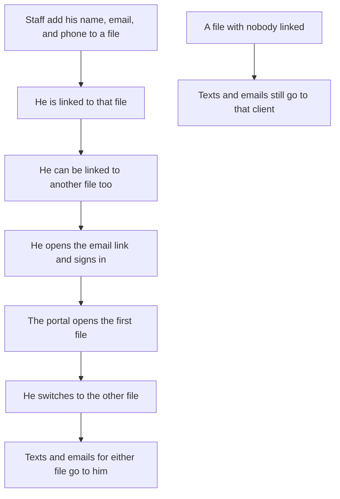

# Authorized representative — intended

A dad watches both kids' credit files. He is not an affiliate. Staff add him. He signs in with his own email link. On each linked file he can do what the kid can do. Texts and emails for those files go to him.

One live person per file. Adding someone else takes the previous person off that file. A file he is not linked to does not open.
