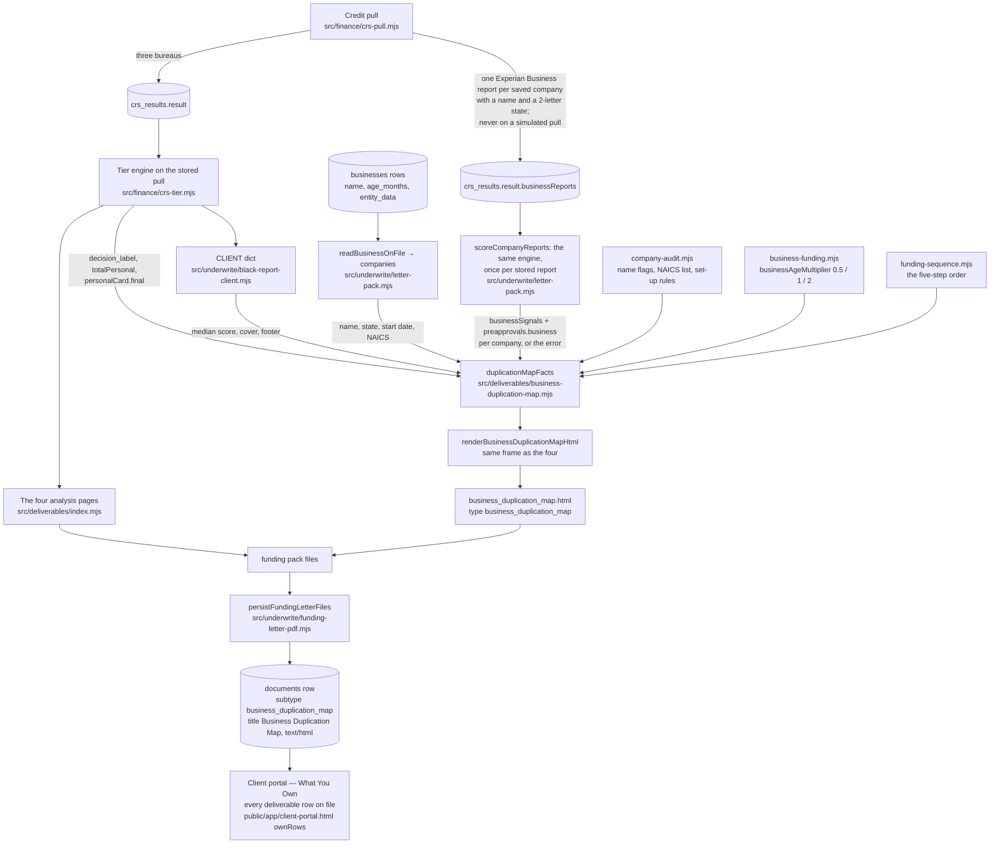
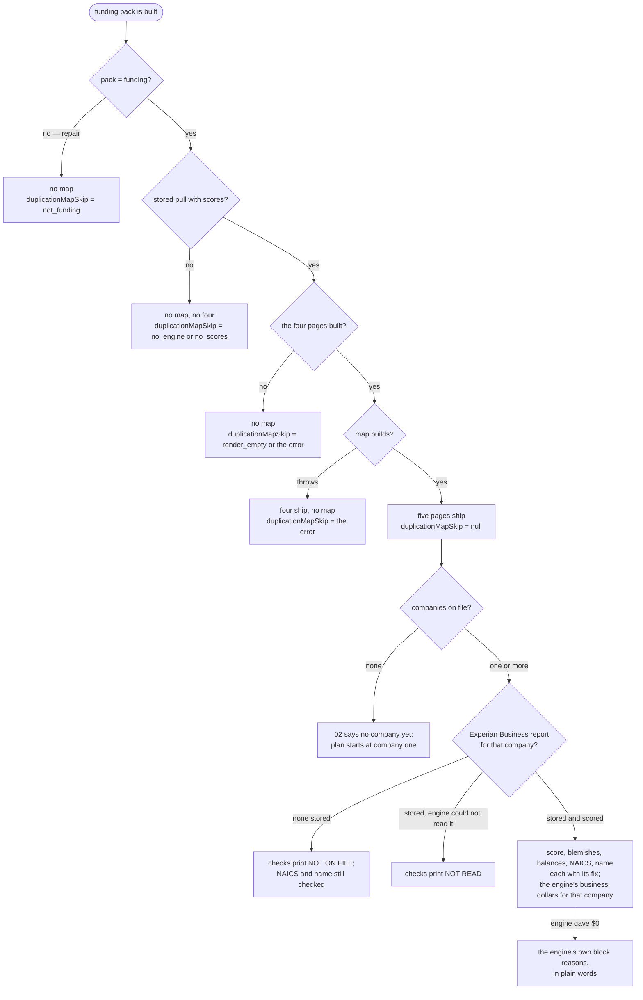

# Business Duplication Map — how the document is made

Generated from the code on 2026-10-02. Not a spec. Every box names the file that does it.

The map is the free bonus of the $297 Funding Roadmap and the fifth hosted page of the funding
pack. The /roadmap sales page shows a sample of it; this is the real document. Its sections mirror
that sample. Its numbers come only from the client's file and the UnderwriteIQ engine.

## Where each fact comes from

## The states the document can be in

## What each section prints

| Section | Prints | Source |
|---|---|---|
| 01 both files | decision, median score, personal funding, card funding, company count, reports count, business funding today; the five-step funding order | engine, CLIENT dict, `funding-sequence.mjs` |
| 02 your business today | per company: Experian Business score, blemishes (bankruptcy, judgment, tax lien, late payments over 30 days, UCC filings), business balances, NAICS code, business name — each with its fix — and the engine's business dollars | stored Experian Business report scored by the engine, `company-audit.mjs` |
| 03 by age | the three age bands in words; the card-funding anchor; when each saved company turns 24 months | `businessAgeMultiplier`, engine, saved or Experian start date |
| 04 quarterly plan | eight quarters from today: one new company a quarter, each new one's 12-month mark, each saved company's 12- and 24-month marks | owner rule in `company-audit.mjs` ("Open one new shell LLC each quarter") |
| 05 set up | NAICS low-risk list, one exact name, website, LinkedIn, the shell-LLC rule | `company-audit.mjs` standing rules (client-facing text only) |

## Not on the file today

* **NAICS code.** No write path saves one (`src/slo/businesses.mjs` saves state and start date,
  not NAICS). Until something does, every company's NAICS row prints "NOT ON FILE" with the
  low-risk list. Open question on `ops/workflows/2026-10-02-roadmap-sample-content.md`.
* **Experian Business on a simulated pull.** `crs-pull.mjs` buys business reports only on a real
  pull, so a simulated client's map prints "not on the file" for every Experian check.
