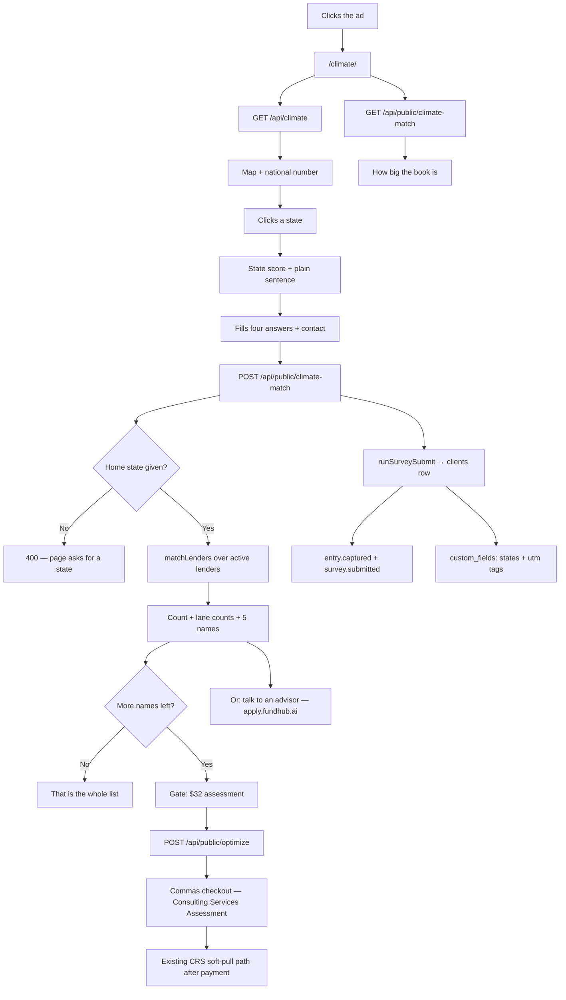

# Lending Climate lead magnet — intended journey

**Page:** `https://fundhub.ai/climate/` (also `/lender-climate`, a 301 into it)
**Role:** a stranger who clicked an ad. Not signed in, not a client yet.
**One job:** tell them how many banks in our book serve their state, and get their contact details.
**Offer brief:** `docs/ads/climate-lead-magnet-offer-2026-09-18.md`
**Built:** 2026-09-18

---

## What the visitor sees, in order

1. **A headline and one button.** "See how many banks in our book fit your state." The
   button goes down the page to the form. Nothing else competes with it.
2. **Today's reading.** One big national number out of `GET /api/climate`, and a map of the
   United States with every state coloured by its own score. Each colour also carries its
   word — Very favorable, Favorable, Neutral, Tight, Very tight — so the map still reads
   when the colours do not.
3. **A state they clicked.** Its name, its score, and a plain sentence saying that is the
   wider picture and not a decision about them.
4. **Four questions and their contact details.** Home state (required), business state (only
   if different), do they have a business, and their own guess at their credit score. Then
   name, email, phone.
5. **Their number.** One big count, then how it splits: national banks, banks local to their
   home state, banks local to their business state. Then **five real bank names** from the
   top of the list.
6. **The gate.** How many more names are in the full list, and the existing **$32** Business
   Financial Assessment as the way to see them. One button. It opens the same Commas
   checkout `/optimize` has used since it shipped.

## Observable ground truth

| Step | What must be true | Where to see it |
|---|---|---|
| Map paints | 51 states drawn, each `fill` equal to the `color` the API sent for that state | `GET /api/climate` → `states[]`, and `public/climate/us-states-paths.json` |
| National number | equals `national.score` exactly, or an em dash when the API did not send one | `GET /api/climate` |
| The count | equals `matchLenders().summary.match_count` over the active, non-demo rows of the `lenders` table | `POST /api/public/climate-match` |
| The book size | equals the same row count `/api/climate` publishes as `banks` — 1,106 on 2026-09-18 | `GET /api/public/climate-match` |
| The names | are real `lenders.name` values, in the matcher's own tier-and-rotation order — the bank's name, its logo and its lane, and nothing else | `POST /api/public/climate-match` → `teaser[]` |
| Held-back business cards | when they answer "personal funding only", every business-table lender is held back and the page says so in words | `summary.held_for_no_business.message` |
| The lead | a `clients` row with `channel_source = website:climate`, plus `entry.captured` and `survey.submitted` events | `clients`, `events` |
| The states and ad tags | `clients.custom_fields.home_state`, `.business_state`, and any `utm_*` that was on the URL | `clients.custom_fields` |
| The unlock | a Commas checkout for **$32** on the existing keep title **Consulting Services Assessment** | `POST /api/public/optimize` → `checkoutUrl` |

## The four states of the screen

| State | What is on screen |
|---|---|
| Loading | a shimmer block the same size as the map, and an em dash where the national score goes |
| Empty | "Pick a state" on the state card, and the form itself as the one action |
| Error | the map hides and the page says today's reading did not load **and that the bank count still works**; a failed count says "try that button once more" |
| Full | the count, the three lane figures, five bank names with logos where we have them, and the gate |

## What this page must never say

Set by the owner and enforced by `src/http/climate-match.test.mjs`:

- No percentage chance of being approved. No "80–90%".
- No dollar amount a bank will give. The only price on the page is **$32**.
- No "pre-approved", "guaranteed funding", "no denials", "we'll get you funded".
- No "your score will go up".
- Lender dollar bands (`typical_approval_range`, `max_known_loc`), stated requirements and
  insider tips are staff-only and never leave the endpoint.
- **A lender's own `product_name` is not on the free teaser.** Some are the bank's
  promotional terms — "0% for 20 Months — No Business Checking Required" is a real one in
  the live book — and on a public funding page that reads as our claim about credit terms.
  Names on the teaser; product names on the gated list.
- Soft-pull wording is attached to the $32 assessment and to nothing else.

## The honest limit, written on the page

The self-reported score band **does not change the count**. No lender row in the book states
a readable credit floor (see `src/lenders/match.mjs`, "THE CREDIT FILE"), and there is no
agreed band → number rule, so no credit profile is passed and the score gate does not run.
The band is stored on the lead. The page says the count comes from the state and business
answers, and that the paid assessment re-runs it on a real report.

## Flow

## Known gaps, written down rather than papered over

- The geocode endpoint (`POST /api/climate/geocode`) is live but this page does not use it.
  A visitor picks their state from a list instead of typing a city or ZIP.
- The count is not re-run automatically after the $32 payment lands. Staff see the real-score
  match today at `GET /api/read/lender-matches?client_id=`; nothing emails the client a new
  list on its own.
- `sms_consent` is sent as false because the form does not ask for it yet.
