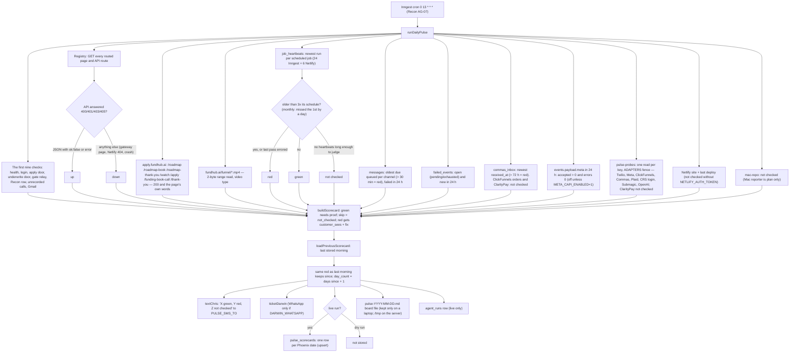
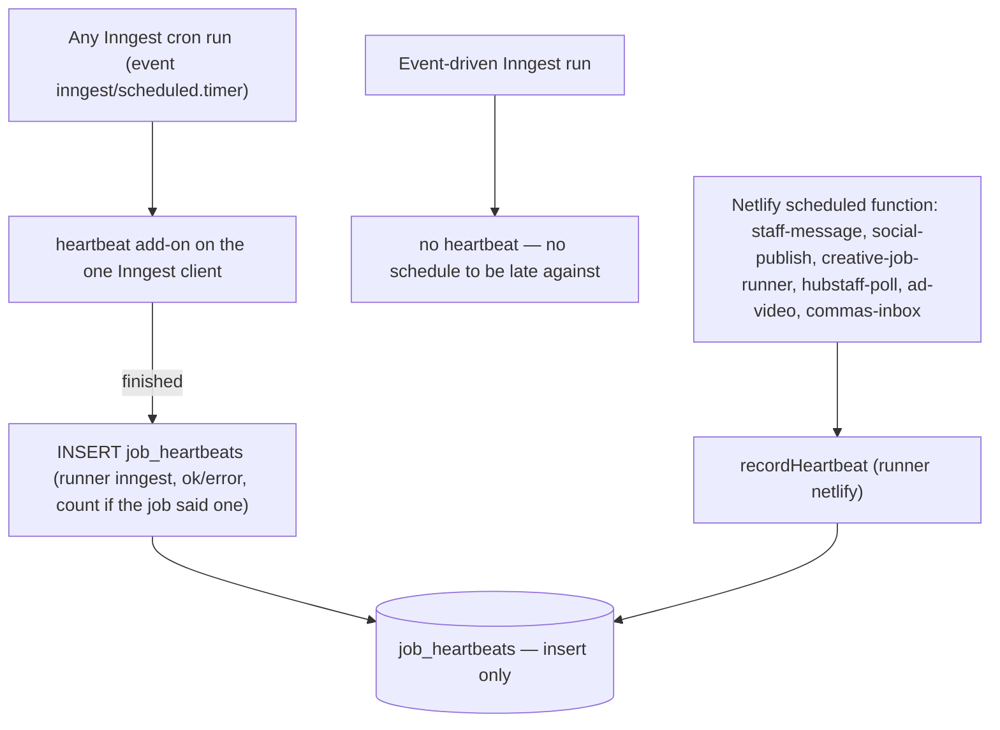
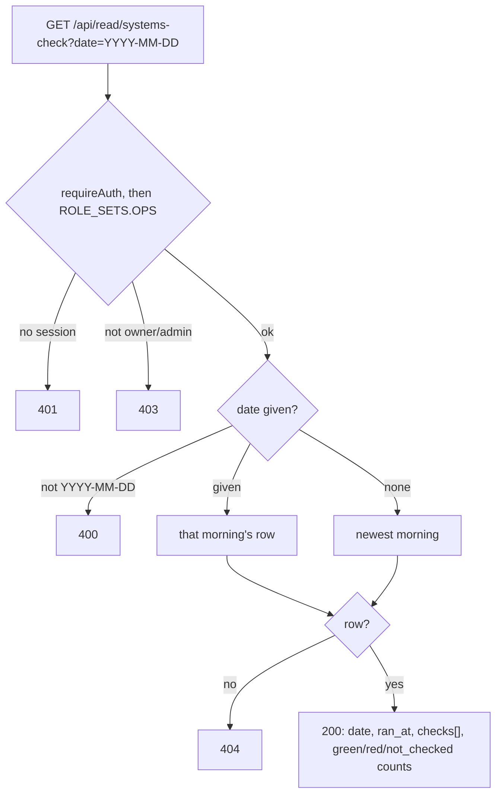

# daily-pulse — actual

What the code does today. Traced from `src/workflows/daily-pulse.mjs`, `src/pulse/daily-pulse.mjs`, `src/pulse/registry.mjs`, `src/pulse/heartbeats.mjs`, `src/pulse/system-checks.mjs`, `src/pulse/scorecard.mjs`, `src/messaging/providers/pulse-probes.mjs`, `src/pulse/notify.mjs`, `src/workflows/client.mjs`, the six `netlify/functions/*` scheduled functions and `api/read/systems-check.mjs`. Not from the spec.

**There is no `daily-pulse-intended.md`.** Nobody has written the intended version of this journey, so there is nothing hand-signed to compare it against. That gap is a finding, not something this file fills.

This is Recon (AG-07), the one watchdog. It reports. It never fixes, never pulls credit, never charges a card, never mails paper, and never calls the Clarity Data Export.

## Every morning

A check that throws becomes one red row with its message. It does not stop the morning text.

## Every scheduled run (the receipts the morning reads)

A heartbeat that cannot be written is logged and dropped. The job's own work is never failed by it.

## Reading the stored morning

## Gaps between this and what was asked (spec, "What it misses")

- **No intended journey.** See the top of this file.
- **ClickFunnels order notices are not checked.** No code anywhere handles a ClickFunnels order (`src/adapters/clickfunnels.mjs` maps appointments, forms and surveys). There is no field to read, so none is guessed.
- **ClarityPay is not checked.** No code and no key exist in the repo.
- **Site paused / last deploy** stay not checked until `NETLIFY_AUTH_TOKEN` exists in the site's own environment. This change does not set it.
- **The Mac's repo copy** stays not checked. The reporter is plan only.
- **Outside-service reads sit behind the ADAPTERS fence.** If `ADAPTERS_DRY_RUN` is not explicitly off in production, every probe is shown as not checked, with that reason.
- **The board file is still written.** On the server it lands in `/tmp` and is lost. The database row is the record that is kept.
