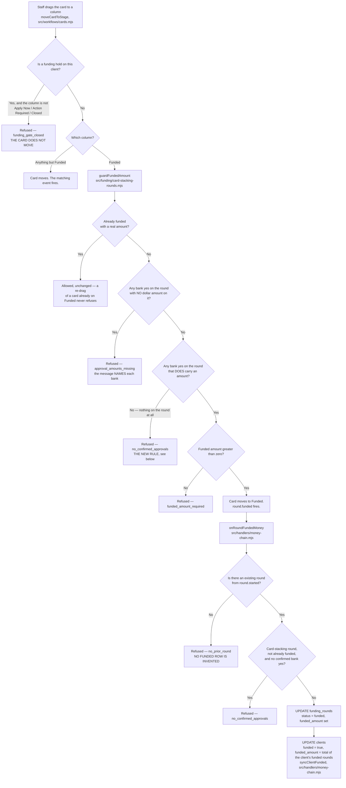
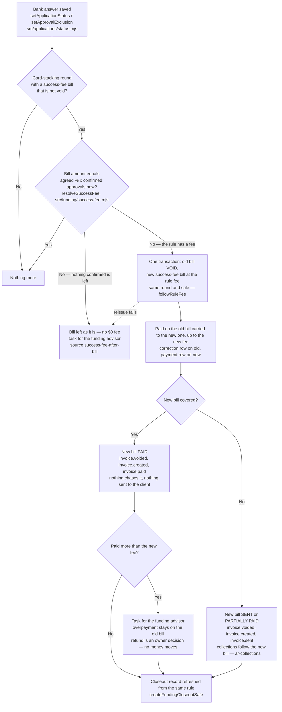
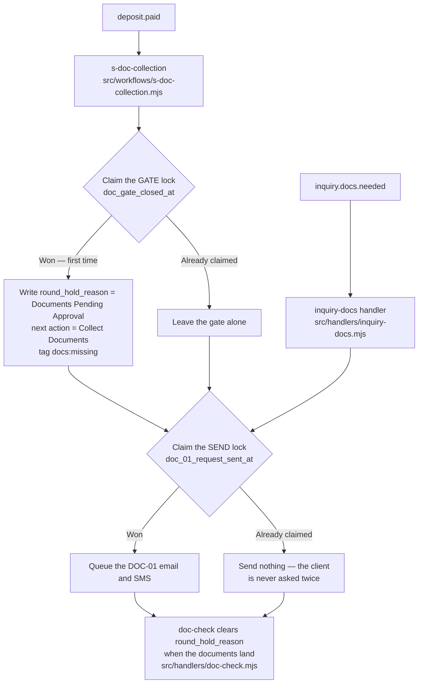

<!-- Hand-authored from the code, 2026-09-17. Traced file by file, not from a spec.
     Files read: src/workflows/cards.mjs, src/funding/card-stacking-rounds.mjs,
     src/funding/success-fee.mjs, src/handlers/money-chain.mjs,
     db/migrations/382_round_approved_amount_from_confirmed.sql,
     src/workflows/s-doc-collection.mjs, src/handlers/inquiry-docs.mjs,
     src/funding/billed-fee-check.mjs, src/applications/status.mjs (2026-09-18),
     src/handlers/doc-check.mjs, src/inquiry-ops/doc-gate.mjs,
     api/dashboard/client.mjs, public/app/client-control-panel.html. -->

# The funding round — what the code actually does

This is the card-stacking funding round: the columns a staff member drags a client's card
across, and what the system writes when they do. The nine generated pages in this folder
answer "who can reach which route". This one answers "what has to be true before a round can
be called funded, and where the dollar figure on the screen comes from".

Every claim names the file that makes it true.

---

## The columns, and the event each one fires

`STAGE_TO_EVENT` in `src/funding/card-stacking-rounds.mjs`:

| Column a staff member drags to | Event the system fires |
|---|---|
| Apply Now | `round.started` |
| Round Submitted | `round.submitted` |
| Approved | `round.approved` |
| Action Required | *(none — the card moves, nothing fires)* |
| Funded | `round.funded` |
| Closed | `round.closeout` |



### The person row follows the rounds

Right after the round is written funded, `syncClientFunded()` in `src/handlers/money-chain.mjs`
sets `clients.funded = true` and `clients.funded_amount` to the total of that client's funded
rounds. If any funded round has no amount, the total stays unknown (`NULL`), never a partial sum
and never `0`. It only ever sets funded to true; nothing here un-funds a client.

Before 2026-09-18 nothing wrote those two columns. Measured on the live site, 2026-09-18 (hole 8):
Sim Eight-Funding had two funded rounds of $25,000 each, and the person row still said
`funded = false` with no amount, so the Client Control Panel's Funded line read "No".

---

## The rule this page exists to protect

**A round cannot be called funded unless at least one bank said yes with a dollar amount
recorded against it.**

Why it is a money rule, not a tidiness rule: the success fee is a percent of *confirmed
approvals* — Approved application rows that carry a real recorded amount
(`src/funding/success-fee.mjs`, `docs/CLOSEOUT-FEE-BASIS.md`). A round closed with no bank yes
on it can never be invoiced, and once a round is closed nobody goes back for it.

Measured on the live walk, 2026-09-16: round 1 on the Sim Eight-Funding file was marked funded
for **$25,000** with **zero** application rows behind it. Nothing was billed for it and nothing
ever could be.

The refusal is written for a person to act on. In full, from
`noConfirmedApprovalRefusal()`:

> Cannot move to Funded — no bank on this round has said yes with a dollar amount recorded
> against it. … Open the client's Funding tab, press Bank yes on the bank that approved and
> type the amount in the Approved $ box beside it. If no bank approved, this round did not
> fund — leave it where it is.

### It is enforced in two places, on purpose

1. **The board.** `moveCardToStage` calls `guardFundedAmount` *before* the card moves, so the
   staff member sees the refusal and the card stays where it was.
2. **The event handler.** `onRoundFundedMoney` in `src/handlers/money-chain.mjs` runs the same
   check again before its `UPDATE`. The board is not the only way `round.funded` arrives — an
   event replay or any future caller can emit it straight at the handler and walk past the
   board entirely. That second check is what makes the rule true of the database rather than
   true of one screen.

**Scope of the second check: card-stacking rounds only** (`funding_rounds.product =
'card_stacking'`). The alt-fin rail (`src/adapters/lendflow.mjs`) records no per-bank
application rows at all, so the same test there would refuse every genuine Lendflow funding.
Those rounds are not billed off confirmed approvals and are left exactly as they were.

**An already-funded round is never re-blocked**, on either path. Replays of a delivered event
are routine and have to stay harmless.

---

## Where the "Approved" figure comes from, and who is allowed to write it

`funding_rounds.approved_amount` is a **summary**. Since
`db/migrations/382_round_approved_amount_from_confirmed.sql` a database trigger keeps it equal,
at all times, to the confirmed approvals on that round:

```
SUM(applications.approved_amount)
  WHERE funding_round_id = <this round>
    AND status = 'Approved'
    AND approval_excluded_at IS NULL
    AND approved_amount IS NOT NULL
    AND approved_amount > 0
```

The trigger fires on every write to `applications`. So:

* **A round that HAS per-bank rows: the trigger owns the column.** `onRoundFundedMoney` no
  longer writes the event payload's approved figure over the top of it. That write was the
  drift that left **$25,000** in the round box on screen against a **$10,000** bank yes, after
  one of the two banks was later moved to Denied and the frozen summary never moved with it.
* **A round with NO application rows at all** (an imported summary, or the alt-fin rail) is
  untouched by the trigger, so there the event payload is still the only source and is still
  used.

`NULL` means *nothing on this round is confirmed*. It is never turned into `0` — a zero here is
exactly what would let a $0 bill be produced. That holds on every path above.

**This column is still not a billing source.** The invoice and the closeout read the
application rows through `src/funding/success-fee.mjs`.

---

## A bank answer that changes after the bill

The success fee is worked out when the round is funded (F-07,
`src/workflows/f-07-funding-locked.mjs`). A bank answer recorded after that — Approved,
Denied, a new amount, or "doesn't count" — can leave the bill disagreeing with the rule.
`src/funding/billed-fee-check.mjs` compares them straight after the answer is saved, and
**the bill follows the rule** (owner-set 2026-09-18: the fee must follow the real approval).



* **The answer is always saved first.** A fault in the comparison or the reissue is logged
  (`[billed-fee-check]`) and never turns the button press into an error.
* **One reissue per bill.** The new bill's key names the old one, so pressing the same answer
  twice, or two presses at once, cannot reissue twice; the second press finds the new bill
  already matches.
* **A void bill owes nothing on screen.** The control panel blockers, the Finance page and the
  list signals read a void or written-off bill as $0 owed (`CLIENT_INVOICES_SQL`,
  `BALANCES_SQL`), so the old bill does not show as a balance outstanding.
* **Alt-fin rounds are skipped**, the same scope as the funded guard: that rail bills off the
  Lendflow figure on the event, not per-bank rows.

Measured on live 2026-09-18, Sim Eight-Funding round 2: the bill billed 10% of $25,000
(Arizona Bank & Trust, Approved when the round was funded). Arizona was moved to Denied
thirty minutes later and Native American Bank was recorded Approved at $10,000. The rule says
$1,000; the $2,500 bill stood and was later paid by a sim receipt. Corrected 2026-09-18 by
running this path on that one test client.

---

## What the Client Control Panel shows

`public/app/client-control-panel.html`, fed by `api/dashboard/client.mjs`, which returns every
round for the client ordered by round number.

* **The boxes at the top are the CURRENT round only** — number, status, "On Hold Because",
  "Approved this round", finalized, and how long it has been open.
* **One line underneath names every round on the file** — "Round 1 · funded · approved $10,000
  · funded $10,000   |   Round 2 · …". It appears only when there are two or more rounds,
  because with one round it would just repeat the boxes. It exists because the boxes show one
  round and say nothing about the others, so a second funded round was simply invisible.
* **Both use the same money rule** (`FHClientPanel.money`). Unknown is a dash. A *recorded*
  zero prints `$0`. They sit a centimetre apart and show the same figure for the current round,
  so they must read the same way — before 2026-09-17 the line printed a recorded zero as a dash
  while the box above printed `$0`.
* **The gate is not weakened by the new line.** It paints nothing at all unless the worked-out
  round from `src/fulfillment/next-action.mjs` came back non-null, so a repair-only client who
  never bought funding still sees no funding money anywhere on the page.

---

## The documents hold that pauses funding

A funding hold on the client stops the card moving to any column except Apply Now, Action
Required and Closed (`src/workflows/cards.mjs`). The hold is
`clients.custom_fields.round_hold_reason`, and the doc hold's value is
`"Documents Pending Approval"` (`src/inquiry-ops/doc-gate.mjs`).



**Two jobs, two locks, and that is the fix.** Both paths send the same "send us your documents"
message and both claim the same send lock `doc_01_request_sent_at`, which is correct — one
lock, one message. But only `s-doc-collection` closes the funding gate, and it used to claim
that shared send lock *before* writing the gate. Whichever path ran first silenced the other
completely, so when the inquiry path won, the gate was never closed at all.

Measured 2026-09-16 on client d682c13b (Sim Eight-Funding): the inquiry path won the race at
17:46:53, the message went out, and `round_hold_reason` was never written. "On Hold Because" on
the Client Control Panel read a dash on a client who was on hold, and the funding gate that
should have blocked the round blocked nothing.

The gate now has its own one-shot lock, `doc_gate_closed_at`, claimed and released
independently of the send. It stays one-shot: `doc-check` clears `round_hold_reason` when the
documents arrive but leaves `doc_gate_closed_at` set, so a replayed `deposit.paid` cannot put
a cleared hold back.

---

## UNVERIFIED

* **Nothing.** Every arrow above was traced to a named file. Where a path is deliberately out
  of scope — the alt-fin rail's rounds — that is stated as scope, not left as an unknown.
