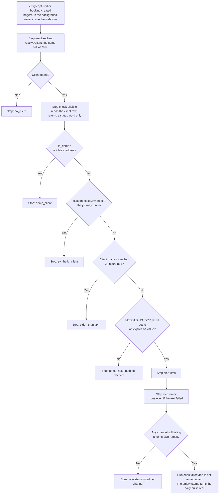
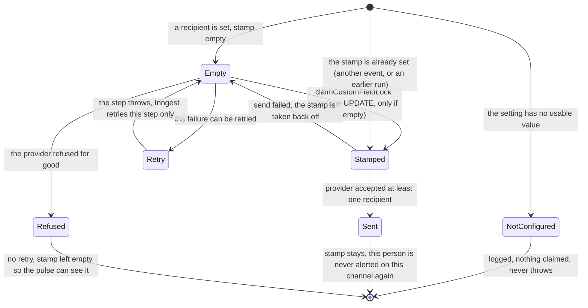

# Lead alert to Chris — flow (generated from code, 2026-10-07)

What happens when a new lead arrives, read from the code in `src/workflows/lead-alert-owner.mjs`, `src/staff/lead-alert.mjs`, `src/workflows/custom-fields.mjs` and `src/pulse/system-checks.mjs` (`checkLeadAlerts`). Spec: `ops/workflows/team-setup-sarah-justice-2026-10-07/w2-lead-alerts-spec.md`. Board: `ops/workflows/team-setup-sarah-justice-2026-10-07.md`.

**No intended journey has this step yet.** No `-intended.md` file mentions a lead alert to the owner. `client-intended.md` and `role-owner-intended.md` list API routes only. Nothing in them conflicts, and this build adds no route, so `npm run journeys:check` is unchanged.

**Owner-set 2026-10-07 (Chris):** "I need to be notified immediately when leads come in (text/email). All incoming leads should alert me first." He answers each lead from his business cell with a personal video. The business cell and the alert email are set as settings at go-live and are not written anywhere in the repo. The $297 contact, the $297 buyer and the education enrollment are **not** leads for this alert. Texting runs 24 hours a day.

## Which doors fire it

Two events start it: `entry.captured` and `booking.created`. These doors make them (each one checked in the code on 2026-10-07):

| Door | Event | Where |
|---|---|---|
| ClickFunnels opt-in, form and survey posts | `entry.captured` | `src/adapters/clickfunnels.mjs` `mapToCanonical` |
| The apply survey on apply.fundhub.ai | `entry.captured` | same webhook |
| A calendar booking with no survey first | `booking.created` | same webhook; the client is made in the same delivery |
| Homepage survey | `entry.captured` | `api/public/survey-submit.mjs` |
| Climate lead magnet | `entry.captured` | `api/public/climate-match.mjs` calls `runSurveySubmit` |
| Staff "New Client" on the Pipeline board | `entry.captured` (source `pipeline`) | `api/pipeline-clients.mjs` |

**Not alerted, on purpose:** education enrollment (fires no event), the $297 contact (`slo-interest`, makes no client), the $297 buyer (`slo-checkout`, fires no `entry.captured`). The older Blake referral text (`blake-lead-watch`) is separate and untouched.

## The run

## One channel (the text and the email each run this)

The stamp lives on `clients.custom_fields`: `lead_alert_sms_at` for the text, `lead_alert_email_at` for the email. One per channel, so a text that worked is never sent again because the email had to retry. **One text and one email per person, ever,** however many times `entry.captured` fires and whether or not `booking.created` follows.

## What is sent, and to whom

* **Text:** `src/messaging/providers/twilio.mjs` `send()`, to every number in `LEAD_ALERT_SMS_TO`.
* **Email:** `src/messaging/providers/resend.mjs` `send()`, to every address in `LEAD_ALERT_EMAIL_TO`.
* **Not** the lead-facing message queue (`sendTemplated`, the dispatcher). That queue applies the *lead's* consent and quiet hours and waits for a five-minute sweeper. This message is for Chris.
* **No fallback.** Neither setting falls back to `PULSE_SMS_TO` (or any other setting). Unset means no alert on that channel and a red line in the pulse.
* Both sends sit behind the messaging fence (`MESSAGING_DRY_RUN` must be an explicit off value). A context that is not live sends nothing.
* The words (`buildLeadAlertText`, `buildLeadAlertEmail`): the lead's name, phone, email, the source (`Ad <ad id> (<utm_content>)` from `client_ad_attribution`, else the channel such as `clickfunnels`, else "not tagged"; a Pipeline-board lead says "added by staff on the Pipeline board"), the time in Arizona (email only), and the link `<APP_BASE_URL | URL | https://fundhub.ai>/app/client-control-panel.html?id=<client id>`.
* A missing phone, email or name does not hold the alert back; the line says "not given yet" (or "not given").
* Nothing personal is stored in Inngest: each step returns a status word, and the details are read again inside the step that sends them. Logs carry the client id only. An error from a provider is scrubbed of numbers and addresses before it is logged or thrown.

## What watches it

`checkLeadAlerts` (`src/pulse/system-checks.mjs`), id `lead-alerts`, group `messages`, run by `runDailyPulse` next to the message-queue check. It reads and never writes. **Red** when:

* a real client (not `is_demo`, not synthetic) made between 24 hours and 15 minutes ago, with an `entry.captured` or `booking.created` event, is missing `lead_alert_sms_at` or `lead_alert_email_at`; or
* `LEAD_ALERT_SMS_TO` or `LEAD_ALERT_EMAIL_TO` has no usable value. Named by setting name only; the value is never read into the line.

There is no row in `src/pulse/registry.mjs` (this adds no page and no `api/` file) and none in `src/pulse/heartbeats.mjs` (it is not a cron).

## UNVERIFIED

* **That a text reaches Chris's phone.** Twilio accepting the message is not delivery. The finished-ad text on 2026-09-24 did not arrive, and whether the number's carrier registration has cleared is not written anywhere in the repo. The email is the backup channel. Proving it needs the real settings and a real send, which was not done here.
* **Inngest's behaviour on a failing step against a live Inngest.** The code throws inside a step so Inngest retries that step, catches the error after the retries are used up so the other channel still goes, then ends the run with a `NonRetriableError`. The unit tests drive this with a stand-in for `step.run`; it has not been run against a live Inngest.
* **Launch day:** a client made in the last 24 hours who fires `entry.captured` or `booking.created` again after this ships gets one alert, because their stamps are empty.

## Known gaps, not fixed here

* **A function killed between claiming a stamp and sending leaves the stamp set with nothing sent.** Same exposure as the S-00 welcome. The pulse cannot see it (the stamp is set).
* **A person who books a call within 24 hours of becoming a client by another door** (for example a $297 buyer) fires `booking.created` with empty stamps and is alerted once. The 24-hour rule is the only test of "brand new".
* **When one channel's step is failing, the other channel waits for that step's retries** (they run one after the other).
