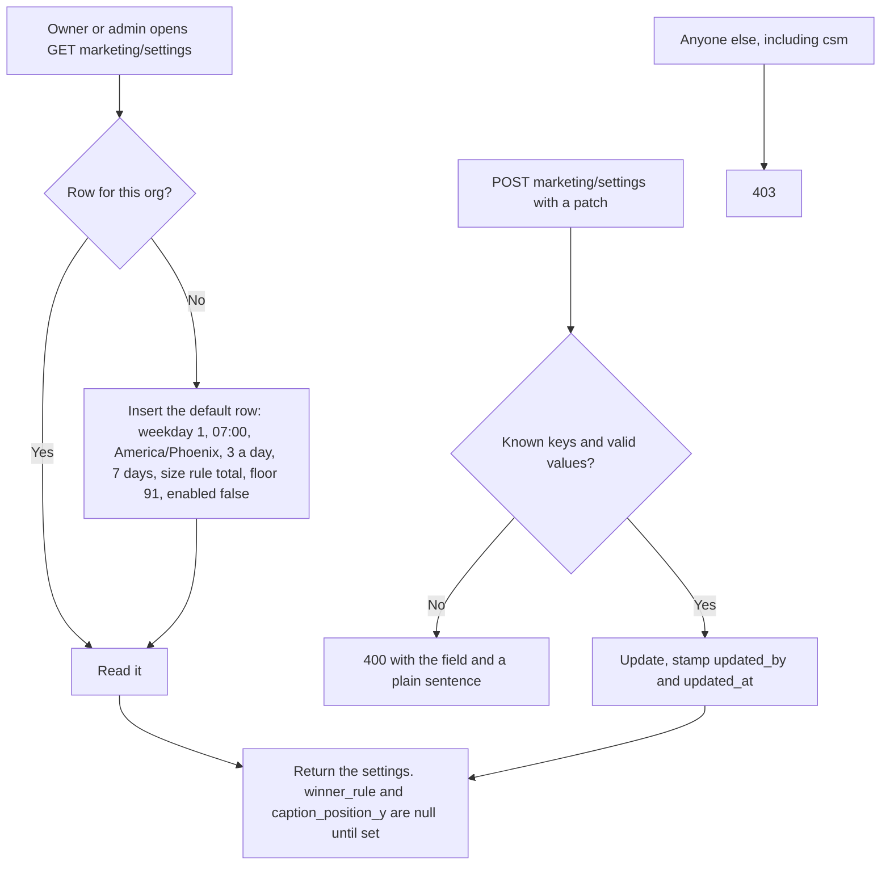
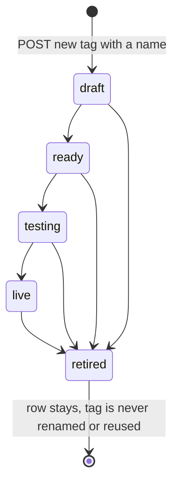
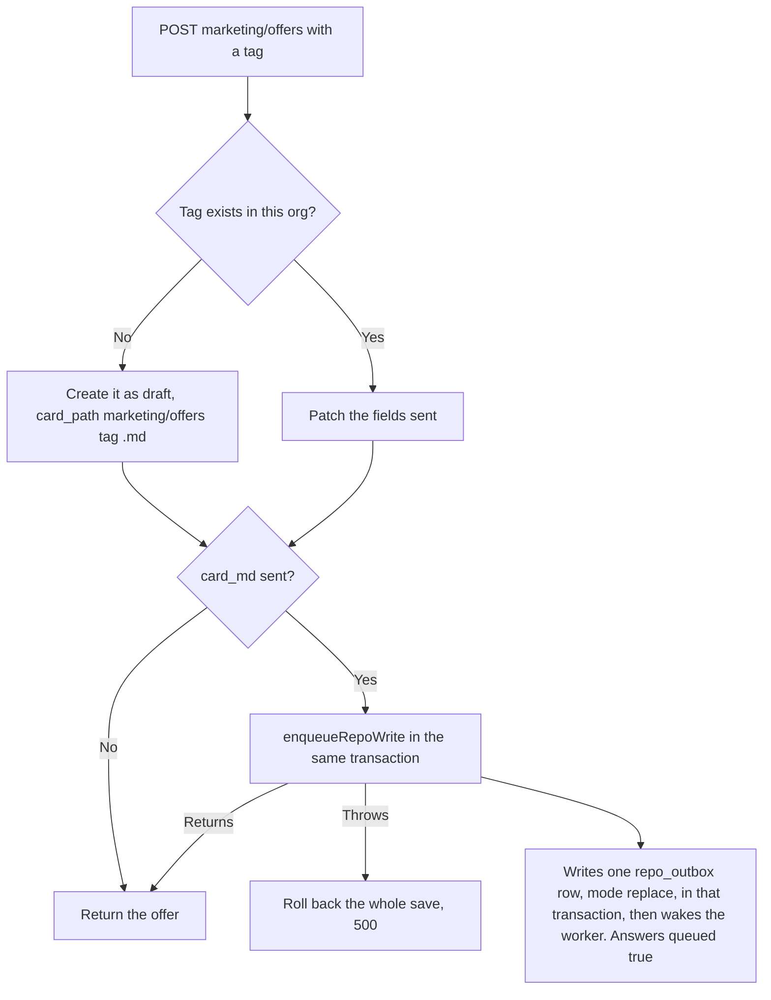
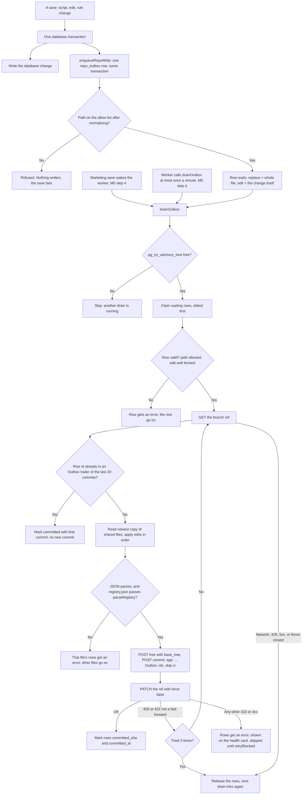
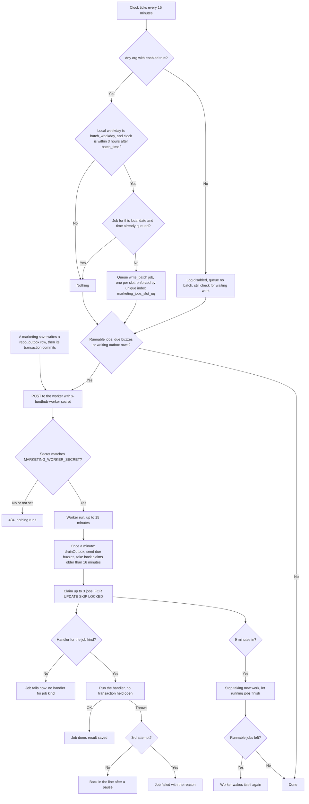

# Marketing machine flow: what the code does

Generated from code, not from the spec. The intended journey is `marketing-machine-intended.md` (agents do not edit it). Each section says which step wrote it. A path that is not built yet is marked `NOT BUILT` or `UNVERIFIED`. Spec: `docs/specs/marketing-machine-2026-10-04.md`.

## M0 step 3: settings, offers, jobs

Migrations `407_marketing_machine_tables.sql` (tables) and `408_marketing_offers_seed.sql` (seeds). Routes `marketing/settings` and `marketing/offers`, role set `ROLE_SETS.MARKETING` (owner, admin).

### Settings

- The clock reads `enabled`, `batch_weekday`, `batch_time`, `timezone` (M0 step 4, below). The buzz path reads `quiet_start`, `quiet_end` and `timezone`. The batch writer that acts on the queued job is `NOT BUILT` (M1).

### Offers

- Seeded by 408 for the default org as `live`: `direct_book` (book_call, lane sorting), `blueprint` (book_call, lane uwiq) and `slo` (direct_buy, lane uwiq, checkout 14700 cents).
- Any status can be set by POST. The ready check (every card part filled, every page or page request present, a Meta campaign, an avatar) is `NOT BUILT`: the spec puts it in the M1 Offers tab (7.3).
- `paused` is a separate flag. Restarting a paused offer clears it. The machine that skips paused offers is `NOT BUILT` (M1).
- The database refuses to change `tag` or `org_id` on an existing offer.
- Seeded step pages come from `marketing/landing-pages/tracking-manifest.mjs`. Blueprint has only `/watch`; its survey and booking pages are blank because they could not be confirmed.

### Supporting tables (created, nothing writes them yet)

`marketing_jobs` (queued, running, done, failed), `marketing_requests` (idempotency; used by the two POSTs when a `request_id` is sent), `marketing_buzzes`, `marketing_model_usage`, `ad_offer_tags`, `agent_requests`, `marketing_shoots`.

`ad_offer_tags` is seeded from decision 9 for the default org: ads 84 to 90 to `slo`, the registry's sorting, funding600 and premium ads to `direct_book`, the uwiq ads to `blueprint`. White-label ads 72 to 76 stay untagged. The reader that takes the script's `offer_key` over this table is `NOT BUILT` (M1).

### Gaps against the intended journey

- The intended journey says Chris pauses or restarts an offer and edits its card in the Command Center. The endpoints exist; the screen is `NOT BUILT`.
- The card save commits to the repo through the outbox in the intended flow. `src/marketing/repo-writes.mjs` calls the real outbox (M0 step 4); the commit happens when the worker drains it.

## Repo saves through an outbox (M0 step 2)

Code: `src/repo/outbox.mjs`, `src/repo/allow-list.mjs`, `src/repo/edits.mjs`, `src/repo/github.mjs`, the client `src/messaging/providers/github-repo.mjs`, table `repo_outbox` (migration 406).

Notes:
- The outbox never forces a push and holds no transaction open across a GitHub call.
- A row that has failed transiently 10 times gets an error instead of retrying forever.
- `outboxHealth()` returns the counts and the last error for the health card. `marketingHealth()` in `src/marketing/health.mjs` returns it with the job queue and buzz counts. The health route that shows it is `NOT BUILT` (M2).
- The GitHub env names are `GITHUB_REPO`, `GITHUB_BRANCH` (default `main`) and `GITHUB_REPO_TOKEN`. They are named in `.env.example`. Setting them on Netlify happens on the Mac.

## Clock, worker, buzzes, model client (M0 step 4)

Code: `netlify/functions/marketing-clock.mjs` (scheduled `*/15 * * * *` in netlify.toml), `netlify/functions/marketing-worker-background.mjs`, `src/marketing/{clock,worker,jobs,notify,wake,time,health,model-usage,handlers}.mjs`, `src/agents/model.mjs` (`callModel`). Tables (migration 410 adds the slot index): `marketing_jobs`, `marketing_buzzes`, `marketing_model_usage`, `repo_outbox`.

Buzzes: `queueBuzz` writes a `marketing_buzzes` row. Inside quiet hours (`quiet_start` to `quiet_end` in the org's time zone, default 21:00 to 07:00 Arizona) `send_after` is when quiet hours end. The worker sends due rows through `notify-fanout send()`, at most one of each kind per 10 minutes, and rows sharing a `group_key` go as one buzz. A failed send leaves the row for the next pass. Nothing calls `queueBuzz` yet: the callers (scripts ready, videos ready, stuck) arrive with M1 and M3. `NOT BUILT`.

Model client: `callModel` with `provider: 'anthropic'` sends only to api.anthropic.com, never OpenAI, and returns an error (status 401, nothing sent) when `ANTHROPIC_API_KEY` is missing or has a `*` in it. `timeoutMs` aborts a slow call. `cache` sends the system prompt as one block with `cache_control` ephemeral. `tools` and `toolChoice` go to Anthropic as `tools` and `tool_choice`, and `tool_use` blocks come back as `toolCalls`. Usage goes to `marketing_model_usage` through `recordMarketingUsage` (not `recordUsage`). Nothing calls it yet: the writer arrives with M1. `NOT BUILT`.

### Gaps against the intended journey

- The job handler list is empty (`src/marketing/handlers.mjs`). A `write_batch` job queued by the clock fails with "no handler" until M1 adds the writer. The clock only queues while `enabled` is true, and `enabled` stays false until M1 is done.
- If `MARKETING_WORKER_SECRET` or the site URL is not set, nothing wakes the worker. The save still succeeds and the row waits. The Netlify variable is set on the Mac with the rest of the batch; none was set by this step.
- A save wakes the worker only after its transaction has committed: `enqueueRepoWrite` does not wake, and the handler calls `wakeAfterCommit` once the save has gone through (not on a rollback, not on a replayed request).
- While `enabled` is false the clock queues no batch but still wakes the worker for waiting repo saves and due buzzes, so a saved offer card never sits uncommitted.
- Two clock ticks cannot queue the same slot twice: migration 410 adds a unique index on (org, kind, slot) and `queueJob` inserts with ON CONFLICT DO NOTHING.
