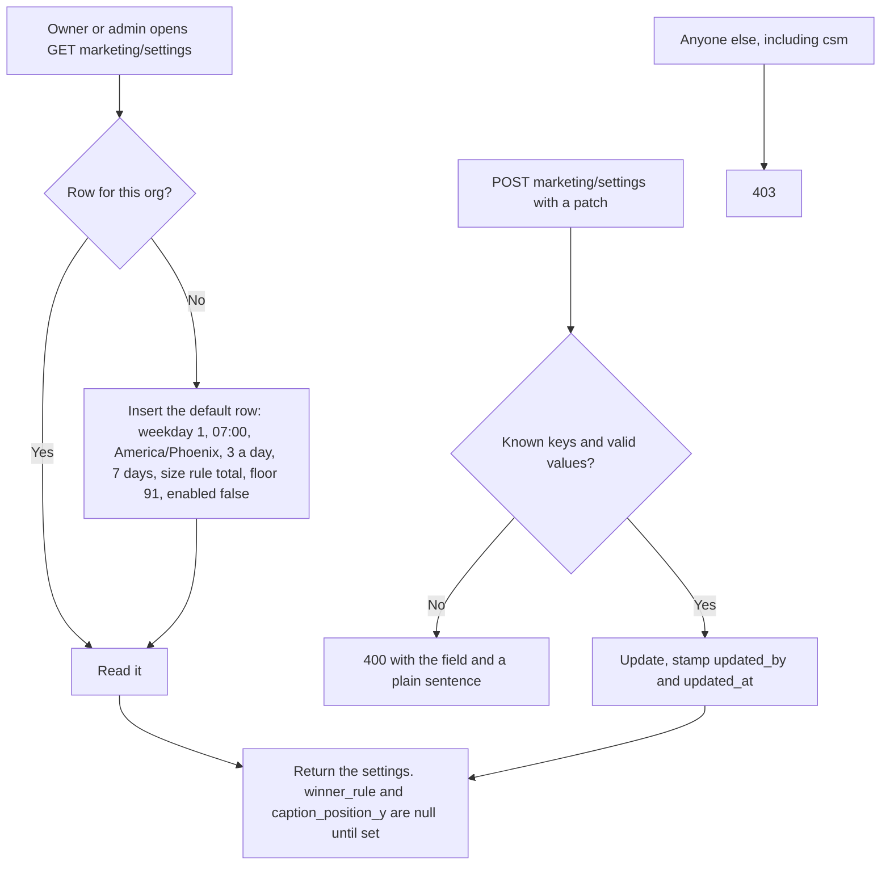
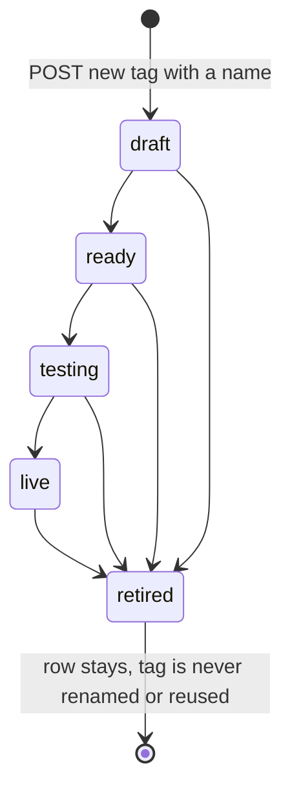
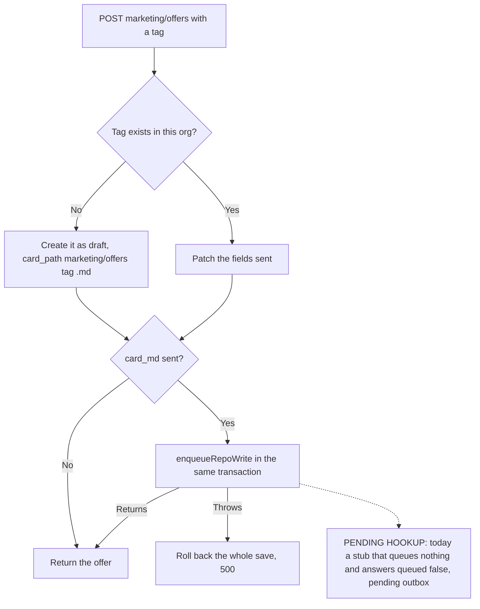
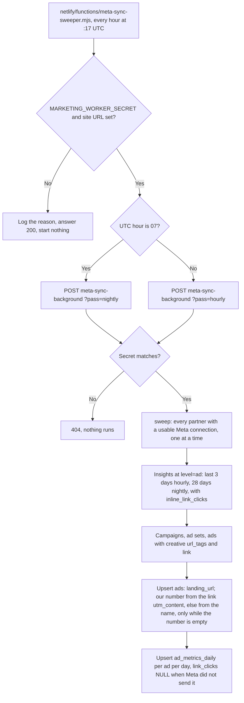
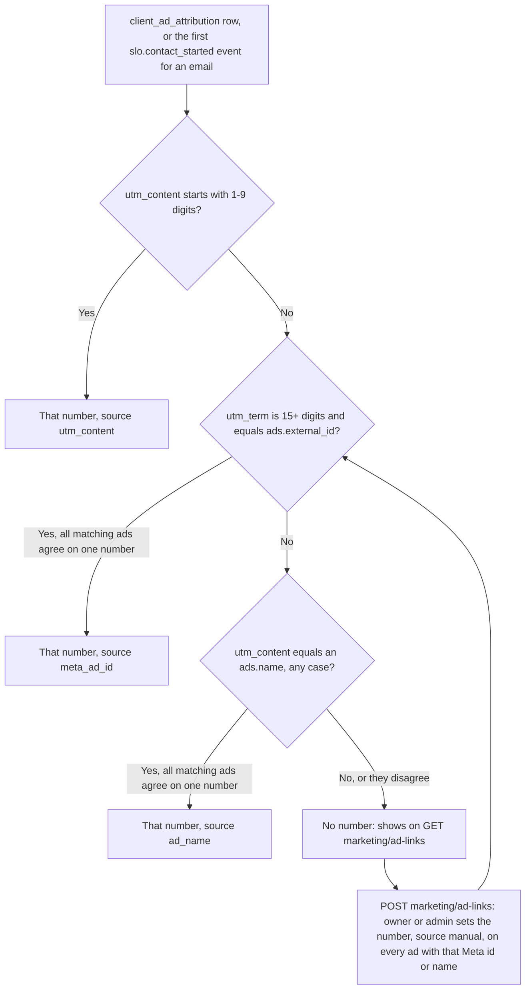
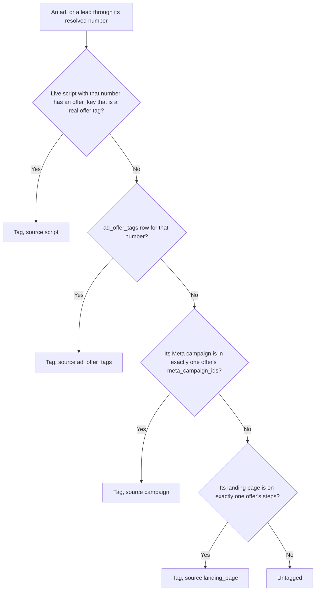

# Marketing machine flow: what the code does

Generated from code, not from the spec. The intended journey is `marketing-machine-intended.md` (agents do not edit it). Each section says which step wrote it. A path that is not built yet is marked `NOT BUILT` or `UNVERIFIED`. Spec: `docs/specs/marketing-machine-2026-10-04.md`.

## M0 step 3: settings, offers, jobs

Migrations `407_marketing_machine_tables.sql` (tables) and `408_marketing_offers_seed.sql` (seeds). Routes `marketing/settings` and `marketing/offers`, role set `ROLE_SETS.MARKETING` (owner, admin).

### Settings

- The marketing clock, worker and the 'enabled' switch are NOT BUILT yet (M0 step 4). Nothing reads `marketing_settings` except this endpoint.

### Offers

- Seeded by 408 for the default org as `live`: `direct_book` (book_call, lane sorting), `blueprint` (book_call, lane uwiq) and `slo` (direct_buy, lane uwiq, checkout 14700 cents).
- Any status can be set by POST. The ready check (every card part filled, every page or page request present, a Meta campaign, an avatar) is `NOT BUILT`: the spec puts it in the M1 Offers tab (7.3).
- `paused` is a separate flag. Restarting a paused offer clears it. The machine that skips paused offers is `NOT BUILT` (M1).
- The database refuses to change `tag` or `org_id` on an existing offer.
- Seeded step pages come from `marketing/landing-pages/tracking-manifest.mjs`. Blueprint has only `/watch`; its survey and booking pages are blank because they could not be confirmed.

### Supporting tables (created, nothing writes them yet)

`marketing_jobs` (queued, running, done, failed), `marketing_requests` (idempotency; used by the two POSTs when a `request_id` is sent), `marketing_buzzes`, `marketing_model_usage`, `ad_offer_tags`, `agent_requests`, `marketing_shoots`.

`ad_offer_tags` is seeded from decision 9 for the default org: ads 84 to 90 to `slo`, the registry's sorting, funding600 and premium ads to `direct_book`, the uwiq ads to `blueprint`. White-label ads 72 to 76 stay untagged. The reader that takes the script's `offer_key` over this table is `fundhub_offer_tag_for_number` (M0 step 5, below).

### Gaps against the intended journey

- The intended journey says Chris pauses or restarts an offer and edits its card in the Command Center. The endpoints exist; the screen is `NOT BUILT`.
- The card save commits to the repo through the outbox in the intended flow. The outbox is `NOT BUILT` on this branch; see the single call site above.

## M0 step 5: Meta version and sync, every lead's ad number, tag views

Migrations `411_ad_numbers_resolver.sql` and `412_offer_tag_views.sql`. Meta Graph version `v26.0` by default in `src/adplatforms/meta.mjs`, `api/campaigns/sync.mjs`, `src/social/adapters.mjs`, `src/social/oauth.mjs` (now reads `META_API_VERSION`) and `src/messaging/providers/meta-capi.mjs`. The Netlify value of `META_API_VERSION` is set on the Mac (not by this step).

### The Meta pull

- The Inngest cron `meta-campaign-sync-sweeper` is no longer registered (it ran inside the 26 s `/api/inngest`). The same `sweep()` runs in the 15-minute background function.
- If Meta refuses the ads list with the creative fields, the plain list is read and the ads still sync, without the link.
- A number with source `manual` or `loader` is never overwritten by the sync.
- The button (`POST campaigns/sync`) still pulls 28 days.

### Every lead's ad number

- Views `v_client_ad_number` (leads) and `v_visitor_ad_number` (SLO visitors, one row per email). Numbers compare as integers: 043 = 43.
- `ads_fundhub_number_uq` is replaced by a plain index: one number can run in several ad sets.
- `ads.fundhub_ad_number_source`: `manual` (Link, or the link-asset route), `loader` (M4, `NOT BUILT`), `utm`, `name` (the sync). Existing numbers were backfilled as `manual`.
- `api/read/ad-spine.mjs` (the people pass) and `api/read/ad-attribution.mjs` now read the resolved number. `ad-attribution` also returns `ad_number` and `ad_number_source`.
- These views read `ads`, which forces partner row-level security: callers run them inside `asStaff()`.

### Offer tags and lead level

- `v_ad_offer_tag` (each Meta ad, landing page from `ads.landing_url`), `v_client_offer_tag` (each lead; campaign from the lead's ad, or a campaign named like its `utm_campaign`; page from `landing_path`).
- A page two offers share tags nobody. Today `/watch` is on both Direct Book and Blueprint, so a lead whose only clue is `/watch` is untagged.
- `v_client_level`: cold, engaged, warm, pulled, client, funded. The table behind each level is in `docs/marketing/metrics.md`.

### Gaps against the intended journey

- The Ads tab with the Link button is `NOT BUILT` (lane E). The endpoint is `marketing/ad-links`.
- Nothing reads the tag views yet (the planner, the Offers screen and the numbers are M1, M2 and M5).
- Confirming one live server event in Events Manager after the ship is a Mac step, `UNVERIFIED` here.
