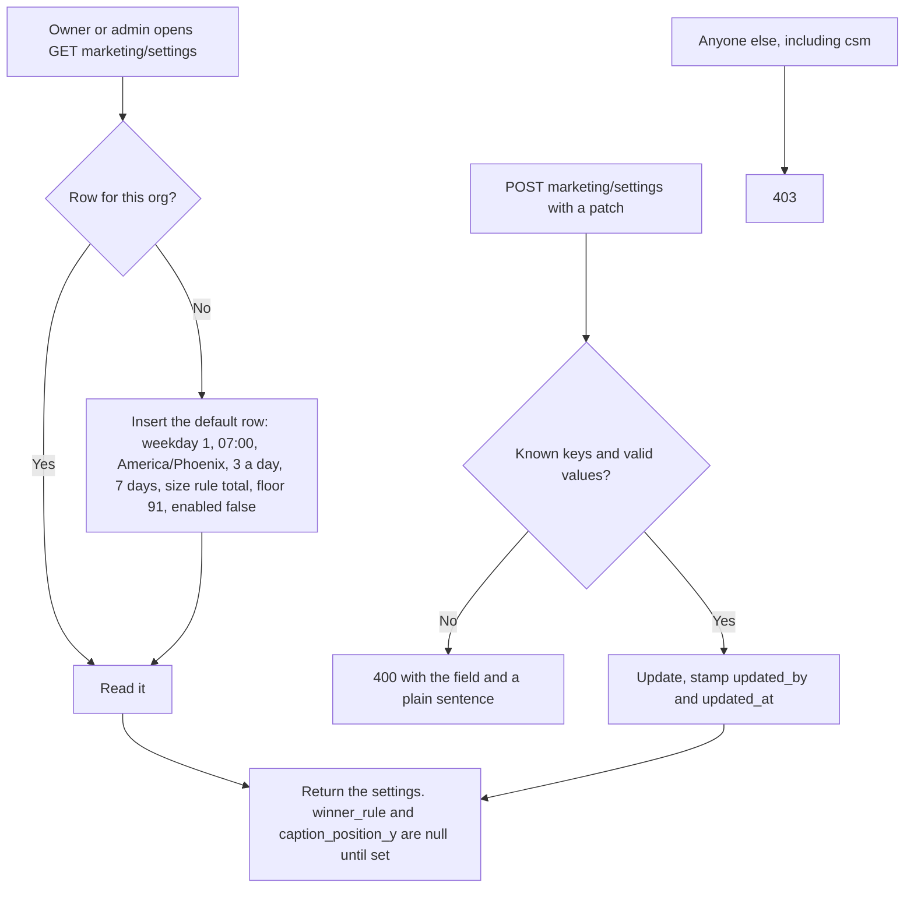
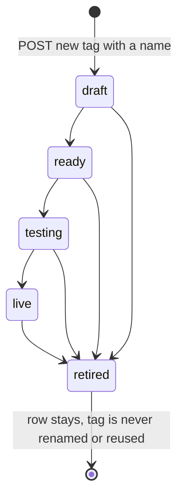
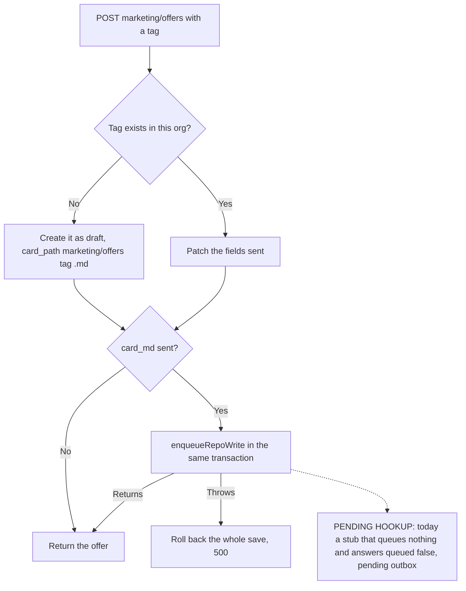

# Marketing machine flow: what the code does

Generated from code, not from the spec. The intended journey is `marketing-machine-intended.md` (agents do not edit it). Each section says which step wrote it. A path that is not built yet is marked `NOT BUILT` or `UNVERIFIED`. Spec: `docs/specs/marketing-machine-2026-10-04.md`.

## M0 step 3: settings, offers, jobs

Migrations `407_marketing_machine_tables.sql` (tables) and `408_marketing_offers_seed.sql` (seeds). Routes `marketing/settings` and `marketing/offers`, role set `ROLE_SETS.MARKETING` (owner, admin).

### Settings

- The marketing clock, worker and the 'enabled' switch are NOT BUILT yet (M0 step 4). Nothing reads `marketing_settings` except this endpoint.

### Offers

- Seeded by 408 for the default org as `live`: `direct_book` (book_call, lane sorting), `blueprint` (book_call, lane uwiq) and `slo` (direct_buy, lane uwiq, checkout 14700 cents).
- Any status can be set by POST. The ready check (every card part filled, every page or page request present, a Meta campaign, an avatar) is `NOT BUILT`: the spec puts it in the M1 Offers tab (7.3).
- `paused` is a separate flag. Restarting a paused offer clears it. The machine that skips paused offers is `NOT BUILT` (M1).
- The database refuses to change `tag` or `org_id` on an existing offer.
- Seeded step pages come from `marketing/landing-pages/tracking-manifest.mjs`. Blueprint has only `/watch`; its survey and booking pages are blank because they could not be confirmed.

### Supporting tables (created, nothing writes them yet)

`marketing_jobs` (queued, running, done, failed), `marketing_requests` (idempotency; used by the two POSTs when a `request_id` is sent), `marketing_buzzes`, `marketing_model_usage`, `ad_offer_tags`, `agent_requests`, `marketing_shoots`.

`ad_offer_tags` is seeded from decision 9 for the default org: ads 84 to 90 to `slo`, the registry's sorting, funding600 and premium ads to `direct_book`, the uwiq ads to `blueprint`. White-label ads 72 to 76 stay untagged. The reader that takes the script's `offer_key` over this table is `NOT BUILT` (M1).

### Gaps against the intended journey

- The intended journey says Chris pauses or restarts an offer and edits its card in the Command Center. The endpoints exist; the screen is `NOT BUILT`.
- The card save commits to the repo through the outbox in the intended flow. The outbox is `NOT BUILT` on this branch; see the single call site above.
