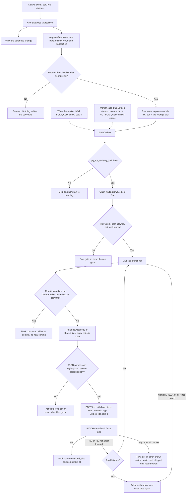

# marketing-machine: actual

What the code does today, drawn from the code. The intended journey is `marketing-machine-intended.md` (Chris's, not edited here). Spec: `docs/specs/marketing-machine-2026-10-04.md`.

Parts are added as each build step lands. A step that is not built yet is marked `UNVERIFIED` or `NOT BUILT`.

## Repo saves through an outbox (M0 step 2)

Code: `src/repo/outbox.mjs`, `src/repo/allow-list.mjs`, `src/repo/edits.mjs`, `src/repo/github.mjs`, the client `src/messaging/providers/github-repo.mjs`, table `repo_outbox` (migration 406).

Notes:
- The outbox never forces a push and holds no transaction open across a GitHub call.
- A row that has failed transiently 10 times gets an error instead of retrying forever.
- `outboxHealth()` returns the counts and the last error for the health card. The card itself is part of M0 step 4 and later. `UNVERIFIED` until then.
- The GitHub env names are `GITHUB_REPO`, `GITHUB_BRANCH` (default `main`) and `GITHUB_REPO_TOKEN`. They are named in `.env.example`. Setting them on Netlify happens on the Mac.
