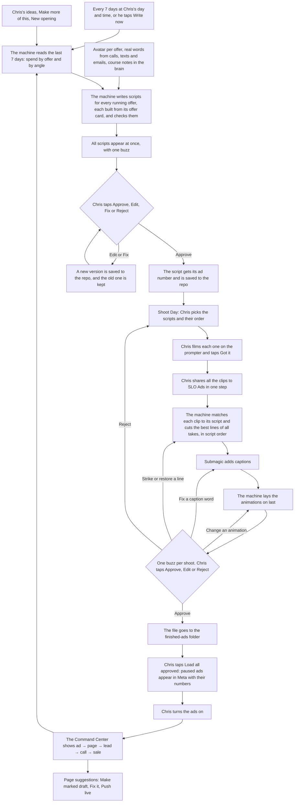

# marketing-machine: intended

The builder wrote this file, and Chris approving it is the signature that it's true. The spec is `docs/specs/marketing-machine-2026-10-04.md`.

Chris runs marketing from the **Command Center** (in the CRM) and the **Teleprompter app** (iPhone and iPad, including an iPad in a mirror rig). His job is to film and to do a bit of editing when it's needed. The machine does the rest.

**The goal:** Chris is in the driver's seat and always knows what's next. He films 10 ads in one session, and by that evening all 10 are cut, captioned, animated and waiting for his approval.

## In one picture

## Steps

1. **The drop.** On Chris's day and time (default Monday 7:00 am Arizona), the batch appears in the app's Inbox all at once. Chris gets one buzz with the real count, like "18 of 21 ready". **Write now** makes a batch any time.
   - The batch covers every running offer: Direct Book, SLO and Blueprint today. Each one gets at least 3 scripts, and spend decides the rest.
   - Every script carries its offer's tag (`direct_book`, `slo`, `blueprint`), and so does everything made from it: the video, the Meta ad, and every lead, call and sale it brings in.
   - Each script is built from its offer card: what the ad sells, what the viewer does after the click, and the beats in order. An SLO ad sends people to get the roadmap. A Direct Book or Blueprint ad sends them to book the call.
   - When two offers are tested on the same funnel, each gets the same angles, so the numbers show which offer structure wins.
   - Each script also draws on its offer's assumed avatar, the real words clients used on recent calls, texts and emails, read from each client's full dossier (with names and numbers removed), what the leads from that angle said and did, and Chris's course library in the brain. When these disagree with Chris's rules, his rules win.
2. **Review.** For each script, Chris taps one of four buttons:
   - **Approve:** the script gets its ad number.
   - **Edit:** Chris types or dictates a change.
   - **Fix:** Chris says what's wrong, and the machine rewrites it. **Make this a rule** adds his note to the rules.
   - **Reject.**

   Every save goes to the database and the repo, and earlier versions are kept. A VSL script locks without an ad number. Chris films it in 4K, and it stays out of the ad pipeline.
3. **Ideas.** Chris dictates an idea in the app. It goes into the next batch, or straight to Write now. Ideas also come from three other places:
   - **Make more of this** on an angle in the Command Center.
   - The plan's 3 angle suggestions. Accepting one makes it an idea.
   - **New opening** on an ad the watch curve flags as dying. The machine writes 3 new first lines for the same body, and Chris picks one in the Inbox. He films only the opening, and the machine joins it onto the old video.
4. **Rules and offers.** The next script follows every change here.
   - **Copy rules:** Chris adds or edits a rule, or bans a phrase, in the app. When a course or the clients' words argue for a change, it waits there as a rule suggestion, and Chris accepts or dismisses it.
   - **Offers:** in the Command Center, Chris pauses or restarts an offer and edits its offer card. Old ads that have no tag yet wait in the Offers tab, and Chris picks their offer once.
   - **New offer:** Chris taps **New offer**, gives it a tag (like `slo`), picks a funnel structure, and fills in the card. The Offers tab lists anything missing. **Build avatar**, **Make page** and **Write VSL** build the missing avatar, page or VSL from the card. When the offer passes the check, Chris sets it to testing, and the next batch writes ads for it.
   - **Courses:** Chris puts each course's transcripts in a Drive folder and taps **Import**. The brain keeps each course labeled.
5. **Plan the shoot.** Chris opens **Shoot Day**. It lists every approved script still waiting to be filmed, in film order, and he drags to reorder. It shows the estimated time and a checklist: rig set, mirror on, remote paired, phone charged with storage free.
6. **Film.** Chris rolls each script on the prompter. The prompter has steady speed, pause and resume, tap to start anywhere, one-tap restart, mirror mode for the iPad rig, and a Bluetooth remote.
   - **Got it** (or the remote) marks the script filmed and loads the next one.
   - **Another take** (or the remote) rolls the same script again.
7. **Upload.** Chris selects all the clips in Photos and shares them to SLO Ads in one step. The machine works out which clip belongs to which ad. Dropping the takes in SLO Ads is his only Drive task.
8. **Watch it move.** On the Shoot Day progress board, each ad moves on its own: filmed → uploaded → matched → cutting → captions → animations → ready to approve → approved → loaded. Anything that needs Chris shows at the top.
9. **Edit.** The machine runs these steps in order:
   1. It matches each clip to its script.
   2. It cuts the best lines of all takes in script order, removing false starts, long pauses and dead air.
   3. Submagic adds the captions.
   4. The machine lays the animations on last.
10. **Approve.** When a shoot's videos are ready, Chris gets one buzz, and an edit round buzzes on its own. He watches each video in the app and taps one of three buttons:
    - **Approve.**
    - **Edit**, in four kinds:
      - **Strike or restore a line:** the machine cuts again, then captions and animations run again.
      - **Fix a caption word:** Submagic exports again with the fix, then animations run again. The word is saved, so later videos spell it right.
      - **Change, remove or add an animation:** only the changed animations render again.
      - **A free note:** the machine turns it into one of the edits above, or flags it for an agent.
    - **Reject:** the script goes back to Shoot Day with the same ad number.
11. **Deliver.** The approved file lands in the finished-ads folder, named with its offer, ad number and angle (like "SLO Ad 93 — …"), plus a brief for Paul.
12. **Load.** Chris taps **Load all approved**. Each video becomes a paused ad in Meta, with its number in the name and in `utm_content`.
13. **Turn on.** Chris turns ads on in the Command Center or in Ads Manager. Only Chris turns ads on or off and changes budgets.
14. **Numbers.** The Command Center is always live. It shows each ad, angle and offer from spend to sale, with tested offers side by side. For each ad it also shows how far its leads got (cold, engaged, warm, pulled, client, funded) and what they objected to on calls. The **Map** tab shows how offers, avatars, angles, ads, videos and courses connect, and the same notes open in Obsidian. The next batch learns from these numbers, from the clients' words and from Chris's edits.
15. **Page suggestions.** With each batch, the machine suggests up to 3 page fixes across the live offers, each with its numbers and the exact new words. Chris taps **Make marked draft** or **Skip**.
    1. The marked draft puts a red box around each problem, with the fix under it.
    2. **Fix it** shows the fixes in green at the same link.
    3. **Push live** puts the page live, and the agent proves it's live.

## Who sees it

- **Command Center:** owner and admin.
- **Teleprompter app:** Chris.

## When something goes sideways

- **A clip matches no script:** it shows as "unmatched" at the top of the Shoot Day board and on the Command Center, with **Assign** and **Retry**.
- **A take is missing its hook, line 2 or call to action:** it waits before Submagic, and Chris picks **Use this cut** or **Re-film**. Re-film puts the script back on Shoot Day.
- **A take arrives before approval:** the machine cuts the ad again with it.
- **A take arrives after approval:** Chris sees "Recut with new take?".
- **The model cost cap is reached:** writing stops, the finished drafts are released, and Chris gets one buzz.
- **The Meta loader's copy check blocks an ad:** the ad stays unloaded, and the reasons show in Launch.
- **A lead's ad can't be matched:** its ad name waits on the Ads tab with **Link**, and Chris picks the ad number once.
- **A save clashes with a newer version:** Chris sees both texts side by side and keeps the one he wants.
- **The app loses signal on location:** it rolls from its saved copy, and saves sync when the signal comes back.
- **A live ad sends people to a page no offer lists:** Today shows "New page found" with **Add offer**, and its spend shows as Unmapped until then.
- **A step fails:** the Command Center shows it with Retry, and Retry picks up from the last good step.

## Rules this flow keeps

- Chris's word beats any written rule.
- The context fetcher keeps everything about each client in one dossier, and every AI agent and the copy machine read it.
- Every offer has one permanent tag, and every script, ad, lead and sale from it carries that tag.
- Every running offer gets scripts, and each script is built for its own offer structure.
- One ad number per ad, used everywhere, and every lead is linked to the ad that brought it.
- Clients' words shape the copy, and they're never quoted as a testimonial without the client's consent and Chris's OK.
- Raw files in SLO Ads stay exactly where and how Chris dropped them.
- Animations always go on last, after the cut and after captions.
- Only Chris turns ads on or off and changes budgets.
- Chris gets a buzz only when he has something to do.
- Every script version and every edit round is saved to the repo.
