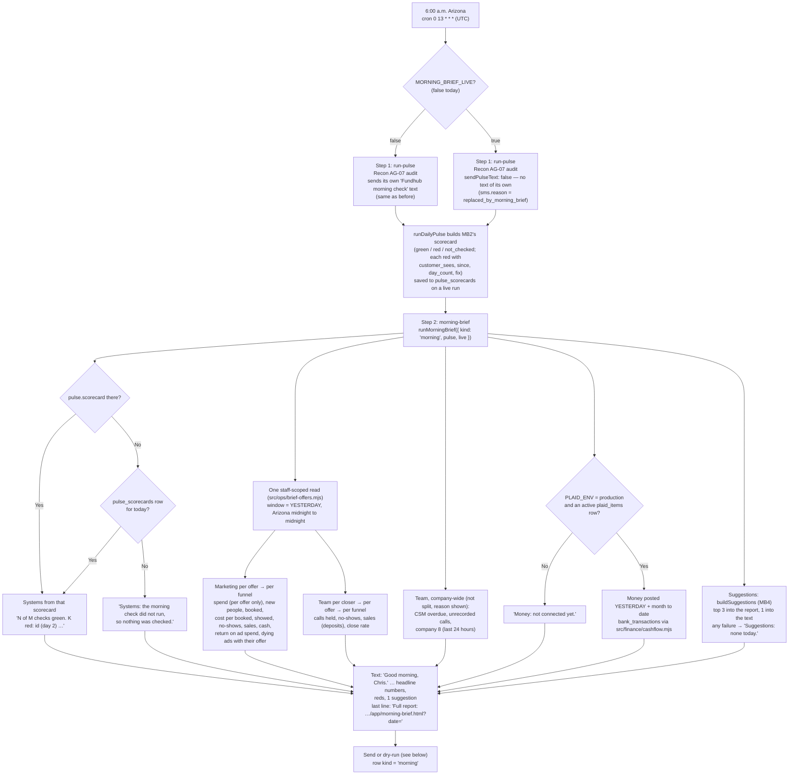
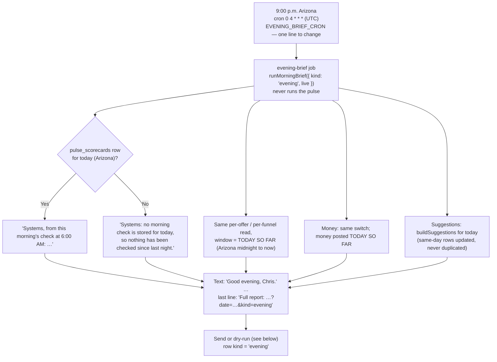
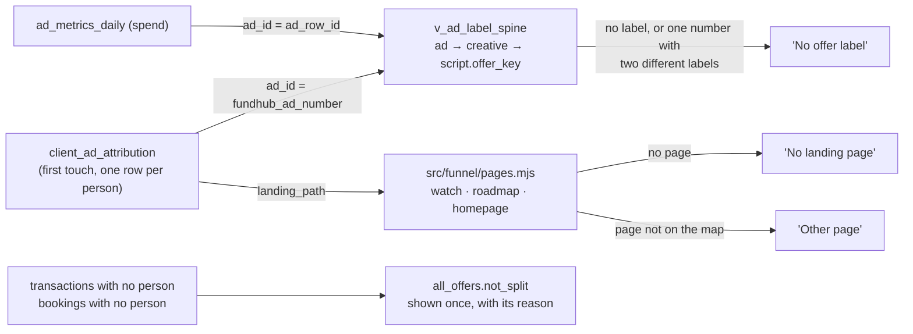
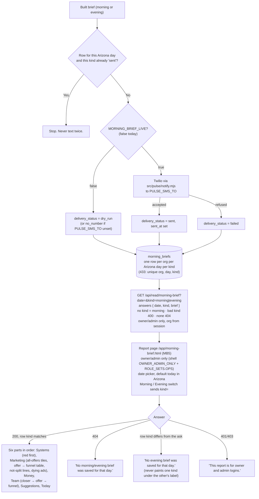
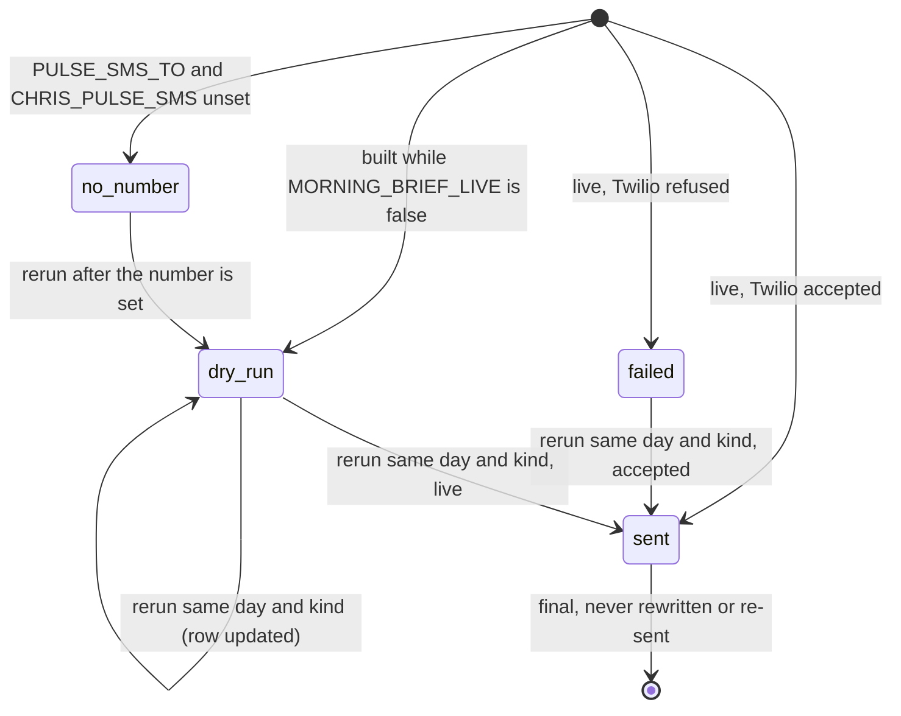

# Morning and evening brief — flow (generated from code, 2026-10-05)

What happens every morning and every evening, read from the code in `src/workflows/daily-pulse.mjs`, `src/workflows/evening-brief.mjs`, `src/pulse/daily-pulse.mjs`, `src/pulse/scorecard.mjs`, `src/ops/morning-brief.mjs`, `src/ops/brief-offers.mjs`, `src/ops/suggestions.mjs`, `src/pulse/notify.mjs` and `api/read/morning-brief.mjs`. The page: `public/app/morning-brief.html` + `public/app/morning-brief.js`. Board: `ops/workflows/morning-brief-2026-10-05.md` (MB2, MB3, MB4, MB5, MB6). Spec: `docs/specs/morning-brief-2026-10-05.md`.

**No intended journey has this step yet.** No `-intended.md` file mentions the morning text, the evening text or the daily pulse text.

**Owner-set 2026-10-05 (Chris):**
1. When the brief goes live it **replaces** the old "Fundhub morning check" pulse text. One text, not two.
2. An **evening brief** at 9:00 p.m. Arizona: "Good evening, Chris." Same content as the morning: systems first, then the sales team, money, and ads.
3. Ad and sales numbers are **organized per offer and per funnel**. A number that cannot be split shows once under "all offers", with a one-line reason.
4. The stored report is the detail. The text is a short summary that ends "Full report: <link>".

Both are **dry-run** today. `MORNING_BRIEF_LIVE` is false. Both briefs are built and saved. Nothing new is texted. The old pulse text still goes, unchanged.

## The morning run

## The evening run

## Where the offer and the funnel come from

Spend belongs to an ad and an ad has no funnel, so spend, cost per booked person and return on ad spend are split by offer only. That is the first `not_split` line. Cash uses the same "paid" statuses as the company cash number (`src/dashboard/kpis.mjs`).

## Send, save, read (both kinds)

## States of a `morning_briefs` row (same for each kind)

The database holds each kind to its greeting: a morning row must start "Good morning, Chris." and an evening row "Good evening, Chris." (`morning_briefs_text_starts_ck`, migration 433).

## What prints a "waiting" line instead of a number

| Part | Why |
|---|---|
| Marketing dashboard link | Not built yet |
| Money per company (Fundhub LLC, Fundhub Credit Solutions, FH Consulting) | Nothing records which bank account is which company |
| Ad money left on the credit line | No source in the repo |
| Funding advisor files per person | Nothing links a funding round to an advisor |
| "Today" | No source yet |

## Gaps (found, not fixed)

- When the brief is live and the brief step fails, the pulse text is already suppressed, so Chris gets no morning text that day. The pulse result is still stored.
- The company 8 numbers (cash collected, files funded) are always the last 24 hours, even in the evening. The text says "Last 24 hours" for those, not "today so far".
- A morning run whose pulse was a dry run carries the scorecard in the brief, but the scorecard is not saved to `pulse_scorecards` (MB2 saves on live runs only). That evening then says no check is stored.
- Offer comes from the first of the marketing machine's three lead → offer rules only (the ad's script label). The other two (campaign mapping, landing page → offer) have no table yet, so those people show under "No offer label".
