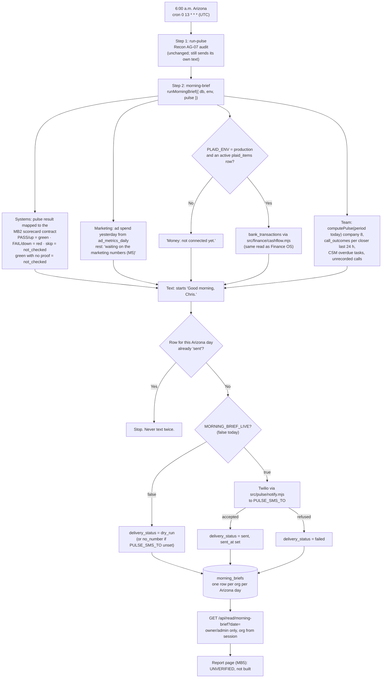
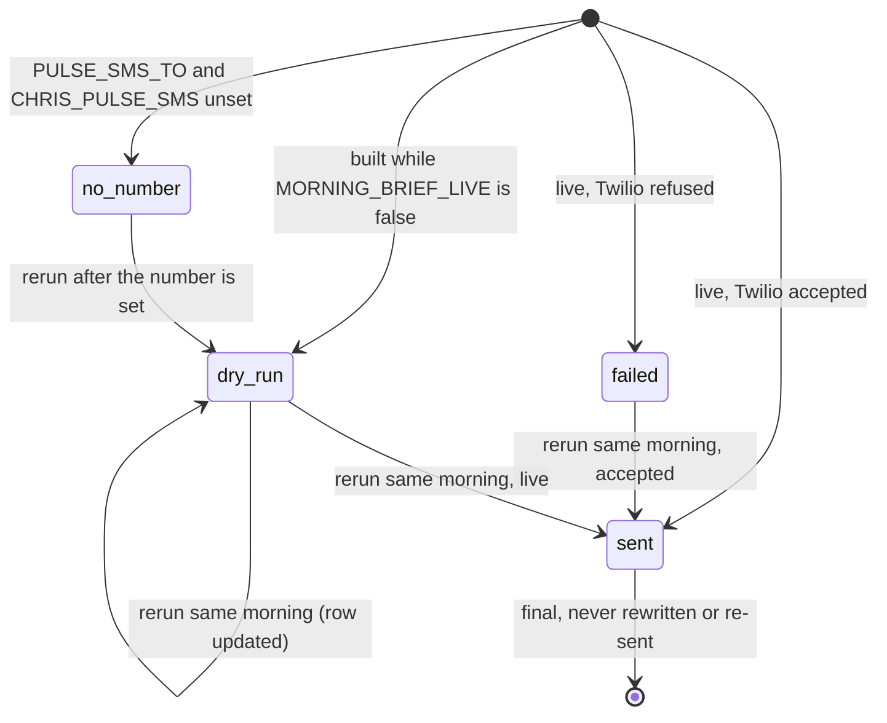

# Morning brief — flow (generated from code, 2026-10-05)

What happens every morning, read from the code in `src/workflows/daily-pulse.mjs`, `src/ops/morning-brief.mjs`, `src/pulse/notify.mjs` and `api/read/morning-brief.mjs`. Board: `ops/workflows/morning-brief-2026-10-05.md` (MB3). Spec: `docs/specs/morning-brief-2026-10-05.md`.

**No intended journey has this step yet.** No `-intended.md` file mentions the morning text or the daily pulse text. Chris has to decide whether this text replaces the pulse text or comes as well. Until he does, the brief is **dry-run**: it is built and saved, and nothing new is texted.

## The run

## States of a `morning_briefs` row

## What prints a "waiting" line instead of a number

| Part | Why |
|---|---|
| Booked calls, shows, sales, return on ad spend, dying ads | Marketing machine M5 is not built. Not rebuilt here. |
| Marketing dashboard link | Not built yet |
| Money per company (Fundhub LLC, Fundhub Credit Solutions, FH Consulting) | Nothing records which bank account is which company |
| Ad money left on the credit line | No source in the repo |
| Funding advisor files per person | Nothing links a funding round to an advisor |
| Suggestions, "Today" | MB4 (waits on Chris's yes to the cadence rules) |
| Report link | MB5 page not built |
| Red check: what the customer sees, since when, day count | MB2 scorecard |
