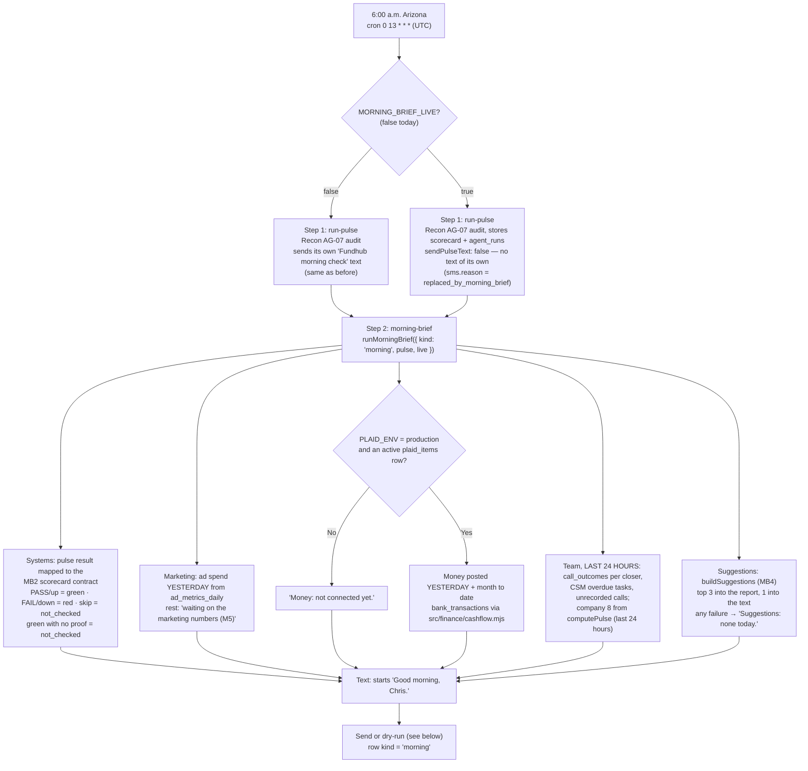
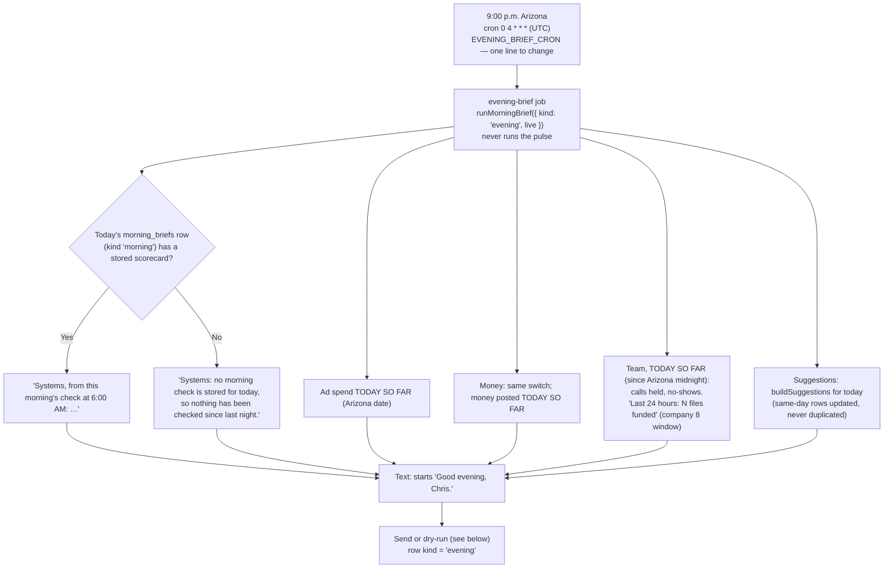
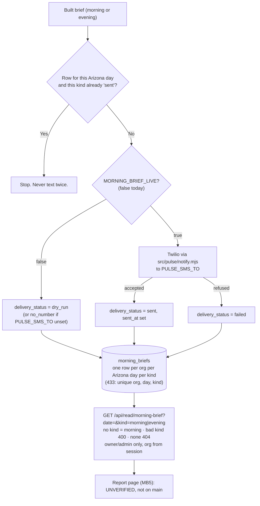
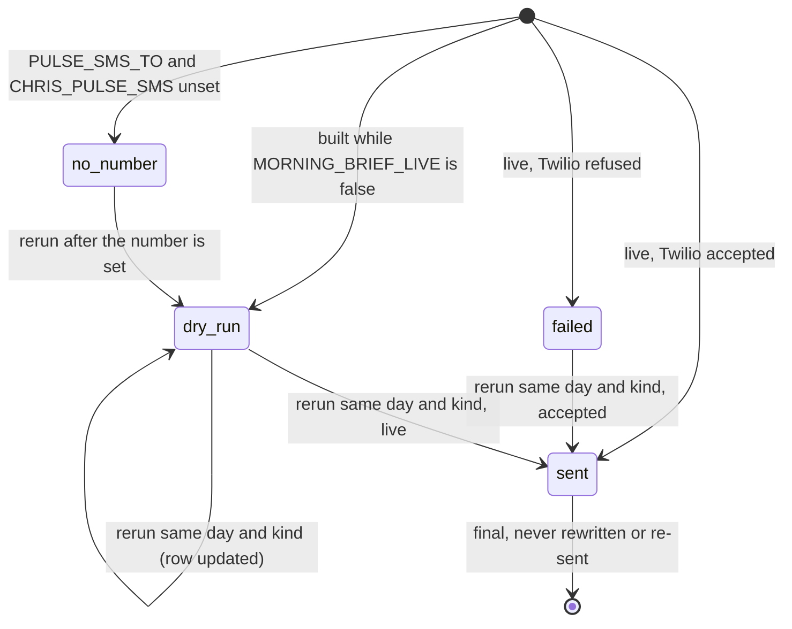

# Morning and evening brief — flow (generated from code, 2026-10-05)

What happens every morning and every evening, read from the code in `src/workflows/daily-pulse.mjs`, `src/workflows/evening-brief.mjs`, `src/pulse/daily-pulse.mjs`, `src/ops/morning-brief.mjs`, `src/ops/suggestions.mjs`, `src/pulse/notify.mjs` and `api/read/morning-brief.mjs`. Board: `ops/workflows/morning-brief-2026-10-05.md` (MB3, MB6). Spec: `docs/specs/morning-brief-2026-10-05.md`.

**No intended journey has this step yet.** No `-intended.md` file mentions the morning text, the evening text or the daily pulse text.

**Owner-set 2026-10-05 (Chris):**
1. When the brief goes live it **replaces** the old "Fundhub morning check" pulse text. One text, not two.
2. An **evening brief** at 9:00 p.m. Arizona: "Good evening, Chris." Same sections, same code, for today so far.

Both are **dry-run** today. `MORNING_BRIEF_LIVE` is false. Both briefs are built and saved. Nothing new is texted. The old pulse text still goes, unchanged.

## The morning run

## The evening run

## Send, save, read (both kinds)

## States of a `morning_briefs` row (same for each kind)

The database holds each kind to its greeting: a morning row must start "Good morning, Chris." and an evening row "Good evening, Chris." (`morning_briefs_text_starts_ck`, migration 433).

## What prints a "waiting" line instead of a number

| Part | Why |
|---|---|
| Booked calls, shows, sales, return on ad spend, dying ads | Marketing machine M5 is not built. Not rebuilt here. |
| Marketing dashboard link | Not built yet |
| Money per company (Fundhub LLC, Fundhub Credit Solutions, FH Consulting) | Nothing records which bank account is which company |
| Ad money left on the credit line | No source in the repo |
| Funding advisor files per person | Nothing links a funding round to an advisor |
| "Today" | No source yet |
| Report link | MB5 page not on main |
| Red check: what the customer sees, since when, day count | MB2 scorecard |
| Evening systems | Reads the morning's stored check; MB2's own stored scorecard is not on main yet |

## Gaps (found, not fixed)

- When the brief is live and the brief step fails, the pulse text is already suppressed, so Chris gets no morning text that day. The pulse result is still stored.
- The company 8 numbers (cash collected, files funded) are always the last 24 hours, even in the evening. The evening text says "Last 24 hours" for those, not "today so far".
