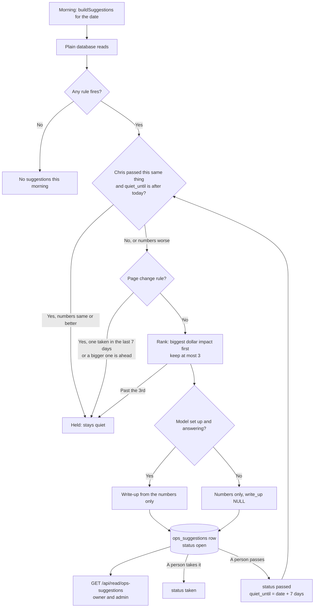

# AI ops suggestions — flow

Built 2026-10-05 (MB4). Traced from the code, not from the spec.

- Law: `.claude/rules/change-cadence.md` (starting defaults, owner-set 2026-10-05).
- Builder: `src/ops/suggestions.mjs` → `buildSuggestions({ db, date, orgId })`.
- Table: `ops_suggestions` (`db/migrations/432_ops_suggestions.sql`).
- Read: `GET /api/read/ops-suggestions?date=YYYY-MM-DD` (owner and admin only).

## In plain words

1. Each morning the builder reads real numbers from the database.
2. It turns them into suggestions. Each one names its rule and its numbers.
3. It drops any that break the cadence law: passed in the last 7 days with the same numbers, or a second page change in one week.
4. It keeps the 3 with the biggest dollar impact. Unknown dollars go after known ones. Unknown is never counted as $0.
5. The model writes 2 or 3 sentences for each, from the numbers only. If the model is down, the numbers go out alone.
6. They are saved, one row per thing per morning.
7. Chris (or the owner of that thing) takes it or passes on it. **Nothing changes by itself.**

## Where the numbers come from

| Rule | Suggestion | Source |
|---|---|---|
| 2. Broken things get fixed the same day | Open dead letters | `failed_events` |
| 6. Pages, VSL and copy change weekly | A running ad dies before the quarter mark: change the opening | `ads`, `ad_metrics_daily` (scored by `src/ops/watch-curve.mjs`) |
| 4 + 5. Raise spend on the ramp, small and slow | Up to 20% more daily spend | `ad_metrics_daily`, `events` (booking.created), `transactions`, closer calendar (`src/ops/hire-closer.mjs`), `action_log` |

Not built yet, and why: rule 3 (no stored target cost per booked call), rule 7 (no record of offer versions), red systems checks under rule 2 (the scorecard is MB2's). The list is `SKIPPED_RULES` in the builder.

## How a suggestion moves

## States

| Status | Set by | What it means |
|---|---|---|
| `open` | The builder | Shown in the morning brief |
| `taken` | A person (`setSuggestionStatus`) | Chris or the owner acted on it. A taken page change holds the next one for 7 days |
| `passed` | A person (`setSuggestionStatus`) | Not now. Quiet until `quiet_until` unless the numbers get worse. The database refuses a pass with no quiet date |

UNVERIFIED: no screen or endpoint calls `setSuggestionStatus` yet. The report page (MB5) is where Chris will take or pass. The morning brief (MB3) is where `buildSuggestions` will be called each morning; nothing schedules it yet.

Nothing deletes a suggestion: the app's database role has no DELETE on this table.
