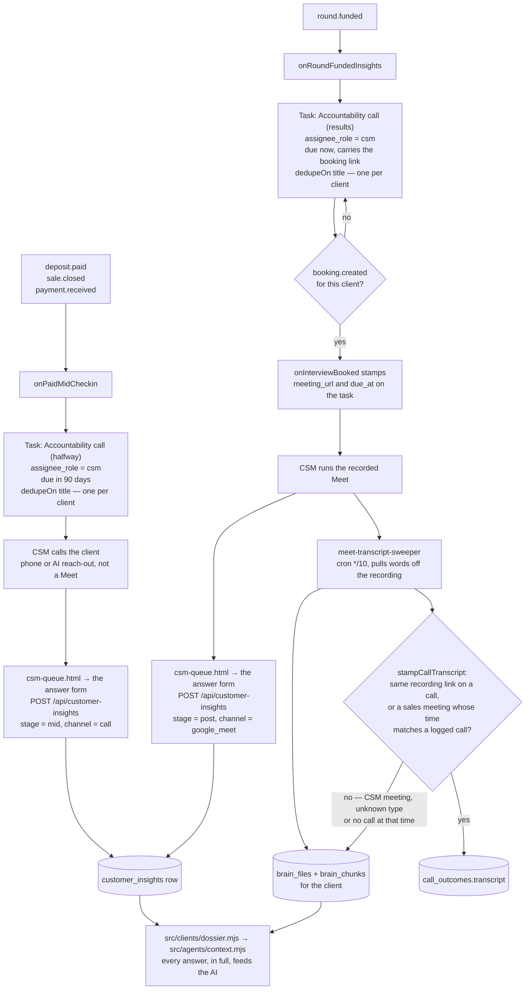
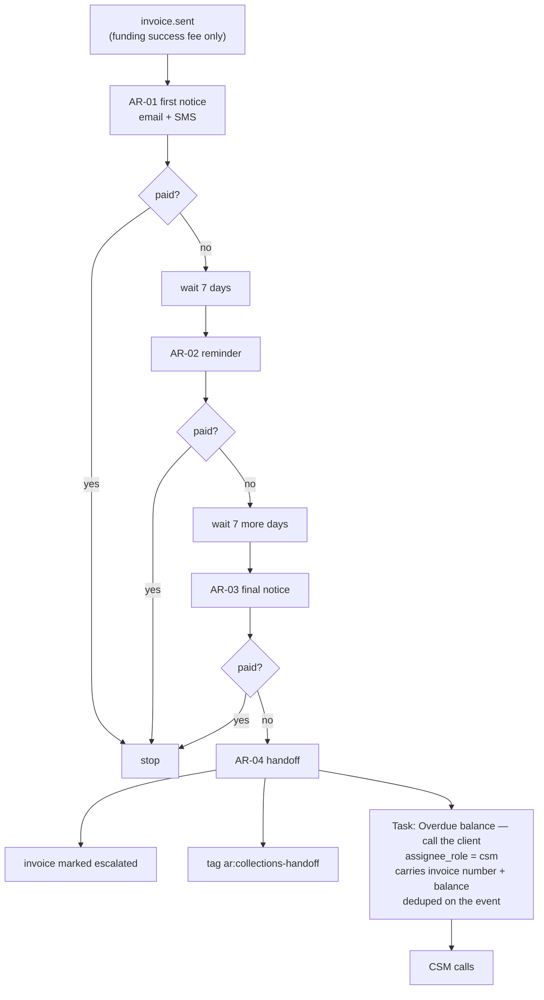
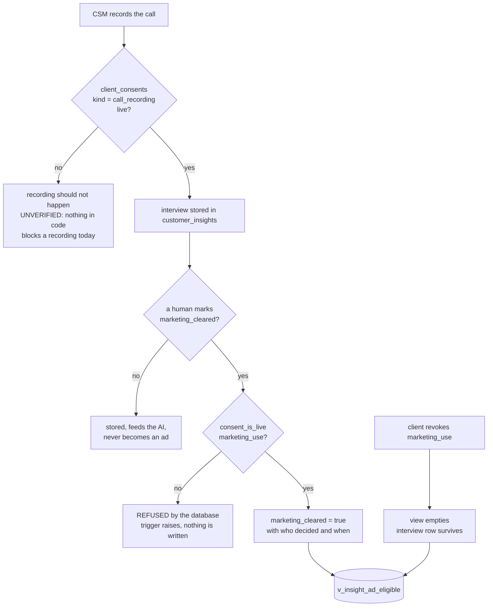

# CSM (Client Success Manager) — what the code actually does

Traced from the code by hand on 2026-09-05, not from the plan. Anything the code
did not show is marked `UNVERIFIED` rather than drawn.

**Re-traced 2026-09-17** after the live walk scored this role FAIL. Six things
changed in the code and are redrawn below: the halfway call now fires on every
kind of payment, the results call is created once and carries a due date, and
the CSM has a screen — `public/app/csm-queue.html` — with the clock, the claim
and the answer form on it.

> **`npm run journeys` does NOT write this file, and must not be pointed at it.**
> The other `role-*-actual.md` pages are that script's output: route tables
> showing which endpoints a role can reach. This page is a different thing — the
> flow of the work through the role, hand-traced. Adding `role-csm` to the
> generator's list would overwrite these diagrams with a route table and lose
> everything the page is for.

There is deliberately **no `role-csm-intended.md`** yet. Intended journeys are
hand-authored by Chris and agents do not write them (CLAUDE.md §4).

Traced from: `src/handlers/customer-insights.mjs`, `src/register-all.mjs`,
`src/lib/create-task.mjs`, `src/insights/store.mjs`, `src/insights/questions.mjs`,
`src/workflows/ar-collections.mjs`, `src/workflows/meet-transcript-sweeper.mjs`,
`db/migrations/166`, `290`, `291`, `292`, `293`.

---

## The two accountability calls the CSM owns

**A CSM meeting's words never land on a sales call (2026-10-05, M0 step 9).**
`stampCallTranscript` (`src/sales/recordings.mjs`) used to fall back to the
client's latest call with no transcript, so a check-in recording could be written
onto a closer's call. Now it stamps a call only when that call already holds the
recording's link, or when the file name says it was a sales meeting
(`meetKindFromName`) and gives its start time (`meetStartFromName`) and a call
was logged from one hour before to six hours after that start. Otherwise the
words stay on the brain file, and the client dossier (`src/clients/dossier.mjs`)
reads them from `brain_chunks`. `UNVERIFIED` against real Drive names: the
type and time come from the file name only, so a Meet file named without
"(YYYY-MM-DD HH:MM GMT±H)" never stamps a call.

**All three money-in events make the halfway call.** `register()` in
`src/handlers/customer-insights.mjs` subscribes `onPaidMidCheckin` to
`deposit.paid`, `sale.closed` and `payment.received`. Until 2026-09-17 the third
was missing, so a repair, trial or academy client paid and no halfway call was
ever created — only the deposit/close shaped sales got one. The same three names
are `ROUTED_EVENTS` in `src/handlers/purchase-routing.mjs`; they are one set and
move together.

**Neither call is created twice.** Both `createTask` calls now pass
`dedupeOn: "title"`. The results call did not, so it fell back to the event id —
which is embedded in the task body — and two `round.funded` events produced two
identical open rows for the same client. `UNVERIFIED` — the title dedupe in
`src/lib/create-task.mjs` does not filter on `done = false`, so once a call is
ticked off, a genuine second funding for the same client is also suppressed. The
halfway call has always behaved that way; the results call now matches it.

**The results call is due the day the round funds.** It carried no due date at
all until 2026-09-17, so it landed in the calendar's "No date" pile. No
post-funding interval is written down anywhere in this repo — there is no
`POST_DUE_DAYS` and no spec line — so the date is "now" rather than an invented
offset, and `onInterviewBooked` still overwrites it with the real meeting time
the moment the client books.

**Both tasks read one constant.** `ASSIGNEE_ROLE` in
`src/handlers/customer-insights.mjs` was `funding_advisor` until 2026-09-05 and
is now `csm`, so both moved together. Registered live at
`src/register-all.mjs:14`.

**The mid check-in fires at day 90**, the halfway point of the 180-day term that
is the only program length stated anywhere in this repo. It was 7 days after
payment until 2026-09-05, which was a welcome call wearing the wrong name — a
week in, nothing has happened yet, so "how is it going" had no answer.

`MID_DUE_DAYS` in `src/handlers/customer-insights.mjs` is the one number.

`UNVERIFIED` — it is not computed per contract. `contracts.signed_at +
term_days/2` looks like the right answer and cannot be built: nothing writes
`term_days` onto a contract, 287 deliberately moved the term into the agreement
text, and zero contracts carry one. A client on a different-length agreement
gets the same day 90.

---

## Chasing money, and where a person finally enters

**Before 2026-09-05 this ladder ended at K and L.** It escalated the invoice,
tagged the client, and stopped. Nothing read that tag, so three unpaid notices
were followed by nobody calling. M is the change.

**Scope, unchanged:** only invoices whose source is `funding_success_fee`.
Subscription and agreement balances do **not** enter this ladder. `UNVERIFIED`
whether Chris wants them to — nothing in the code decides it either way.

---

## Whether a recording may become an ad

**Two consents, not one.** Agreeing to be recorded is not agreeing to be
advertised, and before `db/migrations/291` the table could not hold the
difference — `client_consents.kind` allowed only `soft_pull_consent` and
`dispute_authorization`.

**The stored flag is not the permission.** `marketing_cleared` records that a
human decided about this specific recording. `v_insight_ad_eligible` is the
answer to "may we cut an ad from this today" and re-checks the consent live, so
a revocation empties it without rewriting a single interview row.

**`UNVERIFIED` — nothing in the code stops a call being recorded without a
`call_recording` consent row.** The data slot exists (291). The gate on the act
of recording does not. Recording happens in Google Meet, outside this system.

---

## What the CSM is paid

`commission_rules.basis` now accepts `collections`, paired only to
`cash_collected` — money actually received, net of refunds. `sale_attributions`
accepts the same basis so a CSM can be credited on the deal.

**No rate is set.** Rates in this system are rows with effective dates, never
values in code (`db/migrations/013`). Until Chris adds a rule scoped
`role = 'csm'`, a CSM earns nothing on collections and the calculator reports
"no base rule for this basis" as a warning rather than paying zero silently.

An **upsell** needs none of this: an upsell is a sale, so it is `front_end` with
`role = 'csm'`, which is a config row. `UNVERIFIED` — no code path today
attributes an upsell to whoever was on the check-in call.

---

## What the CSM can see

`ROLE_TABS.csm` in `public/app/shell.js` resolves to the shared staff surface
plus `consent-capture.html`, matching how closer and funding advisor are set up.
**`HOME.csm` is `csm-queue.html`** — it was `client-control-panel.html` until
2026-09-17, which meant the role's first screen asked them to pick a client
instead of showing them who was waiting for a call.

**The CSM has a queue, and now a screen that shows it.**
`GET /api/read/csm-queue` returns their open tasks with, for each one, the
client's name, what they owe, and what they already own — the three questions a
check-in call needs answered before it starts. Balance comes from
`v_invoice_aging` and is **null when the client has no invoice, never 0**,
because "owes nothing" and "we have not looked" are different answers; the screen
prints a dash for null and never a zero.

The endpoint shipped complete and, until 2026-09-17, **no page in the app had
ever requested it** — a grep of `public/` for `csm-queue` returned nothing. The
screen is `public/app/csm-queue.html`, reachable from the Client ops group of
the shared sidebar (`public/app/sidebar.fragment.html` is the source; every
screen's copy is written by `scripts/sync-sidebar.mjs`). It carries four things:

* **The list.** One row per call: who, what the call is, when it is due, days
  overdue, the open balance, and the products they already own.
* **The clock.** `GET/POST /api/shifts`. The only clock control in the app used
  to be on `staff-teams.html`, which is on `FINANCE_ONLY`, so a CSM opening that
  URL was bounced to the Client Control Panel and could never get on shift.
  `api/shifts.mjs` takes the staff id off the session and refuses a body that
  carries one, so every staff role was always allowed to clock in — there was
  simply nowhere to press. No role gate changed.
* **Claim.** `PATCH /api/tasks { id, claim: true }`. This always worked and
  always required an open shift (`requireActiveShift`, owners exempt), which is
  why Claim appeared to do nothing for a CSM who could not clock in. The queue
  read now returns `assignee_staff_id`, so a claim is still visible after a
  reload.
* **The answer form.** `POST /api/customer-insights`, with the questions taken
  from the `questions` object the read endpoint already serves — never a second
  copy in the page. There were zero rows in `customer_insights` because nothing
  had ever posted to it, and the task body told the CSM to call the API by hand.
  Those two sentences now point at this screen.

**The consent screen takes all four kinds.** `consent-capture.html?client_id=…
&kind=call_recording` and `&kind=marketing_use`. Asked on separate visits so
neither rides in on the other's tick.

**The CSM is paid 10% of cash collected on what they sell, and NOTHING on
collections.** Owner-set 2026-09-05. `db/migrations/346` inserts one rule scoped
`role='csm'`; the `collections` basis opened by 293 is deliberately left with no
rule at all. A rep paid to collect leans on a client in the middle of a
conversation meant to be about how that client is doing. A rep paid on the next
sale is motivated to make this one work first.

**The offer on the call is a nudge, not a pitch,** and a client can be sold
another product while still halfway through the current one.

**These are ACCOUNTABILITY CALLS, not interviews.** Owner's word, 2026-09-05,
and the honest one: the CSM holds the client accountable to what they came here
for, records what they say, and mentions what they do not have yet.

**A CSM may record the two conversation consents and NOT a soft-pull consent.**
A consent is what unlocks a credit pull, so the role set on this endpoint is
gated per kind: `role_may_not_capture_this_kind` is the refusal.
