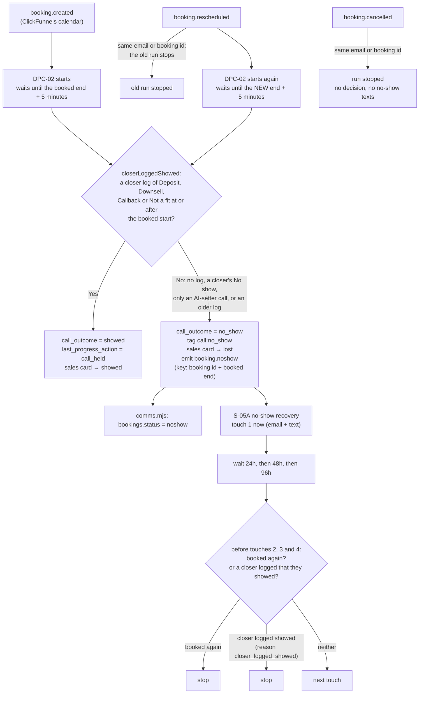
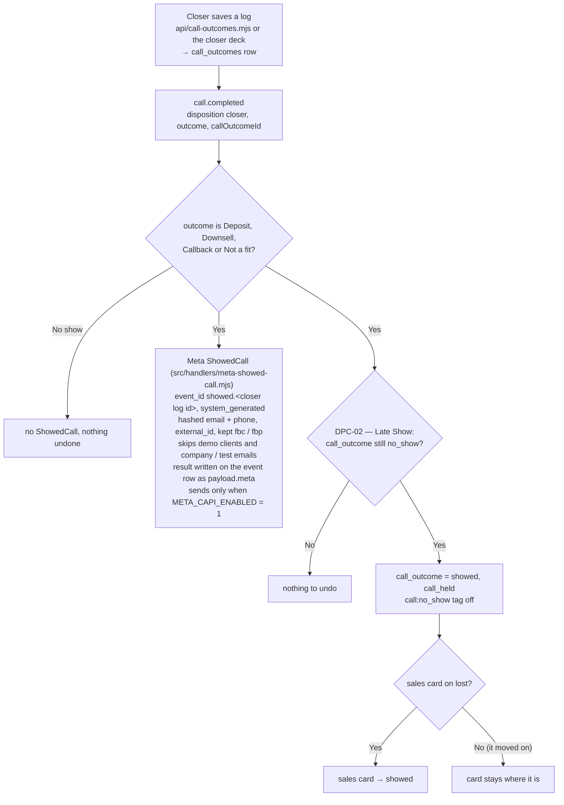

# Showed or no-show — flow (generated from code, 2026-10-05)

What happens to a booked sales call after its time passes, read from the code in `src/sales/call-outcomes.mjs` (the rule), `src/workflows/dpc-02-call-outcome-enforcement.mjs` (DPC-02 and DPC-02 — Late Show), `src/workflows/s-05a-no-show-recovery.mjs`, `src/handlers/meta-showed-call.mjs`, `src/handlers/comms.mjs`, `src/adapters/clickfunnels.mjs` and `src/adapters/bland.mjs`.

**No intended journey has this step yet.** No `-intended.md` file mentions a booked call, showed, no-show, the no-show texts or any Meta event. `client-intended.md` has no booking step at all.

**Owner-set 2026-10-05 (Chris, K3):**
1. A client showed when a closer logged Deposit, Downsell, Callback or Not a fit for them, at or after the call's booked start. Nothing else counts.
2. A cancelled call is never a no-show. A moved call is checked at its new time.
3. A closer who logs after the 5-minute check undoes the no-show: the card goes back to showed and the remaining no-show texts stop.
4. Meta gets a ShowedCall from the closer's log.

## The rule, in one place

`SHOWED_OUTCOMES` and `closerLoggedShowed()` in `src/sales/call-outcomes.mjs`. DPC-02, S-05A and the Meta ShowedCall all ask it.

| Case | Showed? |
|---|---|
| Closer logged Deposit, Downsell, Callback or Not a fit, at or after the booked start | Yes |
| Closer logged No show | No |
| An AI-setter (Bland) call finished — AI-SET-01's confirm call after the booking | No |
| The call time passed and no closer logged anything | No (nothing records a meeting without a log) |
| A closer log from an older call (before this call's booked start) | No |
| A demo closer log (`call_outcomes.is_demo`) | No |
| The call was moved | Not judged at the old time; judged at the new time |
| The call was cancelled | Never judged; never a no-show |

## A booked call, start to end

## The closer's log

## What is not a signal

- **AI setter (Bland).** `src/adapters/bland.mjs` emits `call.completed` (source `bland`) for every finished robot call, voicemail and no answer included. AI-SET-01 places that call right after the booking to confirm it. It never counts as showed and never reaches Meta.
- **The calendar.** ClickFunnels only ever sends booked, moved or cancelled. `bookings.status` has `completed` in its word list (`src/bookings/store.mjs`), but nothing writes it.

## Limits, as built

- The first no-show text (touch 1) goes at the 5-minute check. A closer log after that stops touches 2 to 4. It cannot unsend touch 1.
- Stopping on a move or a cancel depends on the calendar event carrying the same email or booking id as the booking. That is the same match S-04B's reminders and BS-01's pre-call emails already use.
- One ShowedCall per closer log. A client with two held calls is two ShowedCalls, the way Schedule counts every booking.
- BS-01's pre-call emails ask the same rule with no booked start, so any held closer log for the client stops them.
