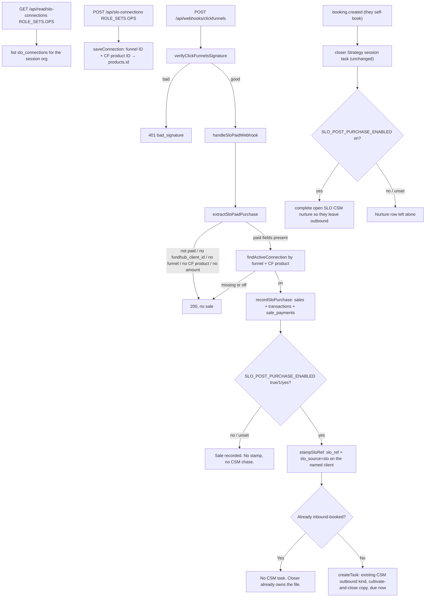

# SLO connections — actual (first slice)

Generated from the code in this worktree. Not from the spec.

## What the code does

## Traced paths

- `public/app/products-commissions.html` — SLO connections tab, hidden until
  `/api/auth/session` says owner or admin.
- `api/read/slo-connections.mjs` — `ROLE_SETS.OPS` (owner, admin).
- `api/slo-connections.mjs` — same gate. Writes `slo_connections`.
- `src/slo/purchase.mjs` — paid types: `order.completed`,
  `one-time-order.completed`, `one_time_order.completed`, `new_purchase`.
  Client key is only `fundhub_client_id`. Amount is `amount_cents` or a CF 2.0
  integer cent total. Classic integer dollars without a cents field are refused.
  After a sale writes, `stampSloRef` and the CSM chase run only when
  `SLO_POST_PURCHASE_ENABLED` is `true`, `1`, or `yes` (unset = off). Then
  `createTask` reuses the existing
  CSM outbound kind (`customer-insights-mid`, assignee_role `csm`) with title
  `SLO paid — walk portal / close`, due immediately. Notes tell the CSM to walk
  dashboards, help, and close or upsell. It does not emit `deposit.paid`. It
  does not create a closer task. If they already inbound-booked (bookings row
  or open closer Strategy session task), no CSM nurture is opened. When
  `booking.created` fires, `onBookingCreated` still makes the closer task.
  Completing the open SLO nurture also waits on that same flag.
- `src/adapters/clickfunnels.mjs` — after a good signature, calls
  `handleSloPaidWebhook` before the email / survey / booking path.
- `src/sales/closer-deck.mjs` `sendDeckSoftPull` — when the flag is on and
  `getLatestPull` is
  younger than 30 days, returns `{ skipped: true, reason: "fresh_pull_on_file" }`
  (HTTP 200). Flag off, no file, or age ≥ 30 days, keeps the existing $32 send.
  `GET /api/read/closer-deck` JSON also carries `slo_ref`, `slo_source`,
  `slo_pack_status`, `last_pull_at` from stored custom fields / `crs_results`.
- `src/sales/cockpit.mjs` `buildCockpit` (`GET /api/read/closer-call`) JSON
  carries the same stored SLO fields on `client` plus `last_pull_at`.

## Not in this code

Soft pull at ClickFunnels paid time, UnderwriteIQ generation, black reports,
paper, recurring, white-label, a new checkout, ClickFunnels apply, a new CSM
task kind, a new route or screen.
