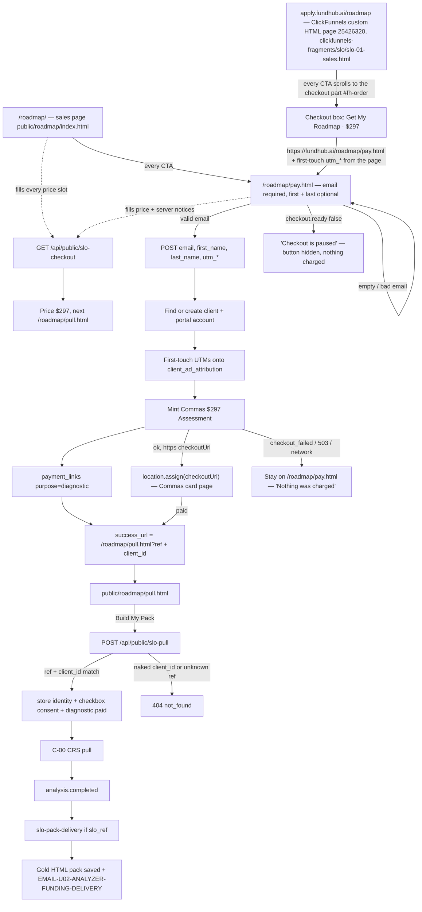

# SLO offer — actual (first slice)

Generated from the code in this worktree. Not from the spec.

Public folder is `public/roadmap/`. Old `/slo` URLs 301 to `/roadmap`. APIs stay `/api/public/slo-*`. The live pages do not use a new product name.

## What the code does

## Traced paths

- `clickfunnels-fragments/slo/slo-01-sales.html` (live at https://apply.fundhub.ai/roadmap) — every CTA is
  `href="#fh-order"` and a click handler scrolls to the checkout section. The checkout box `#fh-pay-go` links to
  `https://fundhub.ai/roadmap/pay.html`; on load and on press it adds the five `utm_*` tags from the page's own
  `fh_attribution` session store (first touch, written by `fh-attribution.js`) or from the page URL, because a
  session store on apply.fundhub.ai is not readable on fundhub.ai. `landing_path` and `referrer_domain` are not
  carried across; pay.html records its own. The box holds no form fields and collects nothing itself.

- `api/public/slo-checkout.mjs` — mint + write a diagnostic payment link so the existing Commas adapter emits `diagnostic.paid`.
- `api/public/slo-pull.mjs` — POST only. Matching `ref` + `client_id` required. Server stores `soft-pull-v1` consent text. Then `diagnostic.paid`.
- `src/slo/buyer.mjs` — client, portal account, `slo_ref` stamp.
- `src/slo/deliver.mjs` — same UnderwriteIQ funding pack and email the closer deck uses. The four analysis docs are the gold HTML pages (`src/deliverables/`), not the short PDFs.
- `src/workflows/slo-pack-delivery.mjs` — on `analysis.completed`, only if `slo_ref` is on the client.
- C-00 / C-06 / U-03 / U-04 are unchanged. ClickFunnels adapter is unchanged.
- `public/roadmap/index.html` — sales copy verbatim from `clickfunnels-fragments/slo/slo-01-sales.html`. Every
  price slot filled from GET `priceDisplay`; none typed. Cut: the layout-preview sample results, the empty
  result placeholders, and the video player (`funnel/slo-vsl.mp4` is 404). A failed price read shows a dash
  and a line saying the exact price is on the next page. Every call to action goes to `/roadmap/pay.html`.
- `public/roadmap/pay.html` — email required before any POST. Leaves only for an `https` `checkoutUrl` the server
  returned. The charge / soft-pull / keep lines are the server's `notices`, plus "We do not sell your data."
  Every failure path says nothing was charged. Back link is `/roadmap/`. Pay POST also sends the five `utm_*`
  tags plus `landing_path` and `referrer_domain` from hidden fields the existing catcher stamps
  (`clickfunnels-fragments/06-utm-hidden-fields.html` / `public/funnel/fh-attribution.js`). First touch is
  written onto the client (`client_ad_attribution` + custom fields). No email guessing beyond find-or-create.
- `public/roadmap/index.html` and `pay.html` load `/funnel/fh-attribution.js` so an ad link to `/roadmap/`
  keeps `utm_content` (ad id) through checkout. Pull form does not; the tags are already on the file.
- ClickFunnels paste of `clickfunnels-fragments/slo/slo-01-sales.html`, `slo-02-order.html`,
  `slo-03-thank-you.html` loads the same script from `https://fundhub.ai/funnel/fh-attribution.js`.
  Sales and thank-you also load the VSL watch beacon. A third funnel is not built yet.
- `public/roadmap/pull.html` — reads `?ref=` and `?client_id=`. Submit POSTs `/api/public/slo-pull`, then clears SSN.
- `clickfunnels-fragments/slo/slo-02-booking.html` (live at https://apply.fundhub.ai/roadmap-book, CF page
  25426722) frames https://apply.fundhub.ai/funding-book-call in `#fh-book-frame`. That native calendar page
  (CF page 25062844) carries `clickfunnels-fragments/04c-book-framed.html` in its head code: only when it is
  inside a frame, it hides its own hero, logo, marquee and footer, hides the scheduler's big logo, and posts
  `fh-book-height` to https://apply.fundhub.ai. The booking page sets the frame to that height (never under
  600px). Once the visitor has touched the calendar, picking a time sends where the picked time + Confirm sit
  (after Confirm: the contact form + Book), and the booking page scrolls only as far as needed to put that on
  screen. Framed on any other address the calendar posts nothing. Opened on its own, /funding-book-call is
  unchanged. A booking still writes `fh_booking_v1` inside the frame and the booking page
  still moves to `/roadmap-thank-you` on it (unchanged).
- `netlify.toml` — `/slo` and `/slo/*` 301 to `/roadmap/` and `/roadmap/:splat`.

## Not in this code

ClickFunnels builder still has to publish the apply.fundhub.ai paste (fragments now include the tracking tags). `SLO_POST_PURCHASE_ENABLED` stays unset (off). A third funnel is not built yet.
