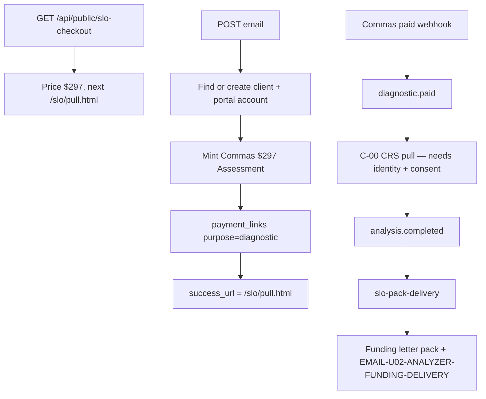

# SLO offer — actual (first slice)

Generated from the code in this worktree. Not from the spec.

## What the code does

## Traced paths

- `api/public/slo-checkout.mjs` — mint + write a diagnostic payment link so the existing Commas adapter emits `diagnostic.paid`.
- `src/slo/buyer.mjs` — client, portal account, `slo_ref` stamp.
- `src/slo/deliver.mjs` — same UnderwriteIQ funding pack and email the closer deck uses.
- `src/workflows/slo-pack-delivery.mjs` — on `analysis.completed`, only if `slo_ref` is on the client.
- C-00 / C-06 / U-03 / U-04 are unchanged. ClickFunnels adapter is unchanged.

## Not in this code

The sales/pay/pull HTML (Claude Code). Identity submit on `/slo/pull.html`. ClickFunnels paste. The live `/watch` funnel.
