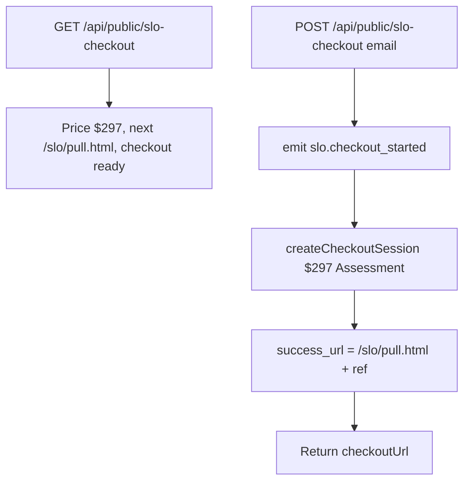

# SLO offer — actual (first slice)

Generated from the code in this worktree. Not from the spec.

## What the code does

## Traced paths

- `src/slo/offer.mjs` — $297, keep title Consulting Services Assessment, pull path `/slo/pull.html`.
- `api/public/slo-checkout.mjs` — public GET/POST. No auth. Records the ask, then mints. Success URL is the pull form, not `/app/payment-success.html`.
- `netlify/functions/api.mjs` — `public/slo-checkout`.
- `src/pulse/registry.mjs` — same key, same change.

## Not in this code

The sales/pay/pull HTML. Identity submit. CRS pull after this pay. Pack build. Book widget. ClickFunnels paste.
