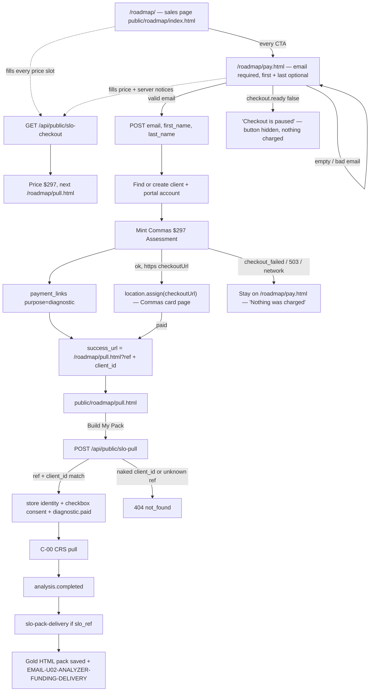

# SLO offer — actual (first slice)

Generated from the code in this worktree. Not from the spec.

Customer name: **Capital Playbook**. Public folder is `public/roadmap/`. Old `/slo` URLs 301 to `/roadmap`. APIs stay `/api/public/slo-*`.

## What the code does

## Traced paths

- `api/public/slo-checkout.mjs` — mint + write a diagnostic payment link so the existing Commas adapter emits `diagnostic.paid`.
- `api/public/slo-pull.mjs` — POST only. Matching `ref` + `client_id` required. Server stores `soft-pull-v1` consent text. Then `diagnostic.paid`.
- `src/slo/buyer.mjs` — client, portal account, `slo_ref` stamp.
- `src/slo/deliver.mjs` — same UnderwriteIQ funding pack and email the closer deck uses. The four analysis docs are the gold HTML pages (`src/deliverables/`), not the short PDFs.
- `src/workflows/slo-pack-delivery.mjs` — on `analysis.completed`, only if `slo_ref` is on the client.
- C-00 / C-06 / U-03 / U-04 are unchanged. ClickFunnels adapter is unchanged.
- `public/roadmap/index.html` — sales copy verbatim from `clickfunnels-fragments/slo/slo-01-sales.html`. Every
  price slot filled from GET `priceDisplay`; none typed. Cut: the layout-preview sample results, the empty
  result placeholders, and the video player (`funnel/slo-vsl.mp4` is 404). A failed price read shows a dash
  and a line saying the exact price is on the next page. Every call to action goes to `/roadmap/pay.html`.
- `public/roadmap/pay.html` — email required before any POST. Leaves only for an `https` `checkoutUrl` the server
  returned. The charge / soft-pull / keep lines are the server's `notices`, plus "We do not sell your data."
  Every failure path says nothing was charged. Back link is `/roadmap/`.
- `public/roadmap/pull.html` — reads `?ref=` and `?client_id=`. Submit POSTs `/api/public/slo-pull`, then clears SSN.
- `netlify.toml` — `/slo` and `/slo/*` 301 to `/roadmap/` and `/roadmap/:splat`.

## Not in this code

ClickFunnels paste. The live `/watch` funnel. `SLO_POST_PURCHASE_ENABLED` stays unset (off).
