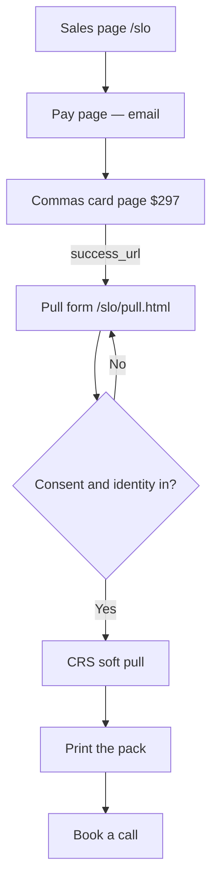

# SLO offer — intended

A stranger pays $297 for the diagnostic pack, then we pull their credit, print the pack, and they book a call.

ClickFunnels stays last. The live apply funnel at `/watch` does not move.

## First question

I paid. What do I do right now?

## What should happen

## Ground truth

1. The sales page shows $297 from the server, not a number typed into the HTML.
2. Commas sees the keep title Consulting Services Assessment. No new catalog product.
3. After pay, the next screen is the pull form in the same window. Not a generic thank-you. Not an email.
4. The pull does not start until they submit name, date of birth, Social Security number, address, and the yes-you-can-pull box.
5. Nothing about the payer except `ref` and `client_id` goes on the success URL. No SSN. No amount.
6. The live `/watch` apply funnel is unchanged.

## Not in the first slice

ClickFunnels paste. Soft pull submit API. Pack build after this pull. Book widget on the SLO path.
