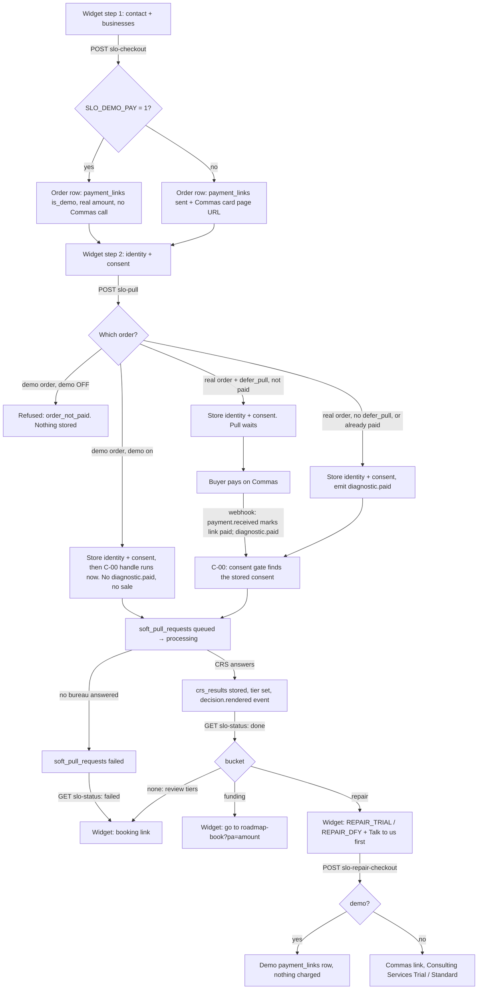
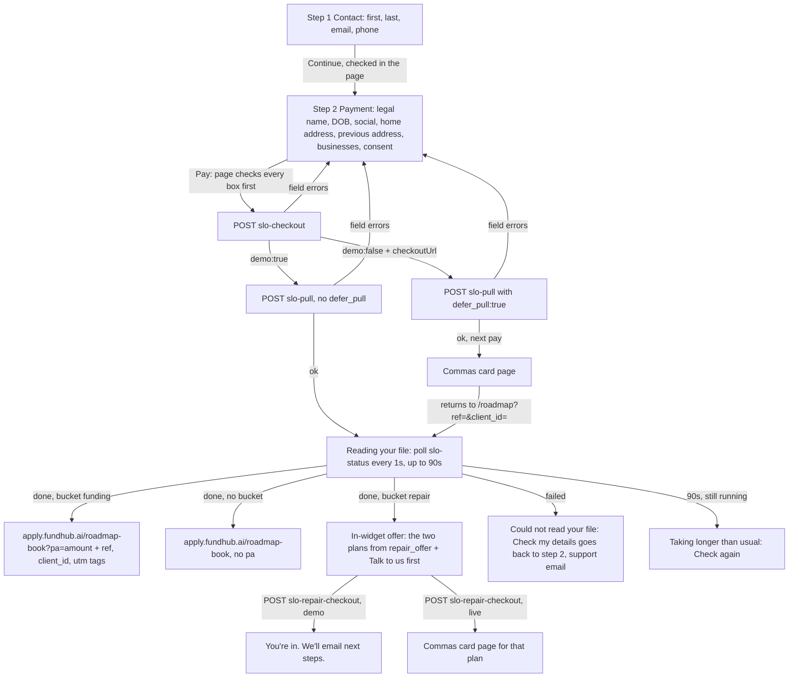

# $297 /roadmap widget — back-end flow (2026-09-22)

Owner-set 2026-09-22: the checkout is a two-step widget on the /roadmap sales
page (https://apply.fundhub.ai/roadmap). The widget is a window onto this flow.
Traced from code on branch `feat/roadmap-widget`:
`api/public/slo-checkout.mjs`, `api/public/slo-pull.mjs`,
`api/public/slo-status.mjs`, `api/public/slo-repair-checkout.mjs`,
`src/slo/pull.mjs`, `src/slo/status.mjs`, `src/slo/repair-offer.mjs`.

## One order, start to finish

## States the widget polls (GET /api/public/slo-status)

| state | when |
|---|---|
| running | no request yet, a request queued or processing, or a result stored but its decision not yet recorded |
| done | this order's crs_results row AND its decision.rendered event exist |
| failed | this order's newest request ended failed or cancelled with no newer result |

Only rows made at or after this order's payment_links row count.

## The widget screens (front end, 2026-09-22)

Source: `clickfunnels-fragments/slo/slo-01-sales.html`, the `#fhw` widget after
the SPLIT-LINE comment. Every "Get My Roadmap" and "Show Me What I Qualify For"
button scrolls to it. No page on the way links to `roadmap/pay.html` any more.

| Rule | Where the page does it |
|---|---|
| Demo or live comes from the server (`demo` on GET and POST slo-checkout). | The yellow demo note shows only when GET says `demo:true`. |
| Total today = base + each extra × (businesses − 1), from GET slo-checkout (defaults 29700 / 1500 cents). | Updates as businesses are added or removed; the Pay button shows the same total. |
| A lone Business 1 may be left blank (it is skipped, the order is still one business). Added businesses must be filled in or removed. | Keeps the shown total equal to what the server charges. |
| Server errors go under the box they name (`field`, including `businesses.i.key`). | Unknown fields show in one line above the Pay button. |
| The social and DOB go in the POST body only; the social box is cleared after a good answer. | Never put in storage, the console or the address bar. |
| `console.info("fh-widget time-to-bucket <ms>")` when state becomes done. | Measured from the Pay press (across the card page through a stored timestamp). |
| Nothing about repair or letter mailing shows before a pull result. | The offer pane is filled only from `repair_offer`. |
| The page takes a phone number in step 1 and sends it as `phone`. | slo-checkout does not store it yet (the back end takes no phone). |
