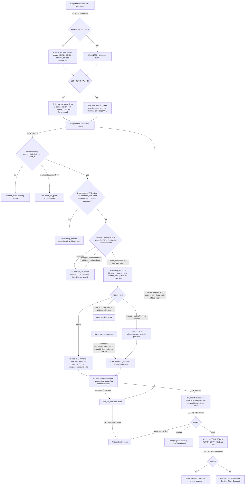
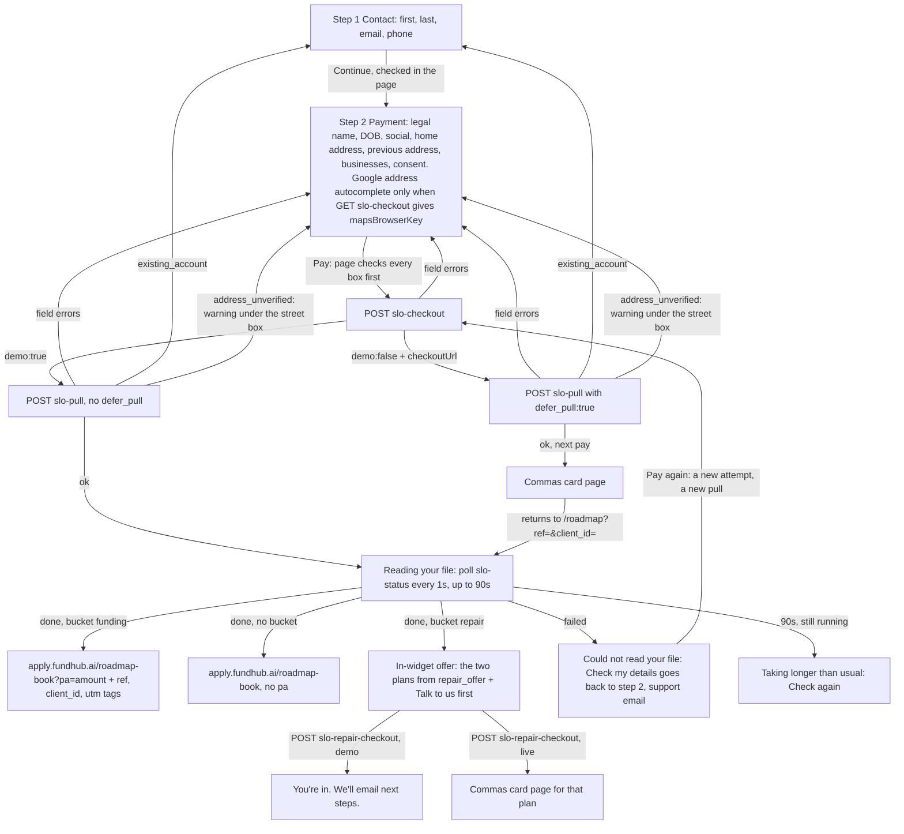

# $297 /roadmap widget — back-end flow (2026-09-22)

Owner-set 2026-09-22: the checkout is a two-step widget on the /roadmap sales
page (https://apply.fundhub.ai/roadmap). The widget is a window onto this flow.
Traced from code on branch `feat/roadmap-widget`:
`api/public/slo-checkout.mjs`, `api/public/slo-pull.mjs`,
`api/public/slo-status.mjs`, `api/public/slo-repair-checkout.mjs`,
`src/slo/buyer.mjs`, `src/slo/pull.mjs`, `src/slo/status.mjs`,
`src/slo/address-check.mjs`, `src/slo/repair-offer.mjs`.
Updated 2026-09-22 after the independent review (email takeover, pay bypass,
retry, address rules, address check, phone, Google autocomplete).

## One order, start to finish

### Rules the back end enforces (2026-09-22 review)

| Rule | Where |
|---|---|
| An email is not a login. An email that already belongs to a client writes nothing to that client at checkout: no name, phone, account, ad tags, businesses or slo_ref. | `resolveSloBuyer` → `{ clientId, created }`; `runSloCheckout` writes to the client only when `created`. |
| The order's ref and business count live on the order row (`payment_links.link_ref`, `business_count`, migration 388). The order is found by that row, never by a client field. | `findSloOrder`, `businessesPaidFor`. |
| An unpaid order is refused (`existing_account`, 409, message under Email) when its client has an identity this order did not write, or has paid before. A paid order (webhook) is not refused. A brand-new client has neither, so its order and its retries go through, demo and live. | `sloClientPriorFile`, `markSloOrderIdentity` (`payment_links.identity_stored_at`). |
| A live order starts a pull only when the Commas webhook has marked it paid. Unpaid → identity + consent stored, `next: 'pay'`, whatever the body says about `defer_pull`. | `runSloPull`. |
| Each new pull after a failed one is a new attempt: `slo-demo:<ref>:<n>` / `slo-pull:<ref>:<n>`, n = 1 + this order's failed or cancelled pulls. A double click inside one attempt is one pull. | `nextSloPullAttempt`. |
| The home and previous address are looked up with the existing geocoder (Google if a server key is set, else the US Census geocoder). Not found → `address_unverified` (422) warning; Pay again with `address_confirmed: true` takes it as typed. Geocoder down or slow (5s) never blocks. Military (AA/AE/AP) is not looked up. | `checkSloAddresses` → `verifyStreetAddress`. |
| Street: 3-48 characters with a digit somewhere (military, Puerto Rico and Wisconsin grid addresses pass). P.O. box is a warning. Apartment: periods and `# ` normalized, then 10 characters at most. No age rule on the date of birth: a real date, 1900 or later, not in the future. | `src/slo/fields.mjs` and the widget's own copy. |
| Phone: optional on the server; when sent, 10 US digits, stored as +1XXXXXXXXXX on a client this checkout creates. | `parseSloPhone`. |
| `GET slo-checkout` returns `mapsBrowserKey` from `GOOGLE_MAPS_BROWSER_KEY` (null when unset, never the server key). | `sloPageConfig`. |

## States the widget polls (GET /api/public/slo-status)

| state | when |
|---|---|
| running | no request of this order yet, its newest request queued or processing, or its result stored but the decision not yet recorded |
| done | a request of this order was fulfilled with a crs_results row AND that row's decision.rendered event exists |
| failed | this order's newest request ended failed or cancelled with no newer result |

Only pulls THIS order started count: a soft_pull_requests row whose ledger key
is `diagnostic-paid:slo-demo:<ref>:<n>`, or `diagnostic-paid:<events.id>` for a
diagnostic.paid event whose payload names this ref (or this order's
payment_links id). Any other pull on the same client — older, or run later by
staff or another order — is never shown. The result shown is the crs_results row
that request was fulfilled with.

## The widget screens (front end, 2026-09-22)

Source: `clickfunnels-fragments/slo/slo-01-sales.html`, the `#fhw` widget after
the SPLIT-LINE comment. Every "Get My Roadmap" and "Show Me How Much I Qualify For"
button scrolls to it. No page on the way links to `roadmap/pay.html` any more.

| Rule | Where the page does it |
|---|---|
| Demo or live comes from the server (`demo` on GET and POST slo-checkout). | The yellow demo note shows only when GET says `demo:true`. |
| Total today = base + each extra × (businesses − 1), from GET slo-checkout (defaults 29700 / 1500 cents). | Updates as businesses are added or removed; the Pay button shows the same total. |
| A lone Business 1 may be left blank (it is skipped, the order is still one business). Added businesses must be filled in or removed. | Keeps the shown total equal to what the server charges. |
| Server errors go under the box they name (`field`, including `businesses.i.key`). | Unknown fields show in one line above the Pay button. |
| The social and DOB go in the POST body only; the social box is cleared after a good answer. | Never put in storage, the console or the address bar. |
| `console.info("fh-widget time-to-bucket <ms>")` when state becomes done. | Measured from the Pay press (across the card page through a stored timestamp). |
| Nothing about repair or letter mailing shows before a pull result. | The offer pane is filled only from `repair_offer`. |
| The page takes a phone number in step 1 and sends it as `phone`. | slo-checkout stores it as +1XXXXXXXXXX on a client it creates; an existing client's phone is not touched. |
| `address_unverified` puts "We couldn't find that address. Check the street and ZIP, or tap Pay again to use it as typed." under the street box. | The next Pay with the same address (kept in memory only) sends `address_confirmed: true`. |
| `existing_account` puts "This email already has a file with us. Email support@fundhub.ai and we will pick it up." under Email. | Step 1 opens. |
| Google Places autocomplete loads only when `mapsBrowserKey` is not null, on the home and previous street boxes, US addresses only. A pick fills street, city, state and ZIP. | Null key: no Google script, plain boxes. |
| Street, apartment and date-of-birth checks match the server (digit anywhere, `Apt. 4B` allowed, no age rule). | Apartment boxes take 14 characters so periods fit; 10 after normalizing. |
