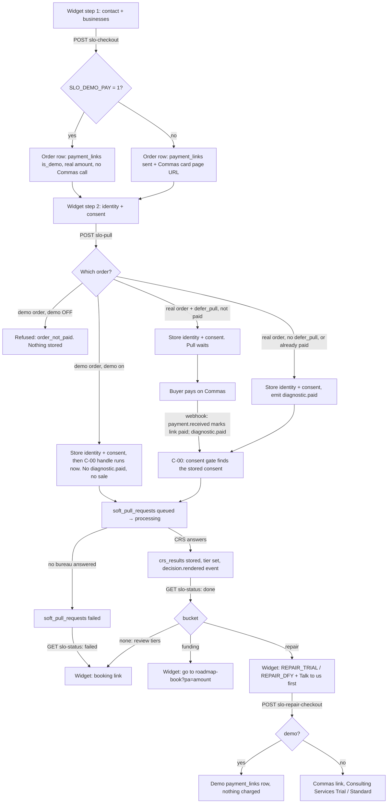

# $297 /roadmap widget — back-end flow (2026-09-22)

Owner-set 2026-09-22: the checkout is a two-step widget on the /roadmap sales
page (https://apply.fundhub.ai/roadmap). The widget is a window onto this flow.
Traced from code on branch `feat/roadmap-widget`:
`api/public/slo-checkout.mjs`, `api/public/slo-pull.mjs`,
`api/public/slo-status.mjs`, `api/public/slo-repair-checkout.mjs`,
`src/slo/pull.mjs`, `src/slo/status.mjs`, `src/slo/repair-offer.mjs`.

## One order, start to finish

## States the widget polls (GET /api/public/slo-status)

| state | when |
|---|---|
| running | no request yet, a request queued or processing, or a result stored but its decision not yet recorded |
| done | this order's crs_results row AND its decision.rendered event exist |
| failed | this order's newest request ended failed or cancelled with no newer result |

Only rows made at or after this order's payment_links row count.
