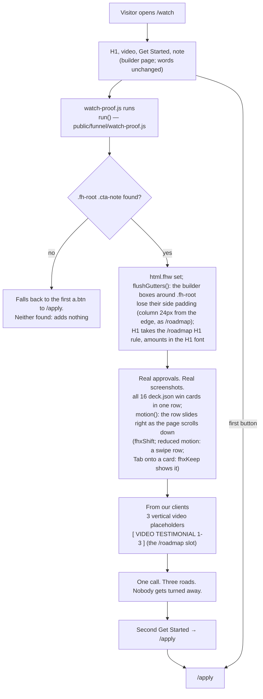
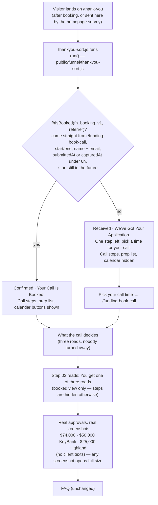

# /watch and /thank-you — the Sorting Hat pages (actual)

Generated from code on 2026-09-22 (branch `feat/watch-proof`; /watch section and
/thank-you proof row regenerated on branch `feat/watch-organize`). Both pages are
ClickFunnels builder pages on apply.fundhub.ai. Their body cannot be replaced by
API, so everything new is added by a footer script served from fundhub.ai:

| Page | ClickFunnels page | Footer script |
|---|---|---|
| https://apply.fundhub.ai/watch | 25061160 | `public/funnel/watch-proof.js` |
| https://apply.fundhub.ai/thank-you | 25063539 | `public/funnel/thankyou-sort.js` |

The Sorting Hat: one call, three roads (get funded now, fix the file first, learn
to do it yourself). Nobody gets turned away.

## /watch

One column at every width, same heading and the same space between the three
blocks. The approvals row starts to slide once the whole row is on screen (its
bottom edge 90% down) and shows the last card while the whole row is still on
screen (its top edge 10% down); the page itself is never held. No client-text
cards (owner, 2026-09-22). Tap, click, Enter or Space on any screenshot opens it
full size; a click or Escape closes it.

## /thank-you

Since 2026-10-02 the live /funding-book-call page stamps `submittedAt` from a
footer block (`marketing/landing-pages/04e-book-confirm.html`, marker
`fh-book-confirm`) only when ClickFunnels fires `cf:form_submitted:ok` — the
booking POST came back OK. A Book press ClickFunnels refuses (bad phone, 422)
stamps nothing. The older body writer still saves on every change; the block
re-stamps after it. `capturedAt` still counts for records made before that.

The live writer saves the record every time the slot, name or email changes,
before Book is pressed. So a record alone is not a booking: the visitor must also
arrive straight from /funding-book-call (`document.referrer`). ClickFunnels sends a
real booker on with `window.location` from that page (`user_pages` bundle, form
submit). Filling the form and pressing Back keeps /thank-you's first referrer, so
that visitor sees "Pick your call time". A booker who comes back later from another
link also sees "Pick your call time"; their confirmation email still holds the time.

Who sees "Pick your call time": everyone without a booking, including the homepage
survey's DOWNSELL and MANUAL_REVIEW leads (`SURVEY_REDIRECTS` in
`src/config/homepage-survey-steps.mjs` still sends them here, not to the calendar).
Decided 2026-09-22 under the owner's "no questions, decide and ship": the Sorting
Hat call is where every lead gets sorted (fund now, fix the file first, or do it
yourself), /watch promises "Nobody gets turned away", and this page's own FAQ
already tells a low-score reader "Still take the call." The survey routing itself
is unchanged.

## Push

`node scripts/cf-push-custom-html.mjs push --only=apply-watch` and
`--only=apply-thank-you`. Mode `builder_page_tracking_inject_only`: appends the
footer script only; any src already on the live page is skipped
(`trackingFooterScripts`, `clickfunnels-fragments/tracking-manifest.mjs`).
The push reads the live footer code (`GET /pages/{id}?expand[]=footer_code`) and
the public page. If either cannot be read, or the page is not a ClickFunnels page
(`isClickFunnelsPageHtml`), it writes nothing, reports `live_page_unreadable` and
exits 1. Otherwise it saves the old footer to
`docs/workflows/cf-push-snapshots/page-<id>-footer_code.html`, builds the new footer
with `nextFooterCode` (one copy of each script the row owns, missing tags added,
other tags untouched), sends it whole with `footer_code_mode: "replace"`, and reads
it back. It fails unless the read-back matches. ClickFunnels "append" stored each
pushed tag twice on 2026-09-22, so the push never appends.
