# VSL watch flow — what happens inside our own sales video

Required by `CLAUDE.md` §3a step 4 and §4. Written 2026-09-09, traced from the code, not
from the plan. Anything that could not be traced is marked **UNVERIFIED**.

This is a **new and separate flow**. It is not part of the ad label spine
(`docs/journeys/ad-label-spine-flow.md`), which is about labels on an ad. This one is
about one person watching one video.

---

## Read this first: the flow does not start on its own

**Nothing here runs until a person pastes the script into ClickFunnels by hand.**

The video page is `https://apply.fundhub.ai/watch`. It is a ClickFunnels page on a
fundhub.ai web address, confirmed live on 2026-09-08
(`docs/specs/marketing-e2e/vsl-measurement-truth.md:215-236`). ClickFunnels holds that
page, not this repository. So a deploy from here changes nothing on it.

The script lives at `clickfunnels-fragments/07-vsl-watch-beacon.html`. Its own first line
says where it goes: a Custom HTML element at the bottom of that page
(`clickfunnels-fragments/07-vsl-watch-beacon.html:1-4`).

Until somebody does that paste, every arrow below stays empty and the two new tables stay
empty. **The back end is finished and the door is open. The page is the missing half.**

---

## The short version

A person lands on the watch page. The video starts on its own with the sound off. The
script listens to the video the same way a person in the room would, writes down which
whole seconds were reached, and posts that list to our own site a handful of times — no
more than eight for one page view. Our site checks it, refuses junk, and files it under a
made-up name for that browser.

| # | The link | Can it happen today? |
|---|---|---|
| 1 | video → the script writes down what it sees | **Only after the paste.** The script is in this repo, not on the page |
| 2 | the script → our site | **Yes.** `POST /api/public/vsl-watch` is routed (`netlify/functions/api.mjs:785`) |
| 3 | our site → the two tables | **Yes, once 379 is applied.** It has never run against a database |
| 4 | the tables → a screen | **No. Nothing reads them yet.** See "What is missing" |

---

## The flow

```mermaid
flowchart TD
    A["A person opens<br/>apply.fundhub.ai/watch<br/>a ClickFunnels page"] --> B["The pasted script wakes up<br/>and looks for a video<br/>sweep() — 07-vsl-watch-beacon.html:742"]
    B -->|"no video on the page"| B2["Nothing happens.<br/>The page is untouched"]
    B -->|"a video is found"| C["track(video) starts listening<br/>07-vsl-watch-beacon.html:393"]

    C --> D["Two made-up names.<br/>One for this browser, kept on the device.<br/>One for this single viewing.<br/>visitorId() — :291, randomKey() — :277<br/>Neither is a person and neither<br/>can be turned into one"]

    D --> E["The video starts on its own,<br/>SOUND OFF<br/>play — :628"]
    D --> F["The browser REFUSED to start it.<br/>Recorded only if the file was ready,<br/>nothing ever played, and the player<br/>is still stopped when they leave<br/>payload() — :496-501"]

    E --> G["Every whole second reached<br/>is written down ONCE<br/>timeupdate — :657<br/>fhShouldSample — :249<br/>NO TIMER: the clock is the browser's<br/>own timeupdate on a real video,<br/>the rule at public/app/client-portal.html:1240"]

    E --> H{"They TAP FOR SOUND"}
    H -->|"volumechange — :703"| I["THE MOMENT THEY CHOSE TO WATCH.<br/>The page's own code then jumps<br/>back to zero and starts again"]
    I --> J["That jump is NOT a rewind.<br/>restartArmed says it is the same person<br/>starting over with the sound on<br/>fhClassifySeek — :266"]
    J --> G

    G --> K["Jumped backwards = a REWIND<br/>Jumped forwards = a SKIP<br/>Back to 0 after the end = a REPLAY<br/>seeked — :680, ended — :651"]

    G --> L["Paused, stalled, or reached the end<br/>pause — :644, waiting — :649, ended — :651"]

    G -->|"60 seconds have piled up,<br/>or the page is closing"| M["ONE MESSAGE, up to 200 seconds in it<br/>payload — :473<br/>Never more than 8 messages a page view"]
    F --> M
    K --> M
    L --> M
    N["They leave the page<br/>pagehide / hidden — :725-726"] --> M

    M -->|"navigator.sendBeacon,<br/>a text/plain blob so the browser<br/>asks no permission first — send() :553"| O["POST https://fundhub.ai/api/public/vsl-watch<br/>ENDPOINT — :228"]
    M -->|"if sendBeacon is missing:<br/>fetch, keepalive — send() :563"| O

    O --> P["THE ROUTE LINE.<br/>public/vsl-watch<br/>netlify/functions/api.mjs:785<br/>Without it the whole internet gets 404"]

    P --> Q{"Which method?"}
    Q -->|"OPTIONS"| R["The browser's permission question.<br/>Answered, writes nothing<br/>api/public/vsl-watch.mjs:198"]
    Q -->|"anything but POST"| S["405. Nothing is stored<br/>api/public/vsl-watch.mjs:205"]
    Q -->|"POST"| T{"Bigger than 8 KB?"}

    T -->|yes| U["413. REFUSED, never cut short —<br/>half a message is a row that says<br/>something that did not happen<br/>api/public/vsl-watch.mjs:211"]
    T -->|no| V{"Does every field pass?"}

    V -->|no| W["400, and the single word 'invalid'.<br/>The real reason stays on our side<br/>api/public/vsl-watch.mjs:217"]
    V -->|yes| X["The three it will not work without:<br/>which video, which browser, which viewing<br/>src/vsl/watch-beacon.mjs:249-259<br/>EMPTY STAYS EMPTY — a thing we were<br/>never told is never stored as 0<br/>src/vsl/watch-beacon.mjs:179-184"]

    X --> Y["Open a transaction and declare<br/>the one visitor being written for.<br/>It never becomes staff<br/>withVslVisitor — src/vsl/watch-store.mjs:84<br/>fundhub_vsl_visitor() — 379:234"]

    Y --> Z{"Too many NEW viewings?"}
    Z -->|"this browser: 40 in 60 minutes"| AA["429 visitor_burst"]
    Z -->|"the whole site: 2000 in 10 minutes"| AB["429 site_flood.<br/>THIS is the guard that holds — a made-up<br/>browser name is free, so the site is<br/>counted too<br/>checkVisitorRate — src/vsl/watch-store.mjs:138<br/>fundhub_vsl_recent_count — 379:583"]
    Z -->|"a viewing ALREADY GOING is<br/>NEVER refused, even mid-flood"| AC["Straight through"]

    AC --> AD["vsl_watch_sessions — one row per viewing<br/>379:314<br/>how far they got, how far AFTER the tap,<br/>did they unmute, did they finish,<br/>replays, rewinds, skips, our ad number"]
    AD --> AE["A row only ever moves FORWARD.<br/>A later message can raise a number<br/>and can never lower it<br/>trigger — 379:725 and 379:799"]

    AC --> AF["vsl_watch_positions — one row per viewing,<br/>holding the list of seconds seen<br/>379:635<br/>Two messages are JOINED, not replaced<br/>fundhub_vsl_merge_positions — 379:294"]

    AD --> AG["ad_number is worked out by the database<br/>from utm_content — 042 and 42 are<br/>the same ad<br/>379:443, fundhub_ad_id() from 286"]

    AE --> AH["ALWAYS the same answer: ok.<br/>Not the row id, not whether it was new.<br/>Nothing can be learned from this door<br/>api/public/vsl-watch.mjs:242"]
    AF --> AH

    AG -.->|"NOTHING READS THESE TABLES YET.<br/>No screen, no endpoint, no report"| AI["UNBUILT"]
```

---

## The two things this fixes that would have made every number wrong

### 1. Starting the video and choosing to watch are not the same thing

The video auto-plays with the sound off. Tapping for sound sends it **back to zero**
(`docs/workflows/cf-vsl-watch-html-step1.html:132-133`).

So somebody can sit through three minutes in silence, tap, watch two seconds, and leave.
One number cannot describe that. There are two:

* `max_position_seconds` — the furthest second of the whole visit (`379:375`)
* `max_position_after_unmute_seconds` — the furthest second **after** the tap (`379:394`)

A person who never tapped has **empty**, not 0, in the second one
(`src/vsl/watch-beacon.mjs:285-286`). Empty means we never heard. Zero would mean we
measured and it really was zero, which is a different thing.

### 2. The jump back to zero is not a rewind

Before the fix the script filed that jump as somebody rewinding. It is not. It is the
same person starting over with the sound on
(`fhClassifySeek`, `clickfunnels-fragments/07-vsl-watch-beacon.html:266-273`).

---

## What is missing, and it is not small

**FIXED 2026-09-09 — the page now sends the after-the-tap number.** It used to not, and
until it did, `max_position_after_unmute_seconds` was empty on every row and the half of
the design that tells "watched in silence" apart from "chose to watch" was inert.

The script now keeps a second high-water mark, `furthestUnmutedExact`
(`clickfunnels-fragments/07-vsl-watch-beacon.html:415`). It starts empty. It only moves
once the tap has already happened (`:447`). It is never seeded from the first mark. It
goes out as `pos_unmuted` (`:517`), which is the name the receiver reads
(`src/vsl/watch-beacon.mjs:285`) and the column that holds it (`379:394`).

Proved without a database in `src/ads/vsl-watch-fragment.test.mjs`, which runs the real
pasted script inside a hand-made browser: before any tap the field is empty and not 0;
after a tap it fills from the tap onward; and a viewing that ran silently to 3:00 then
tapped and left reports 0, not 180.

**Nothing reads these tables.** There is no endpoint and no screen. A drop-off curve
exists in the data and nowhere else.

---

## UNVERIFIED — traced but never run

* **No row has ever been written.** There is no Postgres on the machine this was written
  on. Migration `379_vsl_watch.sql` has never been applied and
  `src/http/vsl-watch.pg.test.mjs` has never run — with `DATABASE_URL` unset it skips.
* **The cross-site post has never been made by a real browser.** Both send paths use a
  `text/plain` body on purpose (`send`, `clickfunnels-fragments/07-vsl-watch-beacon.html:552-572`),
  which is the kind of request a browser sends without asking permission first, so the
  `OPTIONS` branch at `api/public/vsl-watch.mjs:198` is a spare answer the page as written
  never triggers. `sendBeacon` never reads the reply; the `fetch` fallback does, and for
  that one the allow-listed web address matters (`api/public/vsl-watch.mjs:139-150`).
  **UNVERIFIED** — this was reasoned from the code, not observed in a browser.
* **How many people watch this page** is still **UNKNOWN**. Nothing has ever counted it.
  That is the whole reason for this work, and it also means the first drop-off curve drawn
  from a handful of viewers will be noise, not a finding.
* **`fh_attribution` must already be on the page.** The ad number is read from what
  `06-utm-hidden-fields.html` saved (`attribution`, `clickfunnels-fragments/07-vsl-watch-beacon.html:309-319`).
  If that fragment is not pasted on the same page, `utm_content` — and therefore the ad
  number — is empty and no watch row can be tied to an ad. **UNVERIFIED**: whether it is
  on the live page was not checked.
