# Yesdoor flow (what the database enforces today)

Status: **B2 (database + reads) and B3b (the pre-screen funnel and the crons).** Sections 1 to 9 are written from the migrations: every arrow is a rule the database holds in `db/migrations/434_yesdoor_core.sql`, `435_yesdoor_pipeline.sql` or `436_yesdoor_money.sql`. Sections 10 to 14 are written from the B3b code (`api/yesdoor/public/lead.mjs`, `public/prescreen.mjs`, `me/income.mjs`, `src/yesdoor/store/*`, `src/yesdoor/crons/*`, `src/workflows/yd-*.mjs`). An arrow that only the spec draws, and nothing holds yet, is marked **NOT BUILT YET**.

Spec: `docs/specs/yesdoor-mvp-build-spec.md` (§3 draws these). Board: `ops/workflows/yesdoor-mvp-build-2026-10-07.md`.

Built in B3b (sections 10 to 14): the lead, pre-screen and income doors, the matcher wired to the database, the sandbox credit check and bank link, and four crons (re-check, lifetime touches, stale rules, outbox dispatch).

Not built yet (B4 and the front end): booking a tour, tours, the registration email going out, the building portal writes, a building moving an application along, "approved but the building said no" handling, invoices at move-in, payouts, disputes being opened and decided, e-sign. No real email, text, bureau or bank call exists anywhere: everything that would leave the building is a sandbox stub.

## 1. Who sees what

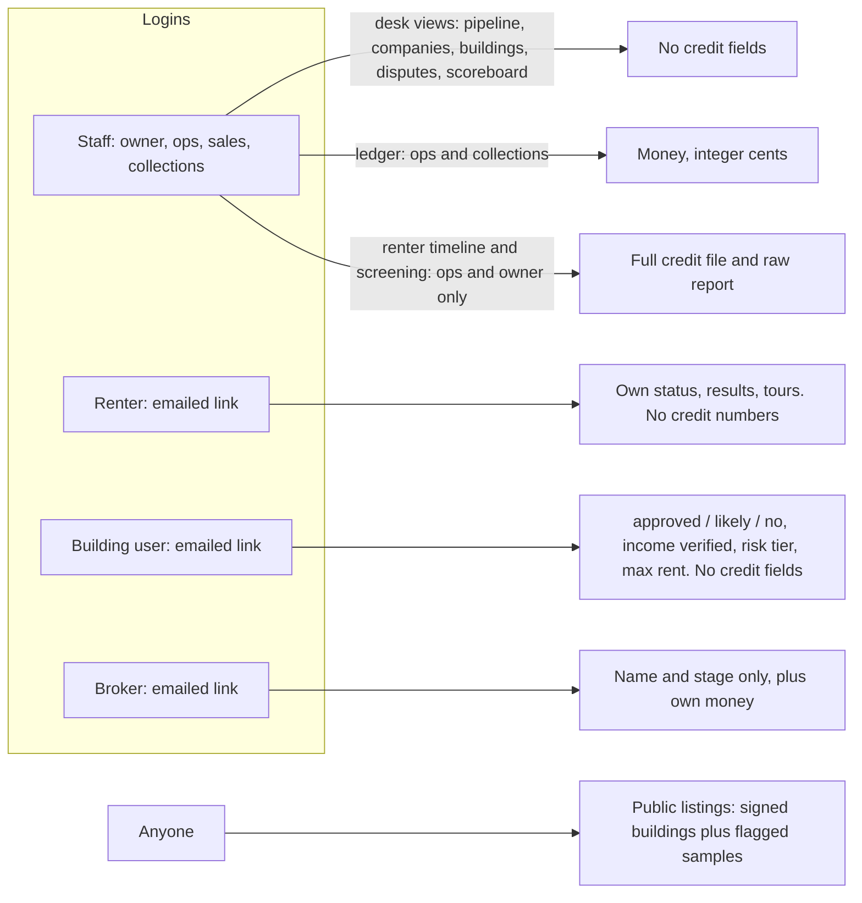

## 2. Signing in (renter, building user, broker)

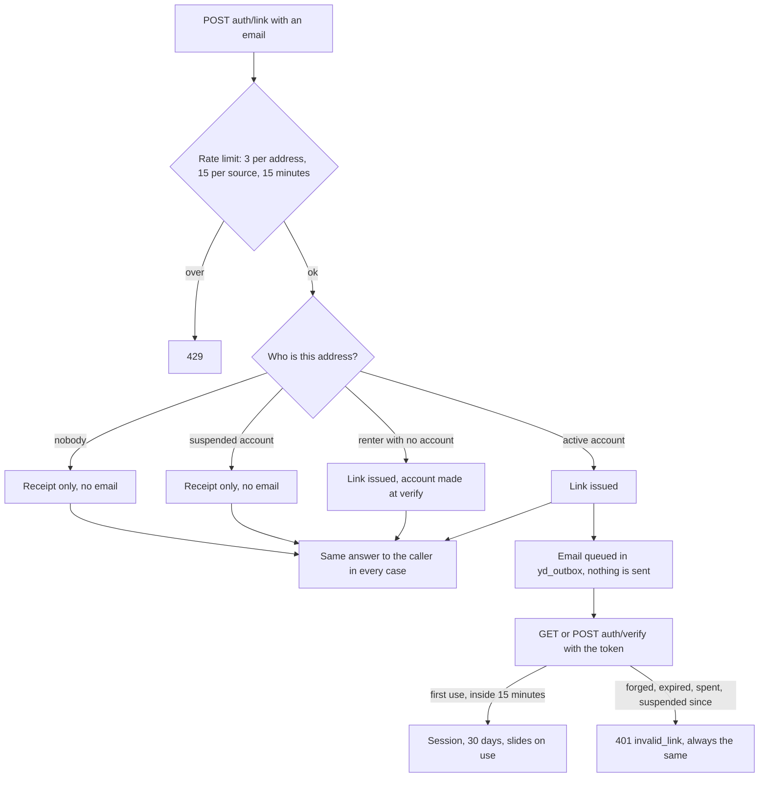

Staff do not use this. Staff sign in with the existing staff login and are checked by role.

## 3. Renter stage (`yd_renters.stage`)

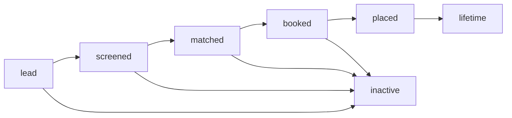

The database only checks that the stage is one of the seven values. What moves a renter, as far as code traced so far:

- `lead` to `screened` to `matched`: B3b, in `applyRenterProfile` (`src/yesdoor/store/matching.mjs`). A finished screening makes `screened`; at least one building answering approved or likely makes `matched`. It only ever moves forward along those two arrows; a `booked`, `placed`, `lifetime` or `inactive` renter keeps its stage when matches are recomputed. Every change writes a `renter.stage_changed` event.
- `matched` to `booked`, `booked` to `placed`, `placed` to `lifetime`, and anything to `inactive`: **UNVERIFIED, NOT BUILT YET (B4).** The arrows above are the spec's intent.

First touch (`source_kind`, `source_ad_id`, `source_broker_id`, `first_touch_at`) is written once. A trigger refuses any later change. A disagreement is decided on `yd_disputes`, never by editing the renter.

## 4. Application stage (`yd_applications.stage`), enforced

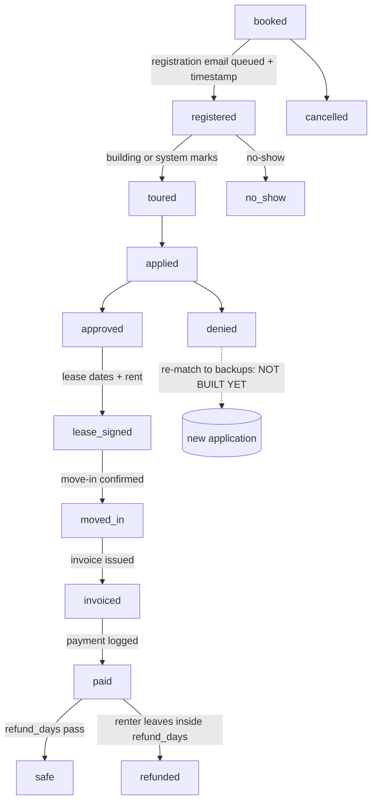

What the database holds on this path:

- A placement is created at `booked`, only at a building that has signed (see section 7), and only while the renter has fewer than 3 open applications.
- Only the arrows above are allowed (`yd_stage_move_ok`). Skipping a stage, going back, and leaving `no_show`, `denied`, `cancelled`, `safe` or `refunded` are all refused.
- `registered` and everything after it needs the registration timestamp and the queued message together. That timestamp is the proof of referral, and it never changes after it is set.
- `denied` needs a reason. `lease_signed` and later need the lease start, end and rent.
- Every move stamps that stage's own timestamp and writes one `yd_events` row, named `application.<stage>`. The creation writes `application.booked`.
- A building may mark a registration `known_prospect` with evidence (columns exist); opening the attribution dispute for it is B4.

"Open" means `booked`, `registered`, `toured`, `applied`, `approved` or `lease_signed`.

## 5. Fee (`yd_fee_ledger.status`), enforced

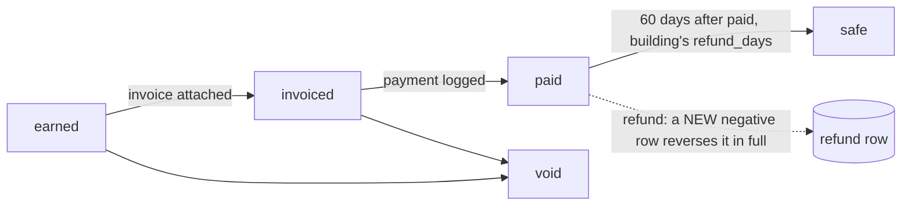

- Amount is bigint cents, positive for a fee and negative for a refund.
- The amount can be corrected only while `earned`. After that it is frozen. Identity and stamped times never change.
- A refund row must reverse one placement fee on the same application, for exactly its negation, once. The original row is left as it was.
- A fee is `safe` only `refund_days` (the building's, default 60) after `paid_at`.
- One placement fee per application. The idempotency key can never earn the same fee twice.
- A fee can be billed only on its own building's invoice, or its company's.

## 6. Broker money (`yd_broker_ledger.status`), enforced

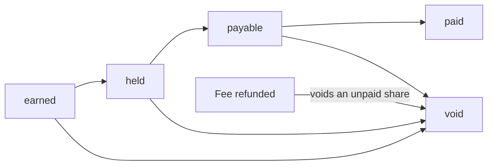

- A broker is paid only on a placement that broker first-touched (`yd_applications.broker_id`), never more than the fee.
- `payable` and `paid` wait until the building's fee is `safe`, and until `hold_until` has passed.
- A share already paid out is left alone when the fee is refunded. That clawback is for a person to decide (B4).

## 7. Who can be matched or booked

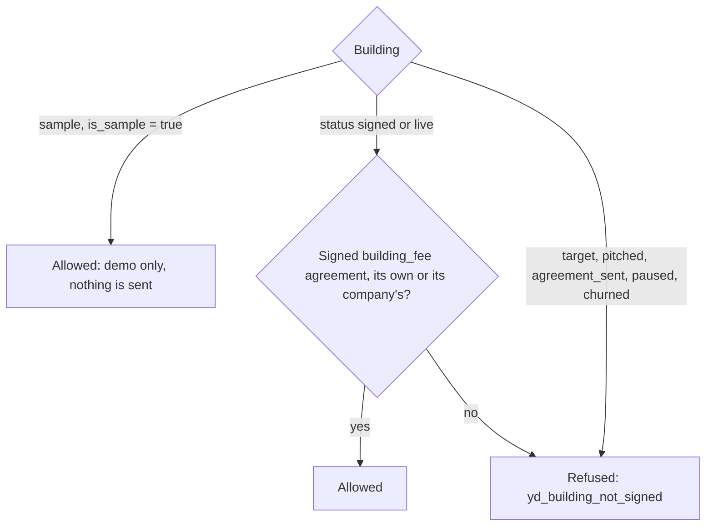

Agreements: `draft` to `sent` to `signed`, or `void` from any of them. Terms are fixed from the moment it is sent. A signed agreement is never edited.

## 8. Building status (`yd_buildings.status`)

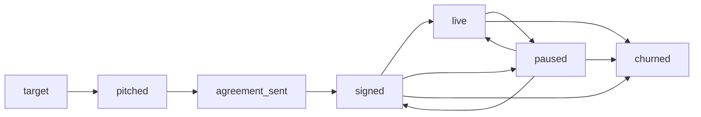

**UNVERIFIED:** the database checks the value is one of the seven, not the order of moves. Pausing a building after three mismatches in 90 days is B4 code, not built yet. Stale rules do NOT pause a building: the daily stale-rules cron only flags it and asks for a re-confirm (section 13), and the matcher caps its answers at "likely" until it confirms.

## 9. Money and records kept forever

Nothing in Yesdoor is deleted. `DELETE` and `TRUNCATE` are revoked from the app role on every `yd_` table, and consents, screenings, raw payloads, income checks, matches, rules, agreements, applications, tours, disputes, events, invoices, the fee ledger, the broker ledger and renter refunds also carry the `fundhub_no_delete()` trigger, which stops the table owner too. A finished screening is frozen; a re-check is a new row. Building rules are never edited; a change is a new version.

## 10. The funnel doors (B3b)

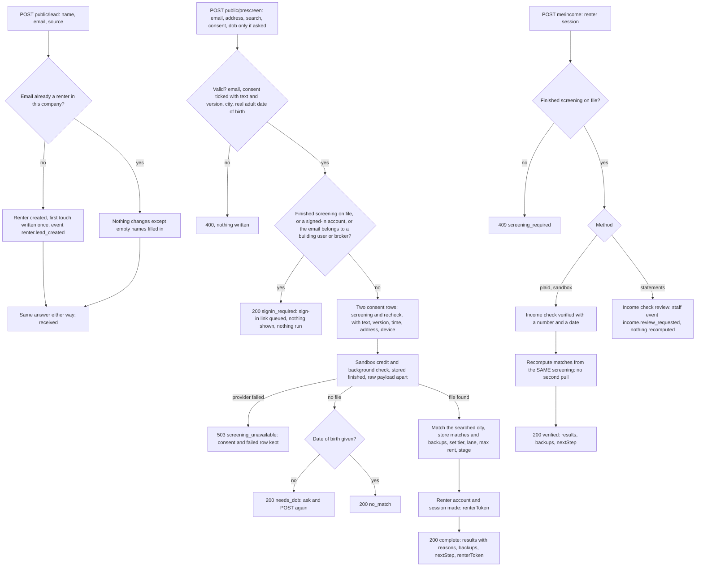

- The company is always the deployment's own (`YD_ORG_SLUG`), never a request field. The renter on `me/income` is read off the session, never the body.
- `public/lead` and `public/prescreen` are public. `me/income` needs a renter session (a staff, building or broker token is refused).
- A pre-screen is one transaction: consent, screening, matches and the renter's new stage and profile land together or not at all. Two at the same instant for one email: one runs, the other gets `signin_required`.
- The date of birth goes to the provider and nowhere else. No table holds it (a test scans every `yd_` table for a planted one).
- The `renterToken` is a session minted by `src/yesdoor/auth/session.mjs`, returned once, and only after a finished screening. `GET me`, `POST me/income` and (B4) `POST public/book` take it as `Authorization: Bearer`.
- First touch (an ad id, or an ACTIVE broker's tracking code) is written when the renter row is created. A second visit through another ad or broker changes nothing; the database also refuses an edit. A code that matches no active broker, a stated "broker" with no code, an "ad" with no id, or an unknown kind all become `direct`.

## 11. What a pre-screen decides (`src/yesdoor/store/matching.mjs` over `src/yesdoor/match/`)

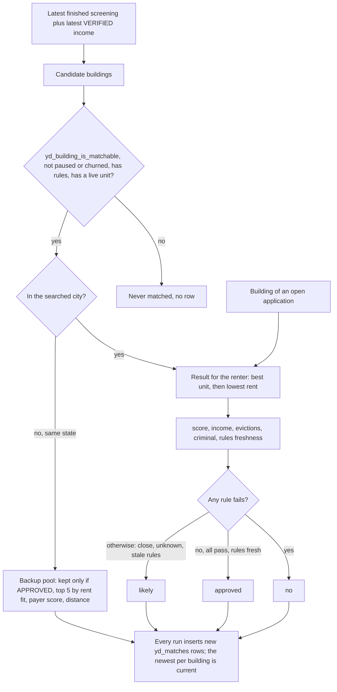

- Income unverified means the income rule is unknown, so nothing can be `approved` before income is verified: a prime file shows `likely` until the bank link, then `approved`.
- Max rent and tier: monthly income divided by the building's multiple (3 if none) is each building's max rent; "approved up to" is the highest of those among approved results in the searched city. Tier A needs verified income, so a prime file is B until then.
- The renter's answer carries per-rule reasons (their own file and the building's rules, in plain words). A building user only ever gets `buildingView`: answer, income verified, tier, max rent. A test reads both sides.
- **UNVERIFIED (not built):** `accepts_second_chance` on a building's rules is stored but the matcher does not read it yet, so a Second Chance renter can be approved on the numbers alone.

## 12. Re-check and lifetime touches (crons)

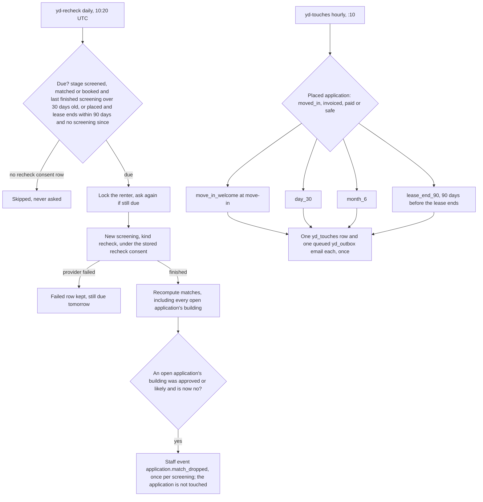

A refunded or cancelled application gets no touches. Two crons at the same moment queue one touch and one email per kind (unique index on application and kind). Nothing here sends: the email is a queued `yd_outbox` row. **UNVERIFIED:** no email-consent row is captured anywhere in the funnel yet (`yd_consents` has the kinds `email` and `sms`), so touches are queued without checking one.

## 13. Stale rules and the outbox (crons)

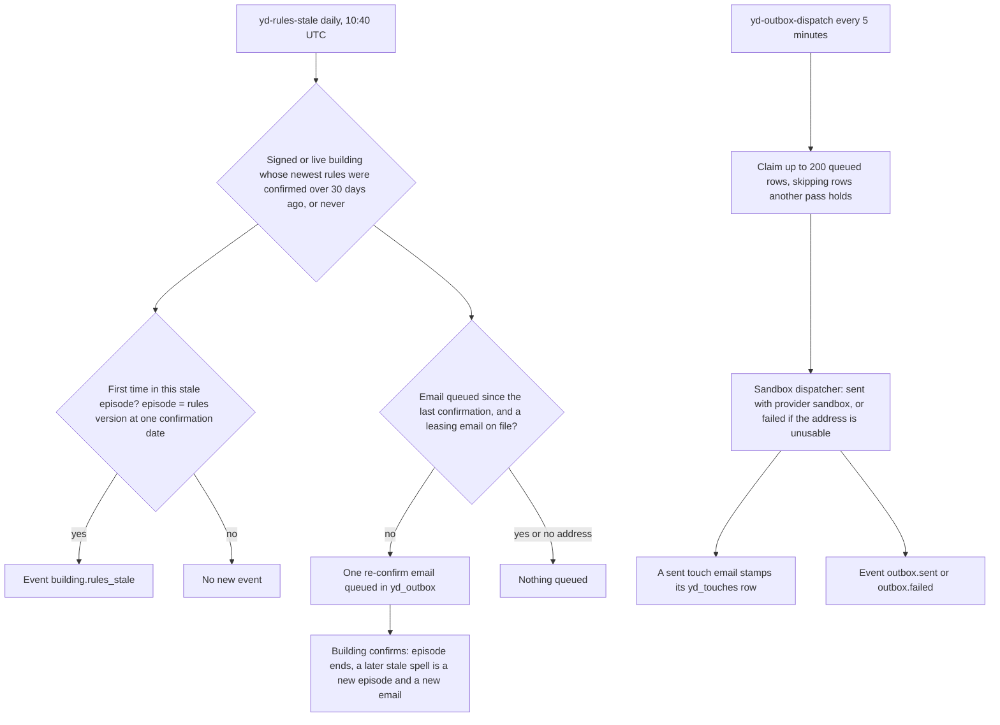

The stale-rules cron changes nothing about the building or its rules (spec §5: rules never change automatically). A failed row is final and keeps its reason in `context.dispatch_error`. Nothing in Yesdoor opens a network connection: guard tests read every source file for `fetch`, sockets and network modules.

## 14. Events written by B3b

| Event | Entity | When |
|---|---|---|
| `renter.lead_created` | renter | the renter row is created, with the first touch |
| `consent.captured` | renter | each pair of screening and recheck consent rows |
| `screening.complete`, `screening.no_match`, `screening.failed` | screening | a screening is stored (initial or recheck) |
| `prescreen.completed` | renter | the pre-screen finished; holds the search (city, state, beds, max rent) later recomputes reuse |
| `renter.matched` | renter | a matching run; counts of approved, likely, no and backups |
| `renter.stage_changed`, `renter.profile_updated` | renter | stage moved; lane, tier, max rent or income flag changed |
| `income.verified`, `income.review_requested`, `income.failed` | income_check | an income check is stored |
| `renter.rechecked` | renter | a re-check finished (reason: `stale_screening` or `lease_end_90`) |
| `application.match_dropped` | application | an open application's building went from approved or likely to no (names the failed rules, no credit numbers) |
| `touch.queued` | touch | a lifetime touch and its email were queued |
| `building.rules_stale` | building | a building entered a stale episode |
| `outbox.sent`, `outbox.failed` | outbox | the sandbox dispatcher moved a row |

Application stage moves keep writing their own `application.<stage>` events from the database trigger (section 4).
