# Yesdoor flow (what the database enforces today)

Status: **B2 (database + reads) and B4 (buildings, tours, money).** Written from the migrations and the code, not from the spec. Every arrow below is a rule the database holds in `db/migrations/434_yesdoor_core.sql`, `435_yesdoor_pipeline.sql`, `436_yesdoor_money.sql` or `437_yesdoor_cancel_after_registration.sql`, or a move that code in `src/yesdoor/store/` makes (named in the section). An arrow that only the spec draws, and nothing builds yet, is marked **NOT BUILT YET**.

Spec: `docs/specs/yesdoor-mvp-build-spec.md` (§3 draws these). Board: `ops/workflows/yesdoor-mvp-build-2026-10-07.md`.

Built in B4 (sections 10 to 15): onboarding companies and buildings, agreements and the signing link, the building portal writes (rules, units, spreadsheet and feed import, stage updates), booking and changing a tour, the move-in fee and invoice, payments, refunds, broker payouts, disputes, and the daily job that turns a paid fee safe.

Not built yet (arrives in B3b and F1): the pre-screen and matcher wiring, the sandbox CRS and Plaid calls from the public doors, the re-check, touches and stale-rules crons, the outbox dispatcher, the public lead door, and every screen. A broker sign-up door does not exist, so brokers are added by staff for now.

Deviation from spec §3 (migration 437): a renter who cancels after the building has been registered can now leave from `registered` and `toured`, not only from `booked`. Without that arrow a renter's cancelled tour kept holding one of their 3 open places.

## 1. Who sees what

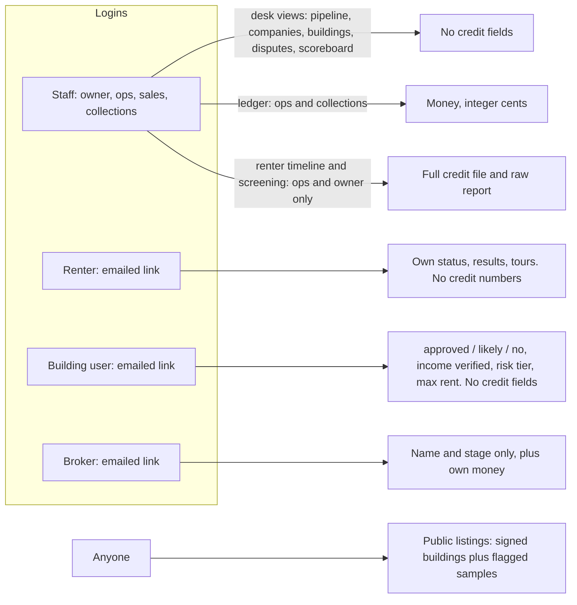

## 2. Signing in (renter, building user, broker)

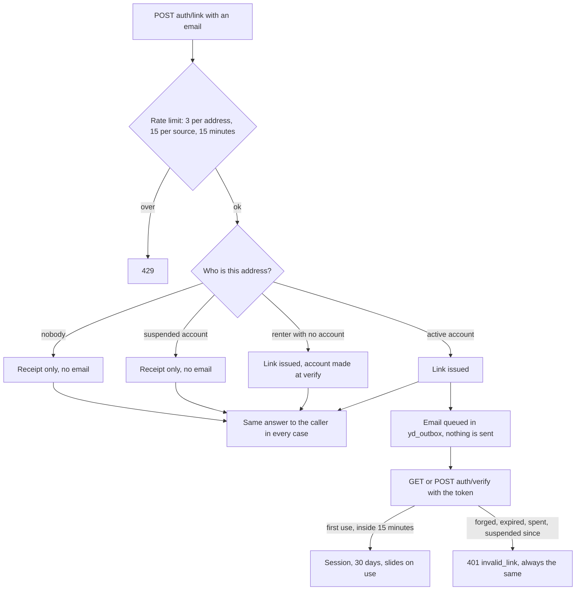

Staff do not use this. Staff sign in with the existing staff login and are checked by role.

## 3. Renter stage (`yd_renters.stage`)

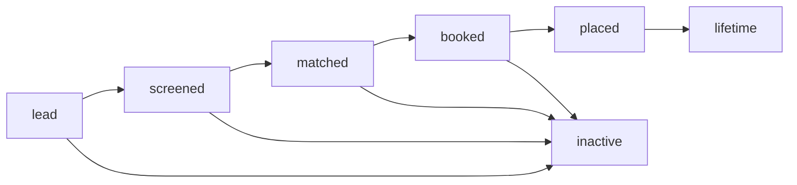

**UNVERIFIED:** the database only checks that the stage is one of the seven values, not the order. The code that moves it, as traced in B4: booking a tour sets `booked` (from `lead`, `screened` or `matched`); a move-in sets `placed`; cancelling the last open application sets `matched` again. `lead`, `screened`, `matched`, `lifetime` and `inactive` are B3b's (the pre-screen, the touches cron) and are not built yet.

First touch (`source_kind`, `source_ad_id`, `source_broker_id`, `first_touch_at`) is written once. A trigger refuses any later change. A disagreement is decided on `yd_disputes`, never by editing the renter.

## 4. Application stage (`yd_applications.stage`), enforced

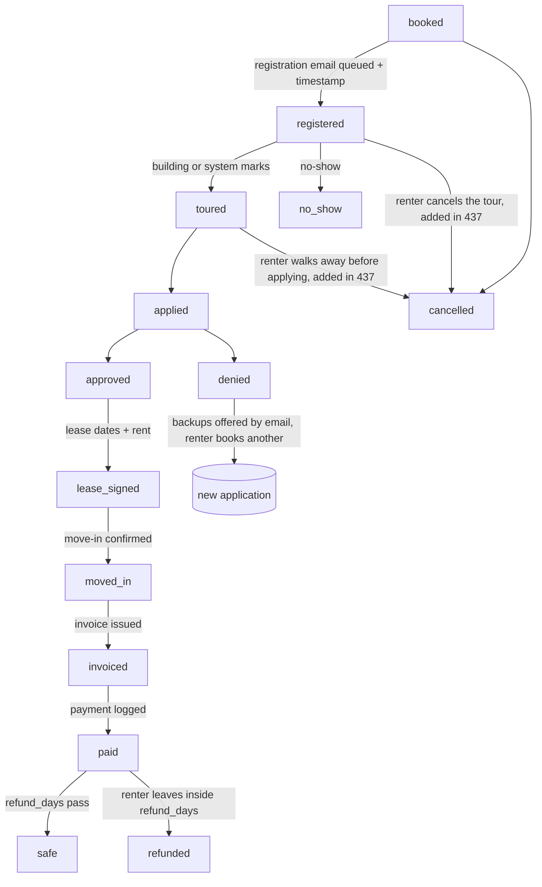

What the database holds on this path:

- A placement is created at `booked`, only at a building that has signed (see section 7), and only while the renter has fewer than 3 open applications.
- Only the arrows above are allowed (`yd_stage_move_ok`). Skipping a stage, going back, and leaving `no_show`, `denied`, `cancelled`, `safe` or `refunded` are all refused.
- `registered` and everything after it needs the registration timestamp and the queued message together. That timestamp is the proof of referral, and it never changes after it is set.
- `denied` needs a reason. `lease_signed` and later need the lease start, end and rent.
- Every move stamps that stage's own timestamp and writes one `yd_events` row, named `application.<stage>`. The creation writes `application.booked`.
- A building may mark a registration `known_prospect` with evidence, within 3 days of receiving it; that opens an attribution dispute (section 15).
- Who moves each stage (B4): booking makes `booked` then `registered` in one transaction (section 11). The building sets `toured`, `no_show`, `applied`, `approved`, `denied`, `lease_signed`, `moved_in` and `refunded` from its portal (sections 12 and 13). The system moves `moved_in` to `invoiced` when the fee is earned. Staff payment moves `invoiced` to `paid` (section 14). The daily job moves `paid` to `safe`. The renter moves `booked`, `registered` or `toured` to `cancelled`.

"Open" means `booked`, `registered`, `toured`, `applied`, `approved` or `lease_signed`.

## 5. Fee (`yd_fee_ledger.status`), enforced

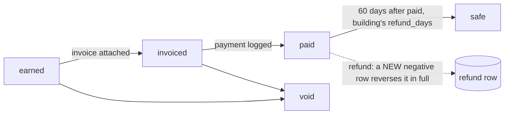

- Amount is bigint cents, positive for a fee and negative for a refund.
- The amount can be corrected only while `earned`. After that it is frozen. Identity and stamped times never change.
- A refund row must reverse one placement fee on the same application, for exactly its negation, once. The original row is left as it was.
- A fee is `safe` only `refund_days` (the building's, default 60) after `paid_at`.
- One placement fee per application. The idempotency key can never earn the same fee twice.
- A fee can be billed only on its own building's invoice, or its company's.

## 6. Broker money (`yd_broker_ledger.status`), enforced

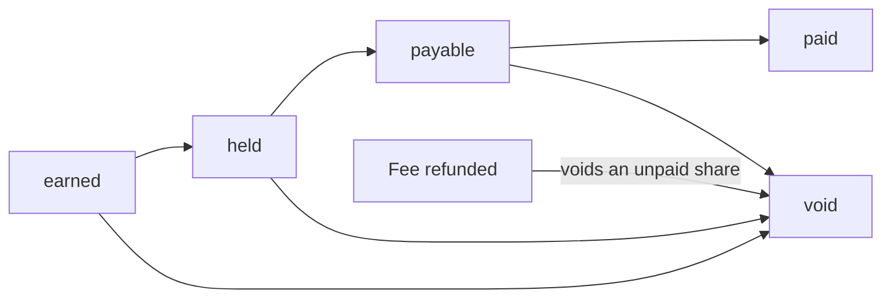

- A broker is paid only on a placement that broker first-touched (`yd_applications.broker_id`), never more than the fee.
- `payable` and `paid` wait until the building's fee is `safe`, and until `hold_until` has passed.
- A share already paid out is left alone when the fee is refunded. A `broker.clawback_needed` event is written so a person decides.
- B4 moves: `earned` when the placement fee is earned (a licensed split partner only: a software partner earns nothing); `held` when the building's payment is logged, until paid + the building's refund days; `payable` when the daily job makes the fee safe; `paid` when staff record a payout reference (the broker must be an active partner).

## 7. Who can be matched or booked

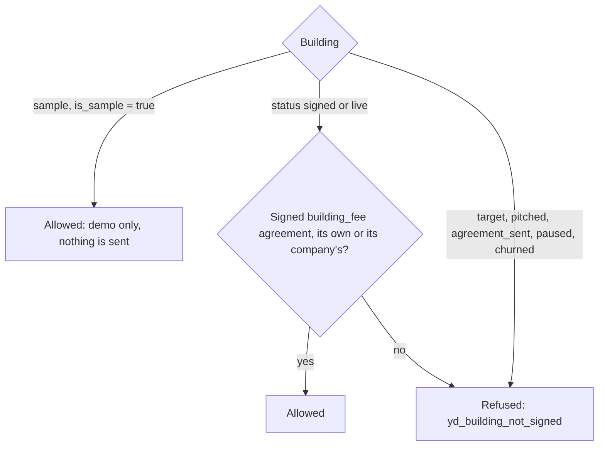

Agreements: `draft` to `sent` to `signed`, or `void` from any of them. Terms are fixed from the moment it is sent. A signed agreement is never edited.

## 8. Building status (`yd_buildings.status`)

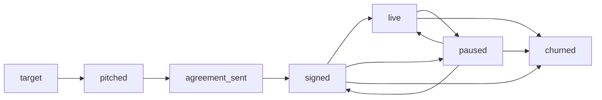

**UNVERIFIED:** the database checks the value is one of the seven, not the order of moves. The code that moves it (B4): sending an agreement sets `agreement_sent`; the signature sets `signed`; three "approved, then denied" in 90 days sets `paused` (section 12); voiding a signed agreement sets `paused`; staff may pause, resume (needs a signed agreement), churn, or move `target` and `pitched` by hand. `signed` and `agreement_sent` are never set by hand. Pausing for stale rules is B3b's cron and is not built yet.

## 9. Money and records kept forever

Nothing in Yesdoor is deleted. `DELETE` and `TRUNCATE` are revoked from the app role on every `yd_` table, and consents, screenings, raw payloads, income checks, matches, rules, agreements, applications, tours, disputes, events, invoices, the fee ledger, the broker ledger and renter refunds also carry the `fundhub_no_delete()` trigger, which stops the table owner too. A finished screening is frozen; a re-check is a new row. Building rules are never edited; a change is a new version.

## 10. Onboarding a building and signing the agreement (B4)

Code: `src/yesdoor/store/supply-writes.mjs`, `agreements.mjs`. Doors: `POST staff/companies`, `POST staff/buildings`, `POST staff/agreement`, `POST webhooks/esign`. Staff roles: ops and sales (the owner always).

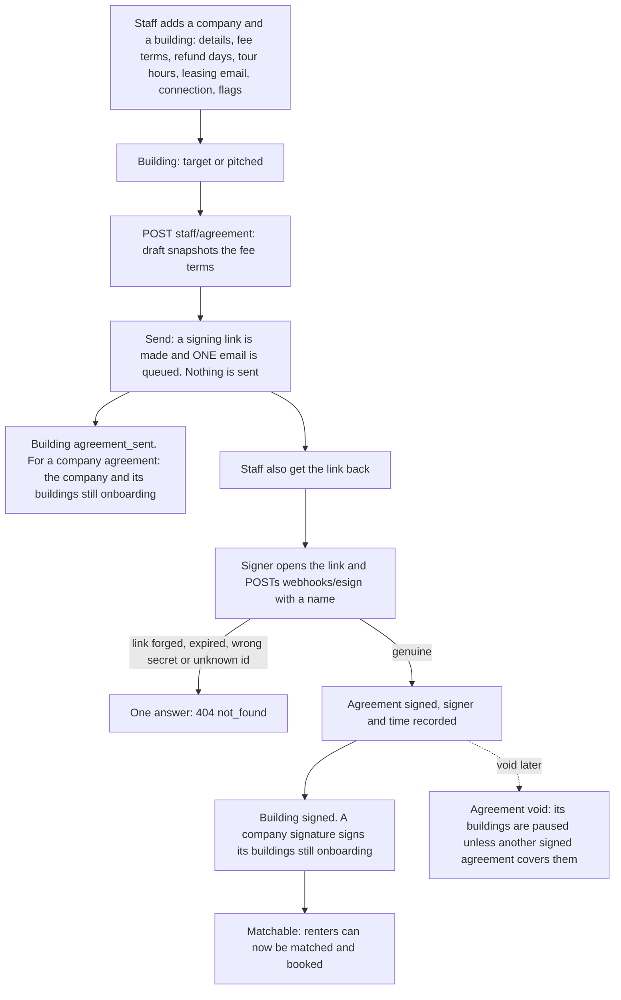

- Sample buildings and companies cannot be sent an agreement.
- Without `YD_LINK_SECRET` (32 characters or more) sending fails closed with a 503 and changes nothing.
- A broker partner agreement is signed the same way; the broker becomes `active` once signed, and (for a split partner) once the licence is verified.
- An application fee nobody told us stays unknown (null), never 0.

## 11. Booking a tour (B4)

Code: `src/yesdoor/store/booking.mjs`. Doors: `POST public/book` (renter token), `POST me/tour` (renter session).

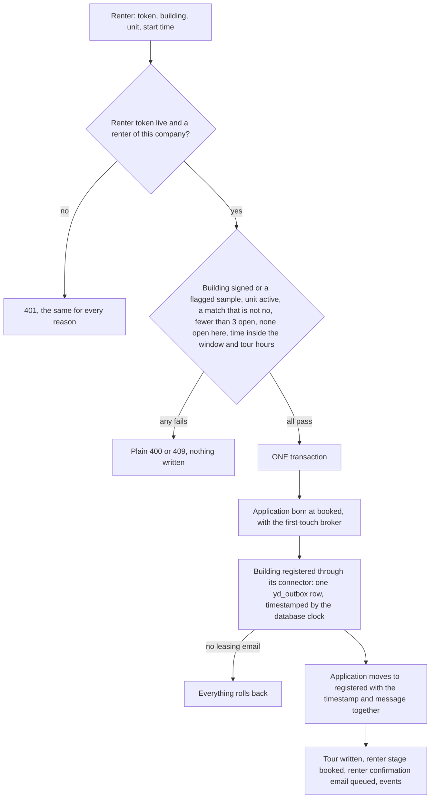

- The renter can reschedule (a new time, same rules) or cancel (tour and placement cancelled, one open place freed, the registration timestamp kept, the building gets a queued notice).
- A building that said no to this renter in the last 90 days is not booked again.

## 12. A building moves a renter along, and a denial after "approved" (B4)

Code: `src/yesdoor/store/placements.mjs`. Door: `POST building/update` (building user, only at their own buildings; anything else is a 404).

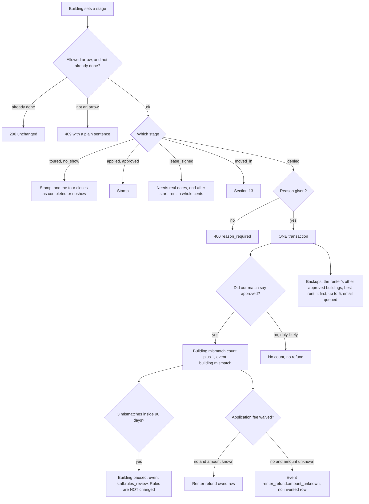

## 13. Moving in earns the fee (B4)

Code: `src/yesdoor/store/fee-ledger.mjs`.

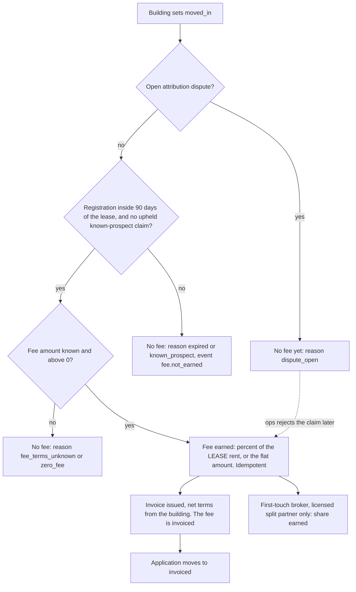

## 14. Payment, safe, refund, payout (B4)

Code: `src/yesdoor/store/money.mjs`, `src/yesdoor/workflows/yd-fee-safe.mjs`. Doors: `POST staff/payment`, `POST staff/refund`, `POST staff/broker-payout` (ops and collections, the owner always).

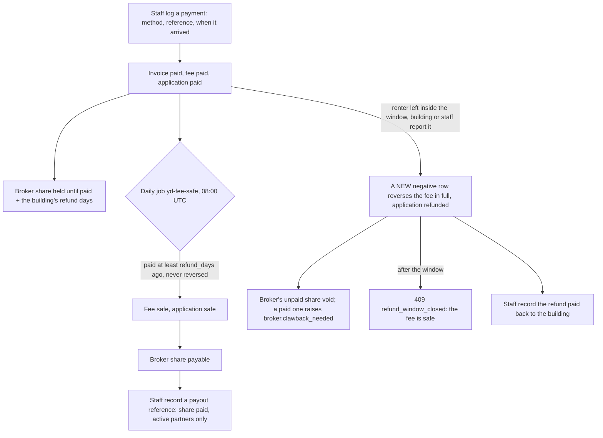

- A renter's application fee owed back (section 12) is marked paid through the same payment door.
- The database checks the clock for `safe` and for a broker being payable; the job only asks for moves it allows.

## 15. Disputes (B4)

Code: `src/yesdoor/store/disputes.mjs`. Door: `POST staff/disputes`. Open: ops, sales, collections. Decide: ops and the owner. Due 14 days after it opens. "Upheld" means whoever opened it was right.

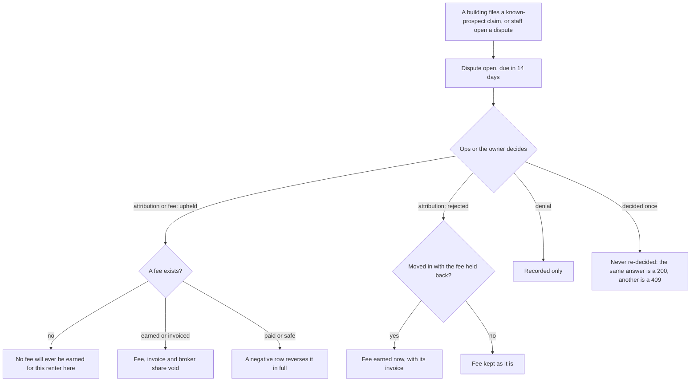
