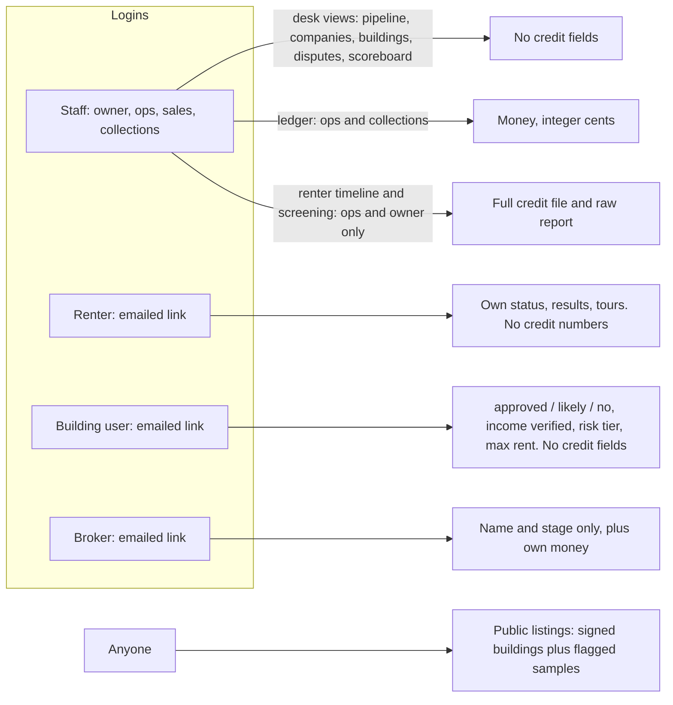
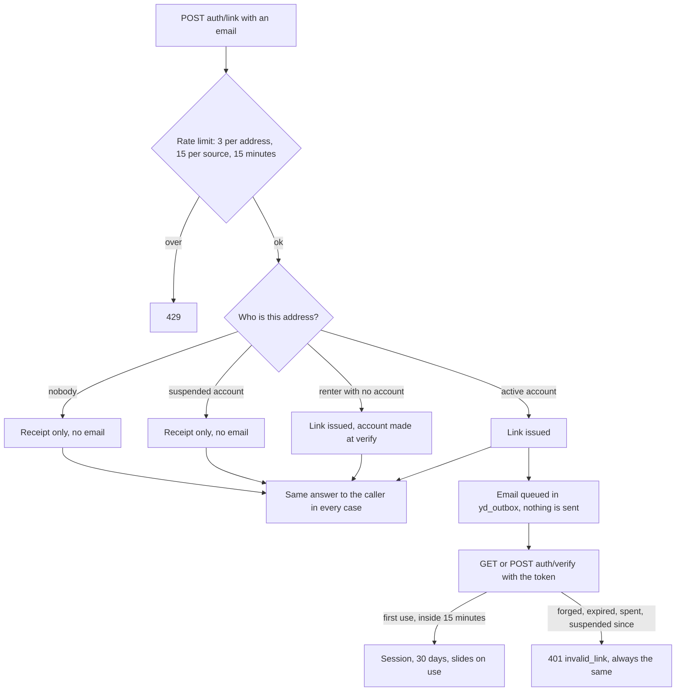
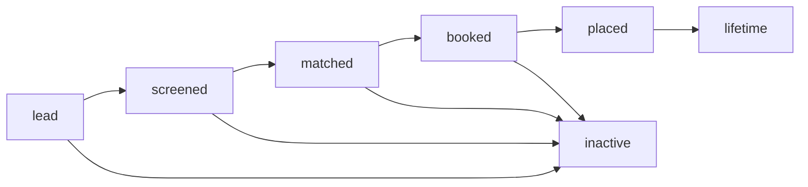
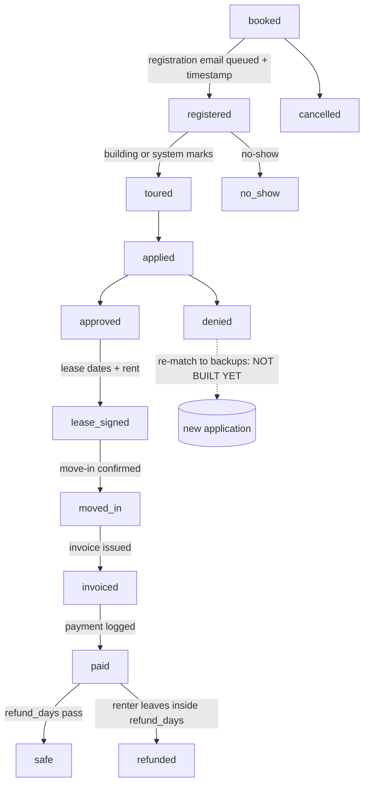
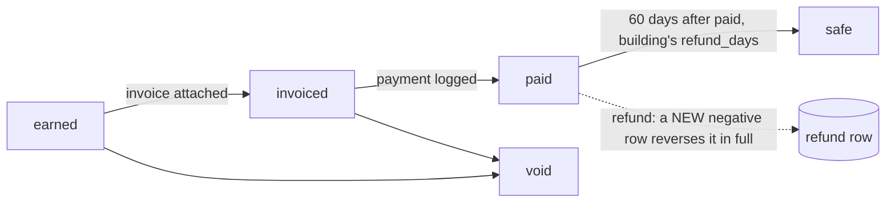
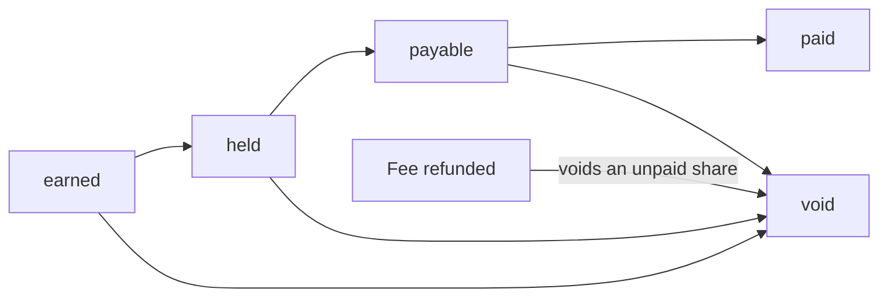
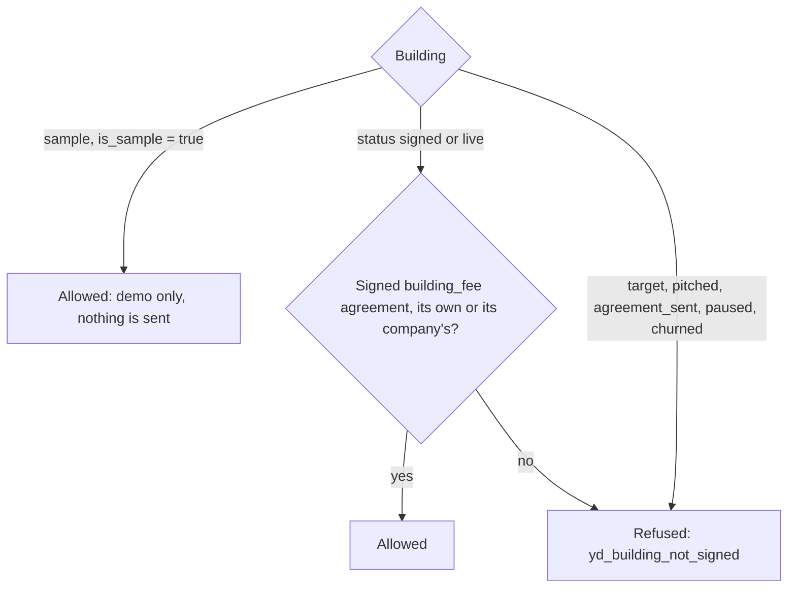
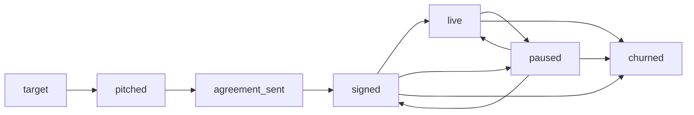

# Yesdoor flow (what the database enforces today)

Status: **B2 (database + reads).** Written from the migrations, not from the spec. Every arrow below is a rule the database holds in `db/migrations/434_yesdoor_core.sql`, `435_yesdoor_pipeline.sql` or `436_yesdoor_money.sql`. An arrow that only the spec draws, and the database does not hold yet, is marked **NOT BUILT YET**.

Spec: `docs/specs/yesdoor-mvp-build-spec.md` (§3 draws these). Board: `ops/workflows/yesdoor-mvp-build-2026-10-07.md`.

Not built yet (arrives in B3 and B4): the pre-screen and matcher, the sandbox CRS and Plaid, the crons, every POST except the sign-in link, the building portal writes, tours and registration emails going out, invoices being made at move-in, payouts, disputes being opened and decided.

## 1. Who sees what

## 2. Signing in (renter, building user, broker)

Staff do not use this. Staff sign in with the existing staff login and are checked by role.

## 3. Renter stage (`yd_renters.stage`)

**UNVERIFIED:** the database only checks that the stage is one of the seven values. Which event moves a renter from one to the next is B3/B4 code, not built yet. The arrows above are the spec's intent.

First touch (`source_kind`, `source_ad_id`, `source_broker_id`, `first_touch_at`) is written once. A trigger refuses any later change. A disagreement is decided on `yd_disputes`, never by editing the renter.

## 4. Application stage (`yd_applications.stage`), enforced

What the database holds on this path:

- A placement is created at `booked`, only at a building that has signed (see section 7), and only while the renter has fewer than 3 open applications.
- Only the arrows above are allowed (`yd_stage_move_ok`). Skipping a stage, going back, and leaving `no_show`, `denied`, `cancelled`, `safe` or `refunded` are all refused.
- `registered` and everything after it needs the registration timestamp and the queued message together. That timestamp is the proof of referral, and it never changes after it is set.
- `denied` needs a reason. `lease_signed` and later need the lease start, end and rent.
- Every move stamps that stage's own timestamp and writes one `yd_events` row, named `application.<stage>`. The creation writes `application.booked`.
- A building may mark a registration `known_prospect` with evidence (columns exist); opening the attribution dispute for it is B4.

"Open" means `booked`, `registered`, `toured`, `applied`, `approved` or `lease_signed`.

## 5. Fee (`yd_fee_ledger.status`), enforced

- Amount is bigint cents, positive for a fee and negative for a refund.
- The amount can be corrected only while `earned`. After that it is frozen. Identity and stamped times never change.
- A refund row must reverse one placement fee on the same application, for exactly its negation, once. The original row is left as it was.
- A fee is `safe` only `refund_days` (the building's, default 60) after `paid_at`.
- One placement fee per application. The idempotency key can never earn the same fee twice.
- A fee can be billed only on its own building's invoice, or its company's.

## 6. Broker money (`yd_broker_ledger.status`), enforced

- A broker is paid only on a placement that broker first-touched (`yd_applications.broker_id`), never more than the fee.
- `payable` and `paid` wait until the building's fee is `safe`, and until `hold_until` has passed.
- A share already paid out is left alone when the fee is refunded. That clawback is for a person to decide (B4).

## 7. Who can be matched or booked

Agreements: `draft` to `sent` to `signed`, or `void` from any of them. Terms are fixed from the moment it is sent. A signed agreement is never edited.

## 8. Building status (`yd_buildings.status`)

**UNVERIFIED:** the database checks the value is one of the seven, not the order of moves. Pausing for stale rules or three mismatches in 90 days is B3 code, not built yet.

## 9. Money and records kept forever

Nothing in Yesdoor is deleted. `DELETE` and `TRUNCATE` are revoked from the app role on every `yd_` table, and consents, screenings, raw payloads, income checks, matches, rules, agreements, applications, tours, disputes, events, invoices, the fee ledger, the broker ledger and renter refunds also carry the `fundhub_no_delete()` trigger, which stops the table owner too. A finished screening is frozen; a re-check is a new row. Building rules are never edited; a change is a new version.
