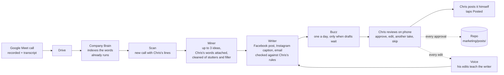
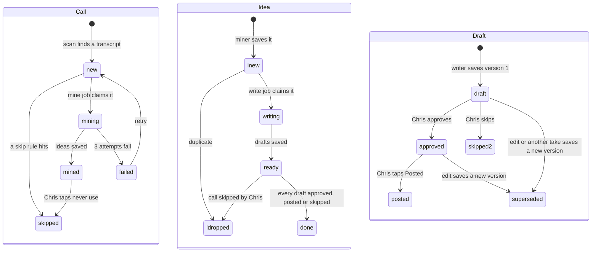

# Calls to Content: build spec

**Version 1 · 2026-10-09 · Owner: Chris · For: Claude Code**

Version 1.1, same day: the miner reads Chris's cleaned words (learning loop spec `docs/specs/learning-loop-2026-10-09.md` §5.3).

Chris saw Scott Oldford's "Calls to Content" (youalreadysaidit.com) in an Instagram ad on 2026-10-08 and said "build." This is Fundhub's own version, built inside this repo on top of what already runs.

Two files make up this build:
- `docs/specs/calls-to-content-2026-10-09.md` (this file)
- `ops/workflows/calls-to-content-2026-10.md` (the shared board)

## The goal

**Chris already explains his best ideas on Google Meet calls. Turn those calls into posts and emails in his voice, so he never writes from a blank page.**

- **In:** Fundhub's recorded Google Meet calls.
- **Out:** a Facebook post, an Instagram caption and an email for each good idea Chris said on a call, written from his own words, with the spot in the call attached so he can check it.
- **Chris's whole job:** read the drafts on his phone, then approve, edit, ask for another take, or skip. He posts and sends them himself.

**Top rule.** Chris's word beats any written rule (law: `.claude/rules/chris-word-wins.md`).

## Contents

0. How to run this build
1. What we're building
2. Owner decisions (law for this build)
3. What already exists (reuse it)
4. Traps
5. Back end
6. The state diagram
7. Front end (last)
8. The whole thing is done when…
9. Only Chris
10. Decisions (defaults)
11. Later, after this build

---

## 0. How to run this build

### 0.1 Gates

Approving this spec covers these CLAUDE.md gates:
- §0 (the split is 0.2 below)
- §1 (the model check; each workflow still prints its `Model:` line)
- §2 (nothing unrequested; this spec is the request)
- §3 steps 3–4 (this spec is the plan)
- §3a step 1 (the workflow questions; §10 holds the answers as defaults)

The order is law (`.claude/rules/build-spec-then-backend-then-frontend.md`): spec → Chris perfects it → back end proven → spec revised if the truth moved → front end last.

Workflows stop for only three things: an item in §9 or §10, a STOP AND ASK from the intended journey (CLAUDE.md §4), or a hard-rule conflict.

### 0.2 The split

| Workflow | Owns | Model | Starts |
|---|---|---|---|
| **W1** | This spec and the board | Opus | done (this chat) |
| **W2** | §5.1 source proof, §5.2 migration, §5.6 read endpoint + its test | Opus | after Chris approves |
| **W3** | §5.4 post rules file, §5.5 post checker, §5.8 allow-list line | Sonnet | after Chris approves, same time as W2 |
| **W4** | §5.3 jobs, §5.4 the miner, §5.5 the writer, the clock hook, the buzz | Opus | after W2, W3 and the learning loop's L2 (the word cleaner) merge |
| **W5** | §5.6 action routes, §5.7 repo files, pulse rows | Sonnet | after W2 merges, same time as W4 |
| **W6** | §7 the screen | Sonnet (Claude only, law: `grok-no-displays.md`) | after W4 and W5 are proven live and this spec is revised |

**What runs at the same time:** W2 and W3. Then W4 and W5. Then W6.

**Real dependencies:**
- W4 needs W2's tables and W3's checker, and the word cleaner from the learning loop build (`docs/specs/learning-loop-2026-10-09.md` §5.3, workflow L2).
- W5 needs W2's tables, and the word cleaner (learning loop L2) for the quote route.
- W6 needs the back end proven (law).

The copy-paste prompts for W2–W6 are on the board. Each one stands on its own.

### 0.3 Migration numbers

This build uses **438–441**. The marketing machine keeps 413–423 and 425–429 for its own lanes.

### 0.4 Tests and the database

Same as the marketing machine spec §0.7: never run pg tests against the `DATABASE_URL` in `.env`. Use CI's database or a scratch database (`createdb fh_c2c`, migrate, test). Chris pre-approves scratch use with this spec.

---

## 1. What we're building

**What Chris does:**
- picks his speaker name once (§9)
- reviews the first 9 drafts so the voice is right (§10 decision 7)
- after that, reviews drafts when the buzz comes, and posts the ones he likes

**Where the words come from.** Each draft is written from what Chris actually said on the call. The writer may not add a claim, a number or a story that isn't in his words from that call or in RULES.md's allowed proof. The source lines stay attached to the draft.

**His words are cleaned first.** Stutters, filler and false starts come out before the miner sees them, and nothing is added (learning loop spec §5.3). The exact words are kept next to the cleaned ones so anyone can check.

**How this sits next to the marketing machine.** Marketing machine §7.10 ("real words") reads what *clients* say on calls to shape ad scripts. This build reads what *Chris* says on calls to write posts and emails. Both read the same transcripts.

---

## 2. Owner decisions (law for this build)

1. **The source is Fundhub's recorded Google Meet calls** (Chris, 2026-10-08: "We record our Google meetings").
2. **The teleprompter app is not part of this build.** The teleprompter is for filming ads and content (Chris, 2026-10-08). Drafts are reviewed on their own page (§7).
3. **Spec, then back end, then front end** (CLAUDE.md §3a, `build-spec-then-backend-then-frontend.md`).
4. **Everything lands in the repo** (CLAUDE.md §3b). Approved drafts are saved under `marketing/posts/`.
5. **Chris's copy rules apply to every draft:** RULES.md Part 0, word for word.
6. **No stutters or filler in copy** (Chris, 2026-10-09: "I don't want to be stuttering"). Chris's lines go through the word cleaner before the miner sees them, and the cleaned words are what every draft is written from.

---

## 3. What already exists (reuse it)

| Piece and where | What it gives this build | Watch out |
|---|---|---|
| **Company Brain Drive index:** `brain_files`, `brain_chunks` (migration 130), `src/company-brain/*`. Owner-set H-2: index everything. | Every Drive file the brain can read, with its text in `brain_chunks` (ordered by `chunk_index`). | It only sees the Drive its token or service account can read (`config.mjs`). See trap 3. |
| **Meet words:** `src/company-brain/meet-transcript.mjs` (`pairMeetTranscripts`, `whisperOnePending`, `applyMeetWords`), run every 10 minutes by `src/workflows/meet-transcript-sweeper.mjs` | A recording's words: a sibling transcript doc first, Whisper for short files. | See traps 1 and 2. |
| **Meet names:** `src/company-brain/meet-title.mjs` (`meetTitleStem`, `looksLikeTranscriptName`, `looksLikeMeetRecordingName`, `meetStartFromName`, `meetKindFromName`) | The call's title, start time and kind (sales / csm) from the file name. | `meetStartFromName` returns null on any other name shape. Never guess a time zone. |
| **Call stamping:** `src/sales/recordings.mjs` (`stampCallTranscript`) | Links a call to a client when the file name has the client's name. | Read only. This build never changes it. |
| **Scrubber:** `src/clients/scrub.mjs` | Removes SSN, card, account and token-shaped strings from free text. | It does not remove names. §5.4 adds the name pass. |
| **Model calls:** `src/agents/model.mjs` `callModel` | One client for Claude and OpenAI. M0 step 4 added `provider`, `timeoutMs`, `cache`, `tools` and `toolChoice`. | Without `provider: 'anthropic'` it switches to OpenAI whenever an unmasked OpenAI key is in `env`. Always pass it. |
| **Job queue, worker, clock:** `marketing_jobs` (407, 410), `src/marketing/jobs.mjs`, `worker.mjs`, `clock.mjs`, `handlers.mjs` (`JOB_HANDLERS`), `netlify/functions/marketing-clock.mjs` (every 15 min) and `marketing-worker-background.mjs` | Queue a job with a slot so it runs once; claim, run, retry three times. | The clock only reads and queues (30-second limit). Real work runs in the worker. |
| **Repo outbox:** `repo_outbox` (406), `src/repo/outbox.mjs`, `src/repo/allow-list.mjs`, `src/marketing/repo-writes.mjs` (`enqueueRepoWrite`) | Saves files to GitHub from the app. | `marketing/posts/` is not on the allow-list yet. §5.8 adds it. |
| **Buzzes:** `marketing_buzzes`, `src/marketing/notify.mjs` (`queueBuzz`, `BUZZ_TITLES`, quiet hours) | Phone buzz, held during quiet hours. | Add one new kind, `content_ready`. |
| **Model cost log:** `marketing_model_usage` (407), written by `recordMarketingUsage` in `src/marketing/model-usage.mjs` | Every model call's tokens and cost. | It has no purpose column. Content calls log their `job_id`, and the job's `kind` (`content_…`) tells them apart. |
| **Copy rules:** `marketing/ads/RULES.md` (Part 0 at line 29), `marketing/ads/VOICE.md`, `marketing/ads/rules-data.mjs` (`NEVER_SAY`, `BANNED_PHRASES`, `BANNED_WORDS`, `BANNED_OPENERS`, `AVOID_PHRASES`), `scripts/ads/check-script.mjs` | Chris's rules and the banned-phrase lists. | `checkOneScript` is built for ad scripts (word floors, close promises). Posts need their own check (§5.5) that reuses the lists. |
| **Posts folder:** `marketing/posts/README.md` | "Organic social posts go here, one file per post." | Empty today. |
| **Roles:** `ROLE_SETS.MARKETING` in `src/http/read-api.mjs` (owner, admin) | Who can use the routes. | |
| **Routes:** the `ROUTES` map in `netlify/functions/api.mjs` | | A handler file is not a route (CLAUDE.md §12). |
| **Pulse:** `src/pulse/registry.mjs` | Every new route and job is watched. | Same change as the feature (law: `pulse-registry.md`). |
| **Word cleaner:** `src/words/clean.mjs` (`cleanSpoken`, `isDeletionOnly`) and `src/words/unchunk.mjs` (`textFromChunks`), built by the learning loop (its spec §5.3, workflow L2) | Chris's lines with stutters, filler and false starts taken out, plus a map from each kept word back to the exact words. | It only removes words. Pass the words area's lists from `loop_areas.config` (`extra_fillers`, `keep_words`) once the learning loop's migration 442 lands; empty lists until then. |

---

## 4. Traps

1. **Whisper text has no speaker names.** `whisper-1` returns plain text. A call whose only words came from Whisper can't tell Chris's lines from anyone else's.
2. **Gemini notes are a summary.** `looksLikeTranscriptName` matches both "Transcript" and "Gemini notes", so `pairMeetTranscripts` can attach a Gemini summary as a call's words. The miner needs Chris's actual words, so it reads only a verbatim transcript with speaker names.
3. **Recordings land in the Drive of whoever started the meeting.** If a closer or CSM starts the Meet, the recording and transcript sit in their Drive. The brain reads only the Drive it has access to. W2 proves which calls actually reach `brain_files` before anything is built (§5.1).
4. **Long calls never go through Whisper.** Files over `WHISPER_MAX_BYTES` (24 MB) wait for Google's transcript doc. Most real calls are long, so the transcript doc is the source that matters.
5. **Don't hold a transaction open across a model call** (marketing machine spec §4 trap 3). Read, close, call the model, then write.
6. **Speaker label format.** Nobody in this repo has parsed a Meet transcript's speaker labels yet. The parser is written from real transcripts that W2 saves as scrubbed test fixtures. Do not write it from memory.
7. **The marketing clock is off while `enabled` is false.** Content gets its own switch (§5.2) so it can run before the script machine is turned on.
8. **Text joined from `brain_chunks` repeats itself.** Chunks overlap by 200 characters (`src/company-brain/chunk.mjs`), so a plain join repeats about 200 characters at every joint. Rebuild a transcript with `textFromChunks` before counting or cleaning words.

---

## 5. Back end

### 5.1 Prove the source first (W2, before any code)

Run these against the live database read-only, then write the answers on the board:

1. How many Meet transcript docs are in `brain_files` from the last 14 days (`looksLikeTranscriptName` and not Gemini notes)? How many Meet recordings (`looksLikeMeetRecordingName`)? How many recordings have no transcript doc?
2. Open two recent transcripts. Write down the exact speaker label format and every speaker name in them.
3. Do sales calls, CSM calls and Chris's own calls all show up, or only calls Chris started?

Save the two transcripts, scrubbed (names swapped for "Chris" and "Person 1", "Person 2"), as fixtures in `src/content/fixtures/`.

**STOP AND ASK** if step 1 finds zero transcript docs, or if step 3 shows team calls are missing. Both become §9 items for Chris.

### 5.2 Schema (W2, migration 438)

Same row-level security pattern as migration 407's marketing tables. Grants to `fundhub_app`.

**New columns on `marketing_settings`**

| Column | Type | Default |
|---|---|---|
| `content_enabled` | boolean | false (on once Chris picks his speaker name) |
| `content_speaker_names` | text[] | `{}` (Chris picks once, §9) |
| `content_channels` | text[] | `{facebook,instagram,email}` |
| `content_ideas_per_call` | int | 3 |
| `content_daily_cap` | int | 5 (new ideas per day) |
| `content_min_words` | int | 600 (Chris's words on the call) |
| `content_buzz_time` | text `HH:MM` | `08:00` |
| `content_month_cost_usd` | numeric | 100 |
| `content_skip_title_words` | text[] | `{}` |
| `content_calibrated` | boolean | false |

CHECKs: channels only from `facebook`, `instagram`, `email`; counts > 0; time matches `HH:MM`; cost ≥ 0.

**`content_calls`** — one row per Meet call the scan looked at.
- `id`, `org_id`, `brain_file_id` (the transcript doc, FK `brain_files`), `recording_brain_file_id` (nullable), `title`, `started_at` (from `meetStartFromName`, nullable), `meet_kind` (`sales` | `csm` | null, from `meetKindFromName`), `speakers` (jsonb: name → word count), `chris_words` (int)
- `status`: `new` | `mining` | `mined` | `skipped` | `failed`
- `skip_reason`: `no_speaker_names` | `chris_not_on_call` | `too_short` | `title_skip_word` | `owner_skipped` | null
- `ideas_count`, `error`, `mined_at`, timestamps
- Unique on (`org_id`, `brain_file_id`).
- CHECK: `status = 'skipped'` requires `skip_reason`.

**`content_ideas`** — one row per idea the miner found.
- `id`, `org_id`, `call_id` (FK)
- `kind`: `point` | `story` | `question` | `objection`
- `title` (a few words), `summary` (one or two sentences)
- `quote` (Chris's words from the call, scrubbed and cleaned: what the writer uses), `quote_raw` (the same passage exactly as spoken, scrubbed), `quote_fixed` (Chris's fix to the cleaning, nullable), `quote_fixed_at` (nullable), `prospect_line` (the question or objection he answered, scrubbed, nullable), `at_seconds` (where it starts in the call, nullable)
- `status`: `new` | `writing` | `ready` | `done` | `dropped`
- `drop_reason` (`duplicate` | `daily_cap_expired` | `owner_skipped_call` | null), `rules_sha`, timestamps
- CHECK: `kind IN ('question','objection')` requires `prospect_line`.

**`content_drafts`** — one row per version of a draft. Every edit keeps the old version.
- `id`, `org_id`, `idea_id` (FK), `root_draft_id` (the first version's id; equals `id` on version 1), `version` (int, starts at 1)
- `channel`: `facebook` | `instagram` | `email`
- `subject` (email only), `body`
- `status`: `draft` | `approved` | `posted` | `skipped` | `superseded`
- `source`: `machine` | `chris`
- `check_results` (jsonb), `flagged` (boolean: still failed a check after the loop), `take_note` (Chris's note for another take, nullable), `make_rule` (text Chris turned into a rule, nullable)
- `approved_at`, `approved_by`, `posted_at`, `posted_url` (nullable), `skipped_at`, `repo_path`, `repo_commit`, timestamps
- Unique on (`root_draft_id`, `version`).
- One live version per root: partial unique index on `root_draft_id` where `status <> 'superseded'`.
- CHECK: `channel = 'email'` requires `subject`; other channels require `subject IS NULL`.
- CHECK: `status = 'posted'` requires `posted_at`.

**`v_content_voice_pairs`** (view): every draft version Chris edited, as `before` (the version he edited) and `after` (his version), with `root_draft_id`, both version numbers, channel and date. The learning loop's voice job (its spec §5.5) reads it; that job is the one voice job for posts and ads.

### 5.3 Jobs (W4)

All four run in the marketing worker, registered in `JOB_HANDLERS`.

| Kind | Queued by | Slot | What it does |
|---|---|---|---|
| `content_scan` | the clock, once an hour while `content_enabled` | local date + hour | Finds Meet transcript docs in `brain_files` with no `content_calls` row, adds them, skips the ones that fail a rule (§5.4 step 1), and queues `content_mine_call` for the rest, newest first, within the daily cap. While `content_calibrated` is false it stops once 3 ideas exist (§10 decision 7). |
| `content_mine_call` | `content_scan` | call id | §5.4. Saves ideas, then queues one `content_write_idea` per idea. |
| `content_write_idea` | `content_mine_call` | idea id | §5.5. Writes all channels for one idea in one model call. |
| `content_rewrite_draft` | the another-take route | draft id + version | §5.5 with Chris's note. Saves a new version. |

**The clock change.** `clock.mjs` queues `content_scan` on its own switch, `content_enabled`, so it runs even while the script machine's `enabled` is off. At `content_buzz_time` it queues a `content_ready` buzz only if new drafts arrived since the last one: "6 new drafts from 2 calls." Add `content_ready: "New content drafts"` to `BUZZ_TITLES`.

**Cost cap.** Before each model call, sum this month's `marketing_model_usage.cost_usd` for rows whose job's `kind` starts with `content_`. At `content_month_cost_usd`, stop, keep what's done, and buzz once with kind `stuck`.

### 5.4 The miner (W4)

**Step 1. Skip rules, no model call.** Skip a call when:
- the transcript has no speaker names (`no_speaker_names`; this covers Whisper-only calls and Gemini notes)
- none of `content_speaker_names` spoke (`chris_not_on_call`)
- Chris spoke fewer than `content_min_words` words (`too_short`; count the raw words, after `textFromChunks`)
- the title has a word from `content_skip_title_words` (`title_skip_word`)

**Step 2. Scrub before any model sees it.**
- Run `src/clients/scrub.mjs` on the text.
- Replace every speaker name that isn't Chris with "Person 1", "Person 2"… in labels and in the text.
- Replace the names of any client linked to the call (`client_id` on the brain file) wherever they appear.
- New pure module `src/content/scrub-names.mjs`, with tests.

**Step 2b. Clean Chris's lines.** Run `cleanSpoken` on each of Chris's turns, with the model pass on and the words area's lists (empty until the learning loop's migration 442 lands). Assert `isDeletionOnly`. The miner reads the cleaned text. Other speakers' lines stay as they are.

**Step 3. One model call** (`MARKETING_CHECK_MODEL`, default `claude-sonnet-5-5`, forced to Anthropic, forced tool `save_ideas`).
- **Finds up to `content_ideas_per_call` ideas, best first:**
  - `point`: something Chris explained about credit, funding or the process
  - `story`: a story Chris told, about himself or a client (client identity removed)
  - `question`: a question someone asked, with Chris's answer
  - `objection`: a worry someone raised, with Chris's answer
- **For each idea it returns:** kind, title, summary, `quote` (Chris's cleaned lines, one passage, at most 300 words; code then finds the matching exact words through the cleaner's word map and saves them as `quote_raw`), `prospect_line` for questions and objections, `at_seconds` when the transcript has times.
- **It never takes:** talk about staff, pay or commissions; Fundhub's own revenue or vendors; anything about a named person; small talk; anything Chris says he is unsure about.
- **Ranking:** the most specific and most teachable first. An idea people at the highest awareness level would learn something from beats a basic one.

**Step 4. Drop repeats.** Compare each idea's title + summary with the last 100 ideas by word-trigram overlap. Above 0.6 it's dropped with `duplicate`. Chris repeats himself on purpose, so the bar is high: only a near-copy is dropped.

### 5.5 The writer (W4) and the post checker (W3)

**The post rules file** (W3 writes it; Chris edits it): `marketing/posts/RULES.md`.
- **Part A, channel formats (starting defaults Chris tunes):**
  - Facebook: 120–250 words, short paragraphs, no hashtags, no links.
  - Instagram: 80–150 words. The first line is the hook. Up to 3 hashtags at the end.
  - Email: a subject of 8 words or fewer. A body of 150–300 words, one idea, ending with one line that points to the booking page (`salesMeetBookingUrl()` in `src/insights/meet.mjs`).
  - Every channel: the first line is a real hook that tells a reader who already knows funding something they don't know.
- **Part B, Chris's post rules.** Starts empty. Every "make this a rule" note lands here (§5.6).
- RULES.md Part 0 applies to every post on top of this file.

**The post checker** (W3): `src/content/check.mjs` `checkPostText(text, {channel, subject})`.
- Reuses the lists in `marketing/ads/rules-data.mjs` and the Part 0 patterns from marketing machine spec 7.1 (strict list). When M1 adds `PART0_PATTERNS`, import it instead of a copy, with a drift test until then.
- Adds the channel length ranges and the email subject rule.
- No ad-only checks (word floors by runtime, close promises).
- Tests: one failing case per pattern; "optimize your credit" passes; each channel range.

**The writer** (W4): `src/content/writer.mjs`.
- **The call:** `callModel` with `provider: 'anthropic'`, `model: MARKETING_WRITER_MODEL` (default `claude-opus-5-5`), `maxTokens: 4000`, `cache: true`, forced tool `save_drafts`.
- **System (cached):** RULES.md Part 0 word for word, `marketing/ads/VOICE.md`, `marketing/posts/RULES.md`, and the 3 newest approved drafts per channel as examples.
- **User:** the idea (kind, title, summary), Chris's cleaned quote (his fix when he made one), the prospect line, the channels to write, and Chris's take note on a rewrite.
- **Output:** one draft per channel in `content_channels`: `{channel, subject?, body}`.
- **Write from what he said.** Every claim, number and story in a draft must come from the quote or from RULES.md's allowed proof.

**The check loop:**
1. `checkPostText` on each draft. Failures go back to Claude, up to 2 rounds.
2. A judge pass (`MARKETING_CHECK_MODEL`) checks what a pattern can't: the Appendix A rules that need context (marketing machine spec 7.6), cause before effect, second person, certainty, and **every claim traces to the quote**.
3. A name check: no speaker name, client name or business name from the call appears in any draft.
4. Still failing after the loop: save it with `flagged = true`. The screen marks it "needs a look."

Log every call in `marketing_model_usage`.

### 5.6 Routes (W2 builds the read endpoint first; W5 the rest)

All routes start with `content/`, sit in the `ROUTES` map, and use `ROLE_SETS.MARKETING`. Every write sends the `version` it acted on and a `request_id`. A stale version gets a 409 with the current version, the same shape as marketing machine spec 7.8.

**Read first (W2), with a test that proves it** (`src/http/content-inbox.pg.test.mjs`, green against a real database):

| Route | What it returns |
|---|---|
| `GET content/inbox?status=` | Ideas with their live draft per channel, the call's title and date, Chris's quote, `at_seconds`, a link to the recording, and flags. Default status: ideas with a draft still `draft`. |

**Then the actions (W5):**

| Route | What it does |
|---|---|
| `GET content/draft?id=` | One draft with every version and its check results. |
| `POST content/drafts/approve` | Marks the live version `approved`, queues the repo file (§5.7), and returns the text so the screen can copy it. |
| `POST content/drafts/edit` | Saves Chris's text as a new version with the same status; the old one becomes `superseded`. Checker warnings never block Chris. With `make_rule`, appends that line to Part B of `marketing/posts/RULES.md` through the outbox. Not allowed on a `posted` draft. |
| `POST content/drafts/another-take` | Returns 202 and queues `content_rewrite_draft` with Chris's note (optional). |
| `POST content/drafts/skip` | Marks it `skipped`. |
| `POST content/drafts/posted` | Marks it `posted`, with an optional link to the live post. |
| `POST content/ideas/quote` | Chris fixes the cleaning on a quote. Saves `quote_fixed`; the writer uses it from then on. The learning loop's words area learns from these fixes (its spec §5.4). It sends the idea's `updated_at` as its version; a stale one gets the 409. The text must still pass `isDeletionOnly` against `quote_raw`, so a fix can only take words out of or put words back from what he said. |
| `GET content/calls` | Calls the scan looked at, with status and skip reason. |
| `POST content/calls/never` | Chris's "never use this call." The call becomes `skipped` / `owner_skipped`, and its open drafts become `skipped`. |
| `GET content/speakers` | Every speaker name the scan has seen, with word counts, so Chris can pick his. |
| `POST content/speakers` | Saves `content_speaker_names`. |
| `GET content/settings`, `POST content/settings` | The §5.2 settings. |

An idea becomes `done` when every one of its drafts is approved, posted or skipped. When the first 3 ideas are all `done`, `content_calibrated` turns true and the scan runs on its own.

Every route and the four jobs go into `src/pulse/registry.mjs` in the same change.

### 5.7 Repo files (W5)

- **One file per approved draft:** `marketing/posts/<channel>/<yyyy-mm-dd>-<slug>.md`, written through the outbox on approve, and rewritten when an approved draft is edited or posted.
- **Front matter, flat values only:** idea, channel, version, status, call (title), call_date, approved_at, posted_at, posted_url.
- **Body:** the draft (the subject first for email), then a `## Source` section with Chris's cleaned quote.
- The database wins when they differ. The file never moves.

### 5.8 Allow-list (W3)

Add `marketing/posts/` to `ALLOWED_PREFIXES` in `src/repo/allow-list.mjs`, with a test that a post path passes and a path outside it is still refused.

### 5.9 Done means (back end)

1. §5.1's answers are on the board, and the two fixtures are in the repo.
2. A real call from the last 14 days runs scan → mine → write and produces drafts for every channel in under 10 minutes.
3. No speaker name, client name or business name from the call reaches the model or a draft (scrub and name-check tests prove it).
4. Every draft passes `checkPostText`, or is flagged.
5. Approve, edit, another take, skip and posted all work, each version is kept, and an approved draft reaches `marketing/posts/` within a few minutes.
6. Running the scan twice queues nothing new.
7. The cost cap stops the jobs and buzzes once.
8. `docs/journeys/calls-to-content-flow.md` holds §6, and `docs/journeys/CHANGELOG.md` has its line.

---

## 6. The state diagram

W4 saves this to `docs/journeys/calls-to-content-flow.md` once the back end matches it. The screen is a window onto it.

`inew`, `idropped` and `skipped2` are drawing names for the idea's `new` and `dropped` and the draft's `skipped`.

---

## 7. Front end (W6, last, throwaway)

Only after the back end is proven live and this spec is revised. `docs/rules/UI-STANDARDS.md` is law.

**The page:** `public/app/content.html` + `content.js`, in the sidebar's Marketing group, owner and admin only. Sync the sidebar and add the page to the pulse registry. When the Command Center ships, this becomes its **Content** tab.

**Phone first.** Chris reviews on his phone.

**Tabs:**
1. **Inbox.** One card per idea, newest first. The card shows the idea's title, the call's name and date, Chris's cleaned quote (folded, tap to open, with **Fix cleaning** to edit it), and a link that opens the recording at `at_seconds`. Under it, one tab per channel with the draft. Buttons: **Approve** (the one primary button; it copies the text), **Edit**, **Another take** (with an optional note), **Skip** (set apart, asks to confirm). Flagged drafts show "needs a look" with the failed check.
2. **Approved.** Approved drafts waiting to be posted, each with **Copy** and **Posted** (with an optional link).
3. **Calls.** Every call the scan looked at, with its status or skip reason, and **Never use this call**.
4. **Settings.** Speaker names (picked from `GET content/speakers`), channels, ideas per call, daily cap, buzz time, cost cap, skip words, and the on/off switch.

**Edit** opens the text in place. A **Make this a rule** box under it takes one line.

---

## 8. The whole thing is done when…

1. Chris has a 45-minute call on Tuesday. At 8:00 the next morning his phone buzzes: "6 new drafts from 1 call."
2. He opens the Content page on his phone and sees two ideas, each with his own words from the call and a link to that spot in the recording.
3. He approves the Facebook post. He changes one line in the email and types "never open with a question" into Make this a rule. He asks for another take on the Instagram caption.
4. Within minutes the approved post is in `marketing/posts/facebook/`, and the new rule is in `marketing/posts/RULES.md`.
5. He posts it himself and taps Posted.
6. No draft breaks a Part 0 rule, and no client's name or business shows up anywhere.

---

## 9. Only Chris

1. Read this spec. Change anything, then answer §10 ("all defaults" works).
2. Say "commit it" so this chat merges the spec and the board to `main`, and writes the §1 flow as `docs/journeys/calls-to-content-intended.md`.
3. Pick your speaker name once on the Settings tab (the names Google Meet shows for you).
4. Review the first 9 drafts (calibration).
5. **Only if W2's proof (§5.1) says so:**
   - Turn on Meet transcripts in Fundhub's Google Workspace, so every recorded call saves a transcript with speaker names.
   - If team calls sit in team members' Drives, decide how they reach the brain: share each person's Meet Recordings folder with the account the brain reads, or let the brain read the whole Workspace.

---

## 10. Decisions (defaults; reply "all defaults" or change a number)

1. **Whose words:** only lines Chris spoke. Other people's lines are used only as the question or worry he answered.
2. **Which calls:** every recorded Meet call where Chris spoke 600 words or more, minus any call he marks "never use" and any title with a skip word (none to start).
3. **Calls with no speaker names** (Whisper-only, Gemini notes only) are skipped and listed on the Calls tab. The other choice is to let the miner guess Chris's lines, which is less accurate.
4. **Channels:** Facebook post, Instagram caption, email.
5. **Volume:** up to 3 ideas per call, and at most 5 new ideas a day (15 drafts). Extra ideas wait for the next day, newest calls first.
6. **Buzz:** one a day at 8:00 am Arizona, only when new drafts are waiting.
7. **Calibration:** the first run stops after 3 ideas (9 drafts). Chris reviews them, and every "doesn't sound like me" edit becomes a post rule. Then it runs on its own.
8. **Client stories:** a story about a client keeps the facts and drops anything that identifies them (name, business name, city, lender details). Dollar amounts stay as Chris said them.
9. **Posting:** the app never posts or sends. Approve copies the text, Chris posts it, then taps Posted.
10. **Models:** the miner on `claude-sonnet-5-5`, the writer on `claude-opus-5-5`, both forced to Anthropic.
11. **Cost cap:** $100 a month for this feature. At the cap it stops, keeps what's done, and buzzes once. At the default volume, with the prices in `src/marketing/model-usage.mjs`, a call costs about 4 cents to mine and an idea about 10 cents to write, so a normal month lands around $20–40.
12. **Where Chris reviews:** a new CRM page, `/app/content.html`, phone first. It becomes a tab in the Command Center when that page ships.

---

## 11. Later, after this build

- Turn a call idea into an ad idea for the marketing machine (an `ad_ideas` row) once M1 lands.
- More channels (LinkedIn, X, YouTube community posts).
- Team members as their own voices, for posts under their names.
- Sell it to clients through FH Consulting once it works for Fundhub. Every table already carries `org_id`.
