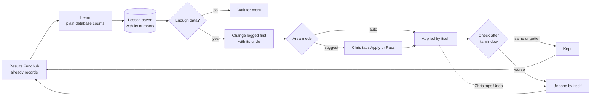
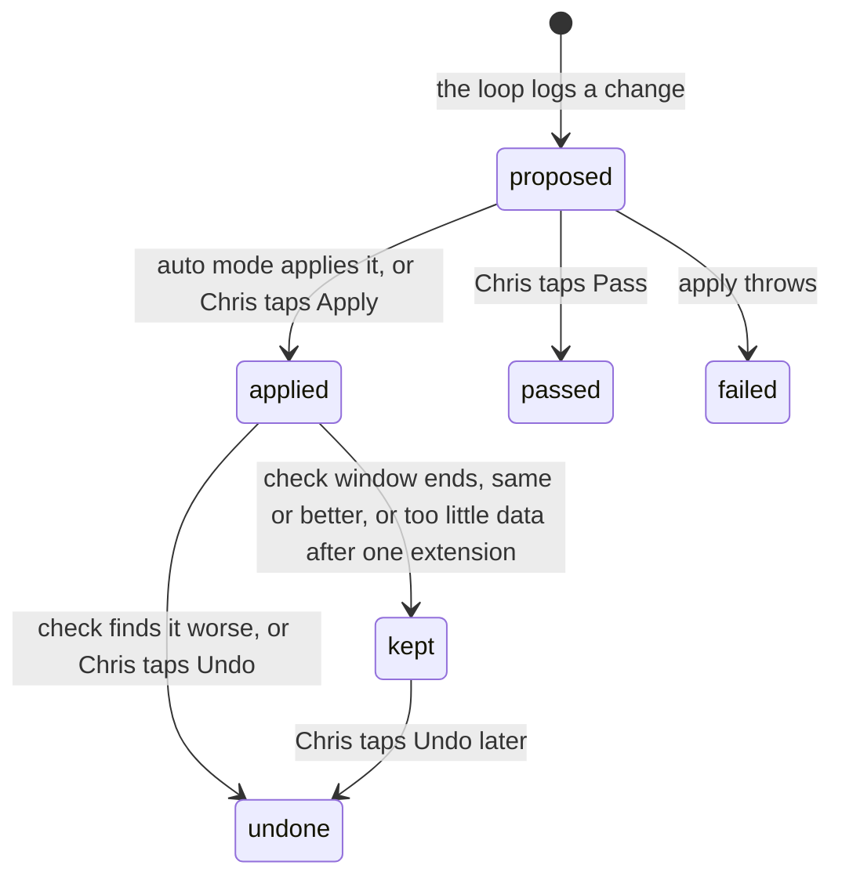

# The learning loop: build spec

**Version 1 · 2026-10-09 · Owner: Chris · For: Claude Code**

Chris, 2026-10-09: "Every aspect of the company should be continuously learning and optimizing itself." "Everything needs to be auto-optimized." And about his own words: "My speech patterns — I don't want to be stuttering. … The cleaned copy should integrate throughout."

He asked first whether this already exists. It was checked on 2026-10-09 across `src/`, `scripts/`, `db/` and `docs/`, and it does not. Fundhub measures a lot and reports it, but nothing changes itself from what it learns. §3 lists what exists.

This change holds four things:
- `docs/specs/learning-loop-2026-10-09.md` (this file)
- `ops/workflows/learning-loop-2026-10.md` (the shared board)
- the change-cadence rule, rule 1 updated to Chris's word in all three homes (CLAUDE.md, `.claude/rules/change-cadence.md`, `.cursor/rules/change-cadence.mdc`)
- `docs/specs/calls-to-content-2026-10-09.md`, updated so the miner reads Chris's cleaned words

## The goal

**Every part of Fundhub reads its own results, learns what works, and changes itself to do more of it. Chris's spoken words reach every piece of copy with the stutters and filler taken out.**

- **In:** what Fundhub already records: lender approvals and denials, dispute results, Chris's edits to drafts, call outcomes, ad numbers.
- **Out:** changes the company makes to itself. Each one is logged before it runs, checked against the numbers after, and undone by itself when the numbers get worse.
- **Chris's whole job:** read one buzz on the days the loop changed something, and tap Undo on anything he doesn't like. He can set any area to suggest-only (he approves first) or off.

**Top rule.** Chris's word beats any written rule (law: `.claude/rules/chris-word-wins.md`).

## Contents

0. How to run this build
1. What we're building
2. Owner decisions (law for this build)
3. What already exists (reuse it)
4. Traps
5. Back end
6. The state diagram
7. Front end (last)
8. The whole thing is done when…
9. Only Chris
10. Decisions (defaults)
11. Phase 2 and phase 3

---

## 0. How to run this build

### 0.1 Gates

Approving this spec covers these CLAUDE.md gates:
- §0 (the split is 0.2 below)
- §1 (the model check; each workflow still prints its `Model:` line)
- §2 (nothing unrequested; this spec is the request)
- §3 steps 3–4 (this spec is the plan)
- §3a step 1 (the workflow questions; §10 holds the answers as defaults)

The order is law (`.claude/rules/build-spec-then-backend-then-frontend.md`): spec → Chris perfects it → back end proven → spec revised if the truth moved → front end last.

Workflows stop for only three things: an item in §9 or §10, a STOP AND ASK from the intended journey (CLAUDE.md §4), or a hard-rule conflict.

### 0.2 The split (phase 1)

| Workflow | Owns | Model | Starts |
|---|---|---|---|
| **L0** | This spec, the board, the rule update, the Calls to Content link | Opus | done (this chat) |
| **L1** | §5.1 migration 442, §5.2 the runner, the `GET loop/changes` read + its test | Opus | after Chris approves |
| **L2** | §5.3 the word cleaner (pure code, no database) | Sonnet | after Chris approves, same time as L1 |
| **L3** | §5.6 lenders: migration 443, the learner, the match-list tie-break | Opus | after Chris approves, same time as L1; merges after L1 |
| **L4** | §5.7 credit optimization: the learner (lessons only) | Sonnet | after Chris approves, same time as L1; merges after L1 |
| **L5** | §5.4 words and §5.5 voice, the two areas that learn from Chris's edits | Sonnet | after L1, L2, Calls to Content W2 (migration 438) and Calls to Content W5 (the quote route) merge |
| **L6** | §5.8 action routes, §5.9 the buzz and the morning-brief section | Sonnet | after L1 merges |
| **L7** | §7 the screen | Sonnet (Claude only, law: `grok-no-displays.md`) | after L1–L6 are proven live and this spec is revised |

**What runs at the same time:** L1, L2, L3 and L4. Then L5 and L6. Then L7.

**Real dependencies:**
- L3 and L4 write their area files against the contract in §5.2, so they can start at once. They merge after L1 because they log through L1's tables.
- L5 needs L1's tables, L2's cleaner, the Calls to Content tables (its migration 438) and its quote route (its W5).
- L6 needs L1's tables.
- L7 needs the back end proven (law).
- Calls to Content W4 (the miner) and W5 (the quote route) need L2's cleaner. That line is on both boards.

The copy-paste prompts for L1–L7 are on the board. Each one stands on its own.

### 0.3 Migration numbers

This build uses **442–445**. Calls to Content has 438–441. The marketing machine keeps 413–423 and 425–429. Two files already share 434 (`434_staff_calendar_links.sql`, `434_yesdoor_core.sql`), so pick a number by listing the folder, never by counting.

### 0.4 Tests and the database

Never run pg tests against the `DATABASE_URL` in `.env`. Use CI's database or a scratch database (`createdb fh_loop`, migrate, test). Chris pre-approves scratch use with this spec.

---

## 1. What we're building

### 1.1 The rules every area follows

1. **Every number comes from a database read.** A model may write a sentence about a number. It never makes one up.
2. **A rate counts only after 10 outcomes.** That is the same floor `src/ops/discoveries.mjs` already uses (`MIN_N_RATE = 10`). Below it, the lesson says "not enough data yet" and nothing changes.
3. **One change per area per run.** Nothing new happens to a target while its last change is still being checked, so every result belongs to one change.
4. **Log it before it runs.** The log holds the numbers behind it, what it was before, what it is after, and the exact way to undo it.
5. **Check it after its window.** Same or better: keep it. Worse: undo it by itself and say so in the buzz.
6. **Stay inside Chris's rules.** The loop never edits a rule Chris wrote: RULES.md Part 0, CLAUDE.md, anything in `.claude/rules/` or `.cursor/rules/`. A change that would break one reaches Chris as a suggestion (marketing machine decision 19: "Chris's rules and voice always win").
7. **A change Chris undid or passed on stays off for 7 days,** unless the numbers get worse (change-cadence rule 8).
8. **Stay inside change-cadence rules 2–8.** Those numbers are the loop's limits.

### 1.2 Every part of the company, by phase

| Area | It learns from | What it changes by itself | Data today | Phase |
|---|---|---|---|---|
| **Chris's words** (the cleaner) | Chris's fixes to a cleaned quote | his personal filler list and keep list | none yet; Calls to Content builds the quotes | 1 |
| **Voice** | Chris's edits to drafts | VOICE.md, a "learned from your edits" section | Calls to Content draft versions (438); ad `voice_pairs` when M1 ships | 1 |
| **Lenders** | approved vs denied, per lender (`applications`) | the lender order in the match list (ties only, §10 decision 6), and the rate shown next to each lender | recorded | 1 |
| **Credit optimization** | deletions per rule and bureau (`dispute_items`) | nothing yet; a weekly lesson for the specialist (§5.7 says why) | recorded | 1, lessons only |
| **Ad budgets** | cost per booked call and sales | the daily budget per ad set, within 20% and once every 3 days | spend and bookings recorded; the target and the ad-to-sale join are missing | 2 |
| **Ad copy** | numbers per ad, Chris's edits, what clients said | the next batch's angle mix | marketing machine M1 and M5, not built | 2, with the marketing machine |
| **Closers** | call outcomes, the belief that failed, transcripts | weekly objection notes for the sales manager, and objection lines for the ad writer | recorded | 2 |
| **Messages** | replies and bookings per template | the better version of a template, picked from a 50/50 test | missing: template versions and reply links | 2 |
| **AI agents** | replies, bookings and opt-outs per prompt version | the better prompt version | missing: prompt versions and outcomes per run | 2 |
| **Pages and the VSL** | step rates, Clarity, the VSL watch beacon | the better page version, picked from a split test | missing: split tests | 3 |
| **Offers and prices** | sales per offer version | changes only after 20 sales (cadence rule 7) | missing: offer versions | 3 |
| **UnderwriteIQ** | — | never | fenced (trap 9) | never |

**Said once.** The data floors count Fundhub's own outcomes, and some of them come in slowly (decisions per lender, deletions per rule at one bureau). So some areas will say "not enough data yet" for weeks and wait. The floors are what keep an automatic change from chasing luck. Phase 2 puts ad budgets and live agent prompts behind a target number and a shadow test, because those are where a wrong automatic change costs money or says the wrong thing to a client.

---

## 2. Owner decisions (law for this build)

1. **Every part of the company learns and optimizes itself** (Chris, 2026-10-09).
2. **Automatic by default** (Chris, 2026-10-09: "everything needs to be auto-optimized"). Every area starts on `auto`. Chris can set any area to `suggest` or `off` (§5.8).
3. **No stutters or filler in copy** (Chris, 2026-10-09). His spoken words go through the word cleaner (§5.3) before any writer uses them. The cleaned words flow into every piece of copy built from his speech.
4. **Chris's rules are the boundary** (`chris-word-wins.md`; marketing machine decision 19). The loop works inside them and never rewrites one.
5. **Change-cadence rules 2–8 are the loop's limits.** Rule 1 now reads "everything optimizes itself" (owner-set 2026-10-09, updated in this change).
6. **Spec, then back end, then front end** (CLAUDE.md §3a).
7. **Everything lands in the repo** (CLAUDE.md §3b).

---

## 3. What already exists (reuse it)

**What measures today (all read-only):**

| Piece and where | What it gives this build | Watch out |
|---|---|---|
| `src/ops/discoveries.mjs` | The sample-size floors: `MIN_N_RATE = 10`, `MIN_N_TIME = 20`. | Reuse the constants. Don't invent new floors. |
| `src/ops/suggestions.mjs`, `ops_suggestions` (432) | Cadence numbers in `CADENCE_DEFAULTS`, the quiet-after-pass logic (`applyQuiet`), the dollar-impact ranking. | Nothing calls `setSuggestionStatus` yet. Its own Apply/Pass path isn't built. |
| `src/ops/watch-curve.mjs`, `src/ops/meta-marketing.mjs` (`costPerBooked`), `src/ops/brief-offers.mjs` | Ad watch curve, cost per booked call (INSUFFICIENT under 10 booked), booked and showed per offer. | Phase 2 inputs. |
| `src/sales/metrics.mjs` | Per-closer cash, close rate and show rate; failed-belief counts by source and setter. | Phase 2 input (closers). |

**What acts today:**

| Piece and where | What it gives this build | Watch out |
|---|---|---|
| `src/optimize/run.mjs`, `rules.mjs`, `ceilings.mjs`; `guardedWrite` and `undo()` in `src/adplatforms/index.mjs`; `action_log` (046) | The pattern this build copies: log before acting, carry the rule and the numbers, keep an undo payload, never act twice in a day. | Partner-scoped (`action_log.partner_id` is required), ad-platform and social targets only (campaign, ad set, ad, creative asset, connection, social post, autopilot), and never scheduled. Fundhub's own ads sit under the house partner `fundhub-house` (377). Phase 2 budgets reuse this code. See trap 4. |

**What records outcomes (phase 1 reads these):**

| Piece and where | What it gives | Watch out |
|---|---|---|
| `applications` (001, 138) with `lender_id`, `status` (`Approved`, `Denied`, …), `approved_amount`; `application_decisions` (139) | Every lender decision, and when it was made. | `approved_amount` is dollars, `numeric(14,2)` (trap 3). |
| `src/lenders/match.mjs` `matchLenders`, `src/lenders/store.mjs` `matchForClient`, `api/read/lender-matches.mjs`, `api/read/funding-rounds.mjs` | The funding advisor's lender list. It sorts by tier, then bureau rotation, then name. | `matchForClient` also feeds the closer cockpit (`src/sales/cockpit.mjs`, the protected Present flow). `matchLenders` is also used by `src/calculators/deal-funding.mjs`, `src/autopsy/score.mjs` and the public climate funnel (`api/public/climate-match.mjs`). None of those change (§5.6). |
| `src/plays/outcomes.mjs` (`YES_STATUSES`, `NO_STATUSES`, `outcomeFromStatus`, `listOutcomesForLaterPlays`) | The exact approval-vs-denial read: `Approved` is yes, `Denied` is no. | Reuse `outcomeFromStatus`. Nothing calls `listOutcomesForLaterPlays` yet. |
| `applications.approval_excluded_at` (272) | Marks an approval Fundhub won't bill for. | Approval-rate reporting ignores it on purpose (the bank still said yes). The lenders area does the same. |
| `dispute_cases` (bureau, round), `dispute_items` (`rule_id`, `round`, `status`), `src/repair/metrics.mjs` (`deletionRate`, `deletionsByRuleId`) | Every dispute result. The helpers exist and nothing calls them yet. | A bureau answer read at 0.85 confidence or above confirms itself (`AUTO_THRESHOLD` in `src/repair/parse-loop.mjs`); lower ones wait for a person. |

**Plumbing:**

| Piece and where | What it gives | Watch out |
|---|---|---|
| Inngest crons in `src/workflows/index.mjs`; `INNGEST_JOBS` in `src/pulse/heartbeats.mjs` | Scheduled jobs with automatic heartbeats. `daily-pulse` runs at `0 13 * * *` (6:00 Arizona). | A new cron goes in both places, or `heartbeats.test.mjs` fails. |
| `queueBuzz`, `BUZZ_TITLES` (`src/marketing/notify.mjs`), `sendDueBuzzes` | Phone buzz with quiet hours (21:00–07:00 Arizona) and a 10-minute throttle per kind. The marketing worker sends due buzzes on every marketing-clock tick, whether or not the script machine is on. | No production code queues a buzz yet. Add the new kinds to `BUZZ_TITLES`. |
| Morning brief: `src/ops/morning-brief.mjs`, `api/read/morning-brief.mjs` (`ROLE_SETS.OPS`), `/app/morning-brief.html` | The page Chris reads each morning. | `MORNING_BRIEF_LIVE = false`, so the brief isn't texted yet (trap 11). |
| Repo outbox: `repo_outbox` (406), `src/repo/outbox.mjs`, `src/repo/edits.mjs` (`append`, `replace_text`), `src/repo/allow-list.mjs` | Saves repo files from the app. `marketing/ads/VOICE.md` is already allowed. | Edits apply to the newest copy of the file on GitHub. |
| `orgs.is_default` (seeding pattern in 048) | How to seed rows for Fundhub's own org. | |
| `src/company-brain/chunk.mjs` (`DEFAULT_CHUNK_CHARS = 1800`, `DEFAULT_CHUNK_OVERLAP = 200`) | How the brain splits text. | Trap 1. |
| `src/pulse/registry.mjs` (`API_KEYS`, `ALLOWED_UNMONITORED`, `DESK_FILES`) | Every new route and page is watched. | Same change as the feature (law: `pulse-registry.md`). |
| `src/agents/model.mjs` `callModel` | Model calls. | Always pass `provider: 'anthropic'`. |

**Copy and voice:**

| Piece and where | What it gives | Watch out |
|---|---|---|
| `marketing/ads/VOICE.md` | Before/after pairs that teach the writer Chris's voice. | Its own rule: every new "Chris wrote" line must be something Chris typed. Nothing an agent writes may be added as an "after" line. |
| Calls to Content `v_content_voice_pairs` (spec §5.2, migration 438) | Every draft version Chris edited, as before and after. | Not built yet. L5 waits for it. |
| Marketing machine §7.2 `voice_pairs` | The same idea for ad scripts. | Spec only. When M1 builds it, its weekly export is this build's voice job (§5.5); M1 adds a source and does not build a second job. |

---

## 4. Traps

1. **Text rebuilt from `brain_chunks` repeats itself.** Chunks overlap by 200 characters (`chunk.mjs`), and `fileText` in `meet-transcript.mjs` joins them as they are. So every joined transcript repeats about 200 characters at each joint, and when a sales call is paired with a Meet transcript doc, `call_outcomes.transcript` holds that joined text (Whisper text is stored as it came). A repeat-finder would read those as stutters, and word counts run high. Anything in this build that cleans or counts words rebuilds the text with `textFromChunks` (§5.3). The existing callers are a leftover card on the board and are not part of this build.
2. **Small numbers lie.** Use the floors in §1.1. A lesson below its floor says so and changes nothing.
3. **Money.** `applications.approved_amount` is dollars in `numeric(14,2)`. Convert to integer cents through `src/commissions/money.mjs`. NULL means unknown and stays NULL (CLAUDE.md §12).
4. **`action_log` doesn't fit this build.** It requires a partner and allows only ad-platform and social targets. This build logs in `loop_changes`. Phase 2 budget moves still go through `guardedWrite`, and their `loop_changes` row keeps the `action_log` id.
5. **The optimizer counts Meta's conversions.** Fundhub's measure is cost per booked call and sales. Phase 2 wires the optimizer to `costPerBooked` before it moves a budget.
6. **Email opens and clicks are thrown away on purpose** (`src/adapters/mailgun.mjs`, `src/adapters/resend-events.mjs`). The messages area (phase 2) learns from replies and bookings instead.
7. **Agent prompts and message templates save over themselves.** There is no version history. Phase 2 adds versions before anything learns from them.
8. **Dispute letter order is shuffled on purpose.** `src/metro2/letters/prompts.mjs` permutes violation order inside a severity tier so letters vary. Never sort letters by deletion rate.
9. **UnderwriteIQ is fenced.** The loop never reads into, writes to or tunes `src/underwrite/engine.mjs` ("KEEP THIS LIVE SNAPSHOT"), `src/underwrite/vendor/*` or `vendor/underwriteiq*`. The tripwire tests are `src/underwrite/fixtures.test.mjs` and `output-baseline.test.mjs`.
10. **Don't hold a transaction open across a model call.** Read, close, call the model, then write.
11. **The morning brief isn't texted yet** (`MORNING_BRIEF_LIVE = false`; MB1 needs a Mac session, because the cloud was refused Netlify env access). The buzz is the path that reaches Chris today.
12. **Two areas could change the same thing.** One open change per target (§5.1's partial unique index) stops them from fighting.

---

## 5. Back end

### 5.1 Schema (L1, migration 442)

Same row-level security and grant pattern as migration 432: RLS on and forced, one app policy, `GRANT SELECT, INSERT, UPDATE` to `fundhub_app`, `REVOKE DELETE, TRUNCATE`. Nothing deletes a loop row.

**`loop_areas`** — one row per area per org. Primary key (`org_id`, `area`).
- `area` (text), `mode` (`off` | `suggest` | `auto`), `cadence` (`daily` | `weekly`)
- `min_n` (int): outcomes before a rate counts
- `check_days` (int), `check_min_n` (int), `worse_by` (numeric, in points): the keep-or-undo test
- `config` (jsonb, default `{}`): the area's live settings, such as the filler list or the active lender stats date
- `updated_by` (text), `created_at`, `updated_at`
- Seeded for the default org (`orgs.is_default`) with the numbers in §10 decision 4, every mode `auto`.

**`loop_runs`** — one row per area per day.
- `id`, `org_id`, `area`, `run_date` (date, Arizona)
- `status` (`ok` | `skipped` | `failed`), `reason`, `lessons`, `changes`, `checked` (ints), `error`
- `started_at`, `finished_at`
- Unique (`org_id`, `area`, `run_date`). A second run the same day finds the row and does nothing.

**`loop_lessons`** — what the loop learned. Append-only.
- `id`, `org_id`, `area`, `run_id`, `subject_key` (for example a lender id)
- `finding` (one plain sentence, built by code from the numbers)
- `numbers` (jsonb), `n` (int), `enough_data` (boolean)
- `created_at`

**`loop_changes`** — every change, logged before it runs.
- `id`, `org_id`, `area`, `run_id` (nullable), `target_type`, `target_key`
- `rule` (which lesson or rule fired), `reason` (one plain sentence), `numbers` (jsonb)
- `before`, `after`, `undo` (jsonb; `undo` is required)
- `mode` (`suggest` | `auto`, the area's mode when it was made)
- `status`: `proposed` | `applied` | `kept` | `undone` | `passed` | `failed`
- `measure` (text), `better` (`up` | `down`), `measure_before`, `n_before`, `check_after` (date), `measure_after`, `n_after`, `extended` (boolean)
- `decided_by` (`loop` or a staff id), `error`, `action_log_id` (nullable, phase 2)
- `applied_at`, `checked_at`, `undone_at`, `passed_at`, `quiet_until`, `created_at`, `updated_at`
- CHECKs: `applied`, `kept` and `undone` need `applied_at`; `undone` needs `undone_at`; `passed` needs `passed_at` and `quiet_until`.
- Partial unique index on (`org_id`, `area`, `target_key`) where `status IN ('proposed','applied')`: one open change per target.

### 5.2 The runner (L1)

**Where:** `src/loop/run.mjs` `runLoop(db, {orgId, today})`, with the area files in `src/loop/areas/<area>.mjs`.

**When:** a new Inngest cron, `learning-loop`, at `0 12 * * *` (5:00 Arizona). That is one hour before `daily-pulse`, so the morning brief can show what the loop did. Register it in `src/workflows/index.mjs` and add it to `INNGEST_JOBS`. Weekly areas run on Mondays.

**The area contract.** Each area file exports:
- `key`, and `learn(db, ctx)` → lessons. Plain database reads only.
- `propose(lessons, ctx)` → one change or null: `{target_type, target_key, rule, reason, numbers, before, after, undo, measure, better}`
- `apply(db, change)` and `undo(db, change)`, both safe to run twice
- `measure(db, change, {from, to})` → `{value, n}`

**One run, per area whose mode isn't `off` and whose cadence is due:**
1. Claim the `loop_runs` row for today. If it exists, stop.
2. `learn`, then save every lesson.
3. **Check what's due.** For each `applied` change whose `check_after` has come: measure the same window length before and after.
   - `n_after` under `check_min_n`: extend the window once by `check_days`. If it's still short after that, mark it `kept` with the verdict "not enough data to judge."
   - Worse by more than `worse_by`: run `undo`, mark it `undone`, decided by `loop`.
   - Otherwise: mark it `kept`.
4. **Propose.** Skip when the target already has an open change, or when Chris undid or passed on the same target and its `quiet_until` hasn't come (unless the new numbers are worse than the ones he passed on).
5. **Log first.** Insert the change as `proposed`.
6. **Act.** `auto`: run `apply`, then mark it `applied` with `check_after = today + check_days`. `suggest`: leave it `proposed` for Chris. An apply that throws marks it `failed` with the error.
7. Finish the `loop_runs` row.

One area failing never stops the others. The model is never called by the runner in phase 1.

### 5.3 The word cleaner (L2)

**Where:** `src/words/clean.mjs`, `src/words/fillers.mjs`, `src/words/unchunk.mjs`. Pure functions with tests. No database.

**The one promise: the cleaner can only take words out.** It never adds, swaps or reorders a word. It may fix capital letters and punctuation. `isDeletionOnly(raw, clean)` checks this: the clean words, lowercased and stripped of punctuation, appear in the raw text in the same order. Every caller asserts it.

**`textFromChunks(chunks, overlap = 200)`** rebuilds a transcript from `brain_chunks` without the repeated joints (trap 1). At each joint it finds the longest end of one chunk that matches the start of the next, up to `overlap` plus a little slack, and keeps it once.

**`cleanSpoken(raw, {extraFillers = [], keepWords = [], modelPass = null})`** returns `{text, words: [{raw_index, word}], removed: [{raw_index, word, why}], removed_share, flagged}`. The `words` map points each kept word back to its spot in the raw text, so a caller can recover the exact raw span.

**Pass 1, rules (always runs):**
1. Sounds that are always filler: um, uh, uhm, er, erm, ah, hmm, mm, mhm.
2. Stutters: the same word twice or more in a row ("the the", "I I I") keeps one. A cut-off piece before the full word ("fun- funding") keeps the full word.
3. Restarts: a run of 1–6 words said again right away keeps the last copy ("we went, we went to the bank" → "we went to the bank").
4. Anything in `extraFillers` (Chris's learned list, §5.4).

**Pass 2, the model (optional, `modelPass`):** for filler that depends on meaning ("like", "you know", "I mean", "kind of", "basically", "literally", "actually", "so" at the start of a sentence) and false starts that aren't exact repeats ("we were — I went to the bank" → "I went to the bank").
- The model gets the words with their numbers and returns **only the numbers of words to remove**, each with a reason. Code does the removing, so the model can't add a word.
- Model: `WORD_CLEANER_MODEL`, default `claude-haiku-5-5`, `provider: 'anthropic'`, forced tool.
- The caller pays for and logs the call (Calls to Content logs it in `marketing_model_usage` under its own job).
- `MODEL_PRICES` in `src/marketing/model-usage.mjs` has no row for `claude-haiku-5-5`, so its calls would log at $0. L2 adds the row from Anthropic's published prices in the same PR. Never a guessed price.

**Words it never removes:** not, no, never, nothing, none, and every "n't" word; any number, dollar amount or percent; any word in `keepWords`. Code drops any removal that points at one of these.

**Guard:** if the passes would remove more than 25% of the words, keep pass 1's result only and set `flagged`.

**Tests:** one case per rule; the protected words survive every pass; `isDeletionOnly` holds on every output; cleaning clean text changes nothing; a fake `modelPass` that asks to remove "not" is refused; once Calls to Content W2 saves its two scrubbed transcript fixtures, both run clean.

**Where the cleaned words go:**

| Who | What it cleans | When |
|---|---|---|
| Calls to Content miner | Chris's lines, before the model sees them. `quote` is the cleaned words; `quote_raw` keeps the exact words. | Phase 1 (that spec's §5.4 now says so) |
| Marketing machine writer | Chris's dictation before a script is written (RULES.md §1.10 "clean it into plain spoken sentences"), and quotes it takes from calls | When M1 ships |
| Marketing machine "real words" (§7.10) | Client words used to learn their language | When that job ships (§10 decision 8) |
| Company Brain, `call_outcomes.transcript` | Never. The raw transcript stays the record. | — |
| Testimonials and proof cards | Never. They stay word for word (law: `proof-cards-from-source.md`). | — |
| Ad video | Never. The cut law (`ad-video-best-of-clips.md`) handles spoken filler in video. | — |

### 5.4 Area: Chris's words (L5)

**Learns from:** Chris's fixes to a cleaned quote in the Calls to Content inbox (that spec's new `POST content/ideas/quote`, which saves `quote_fixed`).

**Lesson:** compare raw, cleaned and fixed for each fixed quote.
- A word Chris removed that the cleaner kept counts toward his filler list.
- A word Chris put back that the cleaner removed counts toward his keep list.

**Change (auto):** a word that reaches 3 removals (`min_n` = 3) joins `loop_areas.config.extra_fillers`. A word that reaches 2 put-backs joins `config.keep_words`. One word per run. Undo puts the list back the way it was.

**Measure:** the share of shown quotes Chris fixes, over 14 days. Undo when it rises by more than 10 points.

### 5.5 Area: voice (L5)

**This is the only voice job.** The marketing machine's §7.2 weekly export is this job; M1 adds `voice_pairs` as a second source.

**Learns from:** every pair of before and after where Chris edited a draft since the last run: `v_content_voice_pairs` now, `voice_pairs` when M1 builds it.

**Change (auto, weekly):** append the new pairs to `marketing/ads/VOICE.md` through the outbox (`append`), under a section called "Learned from your edits."
- Each pair keeps the file's shape: kind (the channel: facebook, instagram or email; ad pairs keep hook, body, cta or close), lane (`content` for posts; the offer lane for ads), "Model wrote" (the version he edited), "Chris wrote" (his version, exactly as he typed it), source (draft id and versions).
- VOICE.md's own rule holds: the "Model wrote" side may come from a generated draft, and the "Chris wrote" side is only what Chris typed.
- No "Why" line, so every line in a learned pair is text that was actually written, by the writer or by Chris.
- The block is wrapped in `<!-- loop:<change id> -->` and `<!-- /loop:<change id> -->`.
- Undo is one `replace_text` that removes exactly that block.

**Measure:** the share of drafts Chris edits before approving, over 28 days. Undo when it rises by more than 10 points.

### 5.6 Area: lenders (L3, migration 443)

**Migration 443, `lender_outcome_stats`:** `org_id`, `lender_id`, `as_of` (date), `decided`, `approved` (ints), `approved_cents_median` (bigint, nullable). Primary key (`org_id`, `lender_id`, `as_of`). Same RLS and grant pattern as 442. Append-only.

**Learns from:** `applications` with a `lender_id` and a status of `Approved` or `Denied`, decided in the last 180 days (the decision date from `application_decisions`). Other statuses aren't decisions and don't count. Read yes and no with `outcomeFromStatus` (`src/plays/outcomes.mjs`). An approval with `approval_excluded_at` set still counts, because the bank said yes. Amounts go through `money.mjs`.

**Lesson per lender:** "Approved 7 of 10 in the last 180 days." Under 10 decided: "not enough data yet."

**Change (auto, weekly):** write a new `lender_outcome_stats` snapshot for today, then set `loop_areas.config.active_as_of` to today. Undo sets it back to the old date.

**What the snapshot changes:**
- `matchForClient` (`src/lenders/store.mjs`) loads the active snapshot and passes it to `matchLenders` as a new, optional `approvalRates`.
- `matchLenders` uses it in the last tie-break only: tier first, then bureau rotation, then approval rate (lenders with 10 or more decisions, highest first), then name. Bureau rotation stays ahead of approval rate (§10 decision 6).
- Each match carries `approval: {decided, approved}` or null, so the funding desk can show "Approved 7 of 10 here."
- Only the funding desk reads (`api/read/lender-matches.mjs`, `api/read/funding-rounds.mjs`) ask for it. `matchForClient` takes a new option for that, off by default, so the closer cockpit (`src/sales/cockpit.mjs`, protected Present flow) stays as it is (§10 decision 11).
- `deal-funding.mjs`, `autopsy/score.mjs` and `api/public/climate-match.mjs` don't pass `approvalRates`. A test proves their output and the cockpit's don't change.

**Measure:** the approval rate of applications decided in the 30 days after the change, against the 30 days before. Judge only with 20 or more decisions in each window. Undo when it drops by more than 10 points.

### 5.7 Area: credit optimization (L4, lessons only)

**Learns from:** `dispute_items` joined to `dispute_cases`. Count disputed and deleted per `rule_id` × bureau × round, reusing `deletionsByRuleId` from `src/repair/metrics.mjs`. That helper groups by rule only and counts every item it's given, so the learner first keeps items with a final result (`deleted`, `verified`, `updated` or `unaddressed`), splits them by bureau and round, then calls it once per group.

**Lessons (weekly):** the 5 rules that delete most at each bureau, and every rule with zero deletions after 20 tries at a bureau. Each lesson is one plain sentence: "Rule X: 0 of 23 deleted at Equifax in round 1."

**Why it changes nothing yet.** The letter engine disputes every violation it finds, and it shuffles the order on purpose (trap 8). So there is no choice yet for the numbers to steer. L4 step 1 looks for a real choice in `src/metro2/` (for example which items go first when a round has a cap). If it finds one, it writes it on the board and stops. Turning that into a change is Chris's call.

### 5.8 Routes (L1 builds the read first; L6 the rest)

All routes start with `loop/`, sit in the `ROUTES` map, and use `ROLE_SETS.OPS` (owner and admin, the same as the morning brief). Every write sends the change's `updated_at` it acted on and a `request_id`. A stale one gets a 409 with the current row.

**Read first (L1), with a test that proves it** (`src/http/loop-changes.pg.test.mjs`, green against a real database):

| Route | What it returns |
|---|---|
| `GET loop/changes?status=&area=&since=` | Changes, newest first, with their numbers, before and after, and the check result. |

**Then (L6):**

| Route | What it does |
|---|---|
| `GET loop/lessons?area=&since=` | Lessons, newest first. |
| `GET loop/areas` | Each area's mode and numbers. |
| `POST loop/areas` | Sets an area's mode or numbers. Chris only. |
| `POST loop/changes/apply` | A `proposed` change in `suggest` mode: apply it now. |
| `POST loop/changes/pass` | A `proposed` change: pass. Sets `quiet_until` to 7 days out. |
| `POST loop/changes/undo` | An `applied` or `kept` change: run its undo now, decided by the person who tapped. |

Every route goes into `src/pulse/registry.mjs` in the same change. Any write route that can't be pinged safely goes in `ALLOWED_UNMONITORED` with its reason.

### 5.9 Telling Chris (L6)

- **The buzz:** after the run, if anything was applied or undone, queue one buzz with kind `loop_daily`: "The loop made 2 changes and undid 1. Open: <link>." Add `loop_daily: "The loop changed something"` to `BUZZ_TITLES`. Quiet hours hold it until 7:00. No buzz on a day with no changes.
- **The morning brief:** a "What the loop did" section on `/app/morning-brief.html`, fed by `src/ops/morning-brief.mjs`: changes applied, undone and waiting, plus lessons with enough data. When the brief starts texting (MB1), the text gets one line: "The loop: 2 changes, 1 undo."

### 5.10 Done means (back end)

1. Migration 442 and 443 are on production, and `/api/health` reads pending 0.
2. The `learning-loop` cron runs at 5:00 Arizona, writes one `loop_runs` row per due area, and a second run that day does nothing.
3. The lenders area writes a real snapshot from live `applications`, logs the change, and the funding desk's lender list carries `approval` on each match. `deal-funding` and `autopsy` output is unchanged (test).
4. The credit optimization area writes its weekly lessons from live `dispute_items`.
5. The word cleaner passes every test in §5.3, and the Calls to Content miner uses it.
6. The voice job appends a real pair to VOICE.md through the outbox, and Undo removes exactly that block.
7. A forced-worse check undoes its change by itself (scratch database test).
8. Undo, apply and pass work from the routes, each with a 409 on a stale row.
9. The buzz arrives once on a day with changes and never on a day without.
10. `docs/journeys/learning-loop-flow.md` holds §6, and `docs/journeys/CHANGELOG.md` has its line.

---

## 6. The state diagram

L1 saves this to `docs/journeys/learning-loop-flow.md` once the back end matches it. The screen is a window onto it.

A lesson has no states. It's saved once and never changes.

---

## 7. Front end (L7, last, throwaway)

Only after the back end is proven live and this spec is revised. `docs/rules/UI-STANDARDS.md` is law. Phone first.

**Where:** a "What the loop did" card on `/app/morning-brief.html`, and a **Loop** page at `/app/loop.html` (owner and admin, in the sidebar next to the morning brief). Sync the sidebar and add the page to the pulse registry.

**The card on the brief:** each change from the last day, in one plain line with its numbers. Applied changes have **Undo**. Waiting changes (suggest mode) have **Apply** and **Pass**.

**The Loop page:**
1. **Changes:** every change, newest first, filterable by area and status, with the same buttons.
2. **Lessons:** what each area learned, newest first, with "not enough data yet" shown plainly.
3. **Areas:** one row per area with its mode switch (auto, suggest, off) and its numbers.

**On the funding desk:** "Approved 7 of 10 here" under each matched lender that has 10 or more decisions.

---

## 8. The whole thing is done when…

1. On Monday at 5:00 the loop runs. The lenders area finds that one bank approved 9 of 11 files in the last 180 days, and another approved 2 of 12.
2. It saves both lessons, logs the change, and updates the lender order. At 7:00 Chris's phone buzzes: "The loop made 1 change. Open: …"
3. On the funding desk the advisor sees "Approved 9 of 11 here" next to the first bank.
4. That week Chris fixes three cleaned quotes in the Calls to Content inbox, and each time he takes out "basically." The next Monday "basically" joins his filler list, and new quotes come without it.
5. He edited 6 drafts last week. On Monday those 6 pairs land in VOICE.md under "Learned from your edits," word for word.
6. Thirty days later the loop checks the lender change. The approval rate held, so the change is kept.
7. Chris never had to approve anything. Any time he wanted, one tap undid a change.

---

## 9. Only Chris

1. Read this spec. Change anything, then answer §10 ("all defaults" works).
2. Say "commit it" so this chat merges the spec and the board to `main` and writes the §1 flow as `docs/journeys/learning-loop-intended.md`.
3. **Before phase 2's ad budgets can run:** set one target cost per booked call. None is stored today (`src/ops/suggestions.mjs` `SKIPPED_RULES`). The numbers in the repo are $30 (projection doc) and about $33 (the ramp), and Chris has said about $50.

---

## 10. Decisions (defaults; reply "all defaults" or change a number)

1. **Mode:** every area starts on `auto` (your word, 2026-10-09). You can switch any area to `suggest` or `off` on the Loop page.
2. **Never touched by the loop:** your written rules (RULES.md Part 0, CLAUDE.md, `.claude/rules/`, `.cursor/rules/`), UnderwriteIQ, prices and offers (phase 3, after 20 sales), and stored keys. A change that would break one of your rules reaches you as a suggestion.
3. **Data floor:** 10 outcomes before a rate counts. A check needs 20 outcomes in each window to judge.
4. **Per-area numbers:**
   - Words: weekly; 3 removals to add a filler word, 2 put-backs to keep one; checked after 14 days; undone if your fix rate rises 10 points.
   - Voice: weekly; every new edit pair is added; checked after 28 days; undone if your edit rate rises 10 points.
   - Lenders: weekly; 10 decisions per lender; checked after 30 days; undone if the approval rate drops 10 points.
   - Credit optimization: weekly lessons; 10 items per rule and bureau, 20 to flag a rule with zero deletions.
5. **How you hear about it:** one buzz at 7:00 on days the loop changed or undid something, plus a section in the morning brief. Nothing on quiet days.
6. **Lender order:** approval rate breaks ties only. Bureau rotation stays ahead of it, so the inquiry spread you built doesn't move. The other choice is to rank by approval rate ahead of rotation.
7. **The cleaner:** it only takes words out; it never removes "not," "no," "never," numbers or dollar amounts; it stops at 25% removed. The model pass runs on `claude-haiku-5-5`.
8. **Client words:** cleaned when they're used to learn how clients talk. Testimonials and proof cards stay word for word.
9. **Phase order:** phase 1 is the loop itself, your words, voice, lenders and credit-optimization lessons. Phase 2 is ad budgets, ad copy numbers, closers, messages and AI agents. Phase 3 is pages, the VSL, offers and prices.
10. **When it runs:** 5:00 Arizona, before the 6:00 pulse.
11. **The closer cockpit's lender list stays as it is.** It's part of the protected Present flow, so only the funding desk gets the approval line and the new order. Say so if you want it in the cockpit too.

---

## 11. Phase 2 and phase 3

Each gets its own short spec once phase 1 is proven. What each one needs first:

**Phase 2**
- **Ad budgets:** your target cost per booked call (§9 item 3); the optimizer wired to `costPerBooked` instead of Meta's conversions (trap 5); a daily cron for the house partner `fundhub-house`; moves within 20% and once every 3 days (cadence rule 5); `guardedWrite` and `action_log` for every move, linked from `loop_changes`.
- **Ad copy:** a report of sales per ad number. `src/ops/brief-offers.mjs` already joins `sales` and `transactions` to `client_ad_attribution.ad_id` (the ad number) but rolls them up by offer, and `api/read/ad-spine.mjs` counts people booked per ad and stops there. Reuse that join. Then the marketing machine's copy recursion (M1 and M5) logs its changes through `loop_changes`.
- **Closers:** weekly lessons from `call_outcomes` (outcome, `belief_failed`, cash) and cleaned transcripts, for the sales manager. The lines go to the ad writer as the "top objections" input (marketing machine §7.10). The Present flow and the closer context path are protected core flow (`redundancy-before-ui-polish.md`), so this adds notes and changes nothing in that flow.
- **Messages:** template versions; each inbound reply linked to the last outbound message it answers; bookings linked to the message before them; a 50/50 split between two versions; the winner kept at the data floor.
- **AI agents:** prompt versions; an outcome per run (replied, booked, opted out) on `agent_runs`; a new version runs in shadow first (agents already have a `shadow` status), and it goes live only after it beats the live one.

**Phase 3**
- **Pages and the VSL:** split tests (none exist), fed by `funnel_page_stats`, Clarity and `vsl_watch_sessions`. Until you say otherwise, page changes keep the marked-draft law (`page-edits-marked-draft.md`).
- **Offers and prices:** a record of offer and price versions, then cadence rule 7 (20 sales on the current version) before anything moves.
