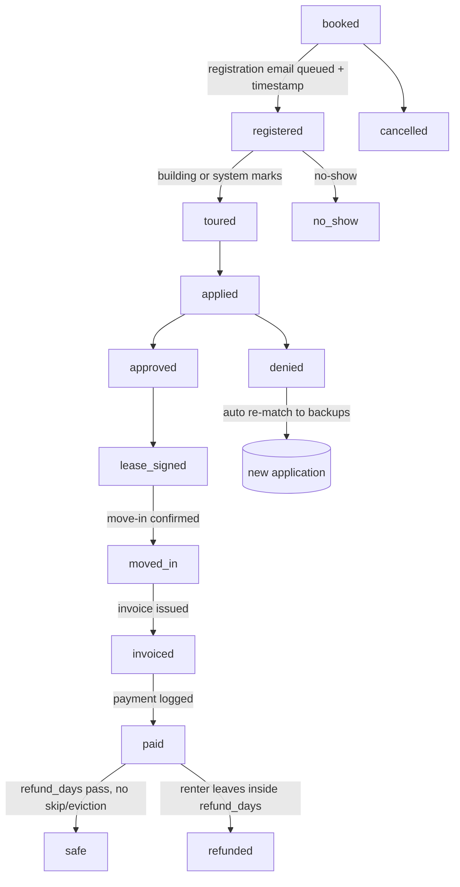

# Yesdoor MVP — detailed build spec (B1, 2026-10-07)

Owner direction: build everything on Claude's best judgment, high quality (Chris, 2026-10-07). Product spec and every owner answer: `docs/specs/yesdoor-mvp-2026-10-07.md` (§1–§17). Board: `ops/workflows/yesdoor-mvp-build-2026-10-07.md`. This file is the build contract for B2, B3, B4 and F1.

## 0. Ground rules for every builder

1. **Separate app, built here for now.**
   - All code lives in `src/yesdoor/**`, `api/yesdoor/**` and `public/yesdoor/**`.
   - Migrations are numbered `434+` and named `*_yesdoor_*`. Every table starts with `yd_`.
   - Its own org row: `orgs.slug = 'yesdoor'`.
   - No foreign key points into a Fundhub table except `orgs`.
2. **Split-ready boundary.** `src/yesdoor/**` may import only from this allowlist:
   - `src/db.mjs`
   - `src/commissions/money.mjs`
   - `src/http/middleware/requireAuth.mjs`, `requireRole.mjs`
   - `src/auth/session.mjs` (staff sessions)
   - `src/workflows/client.mjs` (Inngest client)

   A guard test `src/yesdoor/boundary.test.mjs` fails on any other import. Fundhub logic that Yesdoor needs (magic links, signed links, ledger patterns, the lender-style matcher) is **copied** into `src/yesdoor/`, not imported. That is owner-set: "copied in as starting code."
3. **Nothing transmits.** CRS, Plaid, e-sign, email, text and building software are sandbox stubs that return fixture data and never call the network. Real adapters come later, in `src/messaging/providers/` only (CLAUDE.md §12).
4. **Database rules.** Follow `db/migrations/432_ops_suggestions.sql`:
   - text enums with named CHECKs
   - `ENABLE` + `FORCE ROW LEVEL SECURITY`, with a guarded `<t>_app_all` policy
   - a `set_updated_at()` trigger
   - `REVOKE DELETE, TRUNCATE … FROM fundhub_app` and `GRANT SELECT, INSERT, UPDATE`
   - a `fundhub_no_delete()` trigger on every ledger, event, consent and screening table
   - money as `bigint *_cents`; NULL means unknown, never 0
   - every query filters `WHERE org_id = $1`

   Run `npm run migrations:manifest` after adding SQL.
5. **Routes and monitoring in the same change.**
   - Every handler goes in `ROUTES` (`netlify/functions/api.mjs:305`).
   - Every route goes in `PULSE_REGISTRY` or `ALLOWED_UNMONITORED` (`src/pulse/registry.mjs`).
   - Every cron goes in `src/workflows/index.mjs` `functions` and in `INNGEST_JOBS` (`src/pulse/heartbeats.mjs:14`).
6. **Tests.** Endpoint tests live at `src/http/yesdoor-*.pg.test.mjs`, following `src/http/bookings.pg.test.mjs`:
   - `HAVE_DB` skip
   - the handler imported in `before()`
   - an org fixture with slug `yesdoor-test-*`

   Pure logic gets plain `*.test.mjs` next to it. They run against a **scratch** database only, as `fundhub_app`. Never production.
7. **Do not merge to `main` or run `npm run ship`** until Chris says. Migrations apply on the production deploy (CLAUDE.md §11). Each unit ends as a draft PR.
8. **Tunable numbers live in one file:** `src/yesdoor/config.mjs` `YD_DEFAULTS` (§9). No magic numbers elsewhere.
9. **Plain-English names** in user-facing strings. The company is "Yesdoor."

## 1. Who logs in

| Principal | How | Sees |
|---|---|---|
| Staff (owner, ops, sales, collections) | existing staff login (`requireAuth` + `requireRole`), org `yesdoor` | Everything. Credit details only for `owner` and `ops` |
| Renter | email login link (copy of `src/auth/magic-link.mjs` → `src/yesdoor/auth/magic-link.mjs`) | Own status, matches, tours, results |
| Building user | email login link, tied to one or more buildings | Their renters: approved/likely/no, income verified, risk tier, max rent. Never the raw report |
| Broker | email login link | Their renters' **stage only**, plus their money |

Accounts table: `yd_accounts` (kind `renter|building_user|broker`). Sessions: `yd_sessions`. Links: `yd_magic_links`. A login link lasts 15 minutes; a session lasts 30 days.

## 2. Data model (tables)

All tables have `id uuid pk`, `org_id uuid not null references orgs(id)`, `created_at`, `updated_at`.

**People and accounts**
- `yd_renters`:
  - Contact: email (unique per org, lower-cased), first_name, last_name, phone, current_address jsonb.
  - First touch (written once; a trigger blocks updates): source_kind (`ad|broker|organic|direct|referral`), source_ad_id, source_broker_id, first_touch_at.
  - Status: stage (§3), lane (`verified|second_chance`, null until screened), risk_tier (`A|B|C|D`, null), approved_max_rent_cents, income_verified bool, is_sample bool.
- `yd_accounts`: kind, email, renter_id, broker_id, status.
- `yd_account_buildings`: account_id, building_id, role (`leasing|manager`).
- `yd_sessions`, `yd_magic_links`: copies of the Fundhub shapes (`account_magic_links`, 117).
- `yd_brokers`:
  - Who: name, company, email.
  - Licence: licence_state (`AZ|CA|FL|null`), licence_number, licence_verified_at.
  - Plan: plan (`software|split`), split_percent (default 25), tracking_code (unique per org, case-insensitive, auto `YD-` + 6 digits).
  - status (`applied|active|paused`).

**Consent and screening (kept forever, no delete)**
- `yd_consents`:
  - What: renter_id, kind (`screening|recheck|email|sms`), consent_text, consent_version.
  - How: captured_at, ip, user_agent, method (`checkbox|typed`).
  - The sign-up screen captures `screening` + `recheck` together. The wording covers repeat checks (owner-set: never ask the renter for updates).
- `yd_screenings`:
  - What and status: renter_id, kind (`initial|recheck`), provider (`crs_sandbox|crs`), status (`queued|processing|complete|no_match|failed`).
  - Results: credit_score int, collections_count int, eviction_count int, eviction_last_at date, criminal_flags jsonb (array of {category, years_ago}), raw_ref text (pointer only).
  - result_at.
  - `no_match` means ask for date of birth and retry (spec §7).
- `yd_screening_raw`: screening_id, payload jsonb. Read only by owner/ops endpoints.
- `yd_income_checks`:
  - renter_id, method (`plaid|statements`), status (`pending|verified|failed|review`).
  - monthly_income_cents, sources jsonb (deposit pattern summary), checked_at.

**Supply**
- `yd_companies`:
  - name, tier (`1|2|3|4`), hq_state, software (`yardi|realpage|entrata|other|none`).
  - status (`target|pitched|agreement_sent|signed|live|paused`).
- `yd_buildings`:
  - Place: company_id, name, address, city, state, zip, lat, lng, units_count.
  - Connection: software, connection (`manual|csv|feed|entrata_api`), leasing_email, tour_hours jsonb.
  - Application fee: app_fee_cents, app_fee_waived bool.
  - second_chance bool, allows_renter_incentive bool (default false; e.g. Irvine bans renter gifts).
  - Fee terms: fee_kind (`percent_first_month|flat`), fee_percent, fee_flat_cents, refund_days (default 60), payment_terms_days.
  - status (`target|pitched|agreement_sent|signed|live|paused|churned`), mismatch_count, is_sample bool.
- `yd_building_rules` (versioned; a new row each change, never edited):
  - Link and version: building_id, version int, effective_at, confirmed_at.
  - Rules: min_score, income_multiple numeric (e.g. 3.0), max_evictions, eviction_lookback_years, criminal_policy jsonb ({category: max_years_ago | "never" | "case_by_case"}), accepts_second_chance bool.
  - Provenance: notes, source (`portal|feed|agent_read|staff`).
- `yd_listings`:
  - Unit: building_id, unit_label, beds, baths, sqft, rent_cents, available_on.
  - Extras: specials, photos jsonb.
  - Status: source (`manual|csv|feed|api`), active, last_seen_at, is_sample bool.

**Pipeline**
- `yd_matches`:
  - renter_id, building_id, listing_id null, screening_id, income_check_id null, rules_id.
  - result (`approved|likely|no`), reasons jsonb (one row per rule), max_rent_cents, is_backup bool, computed_at.
- `yd_applications` (the placement record):
  - Who: renter_id, building_id, listing_id, match_id, broker_id null.
  - stage (§3), denial_reason.
  - Proof of referral: registration_sent_at, registration_outbox_id.
  - Lease: lease_start, lease_end, rent_cents.
  - One timestamp column per stage.
  - A DB trigger caps **open** applications at `YD_DEFAULTS.maxOpenApplications` (3) per renter.
- `yd_tours`: application_id, starts_at, ends_at, status (`booked|rescheduled|cancelled|noshow|completed`).
- `yd_agreements`:
  - party_kind (`company|building|broker`), party_id, kind (`building_fee|broker_partner`), status (`draft|sent|signed|void`).
  - terms jsonb (a snapshot of the fee terms at signing), sent_at, signed_at, signer_name, signer_ip.
  - No building gets renters until `signed` (DB check through a function used by the matcher).

**Money (kept forever, no delete, amounts frozen once invoiced)**
- `yd_fee_ledger`:
  - What: application_id, building_id, kind (`placement_fee|refund`), amount_cents (negative for a refund).
  - status (`earned|invoiced|paid|safe|void`), invoice_id, reverses_id.
  - Timestamps: earned_at, invoiced_at, paid_at, safe_at.
  - idempotency_key unique per org.
- `yd_invoices`:
  - Who and what: company_id or building_id, number (unique, `YD-INV-` + 6 digits), total_cents.
  - Dates and status: issued_at, due_at, status (`open|paid|void`), paid_at.
  - Payment: payment_method (`ach|wire|check|paymode`), payment_ref.
- `yd_broker_ledger`: broker_id, fee_ledger_id, amount_cents, status (`earned|held|payable|paid|void`), hold_until, paid_at, payout_ref.
- `yd_renter_refunds`: renter_id, application_id, reason (`app_fee_mismatch`), amount_cents, status (`owed|paid|void`), paid_at.

**Operations**
- `yd_disputes`:
  - kind (`attribution|denial|fee`), subject jsonb (ids), opened_by_kind, opened_by_id, opened_at.
  - due_by (opened_at + 14 days), status (`open|decided`), decision, decided_by, decided_at.
- `yd_touches` (lifetime path):
  - renter_id, application_id, kind (`move_in_welcome|day_30|month_6|lease_end_90`).
  - due_at, sent_at, outcome.
- `yd_state_rules`: state, key, value jsonb. Seeded: CA screening fee cap, CA background-check notice required, AZ none.
- `yd_outbox`:
  - Message: channel (`email|sms`), to_address, template_key, context jsonb.
  - Delivery: status (`queued|sent|failed`), provider, provider_ref.
  - related_kind, related_id.
- `yd_events`:
  - Event: name, entity_kind, entity_id, payload jsonb.
  - Who and when: actor_kind, actor_id, occurred_at.
  - idempotency_key unique per org. No delete.
  - This is Yesdoor's own timeline. It does not use Fundhub `CANONICAL_EVENTS`.

## 3. State machines

**Renter stage** (`yd_renters.stage`): `lead → screened → matched → booked → placed → lifetime`, plus `inactive`.

**Application stage** (`yd_applications.stage`):



Rules:
- Stages only move forward along these arrows; a DB function checks each move.
- Every move writes one `yd_events` row.
- `denied` needs `denial_reason`.
- `lease_signed` needs `lease_start`, `lease_end` and `rent_cents`.

**Fee** (`yd_fee_ledger.status`): `earned` (at moved_in) → `invoiced` → `paid` → `safe` (paid + refund_days). A refund inserts a negative `refund` row that reverses the original; the original stays.

**Broker money** (`yd_broker_ledger.status`): `earned` (when the fee is earned) → `held` (until the fee is `safe`) → `payable` → `paid`. It voids if the fee is refunded.

**Building** (`yd_buildings.status`): `target → pitched → agreement_sent → signed → live`, plus `paused` (stale rules, too many mismatches, or slow pay) and `churned`.

The journey doc `docs/journeys/yesdoor-flow.md` (B2 writes it) draws these.

## 4. The matcher (B3, pure functions in `src/yesdoor/match/`)

Inputs: one screening, one income check (or null), one rules version, the building's state rules, the listing rent, and `YD_DEFAULTS`.

Per rule, it returns `pass | close | fail | unknown`:
- **score:** pass if `score ≥ min_score + margins.score` (20); close if `≥ min_score`; fail below.
- **income:** pass if `monthly_income ≥ income_multiple × rent × (1 + margins.income)` (10%); close if `≥ multiple × rent`; fail below; unknown if income isn't verified.
- **evictions:** fail if `eviction_count` inside the lookback is above `max_evictions`.
- **criminal:** for each flag, check `criminal_policy[category]`. `case_by_case` gives close.
- **rules freshness:** if `confirmed_at` is older than `rulesStaleDays` (30), the best possible result is `likely`.

The result:
- `no` if any rule fails.
- `approved` if every rule passes and the rules are fresh.
- Otherwise `likely`.

Also returned:
- `max_rent_cents = monthly_income / income_multiple` (default multiple 3 when the building states none).
- **Risk tier** (from `YD_DEFAULTS.tiers`):
  - A: score ≥ 700, no evictions in 7 years, no criminal flags, verified income.
  - B: score ≥ 640, no evictions in 5 years.
  - C: score ≥ 580, or one older eviction.
  - D: everything else.
- **Lane:** A or B is `verified`; C or D is `second_chance`.
- **Backups:** after matching, keep the top 5 other `approved` buildings as `is_backup`, ranked by rent fit, then payer score, then distance.

Only `signed`/`live` buildings with fresh rules are ever matched (owner-set: renters see contracted buildings only).

## 5. "Approved, but the building said no" (B3 + B4)

1. The building marks `denied` with a reason (portal or integration).
2. In one transaction:
   - `buildings.mismatch_count += 1` when our match said `approved`.
   - The renter's open backups are offered (an email/text is queued, and the renter portal shows "book another").
   - If `app_fee_waived = false`, a `yd_renter_refunds` row (`owed`) is created for the building's app fee.
3. When `mismatch_count` within 90 days reaches `YD_DEFAULTS.mismatchPause` (3), the building goes to `paused` and staff get a rules-review task (a `yd_events` row plus the staff desk filter).
4. The denial reason is stored for staff to update rules. Rules never change automatically.

## 5b. Referral credit rules (added 2026-10-07 from analog research)

- **First touch:** `yd_applications.registration_sent_at` is the proof.
- **Expiry:** a registration counts for `YD_DEFAULTS.registrationValidDays` (90) from registration. A lease signed after that earns no fee unless the building re-registers the renter.
- **Known renter, no fee:** a building may mark a registration `known_prospect` within `YD_DEFAULTS.knownProspectDays` (3) of receiving it. It must give evidence: its own visitor-record date, earlier than Yesdoor's. That opens a `yd_disputes` row (kind `attribution`). Ops decides within 14 days. If the building wins, no fee row is earned.
- **Invoice proof:** every invoice line carries the registration timestamp, the renter name, the unit, the move-in date and the lease term. That matches how locators bill.

## 6. Re-checks and the lifetime path (B3 crons)

- `yd-recheck` (daily): renters in `screened|matched|booked` whose last screening is older than `recheckDays` (30), and renters 90 days before `lease_end`. It runs a new screening under the stored `recheck` consent and never asks the renter. Results recompute the matches. A renter who drops from approved to `no` on an open application produces a staff event.
- `yd-touches` (hourly): queues `move_in_welcome` (at moved_in), `day_30`, `month_6`, and `lease_end_90` (which also triggers the recheck and fresh matches).
- `yd-rules-stale` (daily): flags buildings whose rules are past `rulesStaleDays` and queues a re-confirm email to the leasing contact.

## 7. Sandbox providers (B3)

Interface modules in `src/yesdoor/providers/`. Each exports `{ PROVIDER, SANDBOX: true, … }` and makes no network calls:
- `crs-sandbox.mjs` `screen({firstName,lastName,email,address,dob})` returns a deterministic result from `src/yesdoor/fixtures/renters.mjs`, keyed by email. Unknown emails return `no_match` until a `dob` is given; then a generated mid-tier file.
  - **Each fixture renter is one consistent person** (`.claude/rules/sample-clients-consistent.md`): score, collections, evictions, criminal flags and income agree with each other.
  - At least 6 fixtures: 2 prime (tier A), 1 tier B, 1 tier C with an old eviction, 1 tier D, 1 `no_match`.
- `plaid-sandbox.mjs` `verifyIncome({renterId, publicToken})` returns monthly income from the fixture. The statement upload path sets `review` for staff.
- `esign-sandbox.mjs` signs through an HMAC link (copy `src/contracts/signed-link.mjs` into `src/yesdoor/agreements/signed-link.mjs`, with its own secret env `YD_LINK_SECRET`).
- `outbox-sandbox.mjs` marks `yd_outbox` rows `sent` with `provider='sandbox'`. A `yd-outbox-dispatch` cron runs every 5 minutes.
- `building-connectors/`: one interface `{ listListings, pushGuestCard, getLeaseStatus }`:
  - `manual`: data comes from the portal.
  - `csv`: import parser with column mapping and per-row errors.
  - `mits-feed`: parses a MITS XML listing file into listings.
  - `entrata-sandbox`: fixture responses.
  - Later: AppFolio's partner stack (Apartment List onboards customers inside AppFolio).

  Registration email = `pushGuestCard` for `manual|csv|feed`.

## 8. Endpoints (B2 reads, B3/B4 writes)

All are under `/api/yesdoor/...`; files in `api/yesdoor/`; tests in `src/http/yesdoor-*.pg.test.mjs`.

**Public (no login):**
- `GET yesdoor/public/listings?city&beds&maxRent&page`: live listings at signed/live buildings, plus samples (flagged `is_sample`).
- `GET yesdoor/public/listing?id`
- `POST yesdoor/public/lead` {firstName, lastName, email, source{kind, adId, brokerCode}}: creates or finds the renter. First touch is never overwritten.
- `POST yesdoor/public/prescreen` {email, address, consent{text, version, checked}, dob?}: consent, then screening, then match. Returns per-building results for the searched area.
- `POST yesdoor/public/book` {renterToken, buildingId, listingId, startsAt}: application + tour + registration queued.
- `POST yesdoor/auth/link` and `GET yesdoor/auth/verify`

**Renter (renter session):**
- `GET yesdoor/me`
- `POST yesdoor/me/income` (sandbox Plaid token or statement upload metadata)
- `POST yesdoor/me/tour` (reschedule/cancel)

**Building user:**
- `GET yesdoor/building/renters`: safe fields only.
- `POST yesdoor/building/update` {applicationId, stage, reason?, lease{start, end, rentCents}?}
- `GET|POST yesdoor/building/rules` (POST creates a new version)
- `POST yesdoor/building/listings`
- `POST yesdoor/building/import` (csv | mits)
- `GET yesdoor/building/invoices`

**Broker:**
- `GET yesdoor/broker/renters` (name + stage only)
- `GET yesdoor/broker/money`
- `GET yesdoor/broker/link`

**Staff:**
- Pipeline and supply:
  - `GET yesdoor/staff/pipeline` (counts and lists by stage)
  - `GET|POST yesdoor/staff/companies`, `GET|POST yesdoor/staff/buildings`
- Agreements and money:
  - `POST yesdoor/staff/agreement` (draft/send)
  - `POST yesdoor/staff/payment` (log invoice payment)
  - `GET yesdoor/staff/ledger`
  - `POST yesdoor/staff/broker-payout`
- Credit details (`owner|ops` only):
  - `GET yesdoor/staff/renter?id` (full timeline)
  - `GET yesdoor/staff/screening?id` (raw)
- Disputes and numbers:
  - `GET|POST yesdoor/staff/disputes`
  - `GET yesdoor/staff/scoreboard`: the weekly numbers the Scale Engine page tracks: leads, pulled, registered, leases, moved in, fees in, days to pay, refunds, buildings signed/live, partners signed/active.

**Sandbox callbacks:** `POST yesdoor/webhooks/esign` (signed link completion). These go in `ALLOWED_UNMONITORED` with a reason.

Every endpoint test proves three things:
1. The wrong principal gets 401/403.
2. Another org's rows are never returned.
3. Building and broker responses contain **no** credit fields. Assert on the absence of keys `credit_score`, `eviction_count`, `criminal_flags`, `collections_count` and `raw`.

## 9. `src/yesdoor/config.mjs` — `YD_DEFAULTS`

```js
maxOpenApplications: 3, maxBackups: 5,
margins: { score: 20, income: 0.10 },
defaultIncomeMultiple: 3,
rulesStaleDays: 30, recheckDays: 30, leaseEndRecheckDays: 90,
refundDays: 60, disputeDays: 14, mismatchPause: 3, mismatchWindowDays: 90,
registrationValidDays: 90, knownProspectDays: 3,
brokerSplitPercent: 25,
tiers: { A: {minScore: 700, evictionYears: 7, criminal: false},
         B: {minScore: 640, evictionYears: 5},
         C: {minScore: 580} }
```

## 10. Work units

**B2 — database + reads (Sonnet).**
- Migrations `434_yesdoor_core.sql` (accounts, renters, brokers, consents, screenings, income, companies, buildings, rules, listings, state rules, events, outbox), `435_yesdoor_pipeline.sql` (matches, applications, tours, agreements, disputes, touches, open-application cap trigger, stage-move function), and `436_yesdoor_money.sql` (fee ledger, invoices, broker ledger, renter refunds, freeze + no-delete triggers).
- Seed: org `yesdoor`; `yd_state_rules`; **Arizona sample** companies, buildings, rules and listings (`is_sample = true`). Use made-up names, real Phoenix-area cities, and rents near the researched $1,550 average.
- `src/yesdoor/config.mjs`, `boundary.test.mjs`, and every **GET** endpoint in §8 with tests. Routes plus pulse rows.
- `docs/journeys/yesdoor-flow.md` (diagrams from §3), plus a CHANGELOG line.

**B3 — pre-screen + matching (Sonnet).** §4–§7:
- the matcher (pure, fully unit-tested, every rule and margin)
- risk tier and lane
- backups
- sandbox CRS/Plaid
- the public lead/prescreen endpoints
- the recheck/touches/rules-stale crons
- the denial-mismatch flow (shared with B4: B3 owns the match side; B4 owns the stage update)

**B4 — buildings, tours, money (Sonnet).**
- Building onboarding (staff), agreements + sandbox e-sign, rules/listings/import endpoints (CSV, MITS), connectors.
- `public/book` + tours + registration (`pushGuestCard`) + outbox dispatch.
- The `building/update` stage moves, with moved_in creating the fee and the invoice.
- Payment logging, the `yd-fee-safe` daily cron (paid → safe; broker held → payable), refunds/reversals, broker ledger and payouts, disputes, and the scoreboard.

**F1 — front end (Sonnet, last).** `public/yesdoor/`:
- Pages:
  - home with search
  - results (map optional) and listing
  - pre-screen funnel: name + email → address + consent → results ("approved up to $X")
  - book a tour
- Logins:
  - renter portal
  - building portal: renters, update stage, rules, listings, invoices
  - broker portal
  - staff desk: pipeline, buildings, money, disputes, scoreboard
- Style: Apartments.com-like and really simple. Follow `docs/rules/UI-STANDARDS.md`; brand tokens are new and live in one CSS file.
- Samples are labeled "Sample listing."
- Done means live Playwright plus a human click-through. Pulse rows for every page.

## 11. Definition of done for each unit

1. `npm run lint`, `npx tsc --noEmit`, `npm test` green.
2. Its `.pg.test.mjs` files pass on a scratch database as `fundhub_app`, with no skips.
3. Routes, pulse and heartbeats updated.
4. Journey doc and CHANGELOG updated in the same commit.
5. A manifest on the board: files, tables, endpoints, events, crons.
6. A draft PR. Not merged and not shipped until Chris says.
