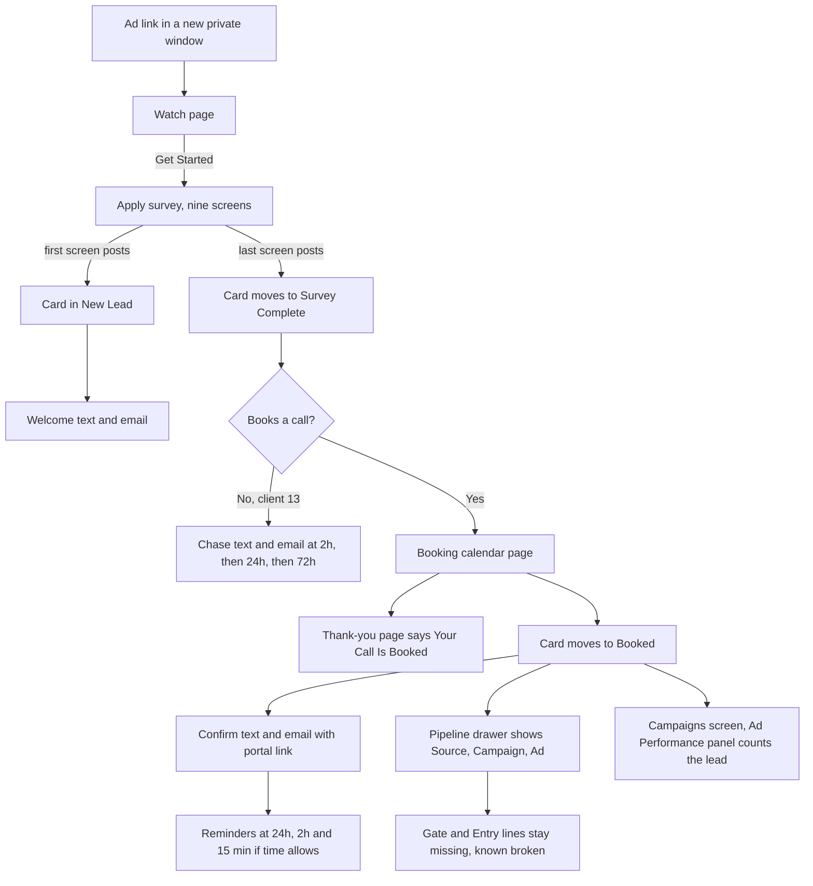
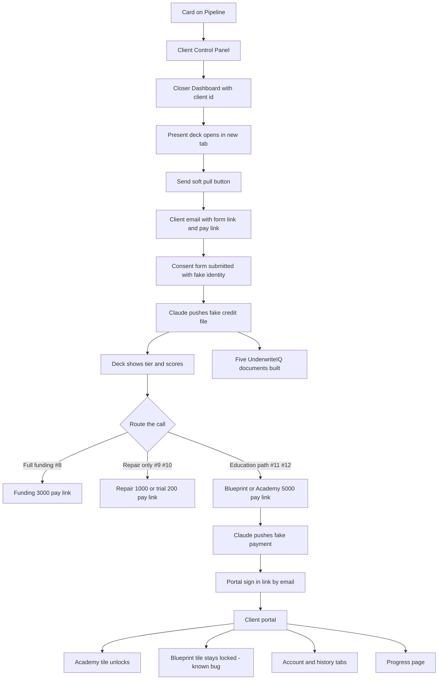
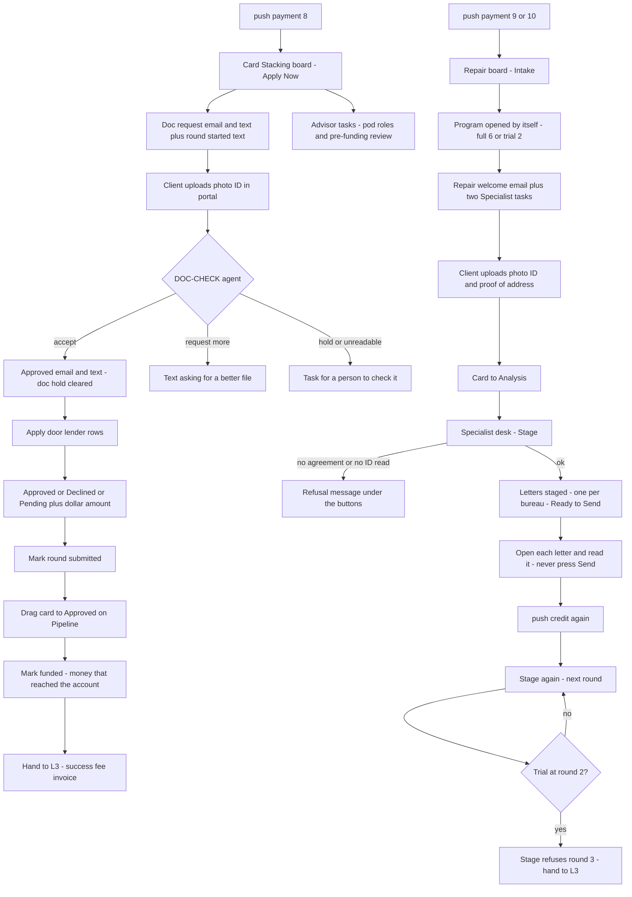
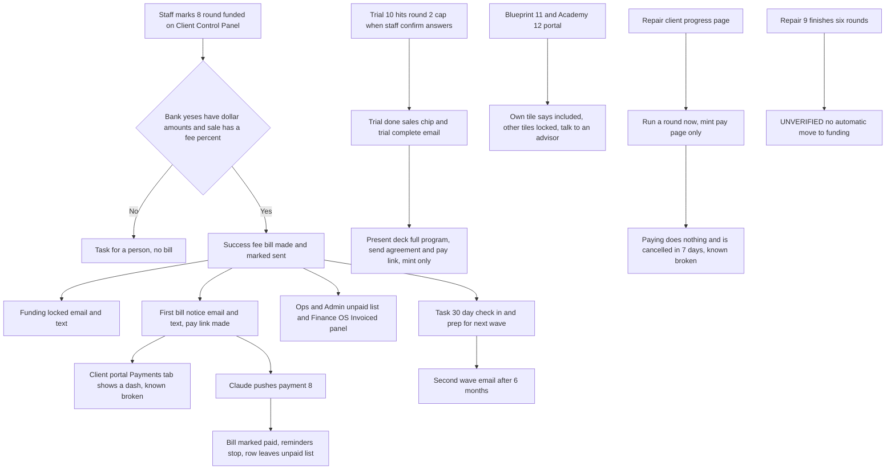

# Live walkthrough — 2026-09-16

**Who:** Chris clicks the live site and takes notes. Claude pushes the fake credit files and payments, and takes the notes.
**Tickable version:** `docs/workflows/live-walkthrough-2026-09-16.html` (open it beside the site). **Scope:** checking only. No new features, no fixes mid-walk.
**Traced from:** the build fundhub.ai was serving (`f739305e`, 2026-09-12). Local main was merged with it at `02c47b21`.

## L0 — Before you start

- fundhub.ai is running the **Sept 12 build**. If the new laptop build gets deployed first, the marketing screens change. See "If the new build is live" under L4.
- **Walk order:** 1) L4, all clients come in from their ad links. 2) L1, each client on the closer deck. 3) L2, fulfillment for #8, #9, #10. 4) L3, the money and the next offer.
- **New private window for every client** (Cmd+Shift+N). One email can run the funnel once.
- **Phone on every client: +16616054248** (the agent phone). Texts go there. Say "check texts #N".
- **Emails** land in your Gmail under the +sim-NN address.
- **Old test clients still exist:** Walk1–Walk4 and Sim One–Five. They are marked demo, so they are **hidden from Pipeline**. Their emails cannot run the funnel again. Use the fresh #8–#14.
- **Notes:** mark each step Worked / Broken / Not sure and type what you saw. Press "Copy my notes" and paste them into the chat.

### Test clients

| # | Name | Email | Ad link (open first, private window) | Path |
|---|---|---|---|---|
| #8 | Sim Eight-Funding | stanbridgejchris+sim-08@gmail.com | https://apply.fundhub.ai/watch?utm_source=fb&utm_medium=paid&utm_campaign=funding600&utm_content=42-ringlights&utm_term=sun | Soft pull → Funding done-for-you ($3,000) → funded → success fee |
| #9 | Sim Nine-Repair | stanbridgejchris+sim-09@gmail.com | https://apply.fundhub.ai/watch?utm_source=fb&utm_medium=paid&utm_campaign=sorting&utm_content=43&utm_term=nosun | Soft pull → Credit repair done-for-you ($1,000, six rounds) → letters |
| #10 | Sim Ten-Trial | stanbridgejchris+sim-10@gmail.com | https://apply.fundhub.ai/watch?utm_source=fb&utm_medium=paid&utm_campaign=sorting&utm_content=45&utm_term=sun | Soft pull → Repair trial ($200, two rounds) → upsell |
| #11 | Sim Eleven-Blueprint | stanbridgejchris+sim-11@gmail.com | https://apply.fundhub.ai/watch?utm_source=fb&utm_medium=paid&utm_campaign=uwiq&utm_content=26-underwriter&utm_term=sun | Capital Blueprint → portal |
| #12 | Sim Twelve-Academy | stanbridgejchris+sim-12@gmail.com | https://apply.fundhub.ai/watch?utm_source=fb&utm_medium=paid&utm_campaign=premium&utm_content=82&utm_term=nosun | Capital Academy → portal |
| #13 | Sim Thirteen-NoBook | stanbridgejchris+sim-13@gmail.com | https://apply.fundhub.ai/watch?utm_source=fb&utm_medium=paid&utm_campaign=sorting&utm_content=43&utm_term=nosun | Fills the survey, does NOT book → chase messages |
| #14 | Sim Fourteen (spare) | stanbridgejchris+sim-14@gmail.com | same link as the client you rerun | Only if a run above fails |

### Say this to Claude

| You say | Claude does |
|---|---|
| `push credit #N` | Claude puts a fake three-bureau credit file on that client. No bureau is called. |
| `push payment #N` | Claude marks the open pay link as paid with a fake receipt. Needs you to press "Send pay link" first. It refuses the $32 soft-pull link. |
| `make docs #N` | Claude makes the fake upload documents (license, bank statement, bill, SSN card; clean and bad copies). |
| `check texts #N` | Claude checks the texts that went to the agent phone for that client. |

### Never click

| What | Where | Why |
|---|---|---|
| "Pull TransUnion", "Pull Experian", "Pull Equifax" | Client Control Panel | Real credit pull |
| "Pay soft-pull assessment" / "Pay $32 assessment" | Soft-pull email and form page | Paying starts a real credit pull |
| Any pay link or Pay button | Emails, texts, portal | Real charge. Claude pushes the receipt instead |
| "Send with mail" | Specialist desk | Real paper mail |
| The old trial Enroll button | Specialist desk | Caps a client at the $200 two-round trial |
| Anything that deletes | Anywhere | — |

## L4 — Marketing: ad click to the lead in the CRM

Each fresh client (#8 to #14) starts from its own ad link. It goes through the watch page, the survey, the booking calendar and the thank-you page, then shows up as a card on the Sales board with the ad number under "How they got here". The welcome, booking and reminder messages should arrive, and so should the no-book chase for #13. The "Gate / Entry / Primary / Secondary" ad lines will not show on any screen, because the live server cannot read its list of ads.

### A. One client, start to finish (do #8 first, then repeat for each)

| Step | Client | Where | You do | You should see | Claude | Heads-up |
|---|---|---|---|---|---|---|
| L4.1 | #8 to #14 | A new private (incognito) browser window | Open a fresh private window for each client. Paste that client's ad link from Section B into the address bar. Never run two clients in the same window. | The watch page loads. The big headline reads "Get Up to $50,000 to $1,000,000 in Funding in 14 Days or Less", with a video and a "Get Started" button under it. |  | The page saves the ad details for this window only, and the first visit wins. Reusing a window can stamp the wrong ad on the next client. One email can only run the funnel once, so if a second pass gets blocked, that is expected. |
| L4.2 | #8 to #14 | Watch page, https://apply.fundhub.ai/watch?... | Click "Get Started". | The apply page. Small label "Application", headline "Let's See What You Qualify For", and the line "A few quick questions, then pick a time for your call. Soft pull only. Zero score impact." The survey sits under it. |  | The "Get Started" button goes to plain /apply, so the ad details are not in the new address. Whether they survive depends on ClickFunnels settings we cannot see. Step L4.17 tells you if they made it. |
| L4.3 | #8 to #14 | Apply page, survey screens 1 to 9 | Screen 1: first name Sim, the client's last name, the client's email, phone +16616054248. Then answer screens 2 to 9 with that client's answers from Section B. | Each screen moves to the next. Screen 6 changes the question on screen 7. If the client picks "No, personal funding only", screen 7 asks about income, not revenue. |  |  |
| L4.4 | #8 to #14 | Your phone (the agent phone) and Gmail | While you answer the survey, or right after, check the phone and the client's Gmail address. | A welcome text: "Hi Sim — Josh at Fundhub. Your application is in. Nothing is reviewed yet; that happens live with an advisor on your call. Pick a time here: ..." And a welcome email with the subject "You're in — here's what happens next". Each should come only once per client. |  | The welcome goes out on the very first survey post, so it can arrive before you finish screen 9. |
| L4.5 | #8, #9, #10, #11, #12, #14 | Booking page, https://apply.fundhub.ai/funding-book-call | Pick any open slot. Make sure the name, email and phone boxes on the calendar are filled in, then confirm the booking. Skip this step for #13. | Before you book, the page shows the label "Qualified · Funding Path", the headline "You Are Qualified.", and "Book Your Funding Call Below" above the calendar. |  | If the slot is less than 24 hours away, the day-before reminder is skipped on purpose. If it is less than 2 hours away, the 2-hour reminder is skipped too. We could not check whether the AI phone call from "Josh" is switched on, so the phone may or may not ring after booking. |
| L4.6 | #8, #9, #10, #11, #12, #14 | Thank-you page on apply.fundhub.ai | Look at the page after booking. You do not need to click the calendar buttons. | The label "Confirmed · Funding Path", the headline "You're All Set." with "Your Call Is Booked." under it, and "We'll see you then. Here's what to expect." You should also see your date and time, plus the "Add to Google Calendar" and "Apple / Outlook (.ics)" buttons. |  | If it says "We've Got Your Application." with no date and time, the page could not find the booking in this window. Note it. |
| L4.7 | #8, #9, #10, #11, #12, #14 | Your phone and the client's Gmail | Check for the booking confirmation right after you book. | A text: "You're booked, Sim. [time] with a Fundhub funding advisor, about 20 minutes. Reply CONFIRM so we know you're set, or move it here: ..." And an email with the subject "You're booked — [time]", which has a portal sign-in link that lasts a year. |  | Keep this email. It is the client's only way into the portal later. |
| L4.8 | #8, #9, #10, #11, #12, #14 | Your phone, later, as each call gets close | Watch the phone before the booked time. | If there was room: a day-before text ("your Fundhub call is tomorrow, at ..."), a 2-hour text ("your Fundhub call is in about two hours, at ..."), and a 15-minute text ("Your call starts in 15 minutes, and I've briefed your advisor ..."). |  |  |

### B. The ad link and survey answers for each client

| Step | Client | Where | You do | You should see | Claude | Heads-up |
|---|---|---|---|---|---|---|
| L4.9 | #8 | https://apply.fundhub.ai/watch?utm_source=fb&utm_medium=paid&utm_campaign=funding600&utm_content=42-ringlights&utm_term=sun | Name Sim Eight-Funding, email stanbridgejchris+sim-08@gmail.com. Answers for screens 2 to 9: $100k - $200k / Equipment or buildout / Grow faster / 700-749 / Yes, 2-5 years / $250k - $499k / Yes, bank statements / $5k - $25k. Then book. | The funnel runs as in Section A. Ad 42 is in the live ad list as "ringlights", group funding600. |  |  |
| L4.10 | #9 | https://apply.fundhub.ai/watch?utm_source=fb&utm_medium=paid&utm_campaign=sorting&utm_content=43&utm_term=nosun | Name Sim Nine-Repair, email stanbridgejchris+sim-09@gmail.com. Answers: $50k - $100k / Debt consolidation / Pay off pressure / 580-649 / Yes, 1-2 years / Under $100k / Not right now / $1k - $5k. Then book. | The funnel runs as in Section A. Ad 43 is in the live ad list, group sorting, with no title. That is fine. |  |  |
| L4.11 | #10 | https://apply.fundhub.ai/watch?utm_source=fb&utm_medium=paid&utm_campaign=sorting&utm_content=45&utm_term=sun | Name Sim Ten-Trial, email stanbridgejchris+sim-10@gmail.com. Answers: Less than $50k / Covering a shortfall right now / Stability / 580-649 / No, personal funding only / $50k-$99k (income) / Yes, both / Less than $1k. Then book. | Screen 7 asks about income, not revenue. Ad 45 is in the live ad list, group sorting. |  | We could not check which booking page ClickFunnels sends a no-business answer to. |
| L4.12 | #11 | https://apply.fundhub.ai/watch?utm_source=fb&utm_medium=paid&utm_campaign=uwiq&utm_content=26-underwriter&utm_term=sun | Name Sim Eleven-Blueprint, email stanbridgejchris+sim-11@gmail.com. Answers: $50k - $100k / Growth (marketing, inventory, hiring) / Grow faster / 650-699 / Yes, 6-12 months / Under $100k / Yes, tax returns / $5k - $25k. Then book. | The funnel runs as in Section A. Ad 26 is in the live ad list as "underwriter", group uwiq. |  |  |
| L4.13 | #12 | https://apply.fundhub.ai/watch?utm_source=fb&utm_medium=paid&utm_campaign=premium&utm_content=82&utm_term=nosun | Name Sim Twelve-Academy, email stanbridgejchris+sim-12@gmail.com. Answers: $200k - $400k / Growth (marketing, inventory, hiring) / Grow faster / 750+ / Yes, 5+ years / $1M+ / Yes, both / $100k+. Then book. | The funnel runs as in Section A. Ad 82 is in the live ad list, group premium. |  |  |
| L4.14 | #13 | https://apply.fundhub.ai/watch?utm_source=fb&utm_medium=paid&utm_campaign=sorting&utm_content=43&utm_term=nosun | Name Sim Thirteen-NoBook, email stanbridgejchris+sim-13@gmail.com. Use the same answers as #9. When the booking page opens, do NOT book. Close the window. | Welcome text and email as in L4.4. About 2 hours later: a text ("Your application is in, but there's no call on the calendar yet ...") and an email ("Your application is in — the call isn't booked yet"). A day after that: a second text and the email "The order matters more than the score". Three days after that: a last text ("Last one from me ...") and the email "Closing this out unless you want the call". |  | Nothing arrives in the first 2 hours. That wait is on purpose. |
| L4.15 | #14 | The ad link of whichever client you are rerunning | Only use #14 if a run above failed. Use email stanbridgejchris+sim-14@gmail.com, first name Sim, and the same answers as the client you are rerunning. | The same things as the client being rerun. |  |  |

### C. Find each lead in the CRM and check the ad number

| Step | Client | Where | You do | You should see | Claude | Heads-up |
|---|---|---|---|---|---|---|
| L4.16 | #8 to #14 | https://fundhub.ai/app/pipeline.html (Sales board) | Sign in as staff and open the board. Find each Sim client by name. | A new card lands in "New Lead". It moves to "Survey Complete" after screen 9, then to "Booked" once a slot is taken. #13 should stay in "Survey Complete". |  | The "— held" figure in the summary row is always a dash. Walk1 to Walk4 will not show here unless demo mode is on. |
| L4.17 | #8 to #14 | Sales board, click a Sim card, then the side panel section "How they got here" | Click the card and scroll to "How they got here". Do not press "Archive". | "Source" fb. "Campaign" is the ad group (funding600, sorting, uwiq or premium). "Ad" is the ad number as typed in the link (42-ringlights, 43, 45, 26-underwriter or 82). "Landed on" shows a page path. "Magnet" says VSL if the path is /watch, or Survey if it is /apply. |  | Known broken: four more lines ("Gate", "Entry", "Primary offer", "Secondary offers") should appear under these, but they will not. The live server cannot read its list of ads, and the screen hides the error. If "Ad" shows a dash, the ad details were lost between the watch page and the survey. |
| L4.18 | #8 to #14 | https://fundhub.ai/app/closer-dashboard.html?client_id=PASTE-CLIENT-ID, and the Client Control Panel for the same client | Paste the client's id from the address bar after you clicked its card. Look under the client's name. | The call screen opens for that client. |  | Known broken: the four ad lines (Gate, Entry, Primary, Secondary) stay hidden here, for the same reason as L4.17. The Client Control Panel shows nothing about which ad brought the person. Do not press any Pull button on that panel. |
| L4.19 | staff | https://fundhub.ai/app/campaign-manager.html, panel "AD PERFORMANCE — WHICH AD BOOKED A CALL" | Scroll to that panel. It opens on "lane". Then click "ad id", then "variant". | Under "lane": rows like funding600, sorting, uwiq, premium, with "Leads", "Booked calls", "Booked rate", "First booked" and "Last booked". Under "ad id": rows 42, 43, 45, 26 and 82 (the ad number only, no name). Under "variant": sun and nosun. Each count should go up as your Sim clients come in. #13 adds a lead but no booked call. |  | The counts include older test leads, so look for the number going up, not the exact total. The "gate", "entry", "primary offer" and "secondary offer" buttons are expected to show a message ending "Press Reload to try again." because they need the same missing ad list. |

### If the new build is live

- Campaigns screen: a new panel called "WHICH ANGLE AND WHICH HOOK ARE WORKING". It has buttons for angle, hook, lane, offer and script type, and a "Window" picker (7, 14, 30 or 90 days, 30 to start). Its columns are Label, Ads, Spend, People arrived, People booked, Cost per booked person, Hook rate and Hold rate. A dash means we do not know. A 0 means we counted zero.
- Campaigns screen: rows in the ad fatigue table get a "Label" button. It opens a "LINK THIS AD" box with a "Creative" picker, an "Our ad number" box (example 43), and "Save this link" and "Close" buttons. "Save this link" writes to the live data.
- A new door on the server takes in video-watching reports from the watch page. The watch page itself will look and act the same after a deploy. Nothing is measured until the new ClickFunnels piece (clickfunnels-fragments/07-vsl-watch-beacon.html) is pasted into the page by hand.
- The Gate / Entry / Primary / Secondary ad lines stay missing even after a deploy. The laptop's server settings (netlify.toml) and the ad-list reader (src/ads/registry.mjs) are the same as live, so the list of ads is still left out.
- Checked 2026-09-16: the laptop copy is in the middle of an unfinished merge. public/app/campaign-manager.html and netlify/functions/api.mjs still hold leftover merge marks (lines that start with <<<<<<< HEAD). If the laptop is deployed as it sits now, the Campaigns screen would show that stray text, and the server code would not load. The last saved version (commit 689fcc5c) does not have these marks.

### Watch closely — could not be traced in the code

- Whether the ad details survive the click from the watch page to the survey. "Get Started" goes to plain /apply, and the ad-tracking piece (06-utm-hidden-fields.html) is written for the application page. What ClickFunnels does here depends on its page settings and its own first-visit record, and neither is in the repo.
- Which key the live ClickFunnels workspace uses to send the hidden ad fields (custom_attributes or custom_fields). The journey page marks this UNVERIFIED, and the adapter reads both.
- Where the survey sends a person after screen 9, including whether #10 (no business) gets a different booking page. That is a ClickFunnels survey setting, not in the repo.
- The exact button labels inside the ClickFunnels survey and calendar widgets. They are built into ClickFunnels, not in the repo.
- Whether the AI phone call from "Josh" (ai-set-01) actually rings after booking. It depends on an outbound switch in the live environment, and I did not read that switch.
- Whether the newer text wording (db/seed/295_sms_copy_2026_09.sql) is actually saved in the live database. It is in the live build, but the database was not read.
- The welcome, confirmation and chase email bodies. Only the subject lines were traced.

## L1 — Front end: file, closer deck, soft pull, Capital Blueprint and Academy, client portal

You open the client's file, open the closer deck, send the soft pull, then Claude pushes a fake credit file and you close each client on the deck with a pay link that Claude then marks paid. For #11 and #12 you then go into the client portal and check every card, tab and button, plus the progress page.

### A. Open the file and the closer screens

| Step | Client | Where | You do | You should see | Claude | Heads-up |
|---|---|---|---|---|---|---|
| L1.1 | #8 | https://fundhub.ai/app/pipeline.html | Find the card for Sim Eight-Funding. Click the client's name on the card. Do the same later for #9 to #12. | The Client Control Panel opens. The web address ends in ?id= and a long code (the client id; copy it). Under "Client facts" you see the tiles Main Status, Prequal, Approved · confirmed, Inquiries on the credit file, Scores, Card Use and Funding Round. Before any credit file, Scores shows a dash. Near the top is a "Do this next" line. |  | This screen does not show which ad brought the person. Never click "Pull TransUnion", "Pull Experian" or "Pull Equifax" on this screen. They run a real credit pull. |
| L1.2 | #8 | https://fundhub.ai/app/closer-dashboard.html?id=CLIENT-ID (paste the id from L1.1) | Open the Closer Dashboard with the client id in the address. Look at the area under the client's name and the buttons beside it. | The client's name is the big heading. Beside it are the buttons "Join call" (grey if the booking has no meeting link), "Present", "Send contract" and "Send pay link". The "What they can get" boxes say "Waiting on UnderwriteIQ" until a credit file is on the client. With no id in the address, the page picks the next booked call, or says "No booked call right now". |  | The four ad lines (Gate, Entry, Primary, Secondary) will most likely stay hidden. On the live site the lookup behind them fails, and the screen hides the lines when that happens. This is the known "ad attribution cannot be read" problem. |
| L1.3 | #8 | Closer Dashboard, button row beside the name | Click "Present". | A new tab opens at present.html?contact= followed by the client id. On the left is the slide the client sees. On the right is the closer's control panel. At the bottom are the phase buttons 01, 02, 03, 04, 05 and 07, plus Back and Next. A "Client screen only" button hides the control panel. |  | The deck does not refresh by itself. After Claude pushes anything, reload this tab. |

### B. Soft pull (do for #8, #9, #10, #11, #12)

| Step | Client | Where | You do | You should see | Claude | Heads-up |
|---|---|---|---|---|---|---|
| L1.4 | #8 | Present deck, phase button "03" (slide S-05 "The assessment"), right-hand panel | Click "03". In the "Live soft pull" box, click "Send soft pull ($32 + approval form)". | Before the click the box reads "consent: waiting", "paid $32: not yet" and "pull: not started". After the click a message says "Soft pull emailed — pay link + approval form." |  |  |
| L1.5 | #8 | Chris's Gmail (stanbridgejchris+sim-08@gmail.com), then the form page it links to | Open the email titled "Your soft-pull assessment — authorize, then pay". Click "Open soft-pull authorization form". On the form, fill in the fake identity: Full legal name, Social Security number, Date of birth, Street address, City, State, ZIP. Skip "+ Add a business". Click "I agree — submit soft-pull approval". | The email has two links: the form and "Pay soft-pull assessment". A text also goes to the agent phone. The form page is titled "Approve your soft-pull assessment". After you submit, the page says "Consent saved" and shows a "Pay $32 assessment" button. |  | Do NOT click "Pay soft-pull assessment" in the email or "Pay $32 assessment" on the page. Paying the $32 starts a REAL credit pull. Claude's payment tool also refuses this link. |
| L1.6 | #8 | Present deck tab | Reload the deck tab and click "03" again. | The "Live soft pull" box now reads "consent: on file". |  |  |

### C. Fake credit file and what it fills in

| Step | Client | Where | You do | You should see | Claude | Heads-up |
|---|---|---|---|---|---|---|
| L1.7 | #8 | Chat with Claude | Ask Claude to push the credit files. Profiles: #8 funding, #9 repair, #10 trial, #11 blueprint, #12 academy. | Claude prints the scores, the tier and the funding estimate for each client. Expected scores (Experian / TransUnion / Equifax): #8, #11 and #12 get 771 / 766 / 778. #9 gets 541 / 552 / 566. #10 gets 604 / 611 / 618. The script says the Pipeline card moves to "Decision rendered". | say "push credit #8" (then #9, #10, #11, #12) | No bureau is called. The real scoring engine picks the tier; nothing forces it. |
| L1.8 | #8 | Present deck, right-hand panel, "03" and the "Engine data" lines at the bottom | Reload the deck tab. Click "03". | The "pull:" line no longer says "not started" and ends with "(from the stored result)". A "tier:" line appears. The "Engine data" line shows the tier, a dollar amount and the three scores. |  |  |
| L1.9 | #8 | Present deck, slide S-07 "Your results" (click "03", then Next twice) | Look at the client's slide. Repeat for #9 and #10. | For a funding tier (#8, #11, #12) it says "Pre-approved for approximately" with a big dollar amount, then the scores. For #9 and #10 it says "Here's what the AI found." with three score bars and a list of reasons. |  | On the repair slide the bar colours follow the bureau, not the score: Experian is always red, TransUnion always green, Equifax always blue. The small print under the headline is very small. |
| L1.10 | #8 | Client Control Panel (reload it), "Client facts"; then the "Documents" item in the left menu | Reload the client's file. Then open Documents from the left menu and look for this client. | The Scores and Card Use tiles no longer show a dash. The credit push also builds the five UnderwriteIQ documents: Credit Analysis Report, dispute letter pack, Credit Optimization Roadmap, Funding Snapshot, and Bank and Lender Match List. |  | No email or text tells the client their documents are ready. Files are kept in the server's short-term memory, so a document can show as saved and still fail to download after the server restarts. |

### D. Close each client on the deck (mint pay links, never pay them)

| Step | Client | Where | You do | You should see | Claude | Heads-up |
|---|---|---|---|---|---|---|
| L1.11 | #8 | Present deck, S-07 "Route the call" box, then phase "07" (S-23) "Do this now" box | On S-07, check that "FULL FUNDING" is picked (dark). Click "07". Click "Send agreement + pay link". When it is sent, click "Log disposition and close". | "Do this now" reads "Chosen: Funding, done-for-you · $3,000". After sending, a message says "Agreement and pay link sent." Gmail gets "Funding, done-for-you — $3,000" with a pay link, and the agent phone gets a text. The last button shows "Disposition written to contact record." | after the link is sent: say "push payment #8" | Even though the button says "agreement", the code only sends the pay link. Do not pay the link. Do NOT open "Other actions" and press "Send contract" for #8: the funding agreement still reads "PLACEHOLDER ... DO NOT SEND THIS" and nothing stops it going out. |
| L1.12 | #9 | Present deck, S-07 "Route the call", S-19 ladder, then "07" | #9: click "REPAIR ONLY". On S-19 click "Onboard now: full done-for-you $1,000". Click "07", then "Send agreement + pay link". #10: the same, but pick "Trial: first round done-for-you $200" on S-19. | "Chosen:" shows "Credit repair, done-for-you · $1,000" for #9 and "Repair test run (first round, done for you) · $200" for #10. Each gets the message "Agreement and pay link sent." Gmail gets a message titled with the offer name and price. | after each link: say "push payment #9" / "push payment #10" | Never press "Send letters now" on the deck. It sends real paper mail. "Stage letters" signs the client up and builds letters, which is desk work (L2). Do not press "Send contract" for #9: the repair agreement is still placeholder text. |
| L1.13 | #11 | Present deck, S-07, S-19, then "07" | On S-07 click "EDUCATION PATH". On S-19 click "Course 1: UWIQ deliverables + bank list $5,000". Click "07". In "Sale motion", choose Downsell or Upsell. Click "Send agreement + pay link". Then open "Other actions" and click "Send contract". | "Chosen: Capital Blueprint · $5,000". If you skip Sale motion, the message says "Choose downsell or upsell before creating this payment link." After sending, the message says "Agreement and pay link sent." and Gmail gets "Capital Blueprint — $5,000". After "Send contract", a "Copy the sign link" button and a link box appear. The Blueprint agreement has real text. | after the pay link: say "push payment #11" |  |
| L1.14 | #12 | Present deck, S-07, S-19, then "07" | On S-07 click "EDUCATION PATH". On S-19 make sure "Course 2: Funding Mastery $5,000" is picked. Click "07". Click "Send agreement + pay link". Then open "Other actions" and click "Send contract". | "Chosen: Capital Academy · $5,000". There is no Sale motion box. The message says "Agreement and pay link sent." Gmail gets "Capital Academy — $5,000". "Send contract" sends the Capital Academy agreement, which has real text. | after the pay link: say "push payment #12" |  |
| L1.15 | #11 | Present deck, "07" "Do this now" box | After Claude says the payment posted, reload the deck. Go to "07" (make sure EDUCATION PATH and Course 1 are still picked). Click "Send deliverables package now". Then click "Log disposition and close". For #12, only click "Log disposition and close". | The payment posts within about a minute of Claude's push. The deliverables button then says either "Deliverables sent. N document(s) saved to the client portal." or "Nothing was sent — " and the reason. The last button shows "Disposition written to contact record." | say "push payment #11" / "push payment #12" first | Nothing emails the client a way into the portal when a payment lands. Use L1.16. |

### E. Into the client portal (#11 and #12)

| Step | Client | Where | You do | You should see | Claude | Heads-up |
|---|---|---|---|---|---|---|
| L1.16 | #11 | Client Control Panel "Actions" group, or https://fundhub.ai/portal-login.html | Pick one way in. Staff way: on the client's file, click "Send portal sign-in link". Client way: open a PRIVATE browser window, go to portal-login.html, type stanbridgejchris+sim-11@gmail.com and click "Email me a sign-in link". Open the emailed link in that private window. | Staff way: a line under the button says "Sent at" and the time. Client way: the page says "If that email address has a Fundhub portal, a sign-in link is on its way." The link signs you in and lands on /app/client-portal.html. |  | The link works once and dies after 15 minutes. Use a private window: staff and client sign-ins are saved in the same place in the browser, so signing in as the client in your normal window signs you out as staff. |
| L1.17 | #12 | https://fundhub.ai/app/client-portal.html (private window), top half | Read the top of the page from the heading down. Click "Join on Facebook" only if you want to check the link. | The top bar says "Client Portal" with the client's name. The greeting says "Welcome to your Fundhub portal. You are all set." Under it: "Your payment is in. Your advisor is working your file." Below that are the welcome video card ("Welcome to the Fundhub portal"), the "Join the Fundhub wins group" card, a status card with a step tracker, and "Your credit scores". |  | Six of the eight tracker steps can never light up. "Welcome video is not available" shows when no video is set. If "Sign to authorize dispute letters" appears, the drawn signature is thrown away when you submit it. |
| L1.18 | #12 | Client portal, "Unlock More" and "What You Own" cards | On the "Capital Academy" tile, click "Open", open one module, then click "Close". On any locked tile, click "Talk to an advisor". Repeat as #11 and look at the "Capital Blueprint" tile. | #12: the Capital Academy tile says "Unlocked" and "Included — you own this". "Open" shows 10 modules, each saying "Video will show here when it is ready." "Talk to an advisor" opens the chat box with "I would like a call about:" and the product name typed in. If a call is on file, a "Booking on file" window opens instead. "What You Own" lists files you can download, or says "Nothing to download yet". |  | #11: the Capital Blueprint tile stays "Locked" after paying. The page looks for a different product code than the purchase gives. A document listed under "What You Own" can fail to download, because files are kept in short-term memory. |
| L1.19 | #11 | Client portal, "Account & history" drawer and the cards below it | Open "Account & history". Click each tab: "Payments", "Agreements", "Documents", "Activity", "Messages". Then look at "Your Funding Advisor", click "Ask for a call", and look for "Turn on notifications". | Five tabs switch the list below them. Agreements shows "No agreements yet" or the contract from L1.13. Documents lists the client's files. Activity lists events on the file. "Ask for a call" opens chat the same way as "Talk to an advisor". |  | Payments always says "No payments yet", even right after paying, and never shows an amount or a Pay button. Messages always says "No messages yet." "Turn on notifications" does nothing. |
| L1.20 | #11 | Client portal link "See exactly where your file stands →", which opens https://fundhub.ai/progress.html | Click the link. Scroll the whole page. Open "Refer a friend" only to look. | The page is titled "Your progress", with the sections "Where you are", "Your scores", "What moved", "What happens next", "Your checklist", "Your documents", "What has happened so far" and "Refer a friend". If you are not signed in, it sends you to the portal sign-in page. |  | If a "Run a round now" box shows, do NOT press "Continue". It opens a real payment page, and nothing ever does the work for a paid extra round. |

### Watch closely — could not be traced in the code

- Whether the Prequal tile on the Client Control Panel fills with the funding estimate after the fake credit push.
- Whether the fake credit push builds the five documents for the repair clients #9 and #10. Only the funding path was traced.
- The exact word the deck's "pull:" line shows after the push. The code only shows it is no longer "not started" and adds "(from the stored result)".
- Whether the soft-pull tile in the portal flips to "Done" after a fake credit file. It depends on how the server decides the pull ran, which was not traced.
- How a contract sent from the deck looks and signs inside the portal's "Your agreements" card.
- What "Your checklist", "What happens next" and the other progress-page sections say for a Capital Blueprint or Capital Academy buyer.
- Whether the upload doors ("Upload documents" and the others) appear for #11 or #12.
- Whether the repair trial agreement (#10) still has placeholder text. Only the funding and repair agreements are recorded as placeholders.
- What "Send deliverables package now" actually stores for #11, and whether its success message can be wrong. The status sweep reports false "delivered" answers on other delivery paths, but this one was not traced.

## L2 — Fulfillment: funding and credit repair

After a fake payment, the live site should put the funding client on the Card Stacking board and the repair clients on the Repair board by itself, then send the document request messages. Staff finish funding on the Client Control Panel (bank answers, then funded) and finish repair on the Specialist desk (Stage makes the letters), but letters only appear after a signed repair agreement and an accepted photo ID.

### Funding: Sim Eight-Funding (#8), from payment to funded

| Step | Client | Where | You do | You should see | Claude | Heads-up |
|---|---|---|---|---|---|---|
| L2.1 | #8 | https://fundhub.ai/app/pipeline.html, then the rail tab "Funding: Card Stacking" | After L1 has minted the $3,000 pay link, tell Claude to push the payment. Wait about a minute. Click the "Funding: Card Stacking" tab. | Sim Eight-Funding sits in the "Apply Now" column. You do not drag it there; the payment puts it there by itself. The older sheet said to drag it. That step is gone. | say "push payment #8" | If no card shows after 2 minutes, tell Claude. Nothing warns anyone when the payment job stops. That happened on 2026-09-06 and a real $3,000 payment sat unprocessed. |
| L2.2 | #8 | Chris's Gmail (stanbridgejchris+sim-08) and the agent phone | Check the inbox and the phone. | An email and a text asking for documents. A second text saying the funding round is underway. |  |  |
| L2.3 | staff | https://fundhub.ai/app/calendar.html, the "No date on it" list in the right column | Look for Sim Eight-Funding's tasks. | "Assign pod roles for funding client" and "Pre-funding review — CRS complete" (it says "Cannot start funding — CRS incomplete" if the fake credit file is missing). Each has "Claim" and "Mark done" buttons. |  | The same two tasks can show up twice. The Walk1 test client got exact copies of both. It is a data problem, not a screen problem. |
| L2.4 | #8 | Client Control Panel for #8, right column "Quick launch" area / Actions group: "Send portal sign-in link"; then Gmail | Press "Send portal sign-in link". Open the email as soon as it lands and click the link. At the same time, ask Claude to make the fake documents. | The client portal opens as Sim Eight. Claude reports nine picture files in docs/workflows/sim-documents/ (id-clean.png, id-blurry.png, id-expired.png, id-wrong-person.png, three bank statements, proof-of-address-clean.png, ssn-card-clean.png). | say "make the sim documents" (Claude runs scripts/sim/make-documents.mjs, which writes docs/workflows/sim-documents/) | The sign-in link from a paid client's email dies in 15 minutes. Open it right away. Paying does not email a sign-in link by itself. |
| L2.5 | #8 | https://fundhub.ai/app/client-portal.html, card "Send a file", box "ID and personal documents" | In "What is this? (helps us file it)" pick "Photo ID". Press "Upload documents". Choose id-clean.png. | The file uploads with no error. Within a few minutes an email and a text say the documents were approved. |  | Use only PNG, JPG or PDF. The picker also offers HEIC (iPhone photos), but the server always refuses it. |
| L2.6 | #8 | Same portal box, then the phone | Upload id-blurry.png as "Photo ID". Then upload id-wrong-person.png as "Photo ID". | For the blurry one, a text asking for a better file, and nothing is saved as proof. For the wrong-person one, either that same text or a staff task named "Document hold — …". If the agent could not read a file at all, a task appears instead: "Check this photo id by hand — nobody has read it". |  | Known bug: a document for the wrong person can still count toward a complete document set the moment it lands. |
| L2.7 | staff | Client Control Panel for #8, main column, block "Funding · Apply door" | Scroll to the lender list. Only look. Do not press "Apply". | Up to 25 bank rows, each with a logo and name. Each row shows either an "Apply" button or the words "No online application on file — this bank is applied to in a branch or by phone." Each row also has an "Approved $" box and three buttons: "Approved", "Declined", "Pending". |  | There is no "Generate Apps" button anymore. You removed it on 2026-09-06, and the list loads by itself. "Apply" opens the real bank's application through a paid proxy connection (a paid service that routes the visit), so leave it alone. |
| L2.8 | staff | Same block, on one lender row, then two more rows | Row 1: type 25000 in "Approved $" and press "Approved". Row 2: press "Declined". Row 3: press "Pending". | Under each row: "Approved · $25000 saved.", "Declined saved.", "Pending saved." The count above the list and the "Approved · confirmed" box update. Nothing counts as an application until one of these buttons is pressed. |  | If you press "Approved" with the box empty, you get "Add the dollar amount here as soon as the bank tells you." That empty amount will block Funded later. |
| L2.9 | staff | Client Control Panel for #8, right column, "More" then "Open Bank Inbox" | Open "More" and press "Open Bank Inbox". | A list of bank emails for this client, or the words "No bank messages for this client." In this test no real bank writes, so expect the empty message. |  |  |
| L2.10 | staff | Client Control Panel for #8, block "Funding round" | Press "Mark round submitted". | "Saved — mark the round submitted." The round Status updates. |  |  |
| L2.11 | staff | https://fundhub.ai/app/pipeline.html, tab "Funding: Card Stacking" | Drag Sim Eight-Funding from "Round Submitted" to "Approved". | The card stays in "Approved". The Client Control Panel has no Approved button, so the drag is the only way. |  |  |
| L2.12 | staff | Client Control Panel for #8, block "Funding round" | Press "Mark funded…". In "Money that reached the account" type 25000. Press "Save funded". | "Saved — mark the round funded." The card moves to "Funded" on the board. Stop here. L3 takes the success-fee invoice. |  | It refuses if any "Approved" bank row has no dollar amount, and the message names that bank. It also refuses an empty or zero amount. The Owner "funded" count can read 0 even when this round is funded (known). |

### Repair: Sim Nine-Repair (#9), $1,000, six rounds

| Step | Client | Where | You do | You should see | Claude | Heads-up |
|---|---|---|---|---|---|---|
| L2.13 | #9 | https://fundhub.ai/app/pipeline.html, rail tab "Optimization (Repair) Rounds"; then Gmail | After L1 minted the $1,000 pay link, tell Claude to push the payment. Wait about a minute. Open the tab. Check #9's inbox. | Sim Nine-Repair card on the Repair board at "Intake" (or "Awaiting Documents"). The six-round program opens by itself, so nobody presses Enroll. A repair welcome email arrives. Two tasks appear for the Specialist: "Start the repair program — confirm the plan with the client" and "Collect photo identification and proof of address". | say "push payment #9" | Do not press "Enroll" on the Specialist desk. It always signs the client up for the 2-round $200 trial. |
| L2.14 | staff | https://fundhub.ai/app/inquiry-remover.html, top toggle "Repair" | Press "Repair". Click the Sim Nine-Repair row. Press "Stage" once, before any ID is uploaded. | The row opens with four boxes: "Items", "Letters this round", "What is next", "Timeline", plus the buttons "Send", "Stage", "Enroll". "Stage" refuses with a line under the buttons. Either: "No signed repair agreement or staff authorization on file." or: "This client's ID has not been read yet, so no letter can name them. Upload and accept their government ID and proof of address, then try again." |  | Never press "Send" on this row. It sends real paper mail, just like "Send with mail". Letters need #9's signed repair agreement from L1 first. That contract's terms may still read "PLACEHOLDER … DO NOT SEND THIS." |
| L2.15 | #9 | Client portal as Sim Nine (sign-in link as in L2.4), box "ID and personal documents" | Upload id-clean.png as "Photo ID". Then upload proof-of-address-clean.png as "Proof of address". | The approved email and text arrive. On the Repair board the card moves to "Analysis". |  |  |
| L2.16 | staff | Specialist desk, "Repair", Sim Nine-Repair row | Press "Stage". Then click each letter under "Letters this round" and read it. Press "Close" each time. | "Letters staged." One letter each for Experian, Equifax and TransUnion, each listing that bureau's bad accounts with the last four digits. The row tag reads "Send letters" and the card moves to "Ready to Send". Each letter opens in a side panel with the client's name and a signature line ending "from the signed repair agreement". |  | Do not press "Send this one" in the side panel. It mails paper too. Known: letters have been missing a mailing address. Check the name and address hard. |
| L2.17 | #9 | Specialist desk, same row | Press "Stage" again right away. Then tell Claude to push a new credit file for #9. Press "Stage" a third time. | The second press refuses: "Pull a fresh credit report before this round. The newest one on file is older than the last round's letters, so we cannot tell what the bureaus already removed." After the new credit file, "Stage" makes the round 2 letters. | say "push credit #9" (second time, a newer file) | Do not use the "Pull TransUnion / Experian / Equifax" buttons for the new file. Those are real credit pulls. |

### Repair trial: Sim Ten-Trial (#10), $200, two rounds

| Step | Client | Where | You do | You should see | Claude | Heads-up |
|---|---|---|---|---|---|---|
| L2.18 | #10 | Pipeline, tab "Optimization (Repair) Rounds"; then the Specialist desk "Repair" tab | After L1 minted the $200 pay link, tell Claude to push the payment. Then repeat L2.15 to L2.17 for Sim Ten-Trial (upload ID and address proof, "Stage", read letters, push credit again, "Stage" for round 2). | Card on the Repair board. The program opens by itself as the trial, capped at 2 rounds. Round 1 and round 2 letters get staged the same way as #9. | say "push payment #10", later "push credit #10" before round 2 |  |
| L2.19 | #10 | Specialist desk, Sim Ten-Trial row | After round 2 letters exist, tell Claude to push one more credit file, then press "Stage" again. | It refuses. The line under the buttons reads "round_cap_exceeded". This is where the trial stops. Hand over to L3 for the upsell. | say "push credit #10" (third file) | The "Trial done — sales" tag and the trial-complete upsell email only fire after a bureau answer is uploaded and a person confirms it. Letters never get mailed in this test, so expect the tag not to show on this path. |

### Watch closely — could not be traced in the code

- Where documents are stored on the live site. The status sweep says the setting is missing and files could vanish on restart. An older 2026-08-24 scorecard says it was set in Netlify. The setting lives in Netlify, not in the code, so I could not confirm it. If a document upload saves but DOC-CHECK makes a 'nobody has read it' task, this is the first thing to check.
- Whether the Client Control Panel shows the documents hold. Its 'On hold because' box reads the funding round's own hold field, while the document request writes a different client field, so the box may stay a dash.
- Which screen, if any, shows the DOC-CHECK verdict to staff. I only traced the messages and tasks it creates.
- Letter PDFs. The Specialist desk shows each letter as text in a side panel. I found no PDF link or stored PDF for staged repair letters.
- The exact words in the Specialist desk 'Program' column for full versus trial.
- Whether the trial and funding purchases unlock the portal's 'ID and personal documents' box. That depends on which unlock (entitlement) each product grants on the live database: the box needs funding-snapshot or metro2-letter-pack.
- Whether the repair card waits on Intake before moving to Awaiting Documents. The waiting-period check in src/repair/croa.mjs depends on contract fields I did not trace.
- How a real bank reply email gets into the Bank Inbox in this test. The client inbox setup (F-10) and the bank email router (F-11) exist, but I did not trace a safe way to feed one in.
- Whether the credit-repair and trial contract text on the live database is still the placeholder. No migration after 288 changes it, but the live data was not checked.

## L3 — Money owed, money in, and the road back to the next offer

When #8's round is marked funded, the site works out the success fee, bills it, sends the first reminder by email and text, and makes a pay link, which Claude then pays with a fake receipt. The next-offer part is mostly a person's job: the trial's "trial done" flag and email, the locked tiles on the client's portal page, and the "Run a round now" button, which you should only use to make a pay link and never pay.

### A. #8 is funded and the success fee bill is made

| Step | Client | Where | You do | You should see | Claude | Heads-up |
|---|---|---|---|---|---|---|
| L3.1 | #8 | https://fundhub.ai/app/client-control-panel.html?id=<#8 client id> (open #8 from Pipeline). Main column, "Client facts" tiles, and the "Funding · Apply door" box | Look at the tile "Approved · confirmed". Look above the lender rows for a yellow box. | "Approved · confirmed" shows a dollar figure. It adds up only the bank yeses that have a dollar amount typed in. This is the number the fee is worked out from: this number times the fee percent agreed at the sale (10%). Example: $50,000 approved makes a $5,000 bill. |  | If a yellow box says a bank approval "is still waiting on its dollar amount", the round cannot be marked funded. Type the amount and press "Bank yes" first, or press "Doesn’t count" on that row. |
| L3.2 | #8 | Same page, "Funding round" box | Click "Mark funded…". Type the money that reached the account (for example 45000). Click "Save funded". Skip this step if the funding walk already did it. | The note under the buttons says "Saved — mark the round funded." The "Status" in the "Funding round" box changes after the page refreshes itself. |  | A blank box or a word is refused on purpose. Blank is not zero. |
| L3.3 | #8 | Chris's Gmail (stanbridgejchris+sim-08) and the agent phone | Wait about a minute. Refresh Gmail and check the texts. | An email titled "FR22 – Total Funding Locked" and a matching text. Then a bill email titled "Invoice INV-XXXXXXXX — Round N complete" with "Amount due:" and the fee amount. A text also comes from "Fundhub billing" with the same bill number and amount. |  | The bill email's "Pay here" link only goes to the portal sign-in page. The portal shows no amount and no pay button (see L3.8). The client has no working way to pay from this email. |
| L3.4 | #8 | Client Control Panel for #8, "Active blockers" at the top of the right-hand side | Reload the page. Read the cards under "Active blockers". | A card "Balance outstanding" with the amount owed. A task "Invoice client — confirmed approvals X @ 10% = Y (send)". Check the math: X times 10% should equal Y and the bill amount. A task "30-day check-in + prep for next wave" also appears. That task is the next-offer start for #8. |  | The amount on the "Balance outstanding" card is printed plainly, like "USD 5000.00", not as a $ figure. |

### B. Who owes what, and how old it is

| Step | Client | Where | You do | You should see | Claude | Heads-up |
|---|---|---|---|---|---|---|
| L3.5 | staff | https://fundhub.ai/app/ops-admin.html (sidebar "Ops & Admin"), section "AR + Collections — Oldest Unpaid First" | Scroll to the table and read #8's row and the total at the top right. | Columns: Client, Invoice, Amount owed, Overdue, Status. #8's row shows "INV-" plus 8 letters, the fee amount, and Status "Sent". The top right reads "$X owed · N invoices". |  | No bill is ever given a due date, so "Overdue" always says "No due date set". This list cannot show how old a bill is. |
| L3.6 | staff | Same page, the "OUTBOUND MAIL" card lower down | Only read it. Do not press any button in this card. | It may say "1 invoice(s) were never emailed to the client." This happens because the automatic bill notice does not count as the bill email. |  | Do not press "Email unsent invoices". It emails every unsent bill for every client, not just #8. Do not press "Pause sending" or "Send what is waiting" either. |
| L3.7 | #8 | https://fundhub.ai/app/finance-os.html (sidebar "Finance OS"), then "Find a client" at the top, pick Sim Eight-Funding | Open #8. Read the "Money in" and "Invoiced" panels. | "Money in" lists the $3,000 deposit under "Paid so far", plus a line saying the agreed success fee percent is not shown. "Invoiced" shows "Billed" as the fee, "Still owed" as the fee, and one row marked "not paid yet" and "no due date". |  |  |

### C. What the client sees, and the pay link

| Step | Client | Where | You do | You should see | Claude | Heads-up |
|---|---|---|---|---|---|---|
| L3.8 | #8 | https://fundhub.ai/portal-login.html (as the client), then the portal, section "Account & history", tab "Payments" | Type the #8 email. Click "Email me a sign-in link". Open the link from Gmail. Open "Account & history" and look at "Payments". | What should be there: the amount owed and a way to pay. |  | KNOWN BROKEN: this tab always shows "Success Fee" with a dash and "No payments yet" for every client. The server sends the amount and pay link, but the page never shows them. The "Messages" tab also always says "No messages yet." |
| L3.9 | #8 | https://fundhub.ai/app/present.html?contact=<#8 client id> (type the address; the "Open Closer Deck" link on the control panel is hidden) | Click the "07" button at the bottom. Click "Other actions". Click "Invoice this client". | A pop-up message: "Invoice emailed." In Gmail: "Your invoice from Fundhub — $X", with "What it is for: Funding success fee", "Due: on receipt", and a "Reference". |  | This email has no pay link. Its "Reference" is 8 plain letters and numbers, while Ops & Admin shows the same bill as "INV-" plus capital letters. |
| L3.10 | #8 | Claude session | Tell Claude to pay the bill. You do not make the pay link. The first bill notice in L3.3 already made it. | Claude's script prints the link, with purpose "custom" and the same dollar amount as the bill, then "HTTP 200". | say "push payment #8" | The script pays #8's newest open pay link. If the bill's pay link was never made, the newest one is the $32 soft pull, and the script refuses. That is a stop, not a pass. Never pay the link yourself. |

### D. After "push payment #8"

| Step | Client | Where | You do | You should see | Claude | Heads-up |
|---|---|---|---|---|---|---|
| L3.11 | #8 | https://fundhub.ai/app/ops-admin.html, "AR + Collections — Oldest Unpaid First" | Wait about a minute. Reload. | #8's row is gone and the total at the top right drops by the fee. If #8 was the only unpaid bill, it reads "No unpaid invoices" and "Nothing outstanding". The 7-day and 14-day reminders for this bill should never arrive. |  | If nothing changed after a few minutes, the background job that handles payments may be stuck. On 2026-09-06 a real $3,000 receipt sat unprocessed, and nothing alerts anyone when this happens. |
| L3.12 | #8 | Finance OS for #8 | Reload. Read "Money in" and "Invoiced". | "Money in" has a new paid line on top of the deposit. "Invoiced" shows "Paid" equal to the fee and "Still owed" at $0.00. The row now says "paid". |  |  |
| L3.13 | #8 | Client Control Panel for #8, "Active blockers" | Reload. | The "Balance outstanding" card is gone. |  |  |

### E. The road back to the next offer

| Step | Client | Where | You do | You should see | Claude | Heads-up |
|---|---|---|---|---|---|---|
| L3.14 | #10 | https://fundhub.ai/app/inquiry-remover.html (repair desk), tile "Trial ending" | After #10's round 2 bureau answers have been confirmed by staff, click the "Trial ending" tile. | #10 is listed with the label "Trial done — sales". Gmail for #10 gets "Your trial rounds are complete — next steps". It says a team member will reach out about the full program. |  | This only happens when a staff member confirms bureau answers at the round-2 limit. Nothing happens on a timer. Do not use the old trial "Enroll" button on the Specialist desk. |
| L3.15 | #10 | https://fundhub.ai/app/present.html?contact=<#10 client id> | Click "05". On the price slide, click "Onboard now: full done-for-you $1,000". Click "07". Click "Send agreement + pay link" once. Do not pay it. | A pop-up message: "Agreement and pay link sent." Gmail for #10 gets the agreement and a pay link for $1,000. |  | The status sweep says the agreement sent after a repair or funding call can open with PLACEHOLDER text instead of the real terms. Note what the agreement says. |
| L3.16 | #11 | Client portal as #11 (sign in at https://fundhub.ai/portal-login.html), section "Unlock More" | Look at the tiles. Click "Talk to an advisor" on "Funding, done-for-you". Close the chat without sending. | The "Capital Blueprint" tile is unlocked and its price line reads "Included — you own this". The other tiles say "Locked". "Talk to an advisor" opens the chat with the topic filled in. Repeat as #12: there, the "Capital Academy" tile should be the one unlocked. |  | There is no online checkout on these tiles. The window says "Online checkout is not available yet." The only next step is chat with an advisor. |
| L3.17 | #9 | https://fundhub.ai/progress.html (as the client; it sends you to sign-in first), section "Run a round now" | Click "Continue". Then "Yes, continue". Then "Take me to payment". When "Your payment page is ready" shows, click "Close". Do NOT click "Open payment page". Reload the page. | The first window is "Here is what you are buying", with prices. The second is "Confirm $X". After you reload, the section says "You already have one in progress". |  | KNOWN BROKEN: if this link is paid, nothing runs, and after 7 days the request is cancelled as if unpaid. Never pay it. If the section says "Not available on your file right now", #9 is not eligible yet. That is not a pass or a fail for this step. |
| L3.18 | #9 | Client portal as #9, "Unlock More" | Look at the "Funding, done-for-you" tile. | It says "Locked", with "Talk to an advisor". That is the only road to funding the portal shows a repair client. |  | Nothing moves #9 toward funding by itself when repair ends. The system only makes a "Re-pull CRS and re-underwrite — new round" task for clients whose funding was paused first. The status sweep also left open who declares six rounds finished. |

### If the new build is live

- Finance OS: the laptop build adds a new panel, "Optimize your accounts" (a paid monthly add-on). For a client who has not bought the add-on, it shows a not-subscribed message. The "Money in" and "Invoiced" panels used in L3.7 and L3.12 are unchanged.

### Watch closely — could not be traced in the code

- Which screen shows the commission earned when #8's success fee is paid. The payment writes commission rows, but I did not confirm which rep's "My Numbers" screen ("Paid out" / "Pending funding") would show it.
- What happens when the #10 full-program pay link from L3.15 is paid by a trial client who already has a repair program: whether it enrolls into six rounds or clashes with the trial record.
- Any automatic next-offer message for course buyers (#11 Blueprint, #12 Academy) after purchase. I found only the locked tiles on the portal.
- Whether the "Round N" number in the bill email subject is filled in for #8. It reads a saved field that I did not trace.
- Whether the task "Invoice client — confirmed approvals … (send)" closes by itself after payment. I found no code that closes it.
- #8's second-wave offer: an email and a task are set for 6 months after funding, so they cannot be seen during this walk.

## Evidence (for Claude, not for the walk)

- L4.1: clickfunnels-fragments/01-vsl.html:129, :159; clickfunnels-fragments/06-utm-hidden-fields.html:36-52 (sessionStorage fh_attribution, first touch wins)
- L4.2: clickfunnels-fragments/01-vsl.html:159 (href="/apply"); clickfunnels-fragments/02a-apply-top.html:81
- L4.3: docs/workflows/manual-walkthrough-SOP.md section 3 table (laptop repo); src/adapters/clickfunnels.mjs survey.submitted path
- L4.4: src/workflows/s-00-welcome.mjs:11-28 (entry.captured, one-time lock s00_welcome_sent_at); db/seed/295_sms_copy_2026_09.sql:54-55; db/seed/013_section4_message_templates.sql:40-42
- L4.5: clickfunnels-fragments/04a-book-top.html:83, :86-110 (saves fh_booking_v1 only when name and email are filled); src/workflows/s-04b-booking-reminders.mjs (booked_inside_24h / booked_inside_2h); src/workflows/ai-set-01-josh-setter.mjs:1-12
- L4.6: clickfunnels-fragments/05-thank-you.html:143 (default wording), :206-226 (calendar block), :290-313 (booked upgrade)
- L4.7: src/workflows/s-04b-booking-reminders.mjs:21-22, :156, :195 (365-day link); db/seed/295_sms_copy_2026_09.sql:58-59; db/seed/012_s04_booking_confirm_email.sql:19-21
- L4.8: src/workflows/s-04b-booking-reminders.mjs:23-24, :277, :296; src/workflows/ai-set-04-3way-handoff.mjs:9-20, :116; db/seed/295_sms_copy_2026_09.sql:63-75
- L4.9: docs/ads/registry.json id 42 (lane funding600); manual-walkthrough-SOP.md section 3 row 1
- L4.10: docs/ads/registry.json id 43 (lane sorting, title null); SOP section 3 row 2
- L4.11: docs/ads/registry.json id 45 (lane sorting); SOP section 3 row 3
- L4.12: docs/ads/registry.json id 26 (lane uwiq, primary capital_blueprint); SOP section 3 row 4
- L4.13: docs/ads/registry.json id 82 (lane premium); SOP section 3 row 5
- L4.14: src/workflows/s-nobook-chase.mjs:12-17, :72, :87, :102; db/seed/295_sms_copy_2026_09.sql:82-95, :100-105; db/seed/013_section4_message_templates.sql:137-139, :184-186
- L4.15: src/workflows/s-00-welcome.mjs:19-21 (one welcome per client)
- L4.16: db/seed/002_pipelines.sql:29-30; src/handlers/client-lifecycle.mjs:281-285, :300-308; src/handlers/comms.mjs:480-490 (stageKey booked); api/dashboard/pipeline.mjs:131, :161; pipeline.html:728
- L4.17: public/app/pipeline.html:2321-2327, :2189-2234 (paintAdRouting returns silently on !r.ok); src/handlers/client-lifecycle.mjs:250-268; netlify.toml:99-104 (docs/ads/registry.json not bundled); src/ads/registry.mjs:22, :129; docs/ops/2026-09-12-status-sweep.md Marketing
- L4.18: public/app/closer-dashboard.html:448-450, :565-570 (#ccp-ad hidden); public/app/closer-call.js:213-229; api/read/ad-attribution.mjs:19, :64; docs/ops/2026-09-12-status-sweep.md Marketing
- L4.19: public/app/campaign-manager.html:374-395, :823, :835, :1159-1185, :2125-2145, :2042-2050; api/read/ad-books.mjs:39-72 (lane/ad_id/variant skip resolveAd); src/ads/registry.mjs:127-137
- L1.1: public/app/pipeline.html:2339; public/app/client-control-panel.html:760-763, 1011-1015, 1050-1066; docs/ops/2026-09-12-status-sweep.md:113
- L1.2: public/app/closer-dashboard.html:447-451, 561-579, 624-631; public/app/closer-call.js:213-232, 843-860; src/ads/registry.mjs:22; netlify.toml:99; docs/ops/2026-09-12-status-sweep.md:98-102
- L1.3: public/app/closer-call.js:133-149; public/app/present.js:177, 956-962, 1019-1022, 1426-1470
- L1.4: public/app/present.js:795-811, 1322, 1398
- L1.5: src/sales/closer-deck.mjs:540-600; public/app/soft-pull-approve.html:214-250, 320-340; scripts/sim/push-payment.mjs:16-19
- L1.6: public/app/present.js:797-798, 1430-1466
- L1.7: scripts/sim/push-credit.mjs:1-24, 740-787, 1114-1127, 1135
- L1.8: public/app/present.js:800-806, 960-975
- L1.9: public/app/present.js:350-355, 486-500; docs/workflows/walkthrough-4-2026-09-06.md:67-73; docs/ops/2026-09-12-status-sweep.md:305-313
- L1.10: public/app/client-control-panel.html:1058-1066; scripts/sim/push-credit.mjs:1108-1111; src/handlers/crs-deliverables.mjs:1-60; src/register-all.mjs:70-76; public/app/client-portal.html:787-793; docs/ops/2026-09-12-status-sweep.md:44-68
- L1.11: public/app/present.js:813-822, 866-890, 925-946, 1320-1326, 1401, 1416-1418; src/sales/closer-deck.mjs:723-800; src/config/offers.mjs:95-104; db/migrations/288_real_contract_text.sql:26-29
- L1.12: public/app/present.js:242-250, 832-845, 896-904, 1206-1278; src/config/offers.mjs:107-126; db/migrations/288_real_contract_text.sql:26-29
- L1.13: public/app/present.js:242-253, 824-832, 846-866, 880-890, 925-935; src/sales/closer-deck.mjs:738-747; src/config/offers.mjs:129-165; db/migrations/288_real_contract_text.sql:23-24
- L1.14: public/app/present.js:242-253, 824-832, 880-890; src/config/offers.mjs:168-176; db/migrations/288_real_contract_text.sql:23-24
- L1.15: public/app/present.js:880-883, 1303-1318, 1414-1418; scripts/sim/push-payment.mjs:7-14; docs/ops/2026-09-12-status-sweep.md:84-88
- L1.16: public/app/client-control-panel.html:1045-1047, 3037-3095; public/portal-login.html:29-45, 183; src/auth/magic-link.mjs:56, 264-289; public/app/client-portal.html:2215-2220
- L1.17: public/app/client-portal.html:415-452, 490-530, 591-614, 1886-1892, 2306; api/read/portal-summary.mjs:298-302; docs/ops/2026-09-12-status-sweep.md:90-98
- L1.18: public/app/client-portal.html:700-822, 1391-1398, 1636-1700, 1743-1780, 1176-1221; docs/ops/2026-09-12-status-sweep.md:94-95, 44-50
- L1.19: public/app/client-portal.html:828-921, 941, 2243-2282; docs/ops/2026-09-12-status-sweep.md:79-84, 99, 105-113, 235-243
- L1.20: public/progress.html:181-213, 269, 981-1013, 1120-1140, 1310; docs/ops/2026-09-12-status-sweep.md:15-27
- L2.1: src/handlers/purchase-routing.mjs:41,75-76,162-168; netlify/functions/commas-inbox-sweeper.mjs:28,70; db/seed/002_pipelines.sql:34; src/funding/card-stacking-rounds.mjs:6 (apply_now fires round.started)
- L2.2: src/workflows/s-doc-collection.mjs:12-13,27-36 (on deposit.paid); src/workflows/round-started-client-notify.mjs:20-27 (on round.started); templates in db/seed/013_section4_message_templates.sql and db/seed/015_live_template_backfill.sql
- L2.3: src/workflows/f-01-funding-intake.mjs:23,60-63; src/workflows/c-05-pre-funding-review.mjs:38-49; public/app/calendar.html:275,536-546; docs/workflows/walkthrough-4-2026-09-06.md:49-50
- L2.4: public/app/client-control-panel.html:1043-1046; scripts/sim/make-documents.mjs:4,33,200-221 (laptop copy; not in the live tree, runs on the laptop); docs/ops/2026-09-12-status-sweep.md portal section
- L2.5: public/app/client-portal.html:660-674,1491-1495; src/documents/upload-validate.mjs:11; api/documents-upload.mjs:155 (fires docs.received); src/workflows/doc-check.mjs:17-21; src/handlers/doc-check.mjs:120-160 (accept sends EMAIL-DOC-03-APPROVED and SMS-DOC-03-APPROVED, clears the Documents Pending Approval hold and the docs:missing tag)
- L2.6: src/handlers/doc-check.mjs:94-108 (unchecked task), :163-171 (request_more sends SMS-DOC-02-REQUEST-MORE), :174-186 (hold task); scripts/sim/make-documents.mjs:203-208; docs/workflows/walkthrough-4-2026-09-06.md:349
- L2.7: public/app/client-control-panel.html:1023-1030,3410 (25-row limit),3897-3915,4069,4140-4148; public/app/proxy-apply.js:1-6,243 (POST /api/proxy/launch)
- L2.8: public/app/client-control-panel.html:4069-4108 (POST /api/applications, stored as Approved / Denied / Applied),1075,3491-3525; src/applications/status.mjs logBankDecision
- L2.9: public/app/client-control-panel.html:1253-1259,2489-2530 (reads bank-inbox)
- L2.10: public/app/client-control-panel.html:897-909,3160-3200; src/funding/card-stacking-rounds.mjs:7,30 (round_submitted fires round.submitted)
- L2.11: db/seed/002_pipelines.sql:34-35; src/funding/card-stacking-rounds.mjs:8; public/app/pipeline.html:1080-1110
- L2.12: public/app/client-control-panel.html:3205-3229; src/funding/card-stacking-rounds.mjs:10,151-230 (guardFundedAmount); public/app/pipeline.html:1088-1095; docs/workflows/manual-walkthrough-SOP.md:131
- L2.13: src/handlers/purchase-routing.mjs:42,77-78,281; src/workflows/repair-enrollment.mjs:47-54,113-120,144-170,246-270; src/repair/pipeline.mjs:64-66; src/repair/notify.mjs:24; public/app/inquiry-remover.html:3979-3993
- L2.14: public/app/inquiry-remover.html:470-471,587,3862-3871,3884-3893 (Send uses mail: true),3918-3941 (Stage calls /api/repair/generate); api/repair/generate.mjs:24-56; src/repair/analyze.mjs:534-536,663-665; src/repair/dispute-auth.mjs SIGNED_REPAIR_SQL; docs/workflows/walkthrough-4-2026-09-06.md:77-83
- L2.15: public/app/client-portal.html:1491-1495 (repair buyers get this box); src/handlers/doc-check.mjs:120-160; src/repair/handlers.mjs:58-120 (docs.received sets repair.docs.complete); src/repair/pipeline.mjs:67
- L2.16: public/app/inquiry-remover.html:3100-3125 (tags),3352-3398 (letter panel; Send this one uses mail: true),3928-3934; src/repair/analyze.mjs:909-915 (repair.letters.ready); src/repair/pipeline.mjs:70; docs/workflows/walkthrough-4-2026-09-06.md:347-348
- L2.17: api/repair/generate.mjs:31-33,107-130 (next round picked from rounds already done); src/repair/analyze.mjs:566-580; src/metro2/rounds/state.mjs:27-33
- L2.18: src/workflows/repair-enrollment.mjs:52,113-120 (repair-trial is program trial, 2 rounds)
- L2.19: src/repair/analyze.mjs:552-562; api/repair/generate.mjs:123-125; public/app/inquiry-remover.html:3103,3121,3933-3934; src/metro2/rounds/program-cap.mjs:40-80; src/metro2/inbound/confirm.mjs:6; src/repair/notify.mjs:29
- L3.1: public/app/client-control-panel.html:1075, :3459-3469; src/funding/success-fee.mjs:1-60; src/workflows/f-07-funding-locked.mjs:85-123
- L3.2: public/app/client-control-panel.html:899-910, :3132-3230; src/funding/card-stacking-rounds.mjs:33 (move to funded sends round.funded)
- L3.3: src/workflows/f-07-funding-locked.mjs:143-171; src/workflows/ar-collections.mjs:108-130; db/seed/013_section4_message_templates.sql:24-25, :805-830; db/seed/015_live_template_backfill.sql:500-510; src/workflows/messaging.mjs:139
- L3.4: src/http/client-detail.mjs:202-209; src/workflows/f-07-funding-locked.mjs:169-170; src/workflows/f-08-post-funding-monitoring.mjs:16-29; public/app/client-control-panel.html:868-869
- L3.5: public/app/ops-admin.html:371-379, :1074-1170; api/read/invoices.mjs:40-61; src/invoices/index.mjs:8-9 (no due date policy); src/workflows/f-07-funding-locked.mjs:149-162 (no dueAt passed)
- L3.6: public/app/ops-admin.html:410-417, :942-951, :1008-1010; src/invoices/notify.mjs:164-176
- L3.7: public/app/finance-os.html:325-339, :778-853, :485-493, :963-1000; api/dashboard/client.mjs:85-86, :115-117
- L3.8: public/portal-login.html:39; public/app/client-portal.html:831, :843-852, :881; api/read/portal-summary.mjs:254, :422; docs/ops/2026-09-12-status-sweep.md:105-113
- L3.9: public/app/present.js:177, :919-922, :1329-1356; src/invoices/notify.mjs:48-73; db/seed/008_contract_messages.sql:99-110; public/app/client-control-panel.html:1238-1248
- L3.10: src/workflows/ar-collections.mjs:55-88, :121; scripts/sim/push-payment.mjs:99-114
- L3.11: src/invoices/allocate.mjs:265-266; src/workflows/ar-collections.mjs:196-219 (stops on invoice.paid); public/app/ops-admin.html:1122-1128; docs/ops/2026-09-12-status-sweep.md:127-129
- L3.12: src/handlers/client-lifecycle.mjs:314-328; public/app/finance-os.html:778-853
- L3.13: src/http/client-detail.mjs:202 (only bills with a balance above zero make a card)
- L3.14: public/app/inquiry-remover.html:579, :3103, :3121; src/metro2/inbound/confirm.mjs:115-116; src/metro2/rounds/program-cap.mjs:40-78; src/repair/notify.mjs:29, :179-191; db/migrations/253_repair_email_templates.sql:130-146
- L3.15: public/app/present.js:242-253, :845-847, :870-893, :1325, :990-992; docs/ops/2026-09-12-status-sweep.md:77
- L3.16: public/app/client-portal.html:726-805, :1083-1106, :1160-1175, :1659-1667
- L3.17: public/progress.html:269, :981-1017, :1071-1170; src/paid-services/round.mjs:211-231, :766-775; docs/ops/2026-09-12-status-sweep.md:16-29
- L3.18: public/app/client-portal.html:745-754; src/repair/handlers.mjs:224-231; src/crs/snapshot-negatives.mjs:274-290; docs/ops/2026-09-12-status-sweep.md:143-144

## Findings

`step | worked / broken / not sure | what you saw`

(paste from the tickable page)
