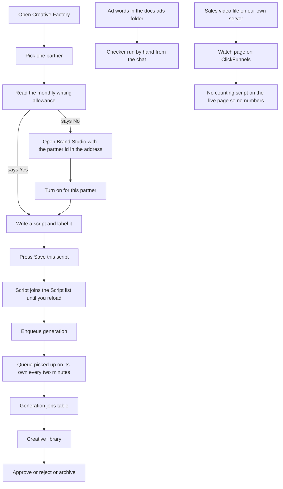
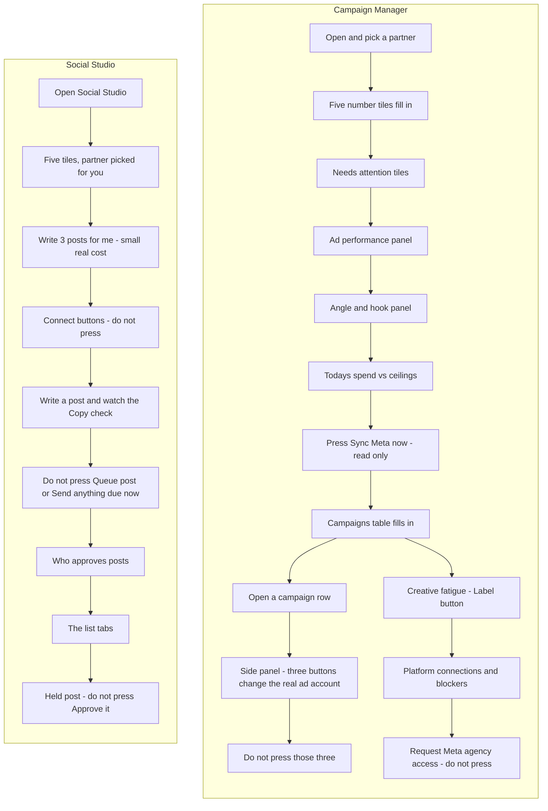
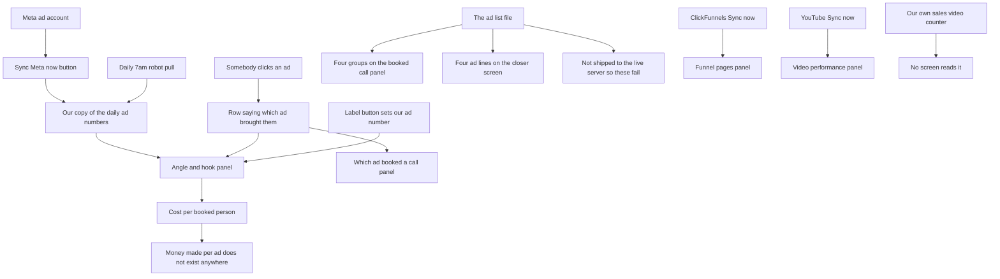

# Marketing walkthrough — 2026-09-17

**Who:** Chris clicks the live site and takes notes. Claude takes the notes and fixes after.
**Tickable version:** `docs/workflows/marketing-walkthrough-2026-09-17.html`. **Scope:** checking only, no fixes mid-walk.
**Traced from:** local main = the build deployed 2026-09-16.

## M0 — Before you start

- **This is the marketing side:** making ads, running them, measuring them. The client side (ad click → lead) is the other sheet, `live-walkthrough-2026-09-16.html`.
- **Order:** M1 make it, then M2 run it, then M3 measure it.
- **You are signed in as the owner already.** These are staff screens, not client pages.
- **Read the red list below first.** 25 buttons on these screens spend real advertising money, post in public, or connect a real account. Walking around them is the whole trick.
- **Nothing here texts or emails a client.**
- **Mark each step** Worked / Broken / Not sure and type what you saw. Press "Copy my notes" and paste them into the chat.

### Never press

| Lane | What not to press, and why |
|---|---|
| M1 | NEVER PRESS "Enqueue generation" with "Kind" set to copy — Creative Factory, the "Generate and decide" card. copy is the one kind written in our code to call a real paid writing service with a key we already hold. |
| M1 | TREAT "Enqueue generation" AS THE POINT OF NO RETURN — Creative Factory, the "Generate and decide" card. There is no cancel button anywhere on the screen and a waiting job is picked up on its own every two minutes. Press it once, read the sentence that comes back, and stop. "Kind" set to static or video is safer on paper, but the real address those use is a setting in the live database that nobody can read from a laptop, so treat them as unknown rather than free. |
| M1 | NEVER PRESS "Run queued jobs now" once a batch is waiting AND the screen has not told you that no service is switched on — Creative Factory, the "Generate and decide" card. It reaches the outside service straight away, up to three jobs at once. With nothing waiting, or after the screen has said no service is switched on, it is safe. |
| M1 | NEVER PRESS "Write page copy" — Brand Studio, the box marked "BS-06 / GENERATION". It sends work to a paid writing service using our key. It only appears after you press "Turn on for this partner", so it will not be on screen until you turn that on. The button next to it, "Make a wordmark from the name", draws the name on our own server and costs nothing. |
| M1 | NEVER PRESS "Send anything due now" — Social Studio, one click away in the "Marketing" menu down the left. It sends real posts to the public on real accounts. Nothing on this sheet needs it. |
| M1 | NEVER TYPE IN "Client ID", "Client secret" or "Refresh token", and never press "Connect" — Creative Factory, the "Video performance" card at the bottom. Those are live Google sign-in secrets and this walk does not need them. The "Sync now" button beside them only reads and is safe. |
| M1 | NEVER PRESS "Approve this brand" or "Send it back" — Creative Factory, the "Review queue" card, inside an opened row whose first column says "Brand". Those change a real partner's brand, not a test one. |
| M1 | NEVER PRESS "Turn off" by mistake — Brand Studio, the box marked "BS-06 / GENERATION". It sits in the same spot as "Turn on for this partner" and only one of the two shows at a time, so a double-tap undoes what you just did. |
| M2 | NEVER PRESS — Campaign Manager, the panel that slides out when you click a campaign row, "Start spending again": turns a real Meta campaign back on and it starts spending against its daily budget straight away. A pop-up asks first; Cancel is safe. |
| M2 | NEVER PRESS — Campaign Manager, the same panel, "Change daily budget": sets what that real ad account may spend every day on that campaign, from then on. A pop-up asks first; Cancel is safe. |
| M2 | NEVER PRESS — Campaign Manager, the same panel, "Stop spending": switches a live real Meta campaign off. No money goes out, but a live campaign changes. A pop-up asks first; Cancel is safe. |
| M2 | NEVER PRESS — Campaign Manager, the box headed "REQUEST META AGENCY ACCESS", "Request access": sends a real access request to a real business on Meta and a real person on their side is asked to approve it. There is NO pop-up and no undo on this screen. |
| M2 | NEVER PRESS — Social Studio, box headed "Write a post", "Send anything due now": puts every post already past its time onto the partner's real social accounts, in public, immediately. A pop-up asks first; Cancel is safe. It cannot be taken back afterwards. |
| M2 | NEVER PRESS — Social Studio, box headed "Write a post", "Queue post": if an account is connected and this partner's approval setting is off, the job that runs every five minutes then sends it in public with nobody pressing anything else. There is NO pop-up. |
| M2 | NEVER PRESS — Social Studio, "Waiting" tab, "Approve it" on a held post: releases a held post so it goes out in public at its send time. A pop-up asks first; Cancel is safe. |
| M2 | NEVER PRESS — Social Studio, "Connect Facebook", "Connect Instagram" and "Connect LinkedIn": finishing one of these marks a real account live, and from that moment the every-five-minutes job is able to post to it in public. |
| M2 | SPENDS A LITTLE, only press if you mean it — Social Studio, box headed "Write posts", "Write 3 posts for me": uses up part of the partner's paid monthly writing budget. It makes drafts only and posts nothing in public. |
| M2 | DO NOT TYPE A KEY — Campaign Manager, box headed "CONNECT CLICKFUNNELS", the "API key" field and the "Connect" button: this saves a real ClickFunnels key and runs a sync straight away. No money and nothing public, but not something to try out. |
| M3 | NEVER PRESS — "Stop spending". Campaigns screen, click a campaign row, then the box headed "CHANGE THIS CAMPAIGN ON META" inside the side panel. Sends a real stop to Meta. That campaign's ads stop being shown and stay stopped until somebody starts them again. It asks a yes-or-no question first — press Cancel. (public/app/campaign-manager.html:1949; api/campaigns/write.mjs:1) |
| M3 | NEVER PRESS — "Change daily budget", and the field beside it reading "New daily budget, in cents". Same box, same side panel. Sets what a real ad account is allowed to spend on that campaign every day from then on. Asks first — press Cancel. (public/app/campaign-manager.html:1951-1954; api/campaigns/write.mjs:1) |
| M3 | NEVER PRESS — "Request access". Campaigns screen, card headed "PLATFORM CONNECTIONS & LAUNCH BLOCKERS", in the box headed "REQUEST META AGENCY ACCESS". Sends a real partnership request to another company's Meta administrator, who is a real person and will see it waiting for them. There is NO are-you-sure question on this one. (public/app/campaign-manager.html:637-654; api/campaigns/meta-agency.mjs:100-130) |
| M3 | NEVER PRESS — "Enqueue generation" and "Run queued jobs now". Creative Factory screen, card headed "Generate and decide". Sends work to an outside ad-making service, which is paid work. "Enqueue generation" on its own is enough: a robot runs the queue every two minutes without being asked. No are-you-sure question on either. (public/app/creative-factory.html:561-562; api/creative/generate.mjs:1, api/creative/run.mjs:1-3; netlify.toml:141-142) |
| M3 | NEVER PRESS — "Save this link". Campaigns screen, card headed "CREATIVE FATIGUE BY AD": press a "Label…" button and a box headed "LINK THIS AD" opens; "Save this link" is inside it. No money and no public post, but it writes straight away with NO are-you-sure question, and it ties a Meta ad to our own ad number for good — this screen cannot undo it. Pressing "Label…" by itself sends nothing. (public/app/campaign-manager.html:588-604, :2918-2944; api/campaigns/link-asset.mjs:44-54) |
| M3 | NEVER PRESS — "Send anything due now" and "Queue post". Social Studio, which is one click away in the "Marketing" list down the left of every screen on this lane. "Send anything due now" publishes real posts on a partner's real social accounts in public and cannot be undone from that screen. "Queue post" is just as final in practice: a robot publishes anything due every five minutes on its own. (public/app/social-studio.html:534-535, :2327-2346; netlify/functions/social-publish-sweeper.mjs:1-11) |
| M3 | DO NOT FILL IN — "Connect" in the box headed "CONNECT CLICKFUNNELS" (Campaigns screen), and "Connect" under "Video performance" (Creative Factory), along with the fields "API key", "Subdomain", "Client ID", "Client secret" and "Refresh token". Both store live keys for outside accounts. No money, but leave them alone on this walk. (public/app/campaign-manager.html:661-677; public/app/creative-factory.html:695-707) |

### Safe to press, named so they are not confused with the above

- SAFE, but named here so it is never confused with the ones above — "Sync Meta now" (Campaigns screen), "Sync now" on the FUNNEL PAGES card (Campaigns screen), and "Sync now" beside Video performance (Creative Factory). All three only READ numbers in and write them into our own tables. None creates, starts, stops or re-budgets an ad, and none posts or messages anybody. (src/workflows/meta-campaign-sync-sweeper.mjs:70-77; api/analytics/clickfunnels-sync.mjs:1-8; api/analytics/youtube-sync.mjs:1-6)
- SAFE — picking a partner from the "Partner" box, and every drop-down on this lane: "Window", "Days", "Platform", "Offer", "Limit", "Target", "Rule". These only change what you are looking at. (public/app/campaign-manager.html:2310-2330)

## M1 — Make it: creative, ad scripts and the sales video

This sheet walks the screens where ads get made: the Creative Factory, the ad script writer inside it, the checker that grades ad words, and the sales video. Nothing on this lane sends a message to a real person and nothing on it posts in public, but three buttons can reach an outside service that charges — they are named below, and the whole lane is safe to walk if you never press them.

### A. Open the screen and pick who it is for

| Step | Where | You do | You should see | Claude | Heads-up |
|---|---|---|---|---|---|
| M1.1 | https://fundhub.ai/app/creative-factory.html | Open this address in the browser you are already signed in to. Look at the very top of the page. | The small grey word "Marketing" and the title "Creative Factory". To the right of the title, two little tags. The first starts out saying "one partner". The second says "Read only" or "Writes on". |  | The "Marketing" menu down the left also holds "Campaigns", "Social Studio" and "Content". None of those three is on this sheet. NEVER PRESS "Send anything due now" on Social Studio — it sends real posts to real public accounts. |
| M1.2 | Creative Factory, the "Partner scope" box near the top | Open the "Partner" drop-down and pick one, then pick it again if it was already showing. For FundHub's own ads, pick the one named for FundHub. | Under the drop-down the partner's NAME appears — not a code. The first little tag at the top changes from "one partner" to that same name. A line on the right reads "Showing" and then the name. A thin banner near the top says "creative factory · everything loaded", or names the parts that did not load. The web address in your browser bar now ends with "?partner_id=" and a long string of letters and numbers. |  | Copy that whole web address now. You need the long string after "partner_id=" if step M1.4 turns out to be needed, and no screen shows it to you anywhere else. If the drop-down says "Could not load partners" or "No partners on file", stop and tell Claude. |
| M1.3 | Creative Factory, the "Monthly writing allowance" card | Read the four numbers: "On?", "Used this month", "Left", "Monthly limit". | If "On?" says Yes, the little tag at the top of the page turns to "Writes on" and five buttons lower down go dark and pressable. If it says No, a line under the numbers says the owner has not turned this on, and those five buttons stay grey. |  | This card only counts. It does not charge anyone anything. The five buttons it controls are "Enqueue generation", "Run queued jobs now", "Approve", "Reject" and "Archive" — so if it says No you cannot approve or reject anything either, not just make things. |
| M1.4 | https://fundhub.ai/app/brand-studio.html — the box marked "BS-06 / GENERATION" | Only do this if M1.3 said No. Paste the whole "?partner_id=" part you copied in M1.2 onto the end of the Brand Studio address, so it reads brand-studio.html?partner_id=… and open it. Scroll to the box marked "GENERATION". Press "Turn on for this partner". | A line reads "On for this partner." The little tag in that box changes from "Off" to "On". Go back to Creative Factory, reload, and the allowance card now says Yes. | If the "Turn on for this partner" button is not there at all, tell Claude. It only shows when the address carries the partner id AND the browser has "owner" saved on it. | MONEY. Two buttons appear only AFTER you turn it on. One of them is "Write page copy" — NEVER PRESS IT. It sends work to a real paid writing service using a key we already hold. The other new button, "Make a wordmark from the name", draws the name itself on our own server and costs nothing. Also: "Turn off" sits right next to the on-switch, so do not double-tap. The link on the Creative Factory allowance card goes to Brand Studio WITHOUT the partner id, and opened that way the on-switch is hidden. Paste the address by hand. |

### B. Write an ad script and label it

| Step | Where | You do | You should see | Claude | Heads-up |
|---|---|---|---|---|---|
| M1.5 | Creative Factory, the card titled "Write a script and label it" | Scroll down. It sits between the allowance card and the "Generate and decide" card. | A big box labelled "The words of the ad", then five boxes named "Name for this script", "Kind of script", "Angle", "Hook" and "Offer", then a drop-down named "Lane", then a button reading "Save this script". |  | If the whole card is missing, your browser has a saved job title on it that is not a staff one. Tell Claude rather than guessing. |
| M1.6 | Creative Factory, inside "Write a script and label it" | Type or paste a few lines of ad words in "The words of the ad". Put a name in "Name for this script". Type something in "Angle", for example Denial Angle. Open "Lane" and pick sorting. | The five label boxes let you type anything at all. There is no list you are forced to pick from. "Lane" is the only one with a fixed list: not tied to one lane, funding600, premium, sorting, uwiq, wl. |  | Only "The words of the ad" is required. Every label can be left blank, and a script with no name is fine — ads are known by their number, not their name. |
| M1.7 | Creative Factory, the "Save this script" button | Press "Save this script" once. Read the line that appears beside it. | A line like: "Saved as version 1 · labelled sorting, denial_angle. It is now in the Script list below." Your typed "Denial Angle" comes back as denial_angle — that is the tidy-up, not a mistake. The lane is listed first, then the angle. |  | Pressing it twice saves the same words twice. There is no undo and no delete button anywhere on this screen. The whole point of these labels is to later ask which angle works — but the only screen that reads them back is "Campaigns", which is a different sheet, and a check on 12 September found that read failing on the live site. Do not expect to see the labels anywhere today. |
| M1.8 | Creative Factory, the "Script" drop-down inside "Generate and decide" | Press reload on the browser. Scroll back down to "Generate and decide" and open the "Script" drop-down. | It is empty again and shows only "— none —". The script you saved is still in the database, but this screen has no way to read it back. | Say to Claude: "the script list is empty after reload" so it goes in the notes. | KNOWN BROKEN, and the screen admits it in its own small print under the card: nothing reads saved scripts back yet. So save the script and make the creative in the same visit, or the link between them is lost. |

### C. Make a creative

| Step | Where | You do | You should see | Claude | Heads-up |
|---|---|---|---|---|---|
| M1.9 | Creative Factory, the "Generate and decide" card | Set "Kind" to static. Set "What is being sold" to Funding. Type a short line in "What to make". Type a short name you have never used before in "Name this batch". Leave "Script" on the one you just saved. | "Enqueue generation" and "Run queued jobs now" are dark and pressable — but only if the allowance card said Yes. If it said No, they stay grey and a line beside them says the owner has not turned this on. |  | MONEY. NEVER set "Kind" to copy on this walk. copy is the one kind that is written in our code to call a real paid writing service with a key we already hold. static and video are safer on paper — in our code they point at pretend addresses and their keys are not set on this laptop — but the real address they use is read from a setting in the live database, which nobody can read from here. So treat static and video as unknown, not as free. |
| M1.10 | Creative Factory, the "Run queued jobs now" button | Before you add anything at all, press "Run queued jobs now" once. | "Nothing ran. Nothing was waiting to run. Add a batch first, then press this again." |  | This is the safe way to prove the button works. With nothing waiting it cannot reach any outside service and cannot spend a cent. |
| M1.11 | Creative Factory, the "Enqueue generation" button | Press "Enqueue generation" once. Read the sentence that comes back word for word before you touch anything else. | One of five answers. 1. "Saved to the queue, but it cannot run yet: no ad-making service is switched on for this account. The next try will be recorded as a failure and nothing will be made." 2. "Saved to the queue, but it cannot run yet: the ad-making service on file is one this system does not know how to use." 3. "Saved to the queue. We could not check whether an ad-making service is switched on, so we cannot say yet whether it will run." 4. "Saved to the queue. It is picked up within a few minutes, or press \"Run queued jobs now\"." 5. "That batch name was already used, so nothing new was added." | Read the sentence out to Claude before pressing anything else. | MONEY, and there is no cancel button anywhere on the screen. Answers 1 and 2 mean nothing can be made and nothing can be charged. Answer 5 means nothing new was saved at all. Answer 3 means nobody knows. Answer 4 means a service IS switched on and the job will run on its own within about two minutes whether or not you touch this screen again — if you get answer 4, stop there, tell Claude, and do not add a second batch. |
| M1.12 | Creative Factory, the "Generation jobs" table | Look at the newest row, at the top. Read the "Status" column and the "Tries" column. Then click that row to open it. | Status is queued, running, succeeded or failed. "Tries" counts the goes it has had, up to three. The opened row says in plain words what happened — for example "Failed. No vendor is switched on. Trying again will not help." |  | What a job cost is never shown here. The small print under the table says so plainly: "Cost per job is not shown here." |
| M1.13 | Creative Factory, the "Run queued jobs now" button | Only do this if M1.11 gave you answer 1 or answer 2 — the ones that say no service is switched on. Then press "Run queued jobs now". | "Tried 1 job: 0 worked, 1 did not. It did not work, and nothing was made. No ad-making service is switched on for this account, so there is nothing to make the work." |  | MONEY. If M1.11 gave you answer 3 or answer 4, do NOT press this. It reaches the outside service straight away, and it takes up to three waiting jobs at once. |

### D. Decide on a creative, and the rest of the screen

| Step | Where | You do | You should see | Claude | Heads-up |
|---|---|---|---|---|---|
| M1.14 | Creative Factory, the strip of numbers right under the title | Scroll back to the top and read the five boxes. | "JOBS IN FLIGHT", "FAILED JOBS", "AWAITING REVIEW", "LIBRARY ASSETS", "ACTIVE BRAND KITS", each with a number under it. |  | These are counts only — you cannot click them. If any part of the screen failed to load, the whole strip is replaced by a line saying which part, rather than showing a number that would be wrong. |
| M1.15 | Creative Factory, the "Creative library" card | Look at the grid of tiles and the three rows of filter buttons above it, marked "State", "Kind" and "Format". Then look at the three drop-downs: "Brand kit", "Include archived", "show". | One tile per creative. A picture or video tile says "no preview available" and "no file on this screen". A written-copy tile is different — it shows the actual words of the ad, or "no words saved yet" if the job has not written them. |  | The picture or video file is never sent to this screen, even when a job worked, so this screen cannot even tell you whether a file was saved. The small print says so. |
| M1.16 | Creative Factory, any tile in the "Creative library" | Click one tile. | A panel slides in from the right headed "Creative detail". It has sections called "The basics", then either "The words" or "Preview", then "Disclosure flags", then "Why it was stopped". |  | The panel never says which script the creative came from. That link is written into the database but no screen on this site shows it back to you. |
| M1.17 | Creative Factory, the "Creative" drop-down and the three buttons beside it | Open the "Creative" drop-down and pick one, then press "Approve". A box asks "Approve this creative? It will be marked approved for this partner." Read it and say yes. | "Done. This creative is now approved." |  | Approving puts nothing in front of the public and spends nothing. It only marks the creative ready. Putting an ad live is on the Campaigns screen, which is a different sheet. The three buttons stay grey until you have both picked a creative and had the allowance card say Yes. |
| M1.18 | Creative Factory, the "Reject" and "Archive" buttons | Pick a creative you do not want and press "Reject". Then pick one you want out of the way and press "Archive". Each one asks you to confirm first. | Reject marks it blocked and it cannot be used. Archive hides it from the library unless you set "Include archived" to Yes. |  | There is no Undo button — but a rejected creative is still in the "Creative" drop-down, and pressing "Approve" on it sets it back to approved. Doing that wipes the list of reasons it was stopped for, and those reasons do not come back. |
| M1.19 | Creative Factory, the "Review queue" card | Scroll to "Review queue" and read it. Do not click any row open yet. | A table with a filter row marked "State" holding the buttons all, blocked, pending and awaiting_approval. The first column says what each row is: "Creative", "Campaign" or "Brand". |  | NEVER PRESS "Approve this brand" or "Send it back". They only appear once you click a "Brand" row open, and they change a real partner's brand, not a test one. Reading the queue is safe; opening a Brand row puts those two buttons in front of you. |
| M1.20 | Creative Factory, the "Brand kits" card | Scroll to "Brand kits" and read it. | The colours, fonts and voice a job is built from, with a filter row marked "State". A line under it reads "Brand kits are read-only here." |  | Nothing here can be changed or pressed. It is a list. |
| M1.21 | Creative Factory, the "Reference" card near the bottom | Open each of the four grey folding lines and read them, then close them again. | They are titled "What each job state means", "How the AI labels are decided", "Why creative gets stopped" and "Settings the creative engine ships with". |  | The last one says its own numbers are not read back from the live system, so it will not change when somebody changes a setting. Take it as a note, not as fact about today. |
| M1.22 | Creative Factory, the "Video performance" card at the bottom | Read the little tag beside the title and read the table. Do not type in the three boxes underneath it. | The tag says one of: loading…, not connected, pending, active, expired, revoked, error, or not loaded. If it says "not connected" the line under it reads "Not connected. Fill in the three fields below and press Connect." The table shows one row per video per day, or "No video stats on file yet." |  | KNOWN BROKEN — nothing pulls these numbers in by itself. There is no timed job for it anywhere, so the table is only as fresh as the last time somebody pressed "Sync now". "Sync now" only reads from Google; it spends nothing and posts nothing. NEVER TYPE IN "Client ID", "Client secret" or "Refresh token" and NEVER PRESS "Connect" — those are live Google sign-in secrets and this walk does not need them. |

### E. The ad rules checker and the ad files

| Step | Where | You do | You should see | Claude | Heads-up |
|---|---|---|---|---|---|
| M1.23 | The chat beside the site — this is not a web page | Say to Claude: run the ad checker on the live ads file. | "docs/ads/CONTROLS.md — 8 scripts checked, 3 need work." Then: Script 7 "Insider Access", Script 8 "Stop Before You Apply Again" and Script 9 "Why I Built This" all come back too short for the sixty-second floor and missing the closing promise. Script 7 also uses a banned phrase, "move the needle". | Claude runs npm run ads:check -- docs/ads/CONTROLS.md. It reads files only — it writes nothing, touches no database and sends nothing anywhere. Claude ran it on 2026-09-17 and got exactly this. | KNOWN BROKEN. Nothing runs this checker on its own — no test, no hook, no schedule. It runs only when somebody asks for it. |
| M1.24 | The chat beside the site | Say to Claude: check the ad names. | "docs/ads/registry.json — 21 of 24 ads have no title." Then the list of numbers: 27, 28, 29, 30, 31, 43, 44, 45, 46, 72 to 83. | Claude runs node scripts/ads/check-registry-titles.mjs. Read only. Claude ran it on 2026-09-17 and got exactly this. | This is NOT a fault. An ad with no name still tracks correctly, because an ad is known by its number. A name only makes a report easier to read. Nothing is blocked by this and nothing needs to be named before anything else can happen. |
| M1.25 | The chat beside the site | Say to Claude: show me what is in the ad scripts folder. | One README file and nothing else. It reads: the 83 ad scripts and the video sales letters from 2 September live in the Claude chat outputs until Chris drops them here. | Claude lists docs/ads/scripts/ and reads the README back to you. | KNOWN BROKEN. The folder the checker is meant to grade is empty. Two files the ads README tells you to open — 20-ads.md and SHOOT-PLAN.md — do not exist either. |

### F. The sales video

| Step | Where | You do | You should see | Claude | Heads-up |
|---|---|---|---|---|---|
| M1.26 | https://apply.fundhub.ai/watch | Open it in a new private window. Let the video start on its own, then press the "Tap for sound" button on top of it. | The video plays with sound from the start, and the normal video controls appear. It runs 3 minutes 27 seconds. | To swap the video, say to Claude: swap the sales video. That is a code change and a ship, not a button. | This page is not part of FundHub — it is a ClickFunnels page. The video file itself is ours and sits at https://fundhub.ai/funnel/vsl.mp4. There is no screen anywhere in FundHub that sets which video plays; the address is typed into the ClickFunnels page by hand. Two files in our own repo disagree about which address the live player is on, so Claude opened this one on 2026-09-17 and confirmed the player is here. |
| M1.27 | Anywhere in FundHub — this step is a check that something is missing | Nothing to press. Look for any screen that shows how far people get through the sales video. | Nothing. There is no such screen. | Say to Claude: nobody is counting the sales video, confirm it. Claude fetched the live watch page on 2026-09-17 and the counting script is not on it. | KNOWN BROKEN, and it is two separate breaks. First: the little counting script that is meant to be pasted into the watch page is not on the live page — checked 2026-09-17, it is not there — so nothing at all is being collected. Second: even if it were pasted, the door it posts to works but no screen anywhere reads what lands behind it. |

### Watch closely — could not be traced in the code

- Whether any ad-making service is actually switched on in the live database. No migration and no seed file creates one, and the live database cannot be read from here. The screen gives you the answer the first time you press "Enqueue generation" — that is why M1.11 lists all five sentences it can come back with.
- Which keys are set on Netlify. Only the file on this laptop could be checked. On the laptop the paid writing-service key is set and none of the picture, video or resize keys are. Netlify's own list is blocked from here.
- Whether "Kind" set to static or video could spend money. In our code they point at pretend addresses, but the real address each one uses is read from a settings row in the live database, which cannot be read from here. Unknown, not proven safe.
- Whether the "Write a script and label it" card shows for you. It is hidden when the browser has a saved job title on it that is not a staff one. Owner should see it, but nobody could sign in to check.
- Whether a saved script really lands as a row, and whether any partner has creatives, jobs, brand kits or review-queue rows today. All of that needs the live database.
- Whether the YouTube channel is connected, so whether the "Video performance" table has any rows at all.
- Whether the Campaigns screen can read the labels back today. The 12 September check found that read failing on the live site. The route for it is present in this build and has been since 8 September, so the fault was something else that cannot be tested from here without calling the live signed-in endpoint.
- Whether the video counting script was ever pasted onto the two other pages that have videos. Only the watch page at https://apply.fundhub.ai/watch was checked, on 2026-09-17.

## M2 — Run it: campaigns, budgets, social posts

This lane walks the two screens where the marketing work actually runs: Campaign Manager, where the Meta ad account is connected and where budgets and spend live, and Social Studio, where posts are written, held and sent. Almost every step is look-only on purpose — eight buttons across these two screens can spend real advertising money, put a real post on a real public account, or ask a real person at Meta to approve something, and each one is named below so you can walk the whole lane without touching any of them.

### Campaign Manager — open it and pick who you are looking at

| Step | Where | You do | You should see | Claude | Heads-up |
|---|---|---|---|---|---|
| M2.1 | https://fundhub.ai/app/campaign-manager.html | Type that address in the browser and press Enter. | Top left: the small word "Marketing", then "Campaigns" in big letters. Top right: a grey label reading "amounts · the ad account's own currency", a box marked "Partner", and a button reading "Reload". Down the left is the menu with "Campaigns" highlighted under "Marketing". | Tell Claude "M2.1 open" and read back the words in the top right. | There may be a second small label left of "amounts" saying something like "ceilings clear". It only appears once the spending panel has answered. Do not read "ceilings clear" as proof that spending is safe — step M2.9 explains why. |
| M2.2 | Campaign Manager — the box marked "Partner" at the top right, next to "Reload" | Click the box and pick a name from the list. | Before you pick, the box reads "Choose a partner" and the grey line under the top bar reads "No partner selected" and "Pick a partner from the list to see their ads." After you pick, the page reloads and that name shows on the grey line. | Tell Claude the exact words in the box. If it says "No partners on file" or "Could not load partners", say so — those are the two failure words. | If the box says "No partners on file" or "Could not load partners" it will be greyed out and nothing below this line can load. That is a stop, not something to work around. |
| M2.3 | Campaign Manager — the row of five boxes under the top bar, above "NEEDS ATTENTION" | Read the five boxes left to right. Do not click them. | "SPEND TODAY", "HEADROOM TODAY", "SPEND YESTERDAY", "LIVE CAMPAIGNS", "ROAS 7D". Each has a number and a small grey line under it saying what it is measured against. | Read Claude the five headings and the five numbers, and any grey line that says a read failed. | A box that shows a dash instead of a number means that read did not answer, and the grey line under it says why. A dash is never a zero. "SPEND TODAY" and "HEADROOM TODAY" will both show a dash and say "no daily limit set for this partner" whenever no spending limit exists. |
| M2.4 | Campaign Manager — the box headed "NEEDS ATTENTION" | Read the four tiles. Do not click them yet — clicking one jumps you down the page. | Four tiles: "Daily limits already hit", "Changes that did not go through", "Connections that cannot go live", "Campaigns with an error on them". Each has a number. | Read Claude the four numbers, left to right, and say if any tile has a blank where a number should be. | Two things. First: a tile with a blank space instead of a number could not be read, and the small grey line under it says why — it is not a zero. Second: "Daily limits already hit" will always show 0. The safety job that is meant to stop a runaway spend is never run on the live site — no button, no schedule, only a test calls it. So a 0 there does not mean spending is under control. |

### The two panels that measure which ad worked — both partly broken

| Step | Where | You do | You should see | Claude | Heads-up |
|---|---|---|---|---|---|
| M2.5 | Campaign Manager — the box headed "AD PERFORMANCE — WHICH AD BOOKED A CALL" | Read the table as it opens. It opens on the choice called "lane". Then, if you want to test it, click "gate" on the small row of choices at the top right of the box. | Columns: Group, Leads, Booked calls, Booked rate, First booked, Last booked. On "lane" it should show rows or say nothing has been attributed to an ad yet. | Tell Claude what happened on "lane", then what happened after you clicked "gate". | KNOWN BROKEN. Four of the choices in that little row — "gate", "entry", "primary offer" and "secondary offer" — have to read the ad name list, and that file was never packed into the live site. Clicking one of those four should make the table say "This could not be read right now. Press Reload to try again." The first three choices do not need that file and should work. Nothing here spends or posts anything. |
| M2.6 | Campaign Manager — the box headed "WHICH ANGLE AND WHICH HOOK ARE WORKING", with a "Window" box at its top right | Read the table. Try the "Window" box and pick "7 days". | Columns: Label, Ads, Spend, People arrived, People booked, Cost per booked person, Hook rate, Hold rate. Under the table it says a dash means we do not know and a 0 means we counted. | Tell Claude whether the Spend column is blank, and read back any bold sentence that appears under the table. | Expect the money columns to be blank. No ad spend has ever been pulled in, so there is nothing to divide by. If the table shows a bold line saying nobody was recorded arriving from any ad, that is the same attribution problem as the step above. Nothing here spends or posts anything. |

### Funnel pages — the ClickFunnels box

| Step | Where | You do | You should see | Claude | Heads-up |
|---|---|---|---|---|---|
| M2.7 | Campaign Manager — the box headed "FUNNEL PAGES", small button on its top row reading "Sync now" | Press "Sync now" once and wait. Do not press it again while it says "Syncing…". | The button changes to "Syncing…" and back. Then either page rows fill in with Funnel, Page, Date, Views, Conversions — or a line appears under the heading starting with the bold words "Sync failed." followed by ClickFunnels' own words. | Paste Claude whatever line appears under the heading afterwards. | Safe — this only reads from ClickFunnels and cannot spend a cent. Also known: nothing pulls these numbers in on its own. They move only when a person presses this button. |

### The money limits and today's spend

| Step | Where | You do | You should see | Claude | Heads-up |
|---|---|---|---|---|---|
| M2.8 | Campaign Manager — the box headed "TODAY'S SPEND VS CEILINGS" | Read the table. | Columns: Scope, Campaign, Platform, Daily limit, Spend today, Headroom, % of ceiling, Max daily increase, Flags. Empty means no spending limit has ever been set for this partner. | Tell Claude how many rows there are, and the "Daily limit" and "Spend today" on each. | Do not add the rows up. A partner limit, a platform limit and a campaign limit can all be counting the same money. The grey line under the table says this too. |
| M2.9 | Campaign Manager — the "Flags" column of that same table, and the grey line under it | Look for the word "breached" in the Flags column. | Most likely nothing says "breached". The grey line under the table reads that green means our own copy looks fine and only "breached" checks the ad platform itself. | Tell Claude if any row says "breached". | THIS IS THE MONEY ONE AND IT IS KNOWN BROKEN. The word "breached" is only ever written by a safety job that goes and asks Meta what was really spent. That job has no button and no schedule anywhere on the live site — only a test ever calls it. So this table can read perfectly healthy while real money is being spent past the limit. Read green here as "nobody checked", not as "safe". |

### Pull the numbers in from Meta

| Step | Where | You do | You should see | Claude | Heads-up |
|---|---|---|---|---|---|
| M2.10 | Campaign Manager — the box headed "CAMPAIGNS", the dark button on its top row reading "Sync Meta now" | Press "Sync Meta now" once. Wait. Do not press it again while it is working. | The grey words next to the button change to "Syncing from Meta…", then to a sentence the server sends back — something like "Pulled in 3 campaigns · 5 ad sets · 12 ads · 40 days of numbers". If it fails it says so in plain words instead. | Paste Claude the whole sentence that comes back, word for word. | Safe on money. It only reads from Meta — campaigns, ad sets, ads and daily numbers — and writes them into our own copy. It changes nothing on Meta and cannot spend a cent. It does change two of our own records: it can mark a connection as working, and it writes down whatever Meta says about the business check. If no partner is picked the button is greyed out and says "Pick a partner first — this needs to know whose ad account to pull." |
| M2.11 | Campaign Manager — the "CAMPAIGNS" table under that button, and the "Platform", "Offer" and "Limit" boxes on the same row | Read the table after the sync finishes. Try the "Platform" and "Offer" boxes. | A row per campaign with: Campaign, Platform, Offer, Approval state, Strategy, Budget / day, Spend yesterday, ROAS 7d, Ad sets, Ads, Disclosure, Status, Synced. There is also a small row of words above the table for filtering by state. | Tell Claude how many campaign rows there are and what "Approval state" says on each. | The money shown is yesterday's, not today's — the grey line under the table says so. "Status" and "Synced" stay blank until a sync has run. |
| M2.12 | Campaign Manager — the "CAMPAIGNS" table; click any campaign row to slide open the panel on the right | Click one campaign row. A panel slides open on the right. Read the grey box headed "CHANGE THIS CAMPAIGN ON META". DO NOT PRESS ANY OF THE THREE BUTTONS. | A panel with "CAMPAIGN DETAIL" and the campaign name at the top. Inside a grey box: buttons "Stop spending", "Start spending again", "Change daily budget", and a number box labelled "New daily budget, in cents". Under them a grey line reads either "These change the real ad account on Meta. You confirm first." or "Pick a partner first. These need one ad account." | Tell Claude the campaign name and which of the two grey lines you see. | THIS IS THE MONEY BOX. All three send a real change to the real Meta ad account. NEVER PRESS "Start spending again" — it turns the ads back on and they start spending against the daily budget straight away. NEVER PRESS "Change daily budget" — it sets what that ad account may spend every day from then on. NEVER PRESS "Stop spending" — no money goes out but a live campaign is switched off. If no partner is picked all three are greyed out. |
| M2.13 | Campaign Manager — the same panel, still open | Read the rest of the panel: "AD SETS", then "DAILY SERIES", then "RECENT ACTIONS" at the bottom. Then close the panel with the ✕ at its top right. | Ad sets with a small mark reading "in learning" on some rows. A chart you can hover, with a "Days" box and a row of measures above it, and totals underneath for spend, times shown, clicks and conversions. At the bottom a list of past changes with an Outcome column. | Tell Claude whether the chart drew anything or said "Nothing was recorded in this window." | If you ever did press one of the three buttons, a pop-up appears first naming the campaign and saying exactly what it is about to do, and Cancel there is safe — the grey line then reads "Nothing was sent — you cancelled." That pop-up is the last stop. After it, the change goes to Meta. |

### Labels on ads

| Step | Where | You do | You should see | Claude | Heads-up |
|---|---|---|---|---|---|
| M2.14 | Campaign Manager — the box headed "CREATIVE FATIGUE BY AD", the "Label…" button at the end of any row | Press "Label…" on one row. A box opens under the table headed "LINK THIS AD". Read it. Then press "Close" without saving. | A line naming the ad, a drop-down called "Creative" that starts on "— leave it as it is —", a box called "Our ad number" with the hint "e.g. 43", and two buttons: "Save this link" and "Close". | Tell Claude whether the "Creative" drop-down had anything in it besides the first line. | No money and nothing public here. But it cannot be undone from this screen — once a creative is linked to an ad there is no unlink button, and the grey line under the table says so. Our ad number is the leading digits of the tag on the ad's link. An ad with no name is fine and is not a fault. If the table is empty there will be no "Label…" button to press. |

### The ad account — is it connected, and what can go live

| Step | Where | You do | You should see | Claude | Heads-up |
|---|---|---|---|---|---|
| M2.15 | Campaign Manager — scroll down to the box headed "PLATFORM CONNECTIONS & LAUNCH BLOCKERS" | Read the table. Do not press anything in this box yet. | A row for each ad account with columns: Platform, Ad account, Connection state, Verification, Token, Campaigns, Can launch, Credit offer, Blockers. Empty means this partner has no ad account connected. | Read Claude the row: platform, connection state, and what "Can launch" says. |  |
| M2.16 | Campaign Manager — the "Can launch", "Credit offer" and "Blockers" columns of that same table | Look at those three columns on the row. Read the grey line at the bottom of the box. | "Can launch" and "Credit offer" are yes or no. "Blockers" is either a list of things to fix or nothing. The grey line reads that blockers are fixed in the ad platform's own Business Manager and nothing here changes them. | Tell Claude yes or no for the two columns, and read back the blocker names or say "none". | These are not decoration. The database itself refuses to put a campaign live when the connection is not working, and it refuses anything to do with credit unless the business check says approved. Nothing on this screen clears a blocker. |
| M2.17 | Campaign Manager — the box under that table headed "REQUEST META AGENCY ACCESS", and below it the box headed "CONNECT CLICKFUNNELS" | Read both boxes. Leave every field empty. Do not press "Request access" and do not press "Connect". | The first box has a field "Meta Business ID", a field "Ad account (optional)" and a dark button reading "Request access". The second has "API key", "Subdomain" and a dark button reading "Connect". | Tell Claude "M2.17 seen, not pressed". | NEVER PRESS "Request access" on this walk. It sends a real request to a real business on Meta, and a real person on their side is asked to approve it in their own settings. It is not undone from this screen. Also do not type a key into "API key" and do not press "Connect" — that saves a real ClickFunnels key and immediately runs a sync. |
| M2.18 | Campaign Manager — the box at the bottom headed "ACTION LOG" | Read the table. Try the "Target" and "Rule" drop-downs. | Columns: When, Actor, Target, Rule, Reason, Change, Outcome, Revert. Actor says "agent" or "human". The grey line under it reads that nothing here retries and that "Revertible" is a label, not a button. | Tell Claude how many rows there are and whether the Actor column ever says "agent". | Expect no "agent" rows at all. The automatic rules listed in the "Rule" drop-down — scale winner, no sales, daily limit hit and the rest — are never run on the live site; nothing anywhere calls that job. And there is no undo button anywhere, so "revertible" is only a word. |

### Social Studio — the accounts

| Step | Where | You do | You should see | Claude | Heads-up |
|---|---|---|---|---|---|
| M2.19 | https://fundhub.ai/app/social-studio.html | Open that address. Check the "Partner" box at the top and change it if it picked the wrong one. | "Social Studio" in big letters. Five boxes across the top: "Connected accounts", "Waiting to post", "Needs a rewrite", "Could not be sent", "Sent". Under them a line reading "Showing" and the partner's name, and a small label reading "now =" and a time. | Read Claude the five numbers and the "Showing" line. | Unlike Campaign Manager, this screen picks the first partner for you. Check the name in the "Partner" box is the one you meant before you read anything. If it says "No partners on file" the line under it reads "No partner is chosen, so nothing on this page is loaded." |
| M2.20 | Social Studio — the box headed "Connected accounts" and the one under it headed "Not connected yet" | Read both. Note which of the three Connect buttons are greyed out. Do not press any of them. | The first box shows either the accounts or a line saying there are none. The second box has a bold line reading "Only Facebook, Instagram and LinkedIn can be connected here." and three buttons: "Connect Facebook", "Connect Instagram", "Connect LinkedIn". Under them a field "LinkedIn organization ID — LinkedIn only", and a grey line reading "Connecting opens that account's own sign-in page. If an account is not set up yet, this line will say so and nothing is sent." | Tell Claude which of the three buttons are greyed out and which are pressable. | NEVER PRESS the three Connect buttons on this walk. Pressing one sends you straight to that service's real sign-in page, and finishing it marks that account live. Once an account is live, the job that runs every five minutes can put a post on it in public with nobody pressing anything. A greyed-out button means that service was never set up here. |

### Social Studio — writing, the copy check, and the hold

| Step | Where | You do | You should see | Claude | Heads-up |
|---|---|---|---|---|---|
| M2.21 | Social Studio — the box headed "Write posts", with a small label at its top right and a button reading "Write 3 posts for me" | Read the small label at the top right of the box first. Only press the button if the label says "Writing on" and you want three drafts. | The label reads "Writing off", or "Writing on" followed by how much budget is left. If you press the button: "Writing…", then "Wrote 3 posts. They are in the waiting list below." If writing is off the button is greyed out and the line reads "The owner has not turned this on for this partner." | Tell Claude what the small label says, and the sentence you get if you press it. | SMALL REAL COST. This uses up part of the partner's paid monthly writing budget, and the label shows what is left. It posts nothing in public — what it makes is a draft in the list at the bottom, with no account on it, and the job that sends posts cannot see it. |
| M2.22 | Social Studio — the box headed "Write a post", middle of the page, and the box beside it headed "Copy check" | Type a short line in "What the post says" and pick something in "What this post is about". Watch the "Copy check" box change as you type. Press "Check the wording". Then press "Clear the form". DO NOT PRESS "Queue post". DO NOT PRESS "Send anything due now". | The "Copy check" box shows one of three words: "Looks fine", "Someone must approve it" or "Refused", with a count of reasons and a sentence explaining what would happen. There is also a field "Picture or video (optional)" that is greyed out on purpose. | Tell Claude which of the three words the Copy check gave for your line. | NEVER PRESS "Send anything due now" — it puts every post that is past its time onto the partner's real accounts, in public, straight away. It does ask first in a pop-up naming the partner, and Cancel there is safe. NEVER PRESS "Queue post" — if an account is connected and this partner's setting says no approval is needed, the every-five-minutes job will then send it in public on its own. "Queue post" gives no pop-up. With no account connected "Queue post" cannot save anything and says so. "Check the wording" and "Clear the form" send nothing anywhere. |
| M2.23 | Social Studio — the box at the bottom left headed "Best times to post", with an "Account" box on its top row | Read it. Try the "Account" box if there is more than one account. | Either the regular posting times for that account, or a line saying none are set. The grey line under it reads that all times here are UTC and that if no times are set, none is made up. | Tell Claude whether any times are listed, or say "none set". | Nothing here spends or posts. But it matters for the next step: an account with no posting times means a post left without a time never goes out on its own. |
| M2.24 | Social Studio — the box at the bottom right headed "Who approves posts" | Read the whole box. | A first line reading either "A person must approve a post before it goes out" or "Posts go out with nobody approving them", with a small label next to it reading "your saved setting", "nothing saved — the safe default", or "setting not read". Under it a short notice explaining what that means. | Read Claude the whole first line and the small label next to it. | This is the switch that decides whether a queued post waits for you or goes out by itself. If nothing has ever been saved for this partner, the answer is "a person must approve" — the safe one. There is no toggle on this screen to change it. Credit repair posts always wait for a person no matter what this says. |

### Social Studio — the list of posts

| Step | Where | You do | You should see | Claude | Heads-up |
|---|---|---|---|---|---|
| M2.25 | Social Studio — the list near the bottom, with five tabs: "Waiting", "Needs a rewrite", "Could not be sent", "Sent", "Send history" | Start on "Waiting" and read the rows. Then click each of the other four tabs and read what is there. Press no button on any row. | On "Waiting": columns Account, Post, About, Send at, Tries, What happens next, and a last column headed "Set a time, or throw it away" holding a time box, a "Queue it" button and usually "Throw it away". A post with no time shows the words "no time set" in dark red. Above the tabs is a short list explaining the six states a post can be in. | Tell Claude how many rows are on each of the five tabs, and whether any row says "no time set". | "Queue it" does NOT put anything in public — the screen sends no account with it, so it only saves a send time on the draft. But emptying the time box and pressing it does not remove a time already saved; the grey line under the table says so. "Throw it away" asks first and spends nothing, but it is permanent — the post can never go out and there is no way back from this screen. |
| M2.26 | Social Studio — the "Waiting" tab, on any row whose "What happens next" says it is held for a person | Look at the two small buttons on that row. PRESS NEITHER. | Two buttons side by side: "Approve it" and "Refuse it", with an empty line under them where the answer would be written. | Tell Claude how many rows show those two buttons. | NEVER PRESS "Approve it" — it releases the post so the job that runs every five minutes sends it in public at its send time. It asks first in a pop-up showing the post's words, and Cancel there is safe. "Refuse it" spends nothing and posts nothing, but it is permanent: a refused post can never be sent. If you see no such buttons, either nothing is held or you are not signed in as an owner or admin. |

### Watch closely — could not be traced in the code

- Whether the Facebook, Instagram and LinkedIn sign-in keys are set on the live site. If one is not set, that Connect button comes up greyed out and the line under it says the service is not set up yet. I could not read the live settings, so watch which of the three buttons are greyed.
- Whether the live site is in practice mode for sending posts. There is a setting that makes a sent post fake instead of real. I could not read it, so treat every send as real.
- Whether Fundhub's own Meta agency key is set. Without it, Request access would fail instead of reaching Meta. I cannot tell which it is, so treat it as live.
- Whether any partner, ad account, campaign, spending limit or social account actually exists in the live database. I did not query it. Every box on both screens may simply come up empty, and empty is not a fault by itself.
- What the approve-before-it-goes-out setting is really saved as for each partner. It can only be read on the live screen.
- Whether the five timed jobs are really running on the live site right now. The settings file lists them, including the one that sends due posts every five minutes, but I could not check the live logs.
- Whether the database change that builds the angle and hook table has been applied on the live site. The file exists in the code. Only the live health page can say if it is applied.
- Whether the Reload button at the top right of Campaign Manager is needed after a sync — it re-reads every panel, and it is safe, but I could not watch it run.

## M3 — Measure it: which ad worked, and what it cost

This lane walks the screens that tell you which ad worked and what it cost. You only look, pick from drop-downs and click between tabs — you never press a button that spends money or posts in public, and most money numbers will be blank because nothing has pulled spend from Meta yet.

### Part 1 — Open the screen and set it up

| Step | Where | You do | You should see | Claude | Heads-up |
|---|---|---|---|---|---|
| M3.1 | https://fundhub.ai/app/campaign-manager.html | Open the page. Read the very top bar only. Do not scroll yet. | Top left reads "Marketing" in small grey letters, then the big word "Campaigns". Top right has a grey pill reading "amounts · the ad account's own currency", a box labelled "Partner" showing "Choose a partner", and a button reading "Reload". Just under the bar, one line reading "No partner selected" and beside it "Pick a partner from the list to see their ads." | Tell Claude whether the Partner box lets you open a list, or whether it is greyed out and says "No partners on file" or "Could not load partners". | MONEY: this one screen holds the three buttons that spend real ad money. They are hidden inside a campaign row. You do not open a campaign row until step M3.15, and even there you only look. |
| M3.2 | Campaigns screen, the "Partner" box in the top bar | Open the "Partner" box and pick a partner. The page reloads by itself. | The web address grows a partner_id on the end. The line under the top bar now shows the partner's name and "Spend is this partner's ads today. One partner at a time." | Tell Claude the partner name you picked, or that the list was empty. | Picking a partner only changes what you are looking at. It sends nothing to Meta and spends nothing. Five of the panels on this page stay empty until you do it, and will just say "Pick a partner to see their ads." If the list is empty, do this lane anyway — three panels are company-wide and still work. |
| M3.3 | Campaigns screen, the row of number tiles and the card headed "NEEDS ATTENTION" | Scroll down a little and read the tiles, then the card below them. Do not click a tile yet. | Five tiles headed "SPEND TODAY", "HEADROOM TODAY", "SPEND YESTERDAY", "LIVE CAMPAIGNS" and "ROAS 7D". Then a card headed "NEEDS ATTENTION" with four boxes: "Daily limits already hit", "Changes that did not go through", "Connections that cannot go live", "Campaigns with an error on them". Under the card, a line reading "Click a tile to jump to that panel." | Tell Claude whether the four boxes show a number or a grey dash. | A grey dash on a tile is on purpose. It means that panel has not answered yet, and a 0 there would be a false all-clear. Clicking a box only scrolls you down the page. |

### Part 2 — Which ad booked a call

| Step | Where | You do | You should see | Claude | Heads-up |
|---|---|---|---|---|---|
| M3.4 | Campaigns screen, the card headed "AD PERFORMANCE — WHICH AD BOOKED A CALL" | Scroll to that card. It opens on "lane". Click "ad id". Wait. Click "variant". Wait. Then click "lane" again. | Column titles: Group, Leads, Booked calls, Booked rate, First booked, Last booked. If anybody has ever arrived from an ad you get rows — under "ad id" they are bare numbers with no name beside them. If nobody has, you get one grey line reading "No booked calls attributed to an ad yet, grouped by lane." with the word changing to match what you clicked. | Tell Claude whether you got rows or the grey line, and read the small line under the table out loud. | A bare number with no name is normal and correct. Ads are known by their number here. A missing name is not a fault. |
| M3.5 | Campaigns screen, same card, the four right-hand words on the button row | Click "gate". Wait. Then "entry". Then "primary offer". Then "secondary offer". Then click "lane" to put it back. | Two outcomes are both possible and you must say which you got. If nobody has ever arrived from an ad, all four come back EMPTY and show the same grey line as before, with the word changed — that is not a failure. If people HAVE arrived from an ad, all four are expected to FAIL: the table shows one grey line reading "This could not be read right now. Press Reload to try again." Pressing Reload will not help. | Tell Claude exactly which of those two you saw, word for word. The difference tells us whether anybody has been recorded arriving from an ad at all. | KNOWN BROKEN, but only in the second case. These four need the ad list file docs/ads/registry.json, and that file is not packed into the live server. The first three buttons never open that file, which is why they keep working. The four only try to open it once there is at least one person to look up. |

### Part 3 — Which angle and which hook are working

| Step | Where | You do | You should see | Claude | Heads-up |
|---|---|---|---|---|---|
| M3.6 | Campaigns screen, the card headed "WHICH ANGLE AND WHICH HOOK ARE WORKING" | Scroll down to that heading. Do not click anything. Read the small words on the right of the heading and the box beside them. | Small buttons reading "angle", "hook", "lane", "offer", "script type", with "angle" already turned on. A box labelled "Window" showing "30 days". Column titles: Label, Ads, Spend, People arrived, People booked, Cost per booked person, Hook rate, Hold rate. | Tell Claude: this is the ad spine panel. It is the only place that puts what an ad cost next to what it brought. | If no ads have ever been pulled in from Meta, the table shows one grey paragraph starting "No ads on file yet, so there is nothing to group. Ads arrive when you press Sync Meta now further down this page." That is the expected state today, not a fault. |
| M3.7 | Campaigns screen, same card, the five small words beside the heading | Click "hook". Wait. Click "lane". Wait. Click "offer". Wait. Click "script type". Wait. Then click "angle" again. | Each click blanks the table for a moment, then fills again. The line under the table changes to match, for example "0 hook groups" or "3 lane groups · money covers 2026-08-19 to 2026-09-17 · most ads first". None of the five should show a red message. | If any one of the five shows an error, tell Claude which word you clicked and read the message out. | Each click asks the server a fresh question. The old rows are wiped first on purpose, so you never read last question's numbers under this question's heading. This panel does not use the broken ad list file, so it should not fail the way step M3.5 can. |
| M3.8 | Campaigns screen, same card, the grey text under the table | Read the grey note under the table. Then, if there are rows, rest your mouse pointer on any grey dash in the Spend, People arrived or People booked columns without clicking. | The note begins "A dash means we do not know. A 0 means we counted and it really was zero." Resting on a dash in Spend pops up "No day of spend was reported for these ads in this window. That is not the same as spending nothing." A dash in the two people columns pops up a sentence beginning "No ad in this group has our ad number on it". | Tell Claude if any dash gives you no pop-up sentence at all. That would mean a reason was thrown away. | This is the single rule this panel exists for. A blank and a zero are never the same thing here. If you ever see a 0 where the number is really unknown, write it down — that is a real fault. |
| M3.9 | Campaigns screen, same card, the "Window" box | Change "Window" to "7 days". Wait. Change it to "90 days". Wait. Put it back to "30 days". | The line under the table changes its dates each time, for example "money covers 2026-09-11 to 2026-09-17". The Ads column should not change, because that counts every ad the label ever had, for all time. Each row also carries a small line saying how many of its ads reported anything inside the window. |  | The Ads number and the money numbers cover different periods on purpose. That is said in the grey text under the table so the two cannot be read as one fact. |
| M3.10 | Campaigns screen, same card, the very bottom of the card | Look right at the bottom of that card for a bold warning line. Read it if one is there. | If the table has NO rows there is no warning line at all, and that is correct — the grey paragraph in the middle already explains itself. If the table HAS rows, up to two bold lines can appear: one saying "Nobody was recorded arriving from any ad in these days." and one saying "No ad spend has been reported for these days". | Tell Claude whether the table had rows, and if it did, which of the two warning lines you can see. That tells us whether the arrivals writer and the Meta pull are both working. | Do not expect a warning line on an empty table. It only fires when there are rows to misread. The draft of this sheet got that wrong. |
| M3.11 | Campaigns screen, same card, the "Cost per booked person", "Hook rate" and "Hold rate" columns | Look along those three columns on every row. Rest your pointer on any dash in Hook rate or Hold rate. | "Cost per booked person" is most likely a dash with a small sentence PRINTED UNDER IT, such as "Need 10 booked people. Have 0. Do not invent a cost." "Hook rate" and "Hold rate" are most likely dashes with NOTHING printed under them — their reason only shows when you rest the pointer on the dash. | Tell Claude if any of these three ever shows a made-up looking number such as 0.0% when there is clearly no video. | A photo ad has no hook rate and never will. It shows blank, never 0%. Also: the hook rate here is NOT the number Meta's own Ads Manager prints beside the words hook rate. Meta publishes no 3-second count at all, so ours is built on a 2-second one. |

### Part 4 — Funnel pages

| Step | Where | You do | You should see | Claude | Heads-up |
|---|---|---|---|---|---|
| M3.12 | Campaigns screen, the card headed "FUNNEL PAGES" | Scroll to that card. Read the grey line just under the heading. Press "Sync now" once ONLY if that line does not say "Not connected yet". | Column titles: Funnel, Page, Date, Views, Conversions. If nothing is connected the grey line reads "Not connected yet — see Connections below." and there are no rows. If it is connected it reads "Connected · last synced" and a date. | Tell Claude what the connection line says and whether any rows arrived. | "Sync now" here is safe — it only reads page numbers from ClickFunnels and writes them into our own tables. But nothing does this on a clock. Numbers only move when a person presses this button. |

### Part 5 — Spend, campaigns, and the campaign drawer

| Step | Where | You do | You should see | Claude | Heads-up |
|---|---|---|---|---|---|
| M3.13 | Campaigns screen, the cards headed "TODAY'S SPEND VS CEILINGS" and "CAMPAIGNS" | Scroll to both cards and read them. Do not click a campaign row yet. Do not press "Sync Meta now". | If you never picked a partner in step M3.2, BOTH cards show one grey line reading "Pick a partner to see their ads." and the bar at the very bottom of the page reads "0 of 5 panels loaded". If you did pick one, the Campaigns card most likely reads "No campaigns yet. Press Sync Meta now to pull them in." and the Spend card reads "No daily limit matches this filter." A grey line under the Campaigns card says spend there is yesterday's, and that Status and Synced stay blank until Sync Meta now has been pressed. | Tell Claude which of those two you got, and read the bottom bar of the page out loud. | MONEY NEARBY: the black "Sync Meta now" button sits in the top-right of the Campaigns card. It only reads from Meta and spends nothing, but leave it until M3.15. |
| M3.14 | Campaigns screen, "CAMPAIGNS" card — click one campaign row to open the side panel | ONLY if a campaign row exists: click the row once. A panel slides in from the right. Read the parts headed "HEADER", "AD SETS", "DAILY SERIES" and "RECENT ACTIONS". Change the "Days" box to 30. Then close the panel with the ✕ in its top right. | Top of the panel reads "CAMPAIGN DETAIL" and the campaign name. Under "DAILY SERIES" a chart, then eight totals labelled "spend · total", "times shown · total", "clicks · total", "conversions · total", "times per person · average", "click rate · average", "cost per conversion · average", "return on ad spend · average", then a small table of the last 14 days with today marked "partial". | Tell Claude whether any spend at all appears, or whether every figure is a dash. | MONEY — NEVER PRESS. Inside this same panel, in the part headed "HEADER", is a box headed "CHANGE THIS CAMPAIGN ON META" holding "Stop spending", "Start spending again", a field reading "New daily budget, in cents" and "Change daily budget". All three buttons send a real instruction to Meta and change what a real ad account spends. Each pops a yes-or-no question first — if you trigger one by accident, press Cancel. |
| M3.15 | Campaigns screen, "CAMPAIGNS" card, the black button reading "Sync Meta now" | Press "Sync Meta now" once. Wait for the small grey text beside it to stop saying "Syncing from Meta…". | One sentence appears beside the button. It will be the server's own words about what it saved, or "Nothing was sent. Pick a partner first.", or a sentence saying what went wrong. If the server sends no sentence of its own you get a count like "Pulled in 0 campaigns · 0 ad sets · 0 ads · 0 days of numbers". | Read the whole sentence out to Claude word for word. The "days of numbers" part is the only bit that says whether any SPEND actually landed. | This button is safe. It only READS from Meta and writes into our own tables. It does not create, start, stop or re-budget anything, and it messages nobody. It does nothing at all unless a partner is picked and that partner has a working Meta connection. |

### Part 6 — Creative fatigue, connections and the action log

| Step | Where | You do | You should see | Claude | Heads-up |
|---|---|---|---|---|---|
| M3.16 | Campaigns screen, the card headed "CREATIVE FATIGUE BY AD" | Scroll to that card. Read the "Window" box beside the heading and the word buttons under it. Look at the far right column headed "Label". DO NOT press a button in that column. | A "Window" box set to "7 days". Word buttons reading "all", "refresh", "queue", "ok", "unconfigured". Column titles: Ad, Campaign, Platform, Spend, Impressions, Frequency, CTR, ROAS, Last date, Rotated, Next rotation, Recommendation, Label. With no partner picked, one grey line reading "Pick a partner to see their ads." With a partner picked but no Meta sync yet, "No ad matches this filter within the window." | Tell Claude whether any rows are listed here. | NEVER PRESS on this walk. Each row's last column holds a small button reading "Label…". Pressing that only opens a box — it sends nothing. But the box is headed "LINK THIS AD" and holds a button reading "Save this link", and THAT one writes straight away with NO are-you-sure question. It ties a Meta ad to our own ad number for good, and this screen cannot undo it. It is also the ONLY place our ad number ever gets set, which is why the People columns back in M3.8 are blank. |
| M3.17 | Campaigns screen, the card headed "PLATFORM CONNECTIONS & LAUNCH BLOCKERS" | Scroll to that card. Read the table and the two boxes underneath it. Press nothing and type nothing. | Column titles: Platform, Ad account, Connection state, Verification, Token, Campaigns, Can launch, Credit offer, Blockers. With no partner picked, one grey line reading "Pick a partner to see their ads." With a partner and nothing connected, "No ad platform connected yet. Connect one in the platform's Business Manager." Under the table, a box headed "REQUEST META AGENCY ACCESS" and a box headed "CONNECT CLICKFUNNELS". | Tell Claude how many connections are listed and what the Token column says for each. | NEVER PRESS: "Request access" in the "REQUEST META AGENCY ACCESS" box sends a real partnership request to another company's Meta administrator — a real person who will see it sitting in their Business Settings. Also do not press "Connect" in the "CONNECT CLICKFUNNELS" box, and do not type anything into "API key" or "Subdomain"; it stores a live key. |
| M3.18 | Campaigns screen, the card headed "ACTION LOG" at the very bottom | Scroll to the last card. Read it. Change the "Target" box to "ad" and back to "all". Press nothing else. | Column titles: When, Actor, Target, Rule, Reason, Change, Outcome, Revert. Boxes labelled "Target" and "Rule". A grey line under it reading "Nothing here retries, so never carried out stays that way." and "Revertible is a label, not a button." With no partner picked, "Pick a partner to see their ads." | Tell Claude whether any rows are listed, and if any row says "failed" or "written down · never carried out". | Nothing on this card can be pressed to change anything. The "Revert" column is a word, not a button — it cannot undo anything from here. |
| M3.19 | Campaigns screen — nothing to click, this is a question for Claude | Ask Claude: does anything pull Meta spend in on its own, without me pressing Sync Meta now? | The answer should be yes — a daily robot pull at 7am UTC that asks Meta for the last 28 days for every partner with a Meta connection. | Claude reports: the daily pull exists in the code and is switched on. Claude CANNOT prove from this laptop that the live site's job service has it registered and running. That needs the live job list checked. | The 2026-09-12 sweep said ad spend is never pulled in. That note is now out of date in the code — the daily pull was written on 2026-09-09. Whether it actually runs on the live site is still unproven. |

### Part 7 — Which ad brought this person, on the people screens

| Step | Where | You do | You should see | Claude | Heads-up |
|---|---|---|---|---|---|
| M3.20 | https://fundhub.ai/app/closer-dashboard.html?id= and the client id on the end | Open the Closer Dashboard with that client's id on the end of the web address. Look at the space right under the client's big name, above the line starting "Every field below fills". | Expected: nothing there. The four small lines "Gate", "Entry", "Primary", "Secondary" stay hidden. | Tell Claude whether the four lines appeared or stayed hidden. | KNOWN BROKEN. The lookup behind those four lines fails on the live site every time, and the screen hides them rather than showing a guess. Same cause as M3.5 — the ad list file is missing from the live server. If you open this page with no client id on the end it will say "No booked call right now." instead, which is a different thing. |
| M3.21 | https://fundhub.ai/app/pipeline.html — click the client's card to open the side panel | Open the Sales board, click that client's card, then scroll the side panel down to the part headed "How they got here". | FIVE lines, always: "Source", "Campaign", "Ad", "Landed on", "Magnet" — each showing either a value or a dash. The four extra lines "Gate", "Entry", "Primary offer" and "Secondary offers" should be MISSING. | Tell Claude what "Source", "Campaign" and "Ad" say. Those three come from an older copy of the tags kept on the client record, not from the proper ad record. | KNOWN BROKEN, same cause again. What you can see here is a second, older copy of where they came from. If the four extra lines DO appear, tell Claude straight away — that would mean the live server is not as broken as we think. |
| M3.22 | https://fundhub.ai/app/client-control-panel.html?id= and the client id on the end | Open the Client Control Panel for that client and look through the whole page for anything naming the ad they came from. | Expected: nothing anywhere on the page mentions an ad number, an ad name, or the tags on the ad link. | Tell Claude you found nothing. That matches what the code says — the whole file was searched and holds no ad wording at all. | KNOWN BROKEN, and it is a gap rather than a crash. This screen was simply never wired to ask which ad brought the person. There is nothing to press and nothing to see. |

### Part 8 — Video watching, and the two things that do not exist

| Step | Where | You do | You should see | Claude | Heads-up |
|---|---|---|---|---|---|
| M3.23 | https://fundhub.ai/app/creative-factory.html, the card headed "Video performance" | Open Creative Factory and scroll down to "Video performance". Read the small badge beside the heading. Press "Sync now" once ONLY if the badge says "active". | Top of the page reads "Marketing" then "Creative Factory". The badge beside "Video performance" reads "loading…", then one of "not connected", "not loaded", "pending", "active", "expired", "revoked" or "error". Column titles: Video, Date, Views, Watch time, Avg view duration, Avg view %. Most likely one grey line reading "No video stats on file yet." | Tell Claude what the badge says and what the grey line under the heading says. | NEVER PRESS on this walk: the "Connect" button under this card, and do not type into "Client ID", "Client secret" or "Refresh token" — those store live Google sign-in details. Also on this same screen, higher up in the card headed "Generate and decide", are "Enqueue generation" and "Run queued jobs now". Those send work to a paid outside ad-making service. "Enqueue generation" alone is enough to start it: a robot picks the queue up on its own every two minutes. Leave all five alone. Like ClickFunnels, nothing syncs YouTube on a clock. |
| M3.24 | No screen — this is a question for Claude | Ask Claude two things. One: is there a screen anywhere that shows how far into our own sales video people get? Two: is there a screen anywhere that shows money made per ad? | Both answers should be no. | Claude reports: the sales video counter is built, the live door for it is open and routed, and the tables it writes into are on the live database — but NO screen and NO endpoint anywhere reads those tables, so the numbers cannot be seen. And nothing at all joins the ad a person came from to money that person paid. Cost per booked person exists; money made per ad does not exist anywhere. | These are gaps, not crashes. There is nothing broken to see and nothing to press. |

### Watch closely — could not be traced in the code

- Whether any ad on the live site has our own ad number set on it. Nothing writes it except the "Save this link" box, and that box was only added on 2026-09-08. If none is set, the "People arrived" and "People booked" columns in the angle-and-hook panel come back blank rather than zero, on purpose. Checking this needs a database read, which this lane is not allowed to do.
- Whether the live site has any campaigns or ads on file at all. If a Meta sync has never succeeded, every money panel on this lane is empty and that is correct behaviour, not a fault. Needs a database read.
- Whether anybody has ever been recorded arriving from an ad. This decides which of the two outcomes in step M3.5 Chris will see: four empty groups, or four failures. The code takes a different path for each and this lane cannot tell which without reading the database.
- Whether the "Partner" box at the top of the Campaigns screen has any partner in it for Chris to pick. Five panels on that screen — spend, campaigns, creative fatigue, connections and the action log — stay empty until one is picked. Needs a live look, which is step M3.2.
- Whether the daily 7am Meta pull is actually registered and running on the live job service. The code exists and is switched on in this checkout, but proving it runs needs the live job list, not the code.
- Whether the sales video page at apply.fundhub.ai/watch is actually sending its watch beacon. That page lives on ClickFunnels and is edited by hand outside this repository, so this checkout cannot say what is pasted on it today.
- Whether the ad list file docs/ads/registry.json is still missing from the live server today. The netlify.toml list that decides what gets packed has not been touched since before the 2026-09-12 sweep measured the failure, and the file is not in that list — but nobody has re-measured it against the live site since the 2026-09-16 ship. Steps M3.5, M3.20 and M3.21 are the live re-measurement.

## Evidence (for Claude, not for the walk)

- M1.1: public/app/creative-factory.html:374, public/app/creative-factory.html:348
- M1.2: public/app/creative-factory.html:1151, public/app/creative-factory.html:2573
- M1.3: public/app/creative-factory.html:1254, public/app/creative-factory.html:1272
- M1.4: public/app/brand-studio.html:522, public/app/brand-studio.html:886, src/brand/copy-generate.mjs:4
- M1.5: public/app/creative-factory.html:446
- M1.6: api/scripts/write.mjs:138
- M1.7: public/app/creative-factory.html:2797, docs/ops/2026-09-12-status-sweep.md:105
- M1.8: public/app/creative-factory.html:507, public/app/creative-factory.html:559
- M1.9: src/creative/providers/copy.mjs:26, src/creative/providers/static.mjs:35
- M1.10: api/creative/run.mjs:93
- M1.11: api/creative/generate.mjs:50, netlify.toml:141
- M1.12: api/creative/jobs.mjs:11, public/app/creative-factory.html:1496
- M1.13: api/creative/run.mjs:95
- M1.14: public/app/creative-factory.html:1348
- M1.15: public/app/creative-factory.html:1638, api/creative/library.mjs:7
- M1.16: public/app/creative-factory.html:2141, api/creative/library.mjs:43
- M1.17: api/creative/actions.mjs:60, public/app/creative-factory.html:1715
- M1.18: api/creative/actions.mjs:66
- M1.19: public/app/creative-factory.html:1918
- M1.20: public/app/creative-factory.html:672
- M1.21: public/app/creative-factory.html:724
- M1.22: public/app/creative-factory.html:684, netlify.toml:135
- M1.23: scripts/ads/check-script.mjs:1
- M1.24: scripts/ads/check-registry-titles.mjs:11
- M1.25: docs/ads/scripts/README.md:1, docs/ads/README.md:14
- M1.26: docs/specs/marketing-e2e/vsl-measurement-truth.md:30, clickfunnels-fragments/01-vsl.html:134
- M1.27: clickfunnels-fragments/07-vsl-watch-beacon.html:3, src/pulse/registry.mjs:13
- M2.1: public/app/campaign-manager.html:322, public/app/campaign-manager.html:326
- M2.2: public/app/campaign-manager.html:330, public/app/campaign-manager.html:2259, public/app/campaign-manager.html:2296
- M2.3: public/app/campaign-manager.html:1090, public/app/campaign-manager.html:1122
- M2.4: public/app/campaign-manager.html:1131, public/app/campaign-manager.html:1155, src/optimize/ceilings.mjs:152
- M2.5: public/app/campaign-manager.html:376, api/read/ad-books.mjs:25, src/ads/registry.mjs:22, netlify.toml:99
- M2.6: public/app/campaign-manager.html:418, public/app/campaign-manager.html:1504, docs/ops/2026-09-12-status-sweep.md:111
- M2.7: public/app/campaign-manager.html:471, public/app/campaign-manager.html:2648, netlify/functions/api.mjs:608
- M2.8: public/app/campaign-manager.html:491, api/campaigns/spend.mjs:28
- M2.9: api/campaigns/spend.mjs:36, src/optimize/ceilings.mjs:152, public/app/campaign-manager.html:509
- M2.10: public/app/campaign-manager.html:526, public/app/campaign-manager.html:2707, api/campaigns/sync.mjs:560
- M2.11: public/app/campaign-manager.html:534, public/app/campaign-manager.html:547
- M2.12: public/app/campaign-manager.html:1947, public/app/campaign-manager.html:1860, api/campaigns/write.mjs:93
- M2.13: public/app/campaign-manager.html:1967, public/app/campaign-manager.html:2009, public/app/campaign-manager.html:2062
- M2.14: public/app/campaign-manager.html:1266, public/app/campaign-manager.html:590, public/app/campaign-manager.html:611
- M2.15: public/app/campaign-manager.html:622, api/campaigns/connections.mjs:1
- M2.16: public/app/campaign-manager.html:684, api/campaigns/sync.mjs:212, db/migrations/046_ad_platforms.sql:414
- M2.17: public/app/campaign-manager.html:637, public/app/campaign-manager.html:661, api/campaigns/meta-agency.mjs:106
- M2.18: public/app/campaign-manager.html:688, public/app/campaign-manager.html:722, src/optimize/run.mjs:23
- M2.19: public/app/social-studio.html:390, public/app/social-studio.html:2218, public/app/social-studio.html:2203
- M2.20: public/app/social-studio.html:453, public/app/social-studio.html:2431, netlify.toml:138
- M2.21: public/app/social-studio.html:427, public/app/social-studio.html:2613, api/social/generate.mjs:178
- M2.22: public/app/social-studio.html:533, public/app/social-studio.html:865, public/app/social-studio.html:2327, src/social/scheduler.mjs:108
- M2.23: public/app/social-studio.html:644, public/app/social-studio.html:1362
- M2.24: public/app/social-studio.html:660, public/app/social-studio.html:1976, src/social/scheduler.mjs:64
- M2.25: public/app/social-studio.html:578, public/app/social-studio.html:1492, public/app/social-studio.html:1528, api/social/posts.mjs:256
- M2.26: public/app/social-studio.html:1475, public/app/social-studio.html:1794, api/social/posts.mjs:92
- M3.1: public/app/campaign-manager.html:322-334, :2261-2265, :2287-2299
- M3.2: public/app/campaign-manager.html:2310-2316, :2528-2552
- M3.3: public/app/campaign-manager.html:351-366, :1076-1121, :1131-1162
- M3.4: public/app/campaign-manager.html:374-395, :1287-1316; api/read/ad-books.mjs:39-81
- M3.5: api/read/ad-books.mjs:60-72; src/ads/registry.mjs:126-129, :131-144; netlify.toml:99-118; public/app/campaign-manager.html:2394
- M3.6: public/app/campaign-manager.html:416-459, :1431-1440
- M3.7: public/app/campaign-manager.html:1442-1444, :1533-1567; api/read/ad-spine.mjs:162-169, :223-231
- M3.8: public/app/campaign-manager.html:436-441, :1400-1402, :1448-1455; api/read/ad-spine.mjs:530-575
- M3.9: api/read/ad-spine.mjs:190-194, :335-345; public/app/campaign-manager.html:1483-1486, :1493-1498
- M3.10: public/app/campaign-manager.html:1500-1527
- M3.11: src/ops/meta-marketing.mjs:38-48, :74-100; src/ops/discoveries.mjs:9; public/app/campaign-manager.html:1404-1412, :1470-1476
- M3.12: public/app/campaign-manager.html:467-486, :1325-1342, :2648-2668; api/analytics/clickfunnels-sync.mjs:1-8
- M3.13: public/app/campaign-manager.html:489-547, :1211-1213, :2528-2552; api/campaigns/spend.mjs:1-13
- M3.14: public/app/campaign-manager.html:1944-1958, :2012-2015, :2026-2071, :2054-2062; api/campaigns/write.mjs:1-11
- M3.15: public/app/campaign-manager.html:526, :2707-2758; src/adplatforms/meta.mjs:131-140; api/campaigns/sync.mjs
- M3.16: public/app/campaign-manager.html:549-618, :1266-1267, :2897-2911, :2918-2944; api/campaigns/link-asset.mjs:44-54
- M3.17: public/app/campaign-manager.html:620-683, :1574-1616, :2761-2790; api/campaigns/meta-agency.mjs:1-11, :100-130
- M3.18: public/app/campaign-manager.html:686-727, :1622-1630
- M3.19: src/workflows/meta-campaign-sync-sweeper.mjs:88, :204-208; src/workflows/index.mjs:209-233
- M3.20: public/app/closer-dashboard.html:449-451, :561-571; public/app/closer-call.js:213-232, :885; api/read/ad-attribution.mjs:19, :64
- M3.21: public/app/pipeline.html:2189-2210, :2321-2328; docs/ops/2026-09-12-status-sweep.md:105-109
- M3.22: public/app/client-control-panel.html (whole file, 4176 lines, no ad or utm wording); docs/ops/2026-09-12-status-sweep.md:113
- M3.23: public/app/creative-factory.html:374, :561-562, :679-718, :2455-2517, :2551-2558; api/analytics/youtube-sync.mjs:1-6; api/creative/run.mjs:1-3; netlify.toml:141-142
- M3.24: db/migrations/379_vsl_watch.sql:311-314, :635; api/public/vsl-watch.mjs:1-11; netlify/functions/api.mjs:196, :785; docs/journeys/vsl-watch-flow.md:100-103; docs/ops/ship-log.md (291 applied, 0 pending, 2026-09-17)

## Findings

`step | worked / broken / not sure | what you saw`

(paste from the tickable page)
