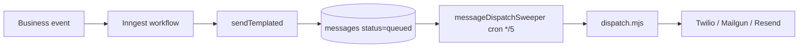

# FundHub company comms map — 2026-09-19

**What this is:** Every outbound **client** SMS and email the code can fire — which event starts it, which workflow owns it, and how it leaves the queue.  
**What this is not:** Copy edits, product fixes, or a Full E2E run.  
**Ground truth:** Live fire in `src/workflows/*.mjs` (+ `src/repair/notify.mjs`, handlers that call `sendTemplated`). Editor trees in `src/journeys/seed-journeys.mjs` are the story, not proof.

**Evidence tonight:** [comms-matrix.json](launch-prove-2026-09-19-evidence/comms-matrix.json) · Lane F sends board [launch-prove-2026-09-19-sends.md](launch-prove-2026-09-19-sends.md)

---

## Scorecard (2026-09-19 run-all)

| Metric | Count | Notes |
|--------|------:|-------|
| **Client template keys in code** | **98** | Workflows + repair + portal/contract/invoice/doc-check/nudge/partner (deduped; excludes hiring/candidate and internal staff-only keys) |
| **Mapped with final status** | **98/98** | Zero PENDING. Full rows: [full-comms-prove-2026-09-19.md](full-comms-prove-2026-09-19.md) |
| **WORKING** | **40** | Delivered to plus-tag sim or agent phone (incl. fresh **S00** on `7well9` — [full-comms-prove](full-comms-prove-2026-09-19.md) Tonight) |
| **NOT WORKING** | **0** | Broken keys cleared; **371** on branch for DOC-02 + partner SMS (prove = BLOCKED until deploy + send) |
| **BLOCKED** | **58** | Branch not reached tonight; includes DOC-02 + partner SMS until fresh delivered prove |

**Run-all:** [comms-run-all-2026-09-19.json](launch-prove-2026-09-19-evidence/comms-run-all-2026-09-19.json) · [comms-run-all-blockers.json](launch-prove-2026-09-19-evidence/comms-run-all-blockers.json)

### What would prove the rest (not Full E2E tonight)

| Blocked bucket | Event / path that proves it |
|----------------|----------------------------|
| Post-book S04 + reminders | Valid CF appointment webhook → `booking.created` → `s-04b-booking-reminders` |
| Nobook chase | `survey.submitted` without book → `s-nobook-chase` (2h / 24h / 48h sleeps) |
| Deposit docs | `deposit.paid` → `s-doc-collection` |
| Funding rail templates | `round.started` / `round.submitted` / `round.funded` on a funding sim |
| Repair rail | `repair.enrolled` / `repair.letters.sent` on repair sim |
| CRS decline | `analysis.completed` decline branch (sample file, no live bureau pull) |
| Affiliate drip | `af-01-affiliate-drip` cron with enrolled affiliate |
| Waypoint nudges | Overdue waypoint + `waypoint-nudge-sweeper` |

---

## How a message actually sends



| Step | Plain English |
|------|----------------|
| **Immediate** | Workflow runs `sendTemplated` right when the event fires (e.g. S-00 on `entry.captured`). Row is `queued`. |
| **Sweeper** | `message-dispatch-sweeper` (every 5 min) drains `queued` → provider. Booking confirm SMS often lands **~3–4 min** after queue. |
| **Scheduled Inngest** | Workflow uses `step.sleep` or `step.sleepUntil` (S-02 +20m, S-nobook +2h/+24h/+48h, S-04b 24h/2h before appt, AR +7d, etc.). |
| **Quiet hours** | SMS parked **11pm–11am Eastern** unless sim bypass applies; already-queued morning stamp may still wait. |

---

## Client journey — event spine (editor + live fire)

```mermaid
flowchart TD
  A[entry.captured] --> S00[S-00 welcome EMAIL+SMS]
  A --> S02[S-02 finish app email +20m if no survey]
  A --> S01[S-01 desk card only]
  B[survey.submitted] --> NB[S-nobook chase 2h/24h/48h]
  C[booking.created] --> S04[S-04b confirm EMAIL+SMS]
  C --> REM[S-04b 24h + 2h SMS]
  C --> JOSH[AI-SET-01 voice not SMS template]
  D[booking.noshow] --> S05[S-05a recovery ladder]
  E[call.completed] --> OFFER[S-offer-bucket EMAIL]
  F[deposit.paid] --> DOC[S-doc-collection]
  G[round.started] --> F01[F-01 intake + round SMS]
  H[round.funded] --> F07[F-07 locked + AR-01]
```



---

## Master map — client path (Sales → book → close → fund)

| Journey step | Event | template_key | Channel | Workflow id | Timing | Track tonight |
|--------------|-------|--------------|---------|-------------|--------|---------------|
| Welcome | `entry.captured` | EMAIL-S00-WELCOME | email | `s-00-welcome` | immediate → sweeper | **PROVEN** — [matrix](launch-prove-2026-09-19-evidence/comms-matrix.json) `7well9`, `vlnv9`; Gmail |
| Welcome | `entry.captured` | SMS-S00-WELCOME | sms | `s-00-welcome` | immediate → sweeper | **PROVEN** — same |
| Intake card | `entry.captured` | — | — | `s-01-new-lead-intake` | desk only | NOT RUN |
| Survey nudge | `entry.captured` | EMAIL-S02-FINISH-APPLICATION | email | `s-02-incomplete-survey-nudge` | sleep 20m | **PROVEN** — `vlnv9` + Gmail; skipped if survey done |
| No book chase 1 | `survey.submitted` | SMS-NOBOOK-01, EMAIL-NOBOOK-01 | both | `s-nobook-chase` | sleep 2h | NOT RUN (book path sims) · sims last 7d: 4 sends |
| No book 2–3 | `survey.submitted` | SMS/EMAIL-NOBOOK-02/03 | both | `s-nobook-chase` | +24h, +48h | NOT RUN |
| Book confirm | `booking.created` | SMS-S04-01-CONFIRM | sms | `s-04b-booking-reminders` | immediate queue → sweeper ~3–4m | **BLOCKED** fresh — [lane-f spot-check](launch-prove-2026-09-19-evidence/lane-f/spot-check-book-run.json) **401 bad_signature** · **PROVEN** Sim Eight |
| Book confirm | `booking.created` | EMAIL-S04-01-CONFIRM | email | `s-04b-booking-reminders` | same | **BLOCKED** fresh · **PROVEN** Sim Eight + Gmail |
| Remind 24h | `booking.created` | SMS-S04-02-REMIND-24H | sms | `s-04b-booking-reminders` | sleepUntil appt−24h | **SCHEDULED** · Sim Eight had none; 2h fired |
| Remind 2h | `booking.created` | SMS-S04-03-REMIND-2H | sms | `s-04b-booking-reminders` | sleepUntil appt−2h | **SCHEDULED** · **PROVEN** Sim Eight |
| Staff alert | `booking.created` | SMS-S04C-STAFF-BOOKED | sms | `s-04c-staff-booked-alert` | immediate | NOT RUN (staff SMS) |
| Setter no-answer | call outcome | SMS-AISET03-MSG1/2/3 | sms | `ai-set-03-no-answer-cadence` | stepped sleeps | NOT RUN |
| 3-way handoff | setter path | SMS-AISET04-HANDOFF | sms | `ai-set-04-3way-handoff` | on trigger | **PROVEN** Sim Eight |
| Precall grid | `booking.created` | SMS-BS01-01/02/03 + email grid | sms/email | `bs-01-precall-launcher` | sleeps | NOT RUN |
| No-show recovery | `booking.noshow` | EMAIL/SMS-S05A-NOSHOW-RECOVERY, 02, 03, 04 | both | `s-05a-no-show-recovery` | stepped | **PROVEN** partial Sim Eight |
| Offer after call | `call.completed` | EMAIL-OFFER-* (7 keys) | email | `s-offer-bucket` | immediate | **PROVEN** Sim Eight (`EMAIL-OFFER-FUNDING-DFY`) |
| Post-call declined | `call.completed` | (routing; may tag only) | — | `s-08-post-call-funding-declined` | — | NOT RUN |
| Deposit docs | `deposit.paid` | EMAIL/SMS-DOC-01-REQUEST | both | `s-doc-collection` | immediate | **PROVEN** Sim Eight · NOT RUN fresh |
| Portal magic | client request / confirm email | EMAIL-PORTAL-MAGIC-LINK | email | `src/auth/magic-link.mjs` | immediate | **PROVEN** Sim Eight (many rows) |
| Contract send | contract flow | CONTRACT-SEND-EMAIL, CONTRACT-REMIND-EMAIL | email | `contract-chaser` + `src/contracts/notify.mjs` | cron + manual | **PROVEN** Sim Eight send |
| Invoice | `invoice.sent` | INVOICE-SENT-EMAIL | email | `src/invoices/notify.mjs` | immediate | **PROVEN** Sim Eight |
| Analyzer delivery | `analysis.completed` | EMAIL-U02-ANALYZER-FUNDING/REPAIR-DELIVERY | email | `u-02-analyzer-complete-delivery` | immediate | **PROVEN** funding email Sim Eight |
| CRS decline | `analysis.completed` | EMAIL/SMS-C06-DECLINE | both | `c-06-crs-results-router` | branch | NOT RUN (no live CRS tonight) |
| Reschedule SMS | `message.inbound` | SMS-DPC04-RESCHEDULE-REBOOKING | sms | `dpc-03-inbound-reply-router` | on reply | NOT RUN |
| No progress 72h | `booking.created` | EMAIL/SMS-DPC05-NO-PROGRESS-72H | both | `dpc-05-no-progress-escalation` | delayed | NOT RUN |

---

## Funding advisor rail

| Event | template_key | Channel | Workflow | Timing | Track tonight |
|-------|--------------|---------|----------|--------|---------------|
| `round.started` | SMS-ROUND-STARTED-NOTIFY | sms | `round-started-client-notify` | immediate | **PROVEN** Sim Eight |
| `round.started` | EMAIL/SMS-F02-ID-PORTAL-NEEDED (+ followup email) | both | `f-02-portal-id-missing` | sleeps | **PROVEN** Sim Eight |
| `round.started` | EMAIL/SMS-F10-INBOX-SETUP | both | `f-10-client-funding-inbox-provisioner` | immediate | NOT RUN |
| `round.submitted` | EMAIL/SMS-F03-ROUND-SUBMITTED | both | `f-03-round-submitted` | immediate | **PROVEN** Sim Eight |
| `round.approved` | EMAIL/SMS-F04-ROUND-APPROVALS | both | `f-04-round-approvals` | immediate | NOT RUN |
| `mail.response` / `docs.received` | EMAIL/SMS-F06-MISSING-DOCS | both | `f-06-funding-conditions-missing-docs` | on event | NOT RUN |
| `round.funded` | EMAIL/SMS-F07-FUNDING-LOCKED | both | `f-07-funding-locked` | immediate | **PROVEN** Sim Eight |
| `round.funded` | EMAIL/SMS-N04-POST-FUNDING | both | `n-04-post-funding-nurture` | immediate | NOT RUN |
| `round.funded` | EMAIL/SMS-N06-RENEWAL | both | `n-06-renewal-second-wave` | delayed | NOT RUN |
| `round.closeout` | (nurture) | — | `n-04-post-funding-nurture` | — | NOT RUN |
| Funding paused | snapshot rule | EMAIL/SMS-AX07-FUNDING-PAUSED | both | `src/crs/snapshot-negatives.mjs` | on rule | NOT RUN |
| `invoice.sent` (success fee) | EMAIL/SMS-AR-01/02/03 | both | `ar-collections` | now / +7d / +14d | **PROVEN** AR-01 Sim Eight |
| Waypoint overdue | sweeper | EMAIL-WAYPOINT-NUDGE-1, SMS-WAYPOINT-* | both | `waypoint-nudge-sweeper` | hourly cap DB | NOT RUN |

---

## Repair / inquiry (email-first client)

| Event | template_key | Channel | Owner | Timing | Track tonight |
|-------|--------------|---------|-------|--------|---------------|
| `repair.enrolled` | EMAIL-REPAIR-WELCOME | email | `src/repair/notify.mjs` | immediate | NOT RUN |
| `repair.letters.sent` | EMAIL-REPAIR-LETTERS-SENT | email | repair notify | immediate | NOT RUN |
| `repair.response.parsed` | EMAIL-REPAIR-RESPONSE-RESULTS | email | repair notify / response-agent | immediate | NOT RUN |
| `repair.round.escalated` | EMAIL-REPAIR-ROUND-ADVANCED | email | repair notify | immediate | NOT RUN |
| `repair.response.retake` | EMAIL-REPAIR-RETAKE-PHOTO | email | repair notify | immediate | NOT RUN |
| `repair.program.complete` | EMAIL-REPAIR-TRIAL-COMPLETE-UPSELL | email | repair notify | trial only | NOT RUN |
| `call.completed` | EMAIL/SMS-DS01-REPAIR-REFERRAL | both | `ds-01-repair-referral` | immediate | NOT RUN |
| `payment.received` | EMAIL-DS02-DIY-LETTERS-READY | email | `ds-02-diy-letters` | after gen | NOT RUN |
| `docs.received` | EMAIL/SMS-DOC-02-REQUEST-MORE, DOC-03-APPROVED | both | `doc-check` / handlers | immediate | WORKING (SMS proved; EMAIL wired + template 371) |

---

## Nurture buckets (temperature)

| Workflow | template_key | Trigger | Status in code |
|----------|--------------|---------|----------------|
| `n-01-cold-nurture` | EMAIL/SMS-N01-COLD-NURTURE | *(retired — no event)* | Registered, **empty trigger** |
| `n-02-warm-nurture` | EMAIL/SMS-N02-WARM-NURTURE | temperature gates | NOT RUN |
| `n-03-hot-nurture` | EMAIL/SMS-N03-HOT-NURTURE | temperature gates | NOT RUN |

---

## Affiliate / partner (mostly not live on client walk)

| Path | template_key | Notes | Track tonight |
|------|--------------|-------|---------------|
| AF drip sweeper | AF catalog templates | `af-01-affiliate-drip` cron | NOT RUN — system-map: zero sends |
| Partner welcome | EMAIL/SMS-PARTNER-WELCOME | `src/partners/welcome.mjs` | WORKING (gate + re-queue; migration 371) |

---

## Deduped client template keys (98)

Alphabetical — every key wired to `sendTemplated` (or contract/invoice notify) for **buyers**, not candidates.

```
CONTRACT-REMIND-EMAIL
CONTRACT-SEND-EMAIL
EMAIL-AR-01-FIRST-NOTICE
EMAIL-AR-02-REMINDER
EMAIL-AR-03-FINAL-NOTICE
EMAIL-AX07-FUNDING-PAUSED
EMAIL-C06-DECLINE
EMAIL-DOC-01-REQUEST
EMAIL-DOC-02-REQUEST-MORE
EMAIL-DOC-03-APPROVED
EMAIL-DPC05-NO-PROGRESS-72H
EMAIL-DS01-REPAIR-REFERRAL
EMAIL-DS02-DIY-LETTERS-READY
EMAIL-F02-ID-PORTAL-NEEDED
EMAIL-F02-ID-PORTAL-NEEDED-FOLLOWUP
EMAIL-F03-ROUND-SUBMITTED
EMAIL-F04-ROUND-APPROVALS
EMAIL-F06-MISSING-DOCS
EMAIL-F07-FUNDING-LOCKED
EMAIL-F10-INBOX-SETUP
EMAIL-N01-COLD-NURTURE
EMAIL-N02-WARM-NURTURE
EMAIL-N03-HOT-NURTURE
EMAIL-N04-POST-FUNDING
EMAIL-N06-RENEWAL
EMAIL-NOBOOK-01
EMAIL-NOBOOK-02
EMAIL-NOBOOK-03
EMAIL-OFFER-FUNDING-DFY
EMAIL-OFFER-FUNDING-MASTERY
EMAIL-OFFER-NONE
EMAIL-OFFER-REPAIR-DFY
EMAIL-OFFER-REPAIR-TRIAL
EMAIL-OFFER-SOFT-PULL
EMAIL-OFFER-UWIQ-DELIVERABLES
EMAIL-PARTNER-WELCOME
EMAIL-PORTAL-MAGIC-LINK
EMAIL-REPAIR-LETTERS-SENT
EMAIL-REPAIR-RESPONSE-RESULTS
EMAIL-REPAIR-RETAKE-PHOTO
EMAIL-REPAIR-ROUND-ADVANCED
EMAIL-REPAIR-TRIAL-COMPLETE-UPSELL
EMAIL-REPAIR-WELCOME
EMAIL-S00-WELCOME
EMAIL-S02-FINISH-APPLICATION
EMAIL-S04-01-CONFIRM
EMAIL-S05A-NOSHOW-02
EMAIL-S05A-NOSHOW-03
EMAIL-S05A-NOSHOW-04
EMAIL-S05A-NOSHOW-RECOVERY
EMAIL-U02-ANALYZER-FUNDING-DELIVERY
EMAIL-U02-ANALYZER-REPAIR-DELIVERY
EMAIL-WAYPOINT-NUDGE-1
INVOICE-SENT-EMAIL
SMS-AR-01-FIRST-NOTICE
SMS-AR-02-REMINDER
SMS-AR-03-FINAL-NOTICE
SMS-AX07-FUNDING-PAUSED
SMS-AISET03-MSG1
SMS-AISET03-MSG2
SMS-AISET03-MSG3
SMS-AISET04-HANDOFF
SMS-BS01-01-BOOKED
SMS-BS01-02-PRECALL
SMS-BS01-03-DAYOF
SMS-C06-DECLINE
SMS-DOC-01-REQUEST
SMS-DOC-02-REQUEST-MORE
SMS-DOC-03-APPROVED
SMS-DPC04-RESCHEDULE-REBOOKING
SMS-DPC05-NO-PROGRESS-72H
SMS-DS01-REPAIR-REFERRAL
SMS-F02-ID-PORTAL-NEEDED
SMS-F03-ROUND-SUBMITTED
SMS-F04-ROUND-APPROVALS
SMS-F06-MISSING-DOCS
SMS-F07-FUNDING-LOCKED
SMS-F10-INBOX-SETUP
SMS-N01-COLD-NURTURE
SMS-N02-WARM-NURTURE
SMS-N03-HOT-NURTURE
SMS-N04-POST-FUNDING
SMS-N06-RENEWAL
SMS-NOBOOK-01
SMS-NOBOOK-02
SMS-NOBOOK-03
SMS-PARTNER-WELCOME
SMS-ROUND-STARTED-NOTIFY
SMS-S00-WELCOME
SMS-S04-01-CONFIRM
SMS-S04-02-REMIND-24H
SMS-S04-03-REMIND-2H
SMS-S05A-NOSHOW-02
SMS-S05A-NOSHOW-03
SMS-S05A-NOSHOW-04
SMS-S05A-NOSHOW-RECOVERY
SMS-WAYPOINT-DUE
SMS-WAYPOINT-NUDGE-2
```

*(Staff-only: `SMS-S04C-STAFF-BOOKED`, commission alerts — not counted in 98.)*

---

## Appendix — spine evidence matrix (Sim Eight · 7well9 · vlnv9)

Full rows: [comms-matrix.json](launch-prove-2026-09-19-evidence/comms-matrix.json)

| template_key | Sim Eight (`+sim-08`) | 7well9 (fresh book) | vlnv9 (polluted book attempt) |
|--------------|----------------------|---------------------|-------------------------------|
| EMAIL-S00-WELCOME | 2026-09-17T06:11:13Z delivered | 2026-09-19T04:43:35Z delivered | 2026-09-19T04:19:55Z delivered |
| SMS-S00-WELCOME | 2026-09-17T06:11:19Z delivered | 2026-09-19T04:43:38Z delivered | 2026-09-19T04:21:17Z delivered |
| EMAIL-S02-FINISH-APPLICATION | — | — | 2026-09-19T04:42:34Z delivered |
| SMS-S04-01-CONFIRM | 2026-09-17T06:18:15Z delivered | — **BLOCKED** | — |
| EMAIL-S04-01-CONFIRM | 2026-09-17T06:18:28Z delivered | — **BLOCKED** | — |
| SMS-S04-02-REMIND-24H | — | — **BLOCKED** | — |
| SMS-S04-03-REMIND-2H | 2026-09-17T15:02:02Z delivered | — **BLOCKED** | — |
| EMAIL/SMS-NOBOOK-01 | — | — | — |
| EMAIL/SMS-DOC-01-REQUEST | 2026-09-17T17:46:53Z delivered | — | — |

**Gmail cross-check (agent read, not Chris):** welcome + S02 subjects match DB `to:` for `7well9` and `vlnv9`; Sim Eight shows 30+ matching messages in All Mail.

---

## Chris blockers (plain English)

1. **ClickFunnels webhook secret (production)** — Netlify CLI **27.5** has no `env:pull`; `env:get --context production` and `env:list --plain` return **masked** values (len 20). Dev context gives unmasked len **84** but live `POST /api/webhooks/clickfunnels` still **401 bad_signature** — production runtime uses a **different** secret than dev. Laptop `.env` is also masked. **`booking.created` cannot fire** on `fe619d14…` / `7well9` until the **real production** secret is in gitignored `.env`, then re-run `scripts/tmp/lane-f-rebook-netlify.mjs`.

2. **Oxylabs (production)** — Live `POST /api/proxy/launch` on Sim Eight still **422 `oxylabs_auth_failed`**. Production `OXYLABS_*` masked in CLI; local `.env` has short placeholders (not production). Does **not** block SMS/email sweeper; **blocks Apply**.

3. **Contracts (hole 1)** — Not an env gate; real agreement text still owner-owned. Contract **emails** can send (`CONTRACT-SEND-EMAIL` on Sim Eight) but launch readiness stays open until hole 1 lands.

4. **Optional — Netlify env:get masking** — Same class as #1: any prove script that needs production secrets cannot rely on CLI masked output; use unmasked local `.env` or runtime on Netlify.

---

## Related docs

- [system-map-2026-08-26.md](system-map-2026-08-26.md) §1 client order  
- [launch-prove-2026-09-19.md](launch-prove-2026-09-19.md) lane board  
- Dispatch: `src/workflows/message-dispatch-sweeper.mjs`, `src/messaging/dispatch.mjs`
