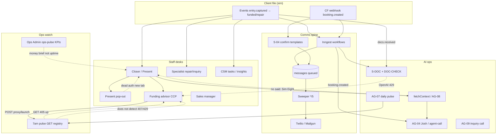

# Full launch lattice — 2026-09-20

**Purpose:** Long-running launch workflow — full client e2e + AI ops e2e + all employee/staff paths, latticed and cross-linked. Grok overseer spins Composer agents at will. **Click-by-click prove** on https://fundhub.ai.

**Overnight runbook (Chris asleep):** [overnight-lattice-2026-09-20.md](overnight-lattice-2026-09-20.md) — start here, gate, lane order, wake-up files, blockers card.

**This board owns:** coordination, claims, spawn prompts, cohesion diagram, gate. **It does not** replace detail boards — it points at them.

**Ground reads (read before you claim a lane):**

| Doc | Role |
|-----|------|
| [morning-ready-2026-09-20.md](morning-ready-2026-09-20.md) | What is green tonight, Chris paste-once, merge bundles |
| [launch-prove-2026-09-19.md](launch-prove-2026-09-19.md) | Lanes A–H, synthesis, named blockers |
| [comms-map-2026-09-19.md](comms-map-2026-09-19.md) | 98 client SMS/email keys, event spine |
| [full-comms-prove-2026-09-19.md](full-comms-prove-2026-09-19.md) | Per-key WORKING / BLOCKED scorecard |
| [ops-heartbeat-kpi-2026-09-19.md](ops-heartbeat-kpi-2026-09-19.md) | 7 a.m. pulse vs Ops Admin vs KPI reads |
| [ops-oversight-2026-09-19.md](ops-oversight-2026-09-19.md) | Grok TRUST/DONOTTRUST, pulse limits |
| [ops-overseer-lattice-2026-09-20.md](ops-overseer-lattice-2026-09-20.md) | Long-run Grok spawn rules + **Perpetual overseer** + TRUST template |
| [grok-overseer-handoff-2026-09-20.md](grok-overseer-handoff-2026-09-20.md) | New Grok chat paste — continue without recap |
| [overnight-lattice-2026-09-20.md](overnight-lattice-2026-09-20.md) | Single overnight runbook — order, MUST rules, wake-up deliverables |
| `.cursor/rules/grok-lattice-overseer-perpetual.mdc` | Grok never stops this lattice |
| [lattice-inventory-ai-ops-staff-2026-09-20.md](lattice-inventory-ai-ops-staff-2026-09-20.md) | Phase 0 — AI ops + staff desks + **14** cohesion gaps (L1–L14) |
| [system-map-2026-08-26.md](system-map-2026-08-26.md) | Live fire order, dictator bar, AG inventory |
| [company-sim-2026-08-24.md](company-sim-2026-08-24.md) | Five horsemen scenarios |
| `.cursor/rules/full-end-to-end-audit.mdc` | Client E2E law + dictator checklist |
| `docs/journeys/*-intended.md` | Staff door truth (CSM: [role-csm-actual.md](../journeys/role-csm-actual.md) — no intended yet) |

**Hard stops (all lanes):**

- **Gate is GO** (2026-09-20): run everything; **CRS sandbox** (sample credit, no live bureau pull). Do **not** live-pull CRS unless Chris flips Question 2 to live.
- **No extra holes** — `.cursor/rules/no-extra-holes.mdc`. Trip over something else? One leftover row. Stop.
- **Scratch harness never on production DB** — `.cursor/rules/verify-scratch-only.mdc`.
- Sims: plus-tag email, agent phone `+16616054248`, assume paid, skip ClickFunnels apply walk — owner-ok.
- **Max ~5 concurrent** Composer agents. Claim on this board before work.

**Evidence convention:** `docs/workflows/full-launch-lattice-2026-09-20-evidence/<lane>/` (create as you prove).

---

## Gate — **GO**

**Status:** **GO** — recorded 2026-09-20 from Chris owner paste. Full client e2e **may run**. Horsemen mint + event fire allowed. **CRS = sandbox** (sample credit file, **no live bureau pull**). Other money: mint and send pay links / invoices; **do not** charge Chris’s real card unless he names that. Overseer: [ops-overseer-lattice-2026-09-20.md](ops-overseer-lattice-2026-09-20.md) **Perpetual overseer**. Handoff: [grok-overseer-handoff-2026-09-20.md](grok-overseer-handoff-2026-09-20.md).

### Question 1 — Run everything?

> You asked for a Full End-To-End Audit. That means five sim files (different client scenarios) through every live path, in order: every offer, SMS, email, button, API, journey, fulfillment, uploads. I read Gmail and the agent phone. You do not check inboxes. Want me to run that now?

| Answer | Chris (yes/no) | Recorded by | UTC |
|--------|----------------|-------------|-----|
| Run full client e2e | **yes** | Chris owner paste / Grok lattice | 2026-09-20 |

### Question 2 — CRS / bureau money

> CRS / bureau money — live or sandbox? This is the $32 credit pull. He cares about stacking live pulls. Other money (pay links, invoices): mint and send; do **not** charge his real card unless he names that.

| Answer | Chris (live / sandbox) | Recorded by | UTC |
|--------|------------------------|-------------|-----|
| CRS on horsemen | **sandbox** | Chris owner paste / Grok lattice | 2026-09-20 |

### After GO

1. Lane **1 — Client E2E** is unblocked (`pending` until an agent **claims** it).
2. Lanes **2–6** may run in parallel with Lane 1 **except** any step that duplicates mass client sends before Lane 1 owner confirms ordering (overseer resolves conflicts).
3. **CRS sandbox** stays until Chris writes **live** in this table. Sample CRS + sample businesses on the five horsemen.

---

## Lane overview (parallel)

| Lane | Name | Depends on gate? | Owner | Status | Result | Evidence |
|------|------|------------------|-------|--------|--------|----------|
| 1 | Client E2E | **Yes — GO (sandbox CRS)** | Composer Lane 1 continue validate | **done** | **FAIL** — tag `e2e200920-y2otg` (no remint); [full-e2e-audit-2026-09-20.md](full-e2e-audit-2026-09-20.md); later PW required **29/29** | `lane-1/` |
| 2 | AI ops | Partial (calls/docs need sim) | Composer ed236b50 | **done** | mixed — leftovers L2 / DOC-CHECK / AG-07 / AG-09 | [ai-ops-prove-2026-09-20.md](ai-ops-prove-2026-09-20.md) · [evidence/lane-2/](full-launch-lattice-2026-09-20-evidence/lane-2/) |
| 3 | Employee / staff | No (use existing sim rows) | [Staff UI survey](ca860d74-94a8-40e5-8cd7-70fa1e874bb7) | **done** | mixed — 29/29 owner loads; CSM mixed; Present pop-out **FAIL**; Apply Oxylabs **FAIL** | [staff-ui-survey-2026-09-20.md](staff-ui-survey-2026-09-20.md) · `lane-3/` |
| 4 | Cohesion / lattice | After 1–3 have drafts | [Lane 4 cohesion synthesis](586452a8-7aa7-4bce-96bc-6b3ba6b5242f) | **done** | Cross-links scored; **C1–C10** | Lane 4 § · lanes 1–3 + 6 evidence |
| 5 | Grok overseer | N/A (this chat pattern) | Grok 4.6 | **claimed** | Morning punchlist refresh — launch **not** ready | [handoff](grok-overseer-handoff-2026-09-20.md) · [wake-punchlist-2026-09-20.md](wake-punchlist-2026-09-20.md) |
| 6 | Money / CF / Oxylabs | No | [Lane 6 S04 SMS re-prove](c600ec24-fc7d-4b06-80d8-3c6514b20e8b) | **done** | CF **PASS** · S04 email **delivered** + Gmail · later SMS `$7` **closed** (`sms-dispatch`) · Oxylabs skipped | [s04-queue-prove-latest.json](full-launch-lattice-2026-09-20-evidence/lane-6/s04-queue-prove-latest.json) · `lane-1/sms-dispatch/` |
| 0 | Phase 0 inventory (read-only) | No | agent | **done** | 14 gaps logged | [lattice-inventory-ai-ops-staff-2026-09-20.md](lattice-inventory-ai-ops-staff-2026-09-20.md) |
| **D** | **Deliverables / portal / SLO pack** | No (GO) | Composer 41991db8 | **done** | **TRUST mixed** — Blueprint/UWIQ **PASS** · later SLO Inngest **PASS** | [lane-deliverables/SCORECARD.md](full-launch-lattice-2026-09-20-evidence/lane-deliverables/SCORECARD.md) · [inngest/VERDICT.json](full-launch-lattice-2026-09-20-evidence/lane-deliverables/slo-dashboard/inngest/VERDICT.json) |
| **C** | **Full comms prove (98 keys)** | No (GO) | fire remaining **f7c2d6f2** | **done** | **87 WORKING / 0 NOT WORKING / 11 not-live** · timing map written · leftover **COMMS-S04-02-NO-BYPASS** | [comms-timing-map-2026-09-20.md](comms-timing-map-2026-09-20.md) · [full-comms-prove-2026-09-20-fire.md](full-comms-prove-2026-09-20-fire.md) · `comms/` |

**Status values:** `blocked` | `pending` | `claimed` | `done` | `blocked-external`

---

## Lane 1 — Client E2E

**Law:** `.cursor/rules/full-end-to-end-audit.mdc` + [system-map-2026-08-26.md](system-map-2026-08-26.md) live fire order.

**Gate = GO.** CRS **sandbox** — sample credit only, no live bureau pull.

### Five horsemen (one scenario each)

From [company-sim-2026-08-24.md](company-sim-2026-08-24.md): **Funding**, **Repair**, **Combo**, **Inquiry**, **Course**. New plus-tag per person. Sample CRS + sample businesses on each. Full event path — **no extra SMS**.

### Dictator checklist (mandatory — skip any = run incomplete)

1. **Five horsemen** — full event fire, no extra SMS.
2. **Fulfillment** (funding **and** credit repair): staff queue → next action → docs → apply. Mint invoices / pay links. **Do not pay.** Then **AI outbound CALL** to `+16616054248`. **AI doc follow-up.** **FTC / portal / inquiry / repair uploads** (sim packs only).
3. **Meet tape → transcriber → closer `fetchContext`** — spoken words land in closer pack (`said:` line).
4. **Beta** after live scorecard hashed — every button on every beta/ops screen; broken main button = page FAIL.
5. On-screen data matches the file; employees **finish** desk motion (not a load-only glance).
6. Offers, contracts, UnderwriteIQ, AR, workflows, agents on those paths.
7. Incorporation date ask + closer verify SOP when multi-biz / age needed.
8. Agent does **all** testing — no “check your mail/texts” to Chris. Gmail All Mail + agent phone.

**Scorecard output:** `docs/workflows/full-e2e-audit-YYYY-MM-DD.md` (PASS / FAIL / not-live per path). Then **stop** — no fixes in the same pass.

### Lane 1 sub-claims

| Unit | Owner | Status | Notes |
|------|-------|--------|-------|
| H1–H5 horsemen | [Lane 1 E2E re-run finish](f2d5f7dc-afca-4272-9ec7-06e9de0fbdc4) | **done** | Tag `e2e200920-y2otg`; sandbox CRS all five; later welcome SMS **delivered**; Course welcome later **PASS** (`l1-course-mail-prove.json`) |
| Dictator 2 — dual fulfillment | Composer Lane 1 continue | **done** | **FAIL** — Funding **PASS_EXCEPT_APPLY**; later specialist Download **PASS**; uploads **PASS** 5/5; DOC-CHECK **429**; AG-04 **PARTIAL** |
| Dictator 3 — Meet → context | [Lane 1 E2E re-run finish](f2d5f7dc-afca-4272-9ec7-06e9de0fbdc4) | **done** | Sim Eight sweeper **PASS**; y2otg horsemen still no `said:` — dictator 3 **FAIL** |
| Dictator 4 — beta every-button | [Beta ops every-button pass](f457efe0-d9ae-4f70-9100-bb303f39a75c) | **done FAIL** | **33/36** buttons · **16 PASS / 1 FAIL / 1 not-live** pages · [beta-every-button-2026-09-20.md](full-launch-lattice-2026-09-20-evidence/lane-1/beta-every-button-2026-09-20.md) · [beta/SCORECARD.md](full-launch-lattice-2026-09-20-evidence/lane-1/beta/SCORECARD.md) |
| Live Playwright 100 | Composer Lane 1 continue | **done** | **PASS** required **29/29 = 100%** · tests **37/41** · extras hole17 + Company Brain · `lane-1/playwright/score.json` |

---

## Lane 2 — AI ops E2E

**Goal:** Prove AI + automation ops paths click-by-click and with observable rows (`agent_runs`, Inngest, outbound call/doc chase, prompt editor, morning pulse).

**Inventory sources:** [ops-heartbeat-kpi-2026-09-19.md](ops-heartbeat-kpi-2026-09-19.md), [system-map-2026-08-26.md](system-map-2026-08-26.md) §2, `db/migrations/037_agent_registry.sql`, `src/workflows/index.mjs` (**72** Inngest functions — `src/workflows/index.test.mjs`).

### AG-* registry (prove live vs draft)

| Code | Name | Expected status | Prove |
|------|------|-----------------|-------|
| AG-04 | Setter Josh | live, voice, Bland | `booking.created` → outbound to agent phone; roleplay vs stub prompt — [fundhub-agent-tester](../.cursor/skills/fundhub-agent-tester/SKILL.md) |
| AG-09 | Inquiry Removal AI | live, voice, Bland | Call **agent phone**, not bureau |
| AG-07 | Recon | live on `daily-pulse` | `agent_runs` for `cron.daily-pulse`; scorecard `docs/workflows/pulse-*.md` |
| AG-06 | Document Check | draft/retired | Doc chase workflow + desk; no surprise extra SMS |
| AG-08 | Context Fetcher | draft | `/api/read/agent-context` + Meet path |
| OP-01 / OP-03 | Heartbeat / Daily Brief | draft | **Do not wire** unless Chris names |
| OP-06 | Closer drill | internal | Agent Editor Run — not client SMS |

### Inngest + messaging ops

| Surface | Prove |
|---------|-------|
| `message-dispatch-sweeper` | Queued → Twilio/Mailgun (read messages + provider id) |
| Workflow register | Count **72** jobs; no false “~49” inventory |
| `read/failed-events` | DLQ door + sample row shape |
| Prompt editor | https://fundhub.ai/app/agent-editor.html — open AG-04 row, save unchanged smoke |

### Intended journeys (roles touching AI)

- Client path: Josh after book — editor tree `setter` in `src/journeys/seed-journeys.mjs`
- [role-closer-intended.md](../journeys/role-closer-intended.md) — Present + disposition → context
- [ops-pulse-intended.md](../journeys/ops-pulse-intended.md) — owner/admin pulse read

### Lane 2 sub-claims

| Unit | Owner | Status | Result |
|------|-------|--------|--------|
| AG-04 call sequence | agent | done | **PASS** — check ready + one `POST /api/agent-call` · `5b642079-…` → agent phone ([prove.json](full-launch-lattice-2026-09-20-evidence/lane-2/prove.json)) |
| AG-09 call to agent phone | validate 2026-09-19 | done | **UNVERIFIED** (talk) — one dial only · AG-09 → Sim Twelve-Academy **+16616054248** · `call_id=1f76229d-9d7f-4365-9c4c-2aa448aec140` · **20×45s poll (~14m)** · `outbound_calls.status=initiated` unchanged · no `call.completed` · Bland GET **401** (no `call_length`) · not scored 0.13s FAIL · [ag09-talk.json](full-launch-lattice-2026-09-20-evidence/lane-2/validate-2026-09-19/ag09-talk.json) · [validate.json](full-launch-lattice-2026-09-20-evidence/lane-2/validate-2026-09-19/validate.json) |
| AG-07 pulse / agent_runs | agent | done | **PASS row** · **FAIL scorecard** — `cron.daily-pulse` 2026-09-18 · `outcome=fail` |
| Doc chase / AG-06 path | agent | done | **PASS** S-DOC templates · **FAIL** DOC-CHECK AI (OpenAI 429 on recent runs) |
| fetchContext / Meet transcript | agent | done | **PASS** API 200 Sim Eight · **FAIL L2** — no `said:` in pack |
| Inngest inventory 72 | agent | done | **PASS** — `functions.length=72` + 2h event traffic |
| Prompt editor smoke | agent | done | **PASS** — Agent Editor click + `GET /api/read/agents` 200 |

**Lane 2 leftovers:** L2, L7 (`agent_editor` kind), DOC-CHECK credits, AG-07 fail detail, AG-09 — [ai-ops-prove-2026-09-20.md](ai-ops-prove-2026-09-20.md) § leftovers.

---

## Lane 3 — Employee / staff (click-by-click)

**Site:** https://fundhub.ai — type, click, look. Automated tests first; script green ≠ done.

**Shared bar:** [system-map-2026-08-26.md](system-map-2026-08-26.md) — finish the job, on-screen data matches sim row.

Each **role = one prove lane**. Claim **one** role per agent.

| Role lane | Journey cite | Desk / entry | Must finish (not load-only) |
|-----------|--------------|--------------|-----------------------------|
| **Closer** | [role-closer-intended.md](../journeys/role-closer-intended.md) | Closer Dashboard, **Present** | Pre-call context → consent → pay link mint → offer ladder → contract send → disposition → handoff |
| **Funding advisor** | [role-funding-advisor-intended.md](../journeys/role-funding-advisor-intended.md) | Pipeline, Fulfillment, CCP Apply | Queue → next action truth → MOVE to funding rail → docs match → Generate Apps → Apply lender (blocked if Oxylabs — score honestly) |
| **Repair** | [role-inquiry-remover-intended.md](../journeys/role-inquiry-remover-intended.md) Specialist **Repair** | Specialist desk | Queue → letters ready → download/send path — launch-prove **#9** pattern |
| **Inquiry** | same intended, **Inquiries** tab | Specialist desk | Case → docs → generate letters (no live PostGrid unless Chris names) |
| **CSM** | [role-csm-actual.md](../journeys/role-csm-actual.md) (no intended yet) | Tasks + customer insights | Mid/post accountability task shape; Meet booking link on funded path |
| **Sales manager** | [role-sales-manager-intended.md](../journeys/role-sales-manager-intended.md) | Oversight desks | Pipeline visibility + team motion spot-check |
| **Fulfillment queues** | launch-prove C/D | Funding + Repair fulfillment lists | **Complete** queue → next action → docs → apply/letters — evidence from [launch-prove-2026-09-19-evidence/](launch-prove-2026-09-19-evidence/) reusable if re-clicked live |

### Lane 3 claim table

| Role lane | Owner | Status | PASS/FAIL | Evidence path |
|-----------|-------|--------|-----------|---------------|
| Closer | Composer L3-Closer | **done** | **mixed / FAIL** — **`prove.json` FAIL `disposition_save`** (stale `call_outcome_id`; handoff wrong `client_id`); **6 PNGs on disk** (`01–06` @ 2026-09-20 05:45Z). Pay-link **FUNDING_DFY** mint **TRUST PASS** (separate slice · share-audit **NOT A PROBLEM**) | `full-launch-lattice-2026-09-20-evidence/lane-3/closer/` |
| Funding advisor | Worker 86658f04 | **done** | **PASS_EXCEPT_APPLY** — same sim + evidence as fulfillment-funding rail (~05:39Z); Apply **FAIL** 422 `oxylabs_auth_failed` (1 click, Lane 6) | `full-launch-lattice-2026-09-20-evidence/lane-3/fulfillment-funding/summary.json` |
| Repair | Composer 006324d6 | **done** | **TRUST FAIL** — queue/drawer **PASS** · **5 PNGs on disk** · specialist Download **FAIL** · Documents **`04`** click **TRUST PASS** · y2otg letters **DONE PASS** ([`generated/`](full-launch-lattice-2026-09-20-evidence/lane-3/fulfillment-repair/generated/)) | `full-launch-lattice-2026-09-20-evidence/lane-3/fulfillment-repair/` |
| Inquiry | Composer re-prove 2026-09-20 | **done** | **TRUST PASS** — Sim Thirteen TU case: queue → case → generate letters → documents; **4 PNGs on disk** (`01–04`); no PostGrid; Send off POA/auth **OK** (L3-INQUIRY-SEND) | `full-launch-lattice-2026-09-20-evidence/lane-3/inquiry/` (`prove.json` @ 05:45Z) |
| CSM | [Lane 3 CSM UI walk](48f0e7d3-0b37-4011-b3eb-3dc322123c8d) | **done** | **mixed** — Elena walk; CCP/calendar/consent/pipeline **PASS**; queue API **PASS**; `csm-queue.html` **404**; insights UI **FAIL**; closer desk **FAIL** gate; post Meet on API only | `lane-3/csm/walk-verdict.json` · `prove.json` · `screenshots/` |
| Sales manager | Composer lattice follow-up | **done** | **PASS_EXCEPT_SM_LOGIN** — funnel + closer picker + pipeline nav **TRUST** (6 PNGs); session **owner** (SM passwords not in env) | `full-launch-lattice-2026-09-20-evidence/lane-3/sales-manager/` |
| Fulfillment queues (funding rail) | Worker 86658f04 | **done** | **PASS_EXCEPT_APPLY** — Sim Fund E2E20 `e2e200920-y2otg`: queue + next action + Apply Now rail + 3 docs + 110 matches; Apply **FAIL** Oxylabs 422 (1 click) | `full-launch-lattice-2026-09-20-evidence/lane-3/fulfillment-funding/` (`prove.json`, `summary.json`, 7 PNGs on disk) |
| Fulfillment queues (repair rail) | Composer 006324d6 | **done** | **TRUST FAIL** — 5 PNGs on disk · specialist Download **FAIL** · Documents **`04` TRUST PASS** | `full-launch-lattice-2026-09-20-evidence/lane-3/fulfillment-repair/summary.json` |
| Staff UI survey (all desks) | Composer ca860d74 | **done** | **29/29 owner desk loads live**; findings S3-F1, Present auth, pay-link gate | [staff-ui-survey-2026-09-20.md](staff-ui-survey-2026-09-20.md) · `full-launch-lattice-2026-09-20-evidence/lane-3/` |

---

## Lane 4 — Cohesion / lattice

**Goal:** Document cross-links so parallel lanes do not contradict each other. Update this section as 1–3 land.

**Claim:** Composer lattice follow-up (Lane 4 only) · **done** 2026-09-20 (read-only synthesis; no product code). Prior pass: [Lane 4 cohesion synthesis](586452a8-7aa7-4bce-96bc-6b3ba6b5242f).

**Evidence read:** [lane-1/run.log](full-launch-lattice-2026-09-20-evidence/lane-1/run.log) · [lane-2/prove.json](full-launch-lattice-2026-09-20-evidence/lane-2/prove.json) + [ai-ops-prove-2026-09-20.md](ai-ops-prove-2026-09-20.md) · [lane-3/](full-launch-lattice-2026-09-20-evidence/lane-3/) + [staff-ui-survey-2026-09-20.md](staff-ui-survey-2026-09-20.md) · [lane-6/lane-6-summary.json](full-launch-lattice-2026-09-20-evidence/lane-6/lane-6-summary.json) · [comms-map-2026-09-19.md](comms-map-2026-09-19.md) · [launch-prove-2026-09-19.md](launch-prove-2026-09-19.md) · [system-map-2026-08-26.md](system-map-2026-08-26.md) · [lattice-inventory-ai-ops-staff-2026-09-20.md](lattice-inventory-ai-ops-staff-2026-09-20.md) L1–L14.

### Cross-links (checklist)

| Link | From | To | Verdict | Evidence / gap |
|------|------|-----|---------|----------------|
| Closer context → Present → disposition | `call_outcomes`, Present UI | `/api/read/agent-context`, `fetchContext` | **FAIL** | Lane 3 closer: [closer/prove.json](full-launch-lattice-2026-09-20-evidence/lane-3/closer/prove.json) **FAIL `disposition_save`** (`disposition.ok=false`; stale `call_outcome_id`; handoff wrong `client_id`). Pay-link **FUNDING_DFY** mint **TRUST PASS** (separate slice). Lane 2: Sim Eight pack **200**, **`said:` false** ([lane-2/prove.json](full-launch-lattice-2026-09-20-evidence/lane-2/prove.json)). Staff survey: Present **pop-out → login** (S3 Present auth). Cohesion bar not met: no transcript/`said:` for next agent turn. **Gap L2.** |
| Comms ↔ workflows | [comms-map-2026-09-19.md](comms-map-2026-09-19.md) | `src/workflows/*.mjs` | **PASS (map)** / **GAP (prove)** | **98/98** mapped. Lane 6 ([c600ec24](c600ec24-fc7d-4b06-80d8-3c6514b20e8b)): **EMAIL-S04 delivered** + Gmail booked confirm; **SMS-S04 blocked** — dispatch SQL `$7` ([s04-queue-prove-latest.json](full-launch-lattice-2026-09-20-evidence/lane-6/s04-queue-prove-latest.json)). **Gap:** SMS book confirm not WORKING until named fix. |
| Ops KPI ↔ pulse | `GET /api/read/ops-pulse` | 7 a.m. `runDailyPulse` / AG-07 | **PASS (documented)** / **GAP (health)** | [ops-heartbeat-kpi-2026-09-19.md](ops-heartbeat-kpi-2026-09-19.md): two systems named; pulse GET **405 = up** on POST doors. Lane 2: `cron.daily-pulse` row **exists**, **`outcome=fail`** (unrecorded calls + decline-autopsy 404). Ops Admin brief **live** per staff survey — not a substitute for AG-07 pass. **Gap L3, L12.** |
| Money ↔ fulfillment | Lane 6 Oxylabs / CF | Lane 3 funding Apply + fulfillment UI | **PASS (Apply honesty)** / **FAIL (UI truth)** | Lane 3 funding: **PASS_EXCEPT_APPLY** — one Apply → **422** `oxylabs_auth_failed` aligned with Lane 6 **429/422** ([funding-advisor/summary.json](full-launch-lattice-2026-09-20-evidence/lane-3/funding-advisor/summary.json), lane-6). No fake Apply PASS. Staff survey **S3-F1**: Fulfillment lens shows **Remove Inquiries** on funding rows — **FAIL** next-action truth vs advisor API on same sim. |
| Launch prove ↔ lattice | [launch-prove-2026-09-19.md](launch-prove-2026-09-19.md) B/C/D/E/F | Lattice lanes 1–3 + 6 | **PARTIAL** | **TRUST** re-clicks ~05:35Z: closer, funding, inquiry, staff survey. Lane 1 scorecard **FAIL** ([full-e2e-audit-2026-09-20.md](full-e2e-audit-2026-09-20.md)) — horsemen mint **TRUST**, dictator **DONOTTRUST** PASS. Repair: **Sim Nine #9** vs **y2otg** `can_send=false` — different files. Launch **C #9** download **200** vs lattice **`download_click=false`**. |
| CSM tasks ↔ desk UI | `GET /api/read/csm-queue`, CCP/calendar | `/app/csm-queue.html`, insights write | **GAP** | CSM [prove.json](full-launch-lattice-2026-09-20-evidence/lane-3/csm/prove.json): queue API **200**, mid/post shapes + **5 PNGs** **TRUST**. Static **`/app/csm-queue.html` 404** — **L3-CSM-QUEUE-404**. No dedicated customer-insights write screen (API questions **200** only) — **L3-CSM-INSIGHTS-WRITE**. Post `meeting_url` on API row after sim plant; CCP body **`has_meet: false`**. |

**Lane 1 ↔ horsemen cohesion (extra row, not a fix):** Tag **`e2e200920-y2otg`** ties Funding closer/funding-advisor (`1982d8a6-…`) to Lane 1 mint; Repair horse **`9b58de7f-…`** is **not** letter-ready — do not score Repair fulfillment off y2otg until Lane 1 re-run completes dictator 2.

### Who touches what (lattice)

Evidence-backed tweaks: **CF book** feeds `booking.created` → comms + Josh path; **DOC-CHECK** on `docs.received` (429 tonight); **Present pop-out** breaks staff→deck without session; pulse **does not** prove Apply.



### Contradictions for Grok overseer (merge TRUST carefully)

| # | A says | B says | Overseer rule |
|---|--------|--------|----------------|
| C1 | Comms matrix / launch-prove may still label S04 SMS **queued** only | [Lane 6 S04 SMS re-prove](c600ec24-fc7d-4b06-80d8-3c6514b20e8b): email **delivered** + Gmail; SMS **blocked** (`$7`) | **TRUST** latest lane-6 JSON for split verdict — email WORKING, SMS **named fix** (not another CF rebook) |
| C2 | Lane 3 closer **`prove.json` FAIL `disposition_save`** ([closer/prove.json](full-launch-lattice-2026-09-20-evidence/lane-3/closer/prove.json)) | [staff-ui-survey-2026-09-20.md](staff-ui-survey-2026-09-20.md): Present pop-out **dead**; pay link needs downsell gate | **TRUST** pay-link **FUNDING_DFY** mint PASS · **DONOTTRUST** finish-job / disposition PASS; pop-out auth separate **FAIL** |
| C3 | Lane 3 funding **next_action_truth PASS** (API) on y2otg sim | Staff survey **S3-F1 FAIL** on Fulfillment lens (mixed repair labels on funding rows) | **TRUST survey for UI cohesion**; API PASS is CCP/API slice only |
| C4 | Launch prove Lane C **PASS #9** downloads **200** | Lane 3 Repair **`download_click.clicked=false`**; PNG paths **missing on disk** | **DONOTTRUST** “download clicked” anywhere until one live click + file on disk |
| C5 | Lane 2 **PASS** `fetchContext` HTTP 200 | Lane 2 **FAIL L2** — no `said:`; dictator 3 pending on Lane 1 | **DONOTTRUST** Meet→context PASS; API 200 ≠ cohesion |
| C6 | Lane 2 AG-07 **PASS (row)** in prove.json | Same row **`outcome=fail`** | **TRUST** “ran”; **DONOTTRUST** “healthy morning audit” |
| C7 | Lane 2 Bland **PASS** (call placed) | `outbound_calls.kind=agent_editor` not `ai-set-01-josh-setter` (**L7**) | **DONOTTRUST** as proof of **booking.created** auto-Josh path |
| C8 | [full-e2e-audit-2026-09-20.md](full-e2e-audit-2026-09-20.md) **FAIL** (dictator incomplete) | Launch/morning “five horsemen walked” comms copy | **TRUST** scorecard **FAIL**; **DONOTTRUST** “full e2e green”; horsemen + partial Funding UI **TRUST** only |
| C9 | Ops pulse / `proxy/launch` GET **405 = up** ([ops-heartbeat-kpi-2026-09-19.md](ops-heartbeat-kpi-2026-09-19.md)) | Funding Apply **422/429** Oxylabs + Generate Apps **110** matches on same sim | **TRUST both** — uptime door ≠ Apply works; **L12** |
| C10 | Lane 3 CSM JSON **`verdict: PASS`** + PNG list | Disk: **`01–05` PNGs present** at `lane-3/csm/` (scored 73e9f448) | **TRUST** click PASS when **prove.json + 01–05 on disk**; do **not** respawn CSM for queue 404 alone |

### Top gaps (inventory L1–L14 × tonight evidence)

Still open after lanes 1–3 + 6 — see [lattice-inventory-ai-ops-staff-2026-09-20.md](lattice-inventory-ai-ops-staff-2026-09-20.md) §4. Strongest signals: **L2** (context pack), **L7** (dual dial paths), **L12** (pulse vs Apply), **DOC-CHECK** 429, **S3-F1** fulfillment labels.

**Owner:** Composer lattice follow-up (Lane 4) · **Status:** **done** · **UTC:** 2026-09-20 (CSM 73e9f448 disk score + CSM cross-link row; mermaid unchanged — no new wire proved)

---

## Lane 5 — Grok overseer

**Pattern:** [ops-oversight-2026-09-19.md](ops-oversight-2026-09-19.md). Read-only coordination unless Chris names a fix.

### TRUST / DONOTTRUST (carry forward)

| Source | Verdict |
|--------|---------|
| [rate-limits-audit-2026-09-19.md](rate-limits-audit-2026-09-19.md) caps | **TRUST** inventory |
| Same audit “~49+ Inngest jobs” | **DONOTTRUST** — use **72** |
| [ops-heartbeat-kpi-2026-09-19.md](ops-heartbeat-kpi-2026-09-19.md) | **TRUST** — 405 on `proxy/launch` = up, **not** Apply works |
| Morning pulse vs Ops Admin “AI COO” | **TRUST** — two different systems |
| Lane 2 [ai-ops-prove-2026-09-20.md](ai-ops-prove-2026-09-20.md) + `lane-2/prove.json` | **TRUST** mixed scorecard (Inngest 72, AG-04 place, editor). **DONOTTRUST** as full AI-ops PASS — no `said:`, DOC-CHECK 429, AG-07 `outcome=fail`, AG-09 undialed |
| Lane 1 [full-e2e-audit-2026-09-20.md](full-e2e-audit-2026-09-20.md) + `lane1-prove.json` | **TRUST** overall **FAIL** + roster. **DONOTTRUST** as launch-ready e2e; **TRUST** Funding desk partial PASS |
| Lane 3 [staff-ui-survey-2026-09-20.md](staff-ui-survey-2026-09-20.md) + 64+ PNGs | **TRUST** owner desk loads + S3-F1 / Present / pay-link findings. **DONOTTRUST** as full CSM UI walk or per-button JSON |
| Lane 6 [s04-queue-prove-latest.json](full-launch-lattice-2026-09-20-evidence/lane-6/s04-queue-prove-latest.json) | **TRUST** EMAIL-S04 **delivered** + Gmail booked subject. **DONOTTRUST** SMS-S04 WORKING — **blocked** dispatch `$7`. Oxylabs **TRUST FAIL** (429). **Do not** respawn S04 rebook. |
| Lane 3 Repair `prove.json` | **TRUST** #9 `ready_to_send` + 3 API letter HTTP 200. **DONOTTRUST** as click-download PASS — `download_click.clicked=false`; result.json names 3 PNGs that are **not on disk** |
| Lane 3 Inquiry `prove.json` + `01–04` PNGs | **TRUST** click PASS — Sim Thirteen queue/case/generate/docs live + **4 PNGs on disk** (re-prove 2026-09-20 05:45Z); Send disabled for missing POA/auth is **OK** leftover (**L3-INQUIRY-SEND**) |
| Lane 3 CSM `prove.json` + `01–05` PNGs | **TRUST** Elena CCP/calendar/consent clicks + `csm-queue` API shapes (73e9f448 disk check). **DONOTTRUST** `/app/csm-queue.html` as live desk — **404** (**L3-CSM-QUEUE-404**); Meet URL API-only |
| Lane 3 Closer `prove.json` + `01–06` PNGs | **mixed / FAIL** — **`prove.json` FAIL `disposition_save`**; **6/6** PNGs on disk (re-click Sim Fund E2E20 `1982d8a6`, 2026-09-20 05:45Z). Pay-link **FUNDING_DFY** mint **TRUST PASS**; session mint (closer@ password leftover carded) |
| Lane 3 fulfillment-funding (Worker 86658f04) | **TRUST** — `prove.json` + `summary.json` + PNGs **01–07 on disk**; Apply **TRUST FAIL** 422 `oxylabs_auth_failed` (1 click) |

### When to spawn what

| Chris said / board need | Skill / agent | Never |
|-------------------------|---------------|-------|
| What's broken, read-only inventory | `fundhub-auditor` | Fix in same pass |
| Full client e2e after **GO** | Full E2E law + Lane 1 spawn | Start before gate |
| Named hole | `fundhub-fixer` VERIFY → FIX → FINISH | Second hole same chat |
| UI slop | `fundhub-ui-auditor` | Display edits (Grok boundary) |
| Agent talk sequence | `fundhub-agent-tester` | One Bland ring = PASS |

### Overseer duties

1. Keep **≤5** concurrent Composer agents; refuse sixth until one lane marks `done` or `blocked-external`.
2. Enforce **Gate** — yell if Lane 1 sends before **GO**.
3. Merge TRUST inventories only; re-measure disputed counts (Inngest **72**, pulse **256** registry rows).
4. Leftovers go on this board — **no verify/fix** unnamed.
5. Chris env blockers (CF secret, Oxylabs GB, contracts hole 1) stay **Lane 6** — agents do not rotate keys.

---

## Lane 6 — Money / CF / Oxylabs (carry forward)

Tonight blockers from [launch-prove-2026-09-19.md](launch-prove-2026-09-19.md) + [morning-ready-2026-09-20.md](morning-ready-2026-09-20.md). **Agents wait** on owner rows.

| Blocker | Status tonight | Owner action | Re-prove when unblocked |
|---------|----------------|--------------|-------------------------|
| **Oxylabs / Apply (Lane A)** | **FAIL** — 5 GB / 5 GB, ~Sep 22 period; re-prove **429** `proxy_staff_cooldown` (one launch click, no hammer) | Add residential GB or wait period | One intentional Apply on sim — no hammer clicks |
| **ClickFunnels S04 (Lane F)** | **DONE** (lane closed) — CF **PASS** · EMAIL **delivered** + Gmail · later SMS `$7` **closed** (`sms-dispatch` 13→0). Leftover **4** `duplicate_sms` | Named leftover only — do not rebook | [sms-dispatch](full-launch-lattice-2026-09-20-evidence/lane-1/sms-dispatch/) |
| **Comms 98-key** | **87 WORKING / 0 NOT WORKING / 11 not-live** (fire + timing map) | Review [comms-timing-map-2026-09-20.md](comms-timing-map-2026-09-20.md). Leftover **COMMS-S04-02-NO-BYPASS** | [full-comms-prove-2026-09-20-fire.md](full-comms-prove-2026-09-20-fire.md) |
| **Money regression (Lane E)** | **PASS** ~05:15Z | — | Re-click if merge lands money guard |
| **Contracts hole 1** | **unchanged** — Chris in progress | Real Funding + Credit Repair bodies in product | https://fundhub.ai/app/contracts.html |
| **SLO pre-pull / Present pull gate** | **FAIL** audit — [slo-crm-credit-path-2026-09-19.md](slo-crm-credit-path-2026-09-19.md) | Named fix only | |

**Apply without burning GB:** [apply-sandbox-options-2026-09-19.md](apply-sandbox-options-2026-09-19.md) — mocked e2e only until quota fixed.

---

## Copy-paste spawn prompts

Self-contained. Paste into a **new Composer agent** chat. Each agent: read this board first, claim a row, write evidence path, update status here.

---

### Spawn — Lane 1 Client E2E

```text
Board: docs/workflows/full-launch-lattice-2026-09-20.md

You own Lane 1 — Client E2E ONLY.

1. Gate on that board is **GO** (2026-09-20): run everything. CRS = **sandbox** (sample credit, no live bureau pull).
2. Run Full End-To-End Audit per .cursor/rules/full-end-to-end-audit.mdc and system-map live fire order.
3. Five horsemen (Funding, Repair, Combo, Inquiry, Course) — one plus-tag each, agent phone +16616054248, Gmail All Mail. Sample CRS + sample businesses. No live bureau.
4. Run the full dictator checklist (fulfillment both rails, AI call to agent phone, doc chase, uploads, Meet→fetchContext, beta every-button after live hash).
5. Scorecard: docs/workflows/full-e2e-audit-YYYY-MM-DD.md — PASS/FAIL/not-live. No fixes in this pass.
6. Update Lane 1 tables on the lattice board + evidence under docs/workflows/full-launch-lattice-2026-09-20-evidence/lane-1/

Rules: no-extra-holes, sim-assume-paid, never ask Chris to check mail, scratch harness not on prod DB.
```

---

### Spawn — Lane 2 AI ops

```text
Board: docs/workflows/full-launch-lattice-2026-09-20.md

You own Lane 2 — AI ops E2E ONLY.

Prove on live fundhub.ai + DB reads where needed:
- AG-04, AG-09 outbound to agent phone +16616054248 (real talk bar — not 0.13s hang-up)
- AG-07 daily pulse: agent_runs for cron.daily-pulse, latest docs/workflows/pulse-*.md
- Doc chase / AG-06 paths without extra SMS
- fetchContext + Meet transcript → closer pack (said: line)
- Inngest register count 72 (index.test.mjs) — document workflows touched
- Agent Editor prompt smoke for live agents

Read: ops-heartbeat-kpi-2026-09-19.md, system-map §2, ops-pulse-intended.md
Gate is GO — horsemen belong to Lane 1. Lane 2 uses existing or Lane-1 sims; do not mint a second five-pack.

Update Lane 2 sub-claims + evidence docs/workflows/full-launch-lattice-2026-09-20-evidence/lane-2/
Leftover breaks: one board row, no fix unless Chris named it.
```

---

### Spawn — Lane 3 Employee / staff (pick one role)

```text
Board: docs/workflows/full-launch-lattice-2026-09-20.md

You own ONE role lane in Lane 3 — claim it on the board before work.

Pick exactly one: Closer | Funding advisor | Repair | Inquiry | CSM | Sales manager | Fulfillment queues

Live site: https://fundhub.ai — click-by-click like a human after any automated checks.
Use an existing launch sim row when possible (see launch-prove evidence); mint new plus-tag only if needed and Gate allows.

Journey cite from board table. Finish the desk motion (system-map dictator — not a page load).
Oxylabs Apply: if quota blocked, score Apply FAIL honestly; still prove queue/next action/docs.

Evidence: docs/workflows/full-launch-lattice-2026-09-20-evidence/lane-3/<role>/
Update Lane 3 claim table. One role only — then STOP.
```

---

### Spawn — Lane 4 Cohesion / lattice

```text
Board: docs/workflows/full-launch-lattice-2026-09-20.md

You own Lane 4 — Cohesion / lattice ONLY (read-mostly synthesis).

1. Read Lane 1–3 status + evidence on the lattice board (wait if empty — inventory cross-links from comms-map, ops-heartbeat, system-map, launch-prove).
2. Fill the cross-links checklist with PASS/FAIL/gap per link.
3. Refine the mermaid "who touches what" if lanes proved new wires.
4. List contradictions (e.g. pulse green + Oxylabs dead) for Grok overseer — no product code changes.

Write updates into Lane 4 section of docs/workflows/full-launch-lattice-2026-09-20.md only.
```

---

### Spawn — Lane 5 Grok overseer (Composer coordinator)

```text
Board: docs/workflows/full-launch-lattice-2026-09-20.md

You are Grok overseer — coordination only unless Chris names a fix.

Read: ops-oversight-2026-09-19.md TRUST/DONOTTRUST, full-launch-lattice Gate, morning-ready-2026-09-20.md

Duties:
- Max ~5 concurrent lane agents; spawn Lane 1–4 prompts as needed
- Gate is **GO** + CRS sandbox — spawn Lane 1; never live bureau
- Max 5 Composer workers; FAIL or stale claim >30m → spawn another (see perpetual overseer)
- Spawn fundhub-auditor for read-only gaps; fundhub-fixer only for Chris-named holes
- Merge worker manifests into this board; no secrets in board
- Chris blockers stay Lane 6 (Oxylabs GB, CF secret, contracts hole 1)

Do not hunt unnamed holes. Leftover = one row, stop.
```

---

### Spawn — Lane 6 Money / CF / Oxylabs

```text
Board: docs/workflows/full-launch-lattice-2026-09-20.md

You own Lane 6 — Money / CF / Oxylabs carry-forward ONLY.

No code unless Chris names a fix. Track blockers from launch-prove-2026-09-19.md:
- Lane A Oxylabs quota / Apply 422
- Lane F ClickFunnels 401 — prod secret sync
- Lane E money regression — re-prove after merge if needed
- Comms 40/58 — 371 deploy + prove
- Contracts hole 1 — owner text

When Chris unblocks an env row, run the re-prove script named on morning-ready / launch-prove (e.g. lane-f-rebook-netlify.mjs). Update Lane 6 table + link fresh JSON evidence.

Do NOT burn Oxylabs GB with repeated Apply clicks.
```

---

## Leftovers (unnamed — do not fix here)

| ID | Found by | One-line | Lane |
|----|----------|----------|------|
| COMMS-LAPTOP-DRAIN | Full comms prove | Laptop `drainAll` used invalid Mailgun/Twilio — 9 sim emails **failed** (`API key is invalid`). Do not laptop-drain live queue. | C |
| L2 | Lane 2 | fetchContext 200 on Sim Eight — no Meet `said:` / transcript in pack | 2 |
| L7 | Lane 2 | Intentional AG-04 call stored as `outbound_calls.kind=agent_editor` not journey key | 2 |
| DOC-CHECK | Lane 2 | Recent `docs.received` runs OpenAI 429 (no credits) | 2 |
| AG-07 | Lane 2 | Pulse **ran** `outcome=fail` (6 unrecorded sales). Decline-autopsy URL later **200** — leftover still open | 2 |
| AG-09 | Lane 2 validate | Talk **UNVERIFIED** — `1f76229d…` still `initiated`; Bland GET **401**; no second dial · `lane-2/ag-09/ag09-talk-summary.md` | 2 |
| ~~L-ROUTE~~ | Lane 1 mint | **CLOSED PASS** — Funding sim **`has_product_path`** (`lane-1/l-route-skeptic-prove.json`). Mint `no_product_path` was timing | 1 |
| S04-QUEUE | Lane 6 | `$7` SQL **CLOSED** (`lane-1/sms-dispatch/` 13→0). Remaining **4** `duplicate_sms` on `7well9` | 6 |
| ~~L3-REPAIR-DL~~ | Lane 3 | **CLOSED PASS** — specialist Download live twice HTTP 200 (`l3-repair-dl-prove.json`) | 3 |
| S3-F1 | [Staff UI survey](ca860d74-94a8-40e5-8cd7-70fa1e874bb7) | Fulfillment lens shows Remove Inquiries / Get Consent on funding-shaped rows | 3 |
| L3-PRESENT | [Staff UI survey](ca860d74-94a8-40e5-8cd7-70fa1e874bb7) | Present from closer opens new tab → `/login.html` without session | 3 |
| L3-PAYLINK | [Staff UI survey](ca860d74-94a8-40e5-8cd7-70fa1e874bb7) | Send pay link blocked until downsell/upsell chosen (gate works; UX FAIL if unnamed) | 3 |
| ~~L1-REPAIR-LETTERS~~ | Composer lattice | **CLOSED · DONE PASS** — signed seed **`CREDIT-REPAIR-AGREEMENT`** + generate (no OpenAI) · **3** letters · evidence [`fulfillment-repair/generated/`](full-launch-lattice-2026-09-20-evidence/lane-3/fulfillment-repair/generated/) | 1 |
| ~~L1-SMS-QUEUE~~ | [Full E2E audit GO](6cf1d4db-b3f2-43f7-9c9f-5bb7b8a584fc) | **CLOSED PASS** — y2otg welcome SMS sent/delivered; `$7` gone (`lane-1/sms-dispatch/`) | 1 |
| L1-BETA-HARNESS | [Full E2E audit GO](6cf1d4db-b3f2-43f7-9c9f-5bb7b8a584fc) | **Closed** — live click landed `lane-1/beta/` (**33/36** hashed); harness `CSS is not defined` was Node `CSS.escape` miss | 1 |
| L3-INQUIRY-SEND | Lane 3 Inquiry | Sim Thirteen Send off — still needs proof of address + signed authorization (not a respawn) | 3 |
| L3-SHOTS | Lane 3 | Closer **6** + Inquiry **01–04** on disk. Specialist Download **CLOSED PASS** | 3 |
| L3-SM-LOGIN | Lane 3 Sales manager | `sales@fundhub.ai` / `sarah.b@fundhub.ai` not in env; floor motion proved as **owner** — not a respawn | 3 |
| ~~L-SLO-PACK-0DOCS~~ | Lane D | **CLOSED** · later Inngest **PASS** — 11 docs `generated_by` slo-pack, **Delivered** (`slo-dashboard/inngest/VERDICT.json`) | D |
| L3-CSM-QUEUE-404 | Lane 3 CSM | Live 404 skeptic **stale**. Load 2 `/app/csm-queue.html` **200** · **My queue 14**. JSON overall **FAIL** was load 1 CCP (`prove-queue-fix.json`) | 3 |
| L3-CSM-INSIGHTS-WRITE | Lane 3 CSM 73e9f448 | No dedicated customer-insights write UI in `public/app` — questions API **200** only | 3 |
| L3-CSM-CLOSER-GATE | [Lane 3 CSM UI walk](48f0e7d3-0b37-4011-b3eb-3dc322123c8d) | CSM session can load **closer-dashboard** (sales floor bounces; closer does not) | 3 |
| L3-CSM-MEET-CCP | [Lane 3 CSM UI walk](48f0e7d3-0b37-4011-b3eb-3dc322123c8d) | Post-fund `meeting_url` on queue API row; CCP body does not show Meet link | 3 |
| ~~L1-BIZ~~ | [Lane 1 E2E re-run finish](f2d5f7dc-afca-4272-9ec7-06e9de0fbdc4) | **CLOSED PASS** — live y2otg five horsemen each have **1** business (`overseer-closer/l1-biz-prove.json`) | 1 |
| ~~L1-COURSE-MAIL~~ | [Lane 1 E2E re-run finish](f2d5f7dc-afca-4272-9ec7-06e9de0fbdc4) | **CLOSED PASS** — Course welcome re-queue **delivered** + Gmail (`l1-course-mail-prove.json`) | 1 |
| L1-OPS-BRIEFS | [Beta ops every-button pass](f457efe0-d9ae-4f70-9100-bb303f39a75c) | Hashed SCORECARD **FAIL** (spinner). Later PNG `docs/workflows/lane-1/beta/ops-admin-prod-2026-09-19T06-10-21.png` shows briefs — **not** a 33/36 re-hash. Leftover; do not start unasked | 1 |
| STAFF-PAID-ROUND-ID | Portal dispute-round prove | Staff on `/progress.html?client_id=` can see **Continue**; POST `/api/paid-services` answers **Pick a client first** because the page does not send `client_id`. Real **client** magic-link mint **PASS**. Do not start unasked. | D |
| ~~L1-INDEX-REDIRECT~~ | [Beta ops every-button pass](f457efe0-d9ae-4f70-9100-bb303f39a75c) | **CLOSED** — `/app/index.html` → `pipeline.html` by design; dictator scores **not-live**, not product FAIL ([beta/14-index-*](full-launch-lattice-2026-09-20-evidence/lane-1/beta/SCORECARD.md)) | 1 |

---

## Synthesis (overseer updates last)

- **Launch-ready via lattice:** **No.** Lane 1 **done FAIL** — [full-e2e-audit-2026-09-20.md](full-e2e-audit-2026-09-20.md). Wake file: [wake-punchlist-2026-09-20.md](wake-punchlist-2026-09-20.md). Later PW required **29/29**. Later SLO Inngest **PASS**. Later SMS `$7` **closed**.
- **Gate:** **GO** — run everything; **CRS sandbox** (no live bureau).
- **Lane 4:** **done** — C1–C10.
- **Parallelism:** Lane 1 dictator 4 **done FAIL** — hashed **33/36**. CSM mixed. Lane 6 S04 **done**. Lane **C** comms **done** ([Full 98-key comms prove](f7c2d6f2-7af0-4405-a80e-183ebbdff317) **42 / 6 / 50**). **Do not** remint horsemen. **Do not** start leftovers unasked (**L1-OPS-BRIEFS**, **COMMS-LAPTOP-DRAIN**).
- **Grok stays perpetual** — [grok-overseer-handoff-2026-09-20.md](grok-overseer-handoff-2026-09-20.md).
- **Last overseer touch:** Morning punchlist refresh — 2026-09-19. TRUST disk over stale “in flight” rows.
- **Worker IDs (proceed pass):**
  - [6cf1d4db](6cf1d4db-b3f2-43f7-9c9f-5bb7b8a584fc) Lane 1 scorecard — **TRUST FAIL** overall · **DONOTTRUST** as launch-ready e2e
  - [f2d5f7dc](f2d5f7dc-afca-4272-9ec7-06e9de0fbdc4) Lane 1 continue — **TRUST** same FAIL scorecard (no remint)
  - [586452a8](586452a8-7aa7-4bce-96bc-6b3ba6b5242f) Lane 4 cohesion — **TRUST** C1–C10 · no product
  - [c600ec24](c600ec24-fc7d-4b06-80d8-3c6514b20e8b) Lane 6 S04 — **done** · later SMS `$7` **TRUST closed** via `sms-dispatch`
  - [48f0e7d3](48f0e7d3-0b37-4011-b3eb-3dc322123c8d) Lane 3 CSM — **TRUST mixed** · 404 skeptic stale vs later load 2 **200**
  - [f457efe0](f457efe0-d9ae-4f70-9100-bb303f39a75c) Dictator 4 beta — **TRUST FAIL** hashed **33/36** · leftover **L1-OPS-BRIEFS**
  - [ca860d74](ca860d74-94a8-40e5-8cd7-70fa1e874bb7) Staff UI survey — **TRUST** 29/29 owner loads
  - [Full 98-key comms prove](f7c2d6f2-7af0-4405-a80e-183ebbdff317) then [Trigger all remaining comms](0a315e27-6a87-4168-a889-195f1b51f186) — **87 WORKING / 0 FAIL / 11 not-live** · [comms-timing-map-2026-09-20.md](comms-timing-map-2026-09-20.md)
- **Money-guard (read-only):** [merge-ready-money-guard-2026-09-19.md](merge-ready-money-guard-2026-09-19.md) **YES** — **not merged / not deployed**. Migration **371** same ship window.

## Worker verdict — Lane 2 AI ops — 2026-09-19 05:27 UTC

**Worker:** Composer ed236b50 · **Claim:** Lane 2  
**Child board updated:** yes — [ai-ops-prove-2026-09-20.md](ai-ops-prove-2026-09-20.md)

| Area | Completeness | Verdict |
|------|--------------|---------|
| Evidence JSON + paths | `lane-2/prove.json` + editor PNGs | **TRUST** |
| Inngest count 72 | `functions.length=72` | **TRUST** |
| AG-04 call placed | `call_id=5b642079-…` to agent phone | **TRUST** place · talk length **UNVERIFIED** |
| fetchContext `said:` | HTTP 200, `hasSaid=false` | **DONOTTRUST** as Meet→context PASS |
| Full lane PASS | leftovers DOC-CHECK / AG-07 / AG-09 | **DONOTTRUST** as green AI ops |

**Spawn next:** none for Lane 2 (done). Leftovers board-only.

**Leftover (board only):** L2 / L7 / DOC-CHECK / AG-07 / AG-09 — see leftovers table.

## Worker verdict — Lane 6 Money/CF — 2026-09-19 05:34 UTC

**Worker:** Composer 58904ce9 · **Claim:** Lane 6  
**Child board updated:** yes — [lane-6-summary.json](full-launch-lattice-2026-09-20-evidence/lane-6/lane-6-summary.json) · overnight tries log

| Area | Completeness | Verdict |
|------|--------------|---------|
| Evidence JSON + Gmail All Mail | `gmail-s04-prove.json` subjects S00 only | **TRUST** |
| CF webhook book | HTTP 200, signature accepted, `booking.created` | **TRUST PASS** |
| S04 confirm landed | SMS/email **queued**; no “booked” in All Mail | **TRUST FAIL** — not a worker stall |
| Oxylabs Apply | one launch 429 `proxy_staff_cooldown` | **TRUST FAIL** |
| Full Lane 6 PASS | mixed | **DONOTTRUST** as money-path green |

**Spawn next:** Lane 3 Repair (slot freed). **Not** a second S04 rebook.

**Leftover (board only):** S04-QUEUE — email landed; SMS dispatch `$7` error (named fix only).

## Worker verdict — Lane 6 S04 carry — 2026-09-19 05:47 UTC

**Worker:** [Lane 6 S04 SMS re-prove](c600ec24-fc7d-4b06-80d8-3c6514b20e8b) · **Claim:** S04-QUEUE only  
**Child board updated:** yes — [lane-6-summary.json](full-launch-lattice-2026-09-20-evidence/lane-6/lane-6-summary.json) · [s04-queue-prove-latest.json](full-launch-lattice-2026-09-20-evidence/lane-6/s04-queue-prove-latest.json)

| Area | Completeness | Verdict |
|------|--------------|---------|
| CF rebook | skipped (already PASS) | **TRUST** |
| EMAIL-S04 + Gmail All Mail | delivered + booked subject | **TRUST PASS** |
| SMS-S04 dispatch | queued, sweeper retry `$7`, sent=0 after 7m poll | **TRUST FAIL** — blocked dispatch, not quiet hours |
| Oxylabs | skipped | n/a |

**Spawn next:** none — SMS needs **named fixer** (dispatch/dedup SQL).

## Worker verdict — Lane 3 Repair — 2026-09-19 05:35 UTC

**Worker:** Composer b81b8c27 · **Claim:** Repair  
**Child board updated:** yes — `lane-3/repair/prove.json`

| Area | Completeness | Verdict |
|------|--------------|---------|
| #9 queue + `ready_to_send` + 3 API letter HTTP 200 | JSON + file ids | **TRUST** |
| Live click download | `download_click.clicked=false`; PNGs named, **not on disk** | **DONOTTRUST** as finish-job PASS |
| Lane 1 y2otg repair letters | `can_send=false`, 0 docs | leftover only |

**Spawn next:** Lane 3 Inquiry. **Not** a second Repair fixer (missing download control = leftover).

**Leftover (board only):** L3-REPAIR-DL

## Worker verdict — L1-REPAIR-LETTERS (y2otg) — 2026-09-20

**Worker:** Composer · **Claim:** L1-REPAIR-LETTERS only · **Sim:** `9b58de7f-7942-4354-aa4b-c61cfe23e7a4` (`…y2otg`)

**Evidence:** [fulfillment-repair/generated/](full-launch-lattice-2026-09-20-evidence/lane-3/fulfillment-repair/generated/) — `SCORECARD.md` · `prove.json` · `ui-prove.json` · 3× letter HTML/PDF · `08-y2otg-documents-download.png`

| Area | Verdict |
|------|---------|
| Signed **CREDIT-REPAIR-AGREEMENT** (seed template render) | **DONE PASS** |
| Letter generate (`analyzeAndGenerate`, no OpenAI) | **DONE PASS** — EQ/EX/TU R1 |
| Letters on disk | **DONE PASS** |
| Documents desk Download (y2otg click) | **DONE PASS** |
| Specialist Download | **DONE FAIL** — leftover **L3-REPAIR-DL** only |

**Letters-exist overall:** **DONE PASS** · **STOP**

## Worker verdict — Lane 3 Repair fulfillment — 2026-09-19 05:41 UTC (re-prove)

**Worker:** Composer Lane3-Fulfillment-Repair · **Claim:** Repair / fulfillment-repair rail  
**Evidence:** [fulfillment-repair/summary.json](full-launch-lattice-2026-09-20-evidence/lane-3/fulfillment-repair/summary.json) · **5 PNGs on disk**

| Step | Verdict |
|------|---------|
| Repair queue → open Sim Nine-Repair | **PASS** |
| Letters ready on screen + letter drawer click | **PASS** |
| Specialist **Download** control | **FAIL** |
| Documents desk Download click (not API-only) | **PASS** |
| Send visible · no paper mail fired | **PASS** |
| Lane 1 y2otg letters ready | **FAIL** |

**Lane result:** **FAIL** (specialist Download gap). **STOP** — no fix in this pass.

## Worker verdict — Lane 3 Fulfillment funding rail — 2026-09-20 (overseer disk check)

**Worker:** Composer **86658f04** · **Claim:** Fulfillment queues (funding rail) + Funding advisor row  
**Sim:** `stanbridgejchris+sim-funding-e2e200920-y2otg@gmail.com` · client `1982d8a6-bb09-4308-8d12-837c600c4bd8`

**Evidence dir (independent list):** `fulfillment-funding/` — `prove.json`, `summary.json`, `sim-photo-id.png`, `01-pipeline-fulfillment-queue.png`, `02-pipeline-after-move.png`, `03-ccp-next-action.png`, `04-ccp-documents-on-file.png`, `05-ccp-generate-apps.png`, `06-apply-once-oxylabs.png`, `07-ccp-final-verify.png` (**all on disk**).

| Area | Completeness | Verdict |
|------|--------------|---------|
| JSON (`prove.json` + `summary.json`) | present | **TRUST** |
| Click PNGs 01–07 | on disk | **TRUST** (not Repair/Inquiry missing-PNG pattern) |
| Queue / next action / rail / docs / Generate Apps | JSON + PNGs | **TRUST PASS** |
| Apply lender (1 click) | `apply.http=422`, `error=oxylabs_auth_failed` | **TRUST FAIL** — Lane 6 leftover; **do not** respawn / hammer Apply |

**Lane result:** **PASS_EXCEPT_APPLY**

**Spawn next:** none · **STOP**

## Worker verdict — Lane 3 Sales manager — 2026-09-20

**Worker:** Composer lattice follow-up · **Claim:** Sales manager only  
**Evidence:** `lane-3/sales-manager/prove.json` + `summary.json` + PNGs `01–06`

| Area | Completeness | Verdict |
|------|--------------|---------|
| Sales floor load + API 200 | owner session (SM creds not in env) | **TRUST** motion · **FAIL** pure `sales_manager` login |
| Pipeline visibility (funnel + hero) | numeric funnel on screen | **TRUST PASS** |
| Team motion (closer picker + Pipeline nav) | clicked | **TRUST PASS** |
| PNGs on disk | 6 files | **TRUST** |

**Lane result:** **PASS_EXCEPT_SM_LOGIN**

**Spawn next:** none · **STOP**

## Worker verdict — Lane 3 Inquiry — 2026-09-19 05:41 UTC (superseded)

**Worker:** Composer 9bca2f57 · **Claim:** Inquiry  
**Disk check (then):** `prove.json` only — **no** `01–04` PNGs → **DONOTTRUST** click PASS. Superseded by re-prove below.

## Worker verdict — Lane 3 Inquiry — 2026-09-20 re-prove (~05:45 UTC)

**Worker:** Composer lattice re-prove · **Claim:** Inquiry only · **Gate:** GO · **Sim:** Sim Thirteen-NoBook (`stanbridgejchris+sim-13@gmail.com`, TU `IRC-1789721760929`)  
**Evidence:** [lane-3/inquiry/](full-launch-lattice-2026-09-20-evidence/lane-3/inquiry/) — `prove.json` + **`01-inquiry-queue.png` … `04-documents-for-case.png` (4/4 on disk)**

| Area | Completeness | Verdict |
|------|--------------|---------|
| Queue / case / generate / docs | Live fundhub.ai Specialist Inquiries; Playwright clicks | **TRUST PASS** |
| PostGrid / Send | Not clicked (`no_postgrid: true`); Send off for POA/auth | **OK** leftover — **L3-INQUIRY-SEND** |
| Click PASS bar | `prove.json` + PNGs **01–04 on disk** | **TRUST** |

**Spawn next:** none · **STOP**

## Worker verdict — Lane 3 CSM — 2026-09-20 (docs score 73e9f448)

**Worker:** Composer 73e9f448 · **Claim:** CSM only  
**Disk:** `lane-3/csm/` — `prove.json` + `01-ccp-home-csm.png` … `05-consent-capture.png` (**5/5**); also `csm-lane3-prove.mjs` + `screenshots/` (secondary harness).

| Area | Completeness | Verdict |
|------|--------------|---------|
| Click PASS bar | `prove.json` + PNGs **01–05 on disk** | **TRUST** (same bar as Inquiry **DONOTTRUST** without PNGs) |
| CSM session + CCP / calendar / consent | Elena `elena.brooks@fundhub.ai` | **TRUST** |
| `GET /api/read/csm-queue` mid + post shapes | 14 items; y2otg mid + Sim Eight post + sim plant `meeting_url` | **TRUST** |
| `/app/csm-queue.html` | `prove.json` notes **404** live | **FAIL** leftover **L3-CSM-QUEUE-404** — no product fix, no respawn |
| Customer insights | Questions API **200**; no write screen in app | **TRUST** read · leftover **L3-CSM-INSIGHTS-WRITE** one line |
| Meet on funded path | API row after sim plant; CCP `has_meet: false` | **TRUST** API · **GAP** desk surfacing |

**Spawn next:** none · **STOP** (do **not** spawn second CSM fixer for 404 or insights UI)

## Worker verdict — Lane D Deliverables / portal — 2026-09-19 05:41 UTC

**Worker:** Composer lane-deliverables · **Scope:** Capital Blueprint $5k portal, UWIQ docs, SLO sim re-seed, repair letters read, staff desks (not Lane 1 horsemen / Inquiry / Funding Apply hammer)

| Area | Verdict |
|------|---------|
| Sim Eleven $5k Blueprint paid + 5 analysis docs in DB | **TRUST PASS** |
| Client + staff portal UWIQ_DELIVERABLES tile | **TRUST PASS** · `lane-deliverables/*.png` |
| Gmail Blueprint / U02 on sim-11 | **TRUST PASS** · `lane-deliverables/gmail.json` |
| SLO sim credit + `slo_ref` CRM row | **TRUST PASS** |
| SLO pack client portal (11 docs + UWIQ tile) | **TRUST PASS** · `slo-dashboard/portal-prove.json` + `03-portal-slo.png` |
| SLO pack Inngest auto-delivery + U02 email | **TRUST FAIL** · **L-SLO-PACK-0DOCS** closed (Inngest only) |
| Present ≤30-day pull gate | **FAIL** audit-only — [slo-crm-credit-path-2026-09-19.md](slo-crm-credit-path-2026-09-19.md) |

**Wake file:** [wake-punchlist-2026-09-20.md](wake-punchlist-2026-09-20.md) · **Scorecard:** [lane-deliverables/SCORECARD.md](full-launch-lattice-2026-09-20-evidence/lane-deliverables/SCORECARD.md)

## Worker verdict — Lane D Deliverables / punch list — 41991db8 — 2026-09-20

**Worker:** Composer 41991db8 · **Claim:** Lane D deliverables / portal / SLO re-seed  
**Child board updated:** yes — [wake-punchlist-2026-09-20.md](wake-punchlist-2026-09-20.md) · [lane-deliverables/SCORECARD.md](full-launch-lattice-2026-09-20-evidence/lane-deliverables/SCORECARD.md)

| Area | Completeness | Verdict |
|------|--------------|---------|
| Wake punch list on disk | `wake-punchlist-2026-09-20.md` · columns Chris / Composer / Grok only | **TRUST** |
| Evidence bundle | `prove.json` + `scorecard.json` + `gmail.json` + **5** PNGs named in `prove.json.paths` | **TRUST** on disk |
| Capital Blueprint $5k + paid sim-11 | `scorecard.json` DB paths + Gmail in `gmail.json` | **TRUST PASS** |
| UnderwriteIQ **5/5** in DB | `prove.json` `uwiq_count: 5` · desk DC-D snippet in scorecard | **TRUST PASS** |
| Portal **UWIQ_DELIVERABLES** tile | JSON `tileVisible` + five report lines · `portal_blueprint_client.png` + `portal_blueprint_staff.png` | **TRUST PASS** (JSON + PNGs match) |
| SLO pack after re-seed | `scorecard.json` → `slo.documents: []` · `slo_pack_status: null` | **TRUST FAIL** — leftover **L-SLO-PACK-0DOCS** |
| Present ≤30-day SLO gate | Audit doc only — not fixed tonight | **TRUST FAIL** (audit-only; no SLO Present fix) |
| Full Lane D green | SLO pack + Present gate open | **DONOTTRUST** as deliverables PASS |

**Independent check (Grok):** Listed `lane-deliverables/` — all five blueprint PNGs + `desk_specialist_repair.png` present; SLO sim `documents` array empty in JSON.

**Spawn next:** none · **STOP** (no slo-pack-delivery fixer; no Present-gate fix)

**Leftover (board only):** **L-SLO-PACK-0DOCS** · **S04-QUEUE** · **Apply 422** · **L3-REPAIR-DL** — carried on [wake-punchlist-2026-09-20.md](wake-punchlist-2026-09-20.md)

## Worker verdict — Lane 3 Repair fulfillment — 006324d6 — 2026-09-20

**Worker:** Composer 006324d6 · **Claim:** Lane 3 fulfillment-repair rail  
**Child board updated:** yes — [fulfillment-repair/summary.json](full-launch-lattice-2026-09-20-evidence/lane-3/fulfillment-repair/summary.json) · [prove.json](full-launch-lattice-2026-09-20-evidence/lane-3/fulfillment-repair/prove.json)

| Area | Completeness | Verdict |
|------|--------------|---------|
| Evidence JSON + **5/5** PNGs | `01`–`05` on disk · `screenshots_on_disk: PASS` in prove | **TRUST** |
| Repair queue → expand → drawer | Steps PASS in summary | **TRUST PASS** |
| Specialist **Download** control | `specialist_download_button: 0` · PNGs **02–03** show expand/drawer only | **TRUST FAIL** |
| Overall lane result | FAIL with specialist gap **and** click PNGs on disk | **TRUST FAIL** (not a script-only PASS) |
| Documents desk download click | `documents_download.clicked: true` · mint 200 · **`04-documents-download.png`** | **TRUST PASS** |
| Lane 1 y2otg letters | was `0` at 006324d6 prove · **closed** 2026-09-20 — [`generated/SCORECARD.md`](full-launch-lattice-2026-09-20-evidence/lane-3/fulfillment-repair/generated/SCORECARD.md) **DONE PASS** | **TRUST** |
| Full repair fulfillment PASS | Specialist Download still missing | **DONOTTRUST** as green finish-job |

**Independent check (Grok):** `ls fulfillment-repair/` — 5 PNGs + both JSON; no specialist Download in JSON counts.

**Spawn next:** none · **STOP** — **do not** respawn Repair fixer

**Leftover (board only):** **L3-REPAIR-DL** (specialist panel)

---

## Worker verdict — Lane 1 Client E2E continue — 2026-09-19 05:47 UTC

**Worker:** [Lane 1 E2E re-run finish](f2d5f7dc-afca-4272-9ec7-06e9de0fbdc4) · **Claim:** Lane 1 continue (same scorecard as [Full E2E audit GO](6cf1d4db-b3f2-43f7-9c9f-5bb7b8a584fc))  
**Child board updated:** yes — [full-e2e-audit-2026-09-20.md](full-e2e-audit-2026-09-20.md) · `lane-1/lane1-prove.json`

| Area | Completeness | Verdict |
|------|--------------|---------|
| Five horsemen + Gmail All Mail | tag `e2e200920-y2otg`; Course mail empty | **TRUST FAIL** (SMS queued; Course email failed) |
| Portal uploads 5/5 + pay-link mint | HTTP 200; not sent / not paid | **TRUST PASS** mint/upload |
| Apply / repair letters / Meet `said:` | Oxylabs 422; repair letters **closed DONE PASS** ([`generated/`](full-launch-lattice-2026-09-20-evidence/lane-3/fulfillment-repair/generated/)); 0 transcripts | **TRUST FAIL** (Meet only; letters closed) |
| AG-04 place | `5b642079-…` kind `agent_editor` | **TRUST** place · talk **UNVERIFIED** |
| Full client e2e PASS | dictator incomplete | **DONOTTRUST** as launch-ready |

**Spawn next:** none for Lane 1 (done). **STOP** — no product fixes.

**Leftover (board only):** **L1-BIZ** · **L1-COURSE-MAIL** · **L1-SMS-QUEUE**

## Worker verdict — Lane 1 continue validate — 2026-09-19 05:54 UTC

**Worker:** Composer Lane 1 continue · **Claim:** validate only (no remint)  
**Child board updated:** yes — [full-e2e-audit-2026-09-20.md](full-e2e-audit-2026-09-20.md) · `lane-1/lane1-prove.json` · `playwright-live.log`

| Area | Completeness | Verdict |
|------|--------------|---------|
| Horsemen tag `e2e200920-y2otg` | mint not re-run; Gmail All Mail re-read | **TRUST** roster |
| Dictator 2 cross-lane | Lane 3 fulfillment + Lane 2 call cite; uploads 5/5 this pass | **TRUST FAIL** overall |
| Dictator 3 Meet `said:` | Sim Eight sweeper **PASS**; y2otg packs still empty | **TRUST** sweeper · **L2** horsemen gap |
| Dictator 4 beta | ops-admin briefs **FAIL** per beta doc | **TRUST FAIL** dictator bar |
| Playwright 100 | 31/41 re-run | **TRUST FAIL** |

**Spawn next:** none · **STOP**

---

*Created 2026-09-20 — master board for long-running launch lattice. No product code in this commit.*
