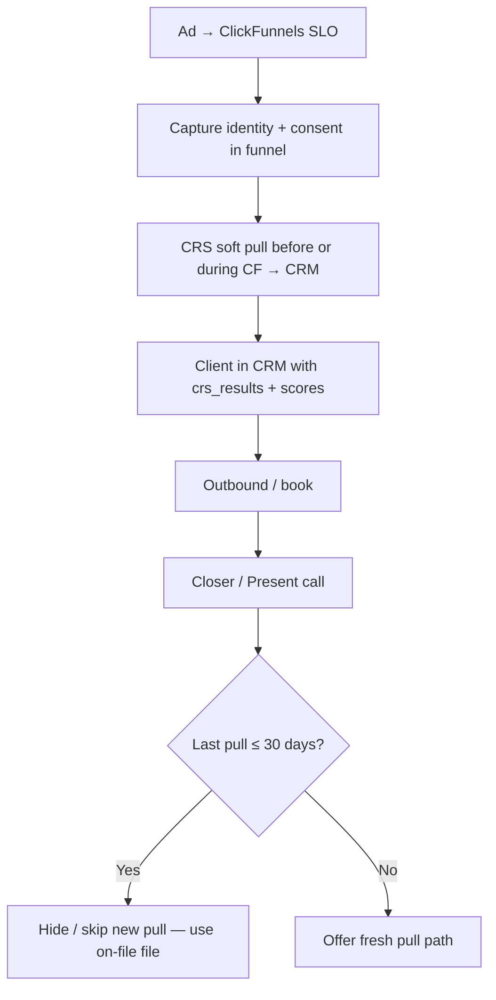
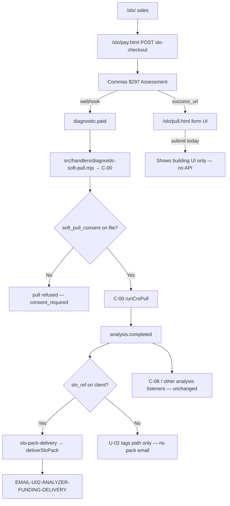
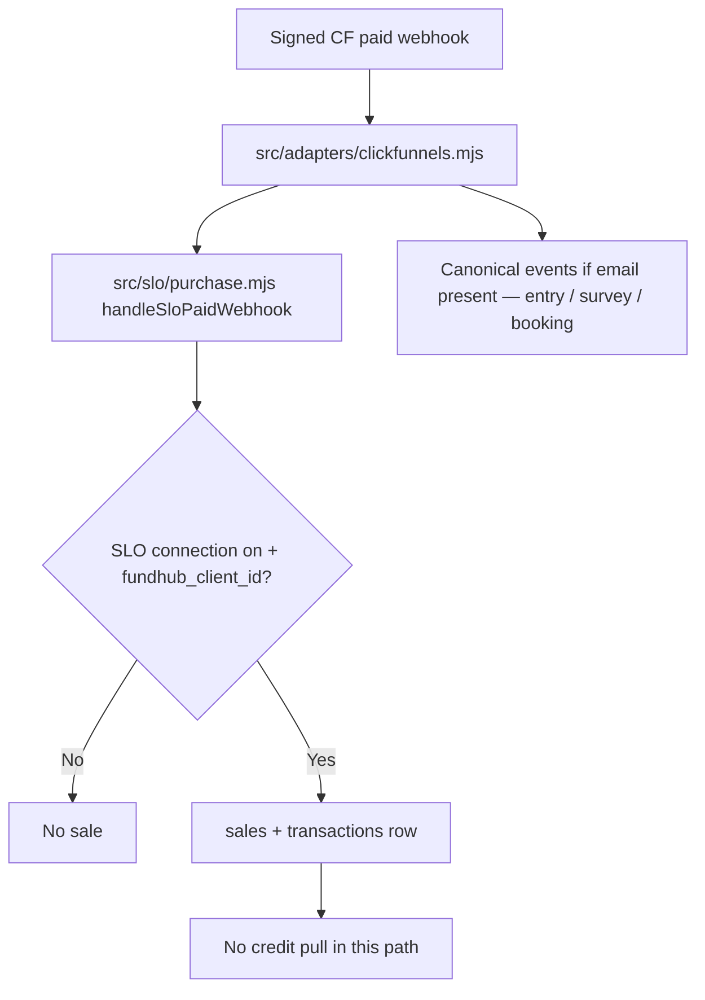

# SLO → CRM → credit → Present — 2026-09-19

Read-only audit for launch prep tonight. **No live bureau pull.** Evidence: repo trace (current worktree + local `main` @ `6f525baf`), live GET probes to `https://fundhub.ai`.

**Owner law (this task):** On the SLO offer, credit is **pre-pulled** before or during the ClickFunnels path into CRM. That path is **different** from the legacy “pull on the call” flow. UI may **hide** pull actions when the file is **fresh**. Rule: **≤30 days** since last pull → typically **no** new pull; **>30 days** → pull again for a fresh file.

---

## 1. Two entry rails (do not merge in your head)

| Rail | Where buyer pays | Credit timing (owner target) | Credit timing (code today) |
|------|------------------|------------------------------|---------------------------|
| **A — Fundhub SLO till** | `https://fundhub.ai/slo/` → `/slo/pay.html` → Commas → `/slo/pull.html` | Pre-pull is **not** how this rail is built; board says **pay → form → pull** | **Pull is wired on `diagnostic.paid`**, before the pull form submits anything |
| **B — ClickFunnels SLO** | CF checkout + signed webhook | Owner target: **pre-pull during CF → CRM** | **Paid webhook only** records sale via `fundhub_client_id` + SLO connection map; **no pull in that handler** |

ClickFunnels fragments (`clickfunnels-fragments/slo/`) describe soft pull **after checkout** in copy. Owner law for launch says **CF path = pre-pulled into CRM** — that is **ahead of** what `slo-connections` + `purchase.mjs` implement today.

Ground truth docs:

- `docs/journeys/slo-connections-intended.md` — CF paid → sale row only (**explicitly not** soft pull in slice).
- `docs/journeys/slo-offer-intended.md` (on local **`main`**, not in this worktree) — pay → pull form → CRS → pack → book.
- `docs/workflows/slo-offer-2026-09-17.md` (local **`main`**) — owner-set order: **“Do not pull the second the card goes through. The pull waits for the form.”**

---

## 2. Intended vs actual (Mermaid)

### 2a. Owner launch target (SLO / CF — pre-pull + fresh-file rule on call)

**30-day rule:** Intended on **Present / closer** and **staff panels** for SLO-tagged buyers. **Not written** in `docs/journeys/*` as of this audit.

### 2b. Actual — Fundhub till (local `main` + live deploy)

### 2c. Actual — ClickFunnels paid (this worktree)

---

## 3. CRM flags and reads (where the file lives)

| Signal | Set by | Used by |
|--------|--------|---------|
| `custom_fields.slo_ref`, `slo_source` | `stampSloRef` on **Fundhub** checkout POST (local `main` `src/slo/buyer.mjs`) | `clientHasSloPurchase` gates **`slo-pack-delivery`** |
| `custom_fields.slo_pack_status` | `deliverSloPack` | Ops / retry (“Delivered” vs “Delivery Failed — Retry”) |
| `payment_links.purpose = diagnostic` | SLO checkout mint | Commas webhook → **`diagnostic.paid`** |
| `crs_results` row | CRS pull success | Present deck `soft_pull` block; client panel **`scores_on_file`** |
| `soft_pull_requests` | `requestSoftPull` | Ledger; deck merges with `crs_results` (F16) |
| CF SLO sale | `recordSloPurchase` | **`source:slo.clickfunnels`** on sale; **does not** set `slo_ref` in code read today |
| Pipeline `diagnostic_paid` | `onDiagnosticPaid` in client-lifecycle | Sales board column |

**Gap vs owner pre-pull:** There is **no** `slo_pre_pulled`, **no** `credit_pulled_at` custom field, and **no** tag that means “SLO buyer — do not pull on call.” `slo_ref` only marks **Fundhub till** checkout started/paid path, not CF-only buyers unless something else stamps it.

---

## 4. Present / closer → soft pull / CRS

| Step | Intended (owner + journeys) | Actual (code) | 30-day rule |
|------|----------------------------|---------------|-------------|
| Load deck | Show survey + engine + pull state | `GET /api/read/closer-deck` → `buildCloserDeck` + `softPullStatus` | **Not applied** |
| Soft pull phase UI | For SLO with fresh file: **do not** push $32 pull again | `public/app/present.js` **always** renders **“Send soft pull ($32 + approval form)”** on S-05 / phase “03 Soft pull” | **Missing** |
| Send soft pull action | Optional on legacy path | `POST /api/closer-deck` `send_soft_pull` → `sendDeckSoftPull` (pay link + approve URL email) | **No age gate** |
| Staff panel “Pull CRS” | Hide when scores on file | `client-control-panel.html`: hides stored “Pull CRS” when **`scores_on_file`** only — **not** age | **Missing** (only boolean scores) |
| CRS execution | Consent + payment gates | `requestSoftPull` → consent required; C-00 on **`diagnostic.paid`** | N/A |
| Repair round stale file | Fresh pull before round 2+ | `credit_file_stale_for_round` compares pull time to **prior round letters** — **not** 30-day SLO rule | Different rule |

Evidence: `src/sales/closer-deck.mjs` (`softPullStatus`), `public/app/present.js` (~795–810), `src/http/client-panel-screen.test.mjs` (scores hide Pull CRS), `src/repair/analyze.mjs` (`credit_file_stale_for_round`).

---

## 5. Where the ≤30-day rule is enforced

| Location | Enforced? |
|----------|-----------|
| SLO / CF ingest | **No** |
| `diagnostic.paid` / C-00 | **No** — fires on payment, not age |
| `public/slo/pull.html` | **No** |
| Present / `send_soft_pull` | **No** |
| Client control panel next action | **No** — only `scores_on_file` |
| `getLatestPull` consumers for closer | **No age check** in deck |
| Repair letter rounds | **Different** stale rule (round vs pull date) |

**Verdict:** Owner **≤30 day** rule is **missing** in product code searched for this audit. Closest behavior: **hide Pull CRS when scores exist**, with **no** date threshold.

---

## 6. Tomorrow — copy / agent touchpoints (SLO path only)

Use these keys when briefing copy or agent prompts. **No SMS** is wired in SLO-specific workflows (`slo-pack-delivery`, `slo-checkout`).

| When | Channel | Template / artifact | Notes |
|------|---------|---------------------|--------|
| Pack ready after CRS (Fundhub till buyer with `slo_ref`) | Email | **`EMAIL-U02-ANALYZER-FUNDING-DELIVERY`** | Queued by `deliverSloPack` / `slo-pack-delivery` |
| Closer sends pull on call (any buyer) | Email | **Ad-hoc HTML** in `sendDeckSoftPull` (not a seeded template key) | Present button `send_soft_pull` |
| Post-payment “assessment running” (offer bucket) | Email | **`EMAIL-OFFER-SOFT-PULL`** | `src/workflows/s-offer-bucket.mjs` — general offer path, not SLO-gated |
| Books strategy call (`SLO_BOOK_URL` / CF scheduler) | Email | **`BS-FUND-{D1–D3}-{E1–E6}-*`** precall grid | Trigger **`booking.created`** — same as other funding books |
| CF lead before SLO pay | Email/SMS | **`entry.captured`** downstream (mostly **retired** cold nurture on N-01) | Only if CF emits capture events |
| AI closer context | Agent read | **`fetchContext`** / `GET /api/read/agent-context` | Uses stored CRS + survey; no SLO-specific branch found |

**Not fired today:** `slo.checkout_started` has **no** dedicated workflow listener found (event emitted on checkout POST only).

**Double email risk:** `U-02` on `analysis.completed` **tags** funding path and **does not** send the pack email; **`slo-pack-delivery`** owns pack + **`EMAIL-U02-…`** for `slo_ref` clients. Non-SLO diagnostics still rely on other analysis handlers (e.g. C-06 / deliverables path) — out of scope unless the same client lacks `slo_ref`.

---

## 7. PASS / FAIL (provable without live bureau pull)

| # | Step | Result | Evidence |
|---|------|--------|----------|
| 1 | Live **`GET /api/public/slo-checkout`** returns $297 + `next: /slo/pull.html` + checkout ready | **PASS** | HTTP 200, JSON `priceCents: 29700`, `checkout.ready: true` (probe 2026-09-19) |
| 2 | Live **`/slo/pay.html`** serves | **PASS** | HTTP 200 |
| 3 | Live **`/slo/pull.html`** submits identity to backend | **FAIL** | Page comment + handler: validation only, **no fetch** to pull API (live HTML matches local `main`) |
| 4 | Pay → pull order matches owner board (“pull waits for form”) | **FAIL** | `diagnostic.paid` → `diagnostic-soft-pull.mjs` → **C-00** immediately; form is after Commas success |
| 5 | Pay → pull without prior consent | **FAIL** (predictable) | C-00 calls `requestSoftPull` → **`consent_required`** if consent not captured before webhook |
| 6 | `slo_ref` gates pack email | **PASS** (code on local `main`) | `slo-pack-delivery.mjs` + `clientHasSloPurchase` |
| 7 | CF paid → sale without email/price guess | **PASS** (this worktree) | `src/slo/purchase.mjs`, `docs/journeys/slo-connections-actual.md` |
| 8 | CF paid → credit pre-pull into CRM | **FAIL** | `handleSloPaidWebhook` writes sale only |
| 9 | Present hides soft pull for fresh SLO file | **FAIL** | `present.js` always shows send soft pull on S-05 |
| 10 | ≤30-day rule anywhere on closer path | **FAIL** | No matcher in deck / panel / soft-pulls |
| 11 | SLO VSL asset live | **FAIL** | `https://fundhub.ai/funnel/slo-vsl.mp4` → **404** (probe) |
| 12 | SLO checkout code in **this worktree** | **FAIL** | `api/public/slo-checkout.mjs` absent; lives on local **`main`**, deployed live, **`origin/main` tip `45372eda` lacks file** |
| 13 | ClickFunnels SIM MODE off on fragments | **UNVERIFIED** | `FH_SIM = true` still in fragment README / ty page — launch checklist item |

Sandbox/sample pulls for sim clients (e.g. sim SloEighteen) can prove **read** paths (`scores_on_file`, deck tier) without bureau — not run in this pass.

---

## 8. Top blockers for SLO going live

1. **Pull form is a dead end** — Buyers land on `/slo/pull.html`, fill SSN/consent, and **nothing is sent**. Pack never starts unless some **other** path already pulled (or staff intervenes).
2. **Payment fires C-00 before consent** — `$297` **`diagnostic.paid`** runs CRS logic **before** the pull form can record consent → **`consent_required`** / no file, while UI says “building your pack.”
3. **Owner pre-pull (CF) not implemented** — Webhook records **sale only**; no CRS, no `slo_ref`, no SLO-specific CRM flag for “already pulled.”
4. **≤30-day + hide pull on call — not in code** — Present still pushes **Send soft pull ($32)**; no SLO buyer discrimination.
5. **Repo / deploy drift** — Live site runs SLO till; **`origin/main` missing** `api/public/slo-checkout.mjs` and friends; current branch **`claude/slo-offer-financial-model-fo8uy1`** also missing that tree → fixes on wrong branch do not ship.
6. **Marketing assets** — SLO VSL **404** on fundhub.ai; CF fragments still document SIM MODE / placeholder proof.
7. **Two truths in docs** — `slo-offer` board says wait for form; `diagnostic.paid` wiring says pull on pay. Must pick **one** before copy/agents promise outcomes.

---

## 9. What Chris must decide (one decision each)

1. **Launch rail:** Fundhub **`/slo`** till first, or ClickFunnels with **`fundhub_client_id`** + connections — or both with different credit rules?
2. **When pull runs for till buyers:** Only after **`/slo/pull.html` POST** (board order), or keep **`diagnostic.paid`** trigger and move consent **before** Commas?
3. **CF pre-pull:** Which system runs CRS during CF (ConsumerDirect widget, staff, other), and which **CRM field/tag** means “SLO pre-pulled — do not bill $32 on call”?
4. **30-day rule:** Exact clock start (`crs_results.created_at`?), and which UI must obey it (Present only vs panel vs both)?
5. **CF paid buyers:** Should **`recordSloPurchase`** also set **`slo_ref`** / trigger **`slo-pack-delivery`**, or a different product code?
6. **Git line of truth:** Merge local **`main` @ `6f525baf`** (has SLO till) to **`origin/main`** before tonight’s fixes, or branch from deploy tip?

---

## 10. Code pointers (quick)

| Piece | Path |
|-------|------|
| Fundhub till | `api/public/slo-checkout.mjs`, `src/slo/offer.mjs`, `src/slo/buyer.mjs` (local **`main`**) |
| Pull UI stub | `public/slo/pull.html` (local **`main`**) |
| Pay → C-00 | `src/handlers/diagnostic-soft-pull.mjs`, `src/workflows/c-00-crs-soft-pull-request.mjs` |
| Pack after pull | `src/workflows/slo-pack-delivery.mjs`, `src/slo/deliver.mjs` |
| CF paid | `src/adapters/clickfunnels.mjs`, `src/slo/purchase.mjs` |
| Present actions | `api/closer-deck.mjs`, `public/app/present.js`, `src/sales/closer-deck.mjs` |
| Connections map | `docs/journeys/slo-connections-intended.md`, `src/slo/connections.mjs` |

---

*Auditor pass — findings only. No product edits in this task.*
